# Screens

## Screen: /

- **URL:** `/` — public marketing landing (no auth gate).
- **What the user sees:** Dark 21.gifts header with a language switcher, headline about peer-to-peer Bitcoin gifts, How it works (login and Wallet of Satoshi address) / Why / FAQ, CTA **Ask for help** (`/login`).
- **Actions:** Read the pitch, change language, open login, jump to in-page sections, open Stats, open Legal & Privacy, open the Handbook.
- **Calls:** `Home` (`src/app/(marketing)/page.tsx`) inside `MarketingLayout`, `LanguageSwitcher`.

### Variant: default

Desktop/wide layout: section nav is visible in the header (How it works, Why, FAQ, Stats, Handbook, Log in). No hamburger.

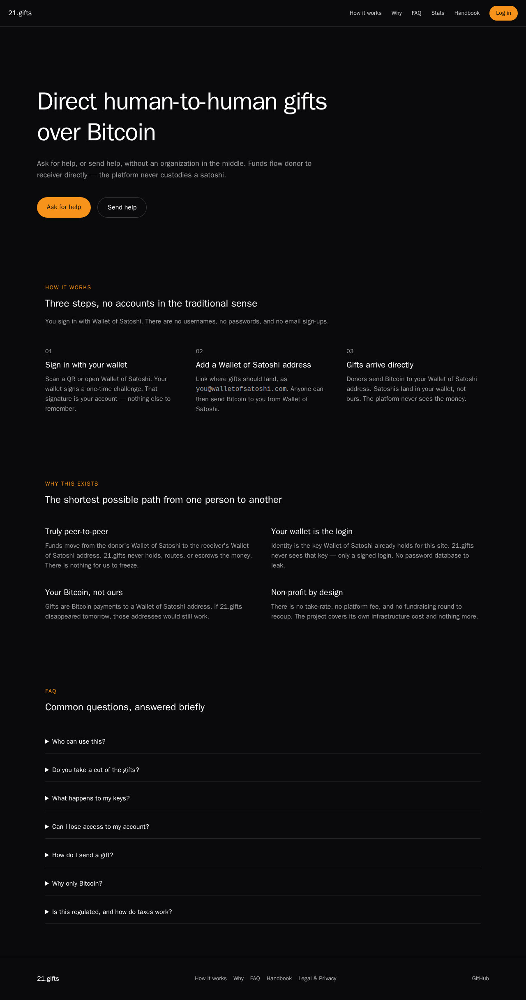

### Variant: mobile-nav

Narrow viewport: header shows the Menu button. Open it to reveal the same links stacked. Tapping a link closes the menu.

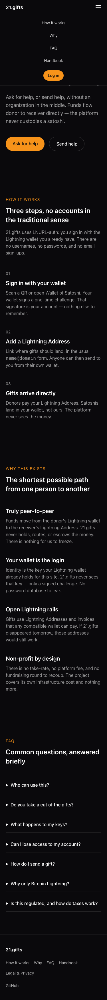

## Screen: /legal

- **URL:** `/legal` — imprint and privacy. `/legal.html` permanently redirects here.
- **What the user sees:** Dark 21.gifts header with a language switcher, Legal Notice (Switzerland, info@21.gifts) and Privacy Policy (no analytics; no cookies unless the visitor chooses a language — then a `locale` cookie; session in localStorage; Cloudflare TLS; login on this origin). Legal body copy stays English.
- **Actions:** Change language. Read the legal body. Header **Log in** goes to `/login`.
- **Calls:** `LegalPage` inside `MarketingLayout`, `LanguageSwitcher`.

### Variant: default

The only state: imprint plus privacy, marketing chrome.

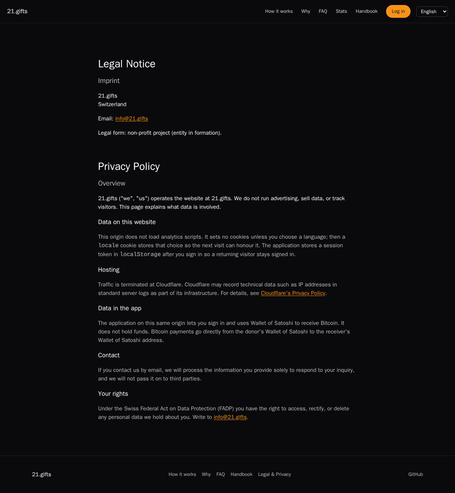

## Screen: /stats/[day]

- **URL:** `/stats/YYYY-MM-DD` — public list of outbound gifts that UTC day. Invalid dates 404.
- **What the user sees:** Dark 21.gifts header, **All stats** back to `/stats`, heading **Gifts on {day}**, a **UTC day** date input, then either the gift table (Time, Recipient, Sats, BTC, USD), empty copy **No gifts recorded on this day.**, **Loading…**, or **Try again**. Stats body copy stays English.
- **Actions:** Pick another UTC day in the date input (navigates to `/stats/{next}`). Open **All stats**. Change language. Header **Log in** goes to `/login`.
- **Calls:** `GiftDayPage`, `DayLoader`, `GiftDayTable`, `fetchGiftDay` (`GET /gifts?day=`).
- **Auth:** None.

### Variant: default

Loaded day with at least one gift row (recipient **alice**).

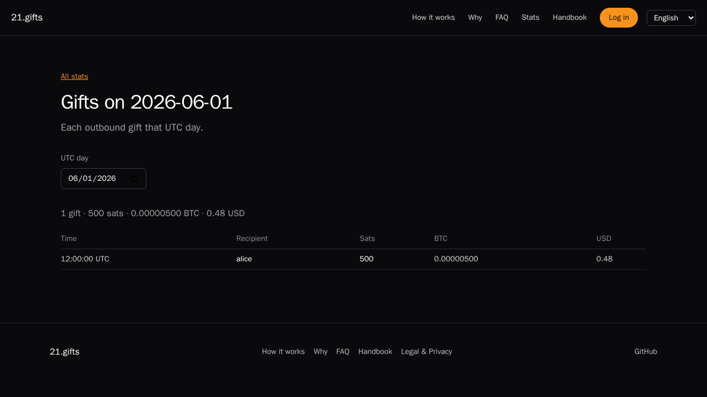

### Variant: empty

No gifts that UTC day. Copy **No gifts recorded on this day.**

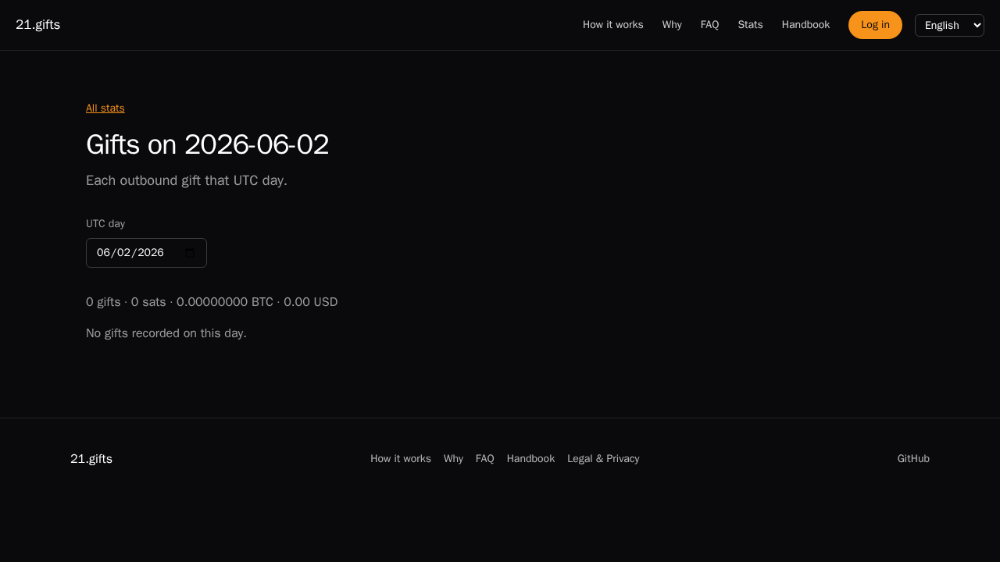

### Variant: loading

Waiting on `GET /gifts`. Copy **Loading…**

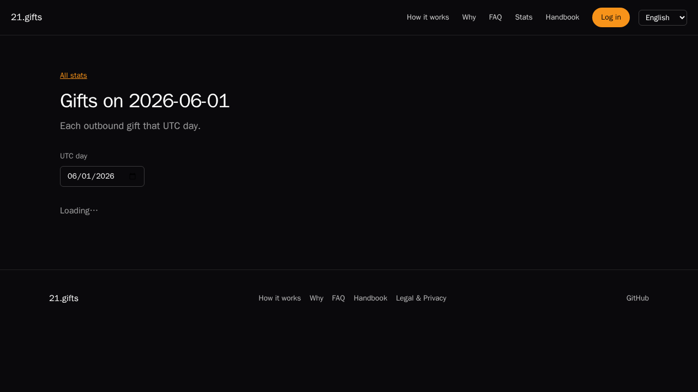

### Variant: error

Fetch failed. Button **Try again**.

## Screen: /stats

- **URL:** `/stats` — public gift totals (no auth gate).
- **What the user sees:** Dark 21.gifts header with a language switcher, heading **Gifts**, four KPI cards (total spent in **BTC** and **USD** with a sats caption, gifts, people, period), then diagrams: **Total spend over time** (one cumulative chart; days with spend are markers on the series, not a wrapping date list), **By person** and **By month**. Each diagram has a BTC/USD control that defaults to BTC; over time switches the series, person and month rescale bar size while labels stay both units. Empty database copy: **No gifts recorded yet.** Stats body copy stays English.
- **Actions:** Change language. Read the charts. Open a spend day (`/stats/{YYYY-MM-DD}`) from **Total spend over time** by clicking a day with spend. Switch **Total spend over time** / **By person** / **By month** between BTC and USD. Header **Stats** stays on this page; **Log in** goes to `/login`.
- **Calls:** `StatsPage`, `StatsLoader`, `StatsDashboard`, `fetchGiftStats` (same-origin `GET /gifts/stats`), `LanguageSwitcher`.

### Variant: default

Loaded stats with one cumulative over-time chart visible. Scale defaults to BTC.

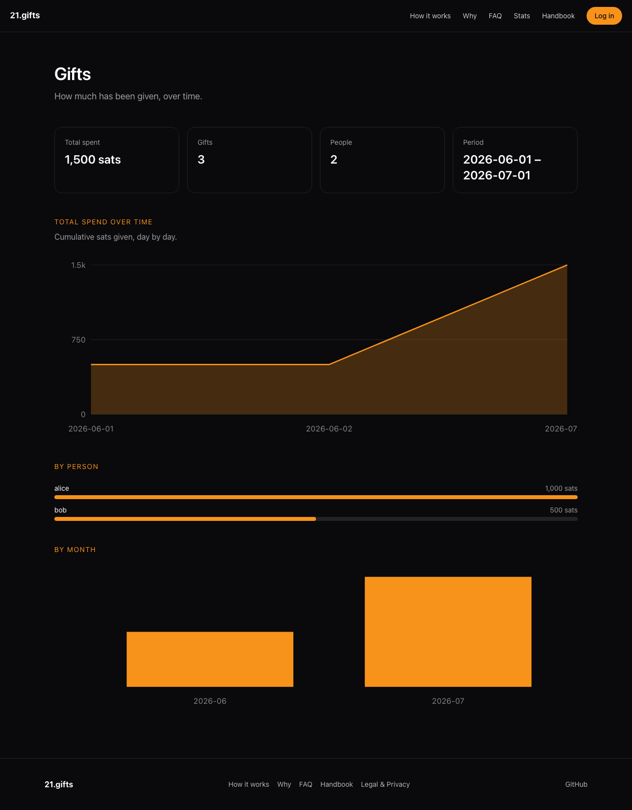

### Variant: usd-scale

Inverted ranking fixture (June tall in BTC / short in USD, July the reverse). Scale switched to USD on **Total spend over time**, **By person**, and **By month**.

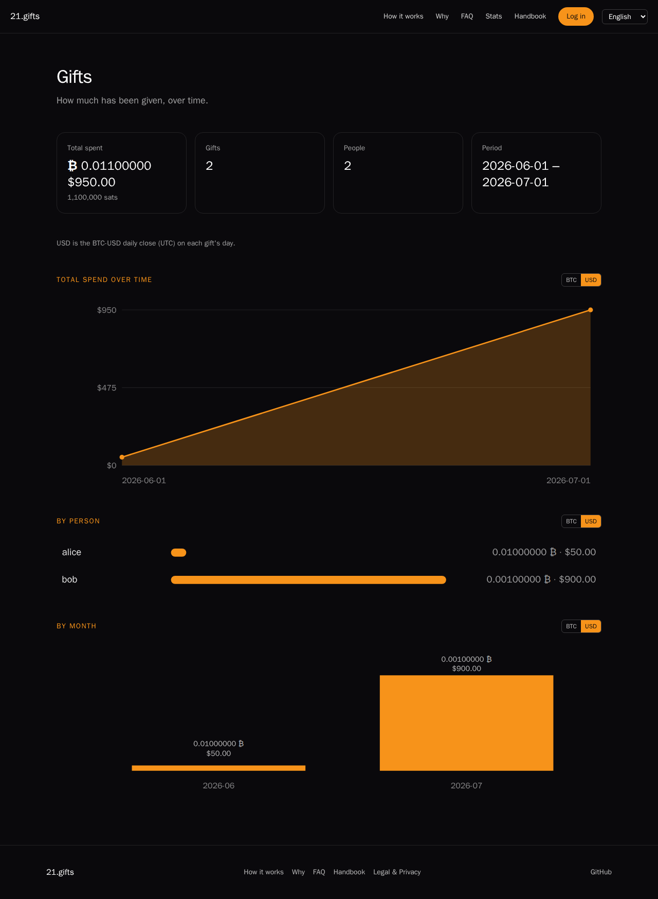

### Variant: empty

Zero gifts. KPI zeros and **No gifts recorded yet.**

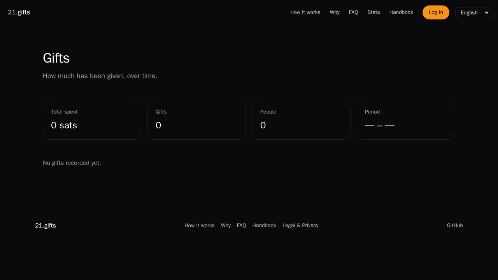

### Variant: loading

Waiting on `GET /gifts/stats`. Copy **Loading…**

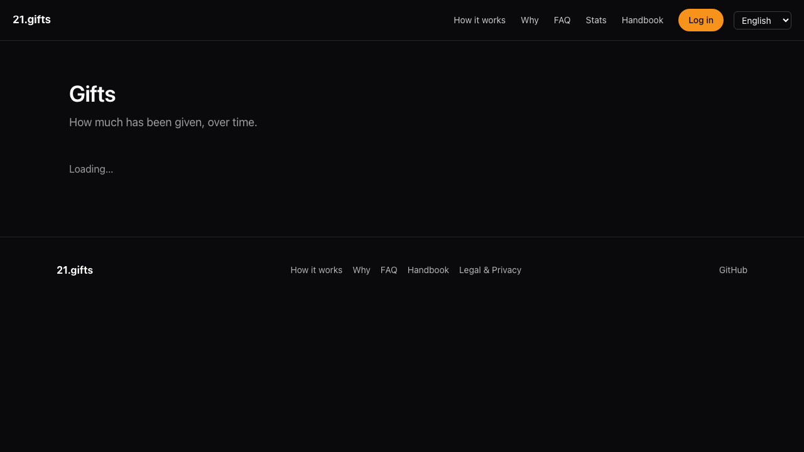

### Variant: error

Fetch failed. Copy **Could not load gift stats. Please try again.** and **Try again**.

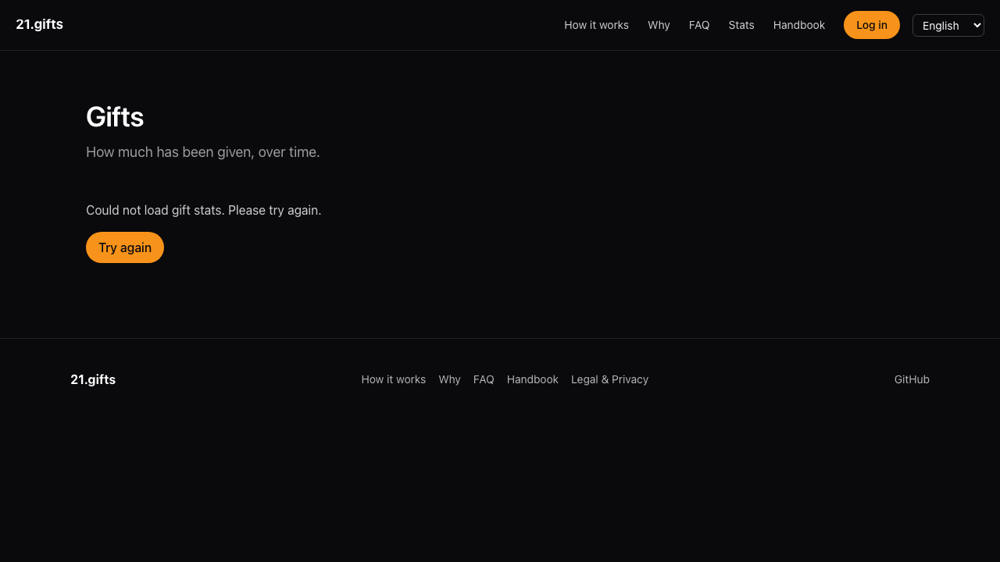

## Screen: /login

- **URL:** `/login` — login only.
- **What the user sees:** Light language switcher top-right on the page (not the marketing header). Idle **Log in**. In Telegram or another in-app browser, an escape card (**Open this page in your browser**) with **Open in browser** and **Copy link** instead of **Log in**. Error is terminal until **Try again**. After success the visitor is sent to `/setup/name`, `/setup/address`, or `/welcome`.
- **Actions:** Change language. Log in (existing login, or create one when the browser has none). In an in-app browser: open the page in the system browser or copy the link.
- **Calls:** `LoginCard`, `OnboardingGate`, `usePasskeyLogin`, `useAuthStore`, `LanguageSwitcher`, `isInAppBrowser`, `openInSystemBrowser`.

### Variant: idle

Logged out. Heading **Sign in to 21.gifts**, one **Log in** button.

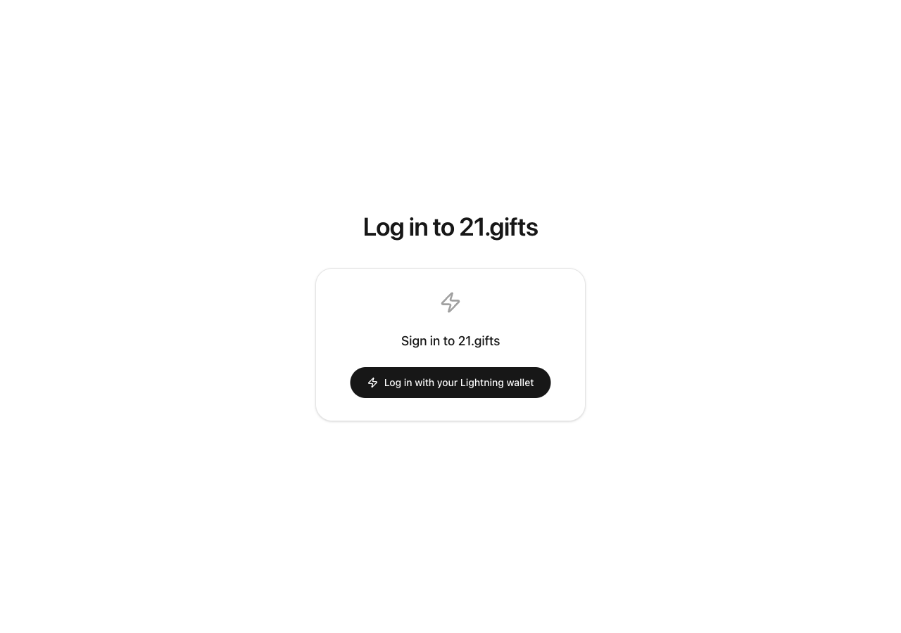

### Variant: starting

Transient after a login click, before the ceremony finishes: spinner and **Preparing your login…**.

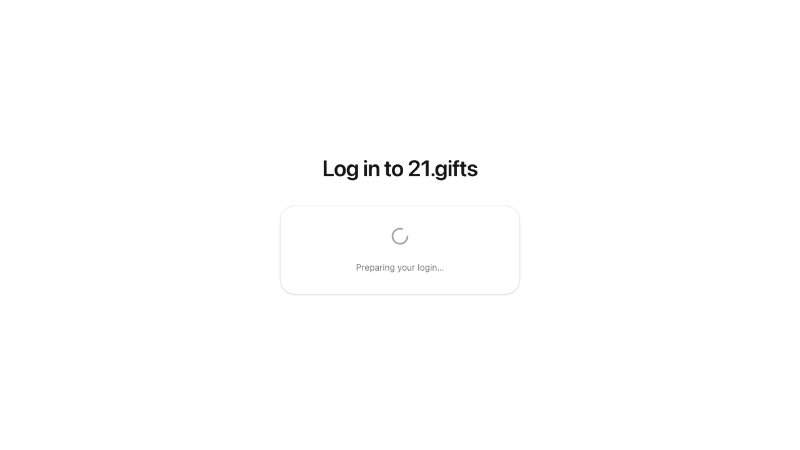

### Variant: error

Login begin or finish failed. Copy **Something went wrong. Please try again.** and **Try again**.

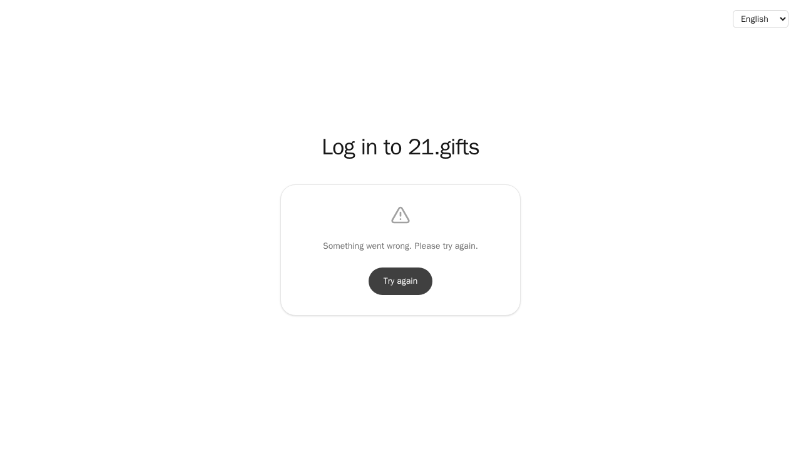

### Variant: in-app

Telegram or another in-app WebView detected. Heading **Open this page in your browser**; no **Log in** button; **Open in browser** and **Copy link** instead.

## Screen: /setup/name

- **URL:** `/setup/name` — first screen after login.
- **What the user sees:** One **Menu** top-right; open it for Profile, language, and **Log out**. Heading **Your name**, name form. No Wallet of Satoshi form.
- **Actions:** Save a name; open **Menu** for Profile, language, or **Log out**. After save, the visitor is sent to `/setup/address`.
- **Calls:** `NameSetup`, `NameForm`, `SignedInChrome`, `OnboardingGate`.

### Variant: default

Signed in, no name yet. **Your name**, **Save name**. One **Menu** top-right; open it for Profile, language, and **Log out**.

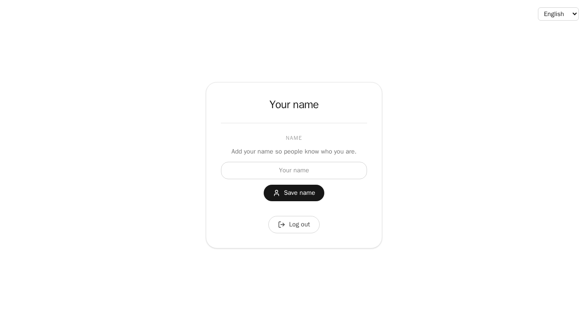

## Screen: /setup/address

- **URL:** `/setup/address` — second screen after login.
- **What the user sees:** One **Menu** top-right; open it for Profile, language, and **Log out**. Heading **Your Wallet of Satoshi address**, greeting **Hi, {name}**, address form. No name form.
- **Actions:** Link an address; open **Menu** for Profile, language, or **Log out**. After save, the visitor is sent to `/welcome`.
- **Calls:** `AddressSetup`, `LightningAddressForm`, `SignedInChrome`, `OnboardingGate`.

### Variant: default

Signed in with a name and no address. **Your Wallet of Satoshi address**, **Link address**. One **Menu** top-right; open it for Profile, language, and **Log out**.

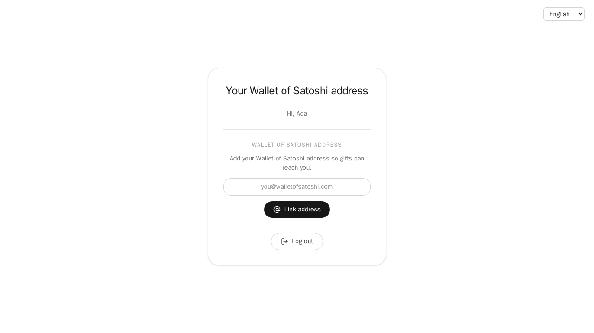

## Screen: /welcome

- **URL:** `/welcome` — third screen after login, when name and address are both saved.
- **What the user sees:** One **Menu** top-right; open it for Profile, language, and **Log out**. Gift icon, **Welcome, {name}**, public forum (message name, text, timestamp, sat total with a Bitcoin pay icon beside it, disabled when the note is not payable, composer textarea with **Post** to the right). No name or address form. No guest donate CTA.
- **Actions:** Post a message, pay a payable note in-app, retry a failed load; open **Menu** for Profile, language, or **Log out**.
- **Calls:** `WelcomeScreen`, `ForumLoader`, `ForumBoard`, `SignedInChrome`, `OnboardingGate`.

### Variant: default

Gift icon, **Welcome, Ada**, public **Forum** with posts from more than one person (Bob, Carol, Ada — name, text, timestamp, sat total with a Bitcoin pay icon beside it), composer. One **Menu** top-right; open it for Profile, language, and **Log out**.

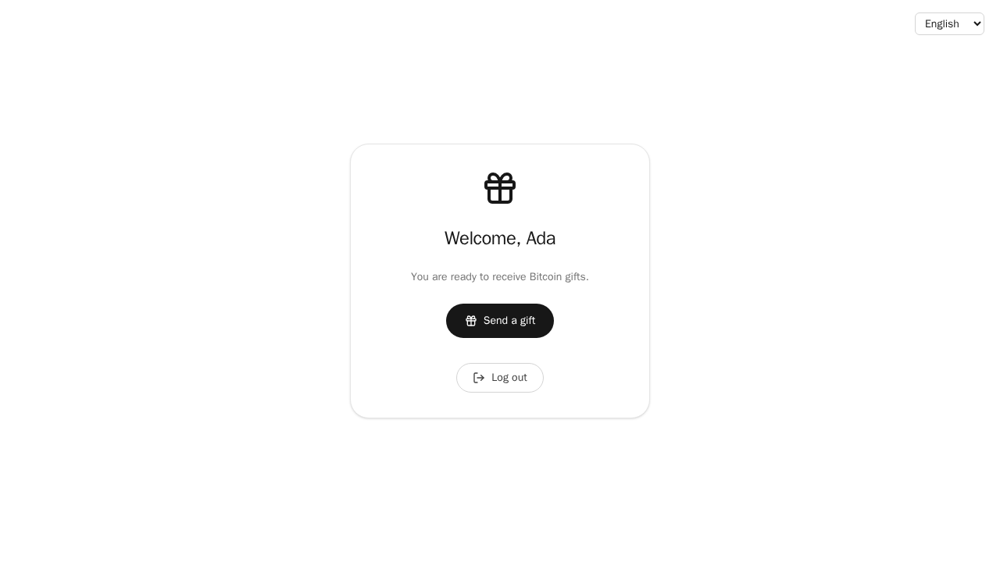

### Variant: empty

Empty copy **No messages yet. Be the first to write.** plus composer.

### Variant: loading

Loading copy **Loading…** while the messages fetch is in flight.

### Variant: error

Load error **Could not load messages. Please try again.** plus **Try again**.

### Variant: validation-error

Click **Post** with an empty composer → **Enter a message**. The composer caps at 500 characters (same as `POST /messages`); over-length drafts show **Keep it to 500 characters** and are not sent.

### Variant: menu-open

Open **Menu** top-right → Profile link (sat totals as `ArrowUpRight` / `ArrowDownLeft` icons plus amounts; accessible names stay the catalog Given/Received strings), language, and **Log out**.

## Screen: /profile

- **Purpose:** Signed-in profile after onboarding: sat totals shown as icons plus amounts, edit name and Wallet of Satoshi address, return to the forum via an icon-only back control.
- **Inputs:** Session account (name + Lightning Address) via `OnboardingGate` / `useAuthStore`; public gift stats via `useAccountTotals`.
- **Actions:** Open **Menu** for Profile (current), language, or **Log out**; icon-only back (top-left) to the forum; save name; link or change address.
- **Used by:** Route `/profile` (`ProfilePage`).

### Variant: default

Heading **Profile**, outbound/inbound sat totals as `ArrowUpRight` / `ArrowDownLeft` icons with visible amounts (accessible names from `profile.given` / `profile.received`), name form, Wallet of Satoshi address form. Icon-only back top-left (returns to the forum); one **Menu** top-right.

## Screen: /handbook

- **URL:** `/handbook` — public app handbook (no auth gate).
- **What the user sees:** Localized heading **Handbook** and intro chrome, language switcher in the marketing header, intro with a link to the api handbook on GitHub (`21gifts/api`), in-page nav (Overview / Screens / Functions / Endpoints) each with a link icon, then the four `docs/handbook/` markdown files rendered as HTML (English bodies). Every markdown heading has a sibling link icon.
- **Actions:** Change language, read the docs, jump via the section nav, copy a chapter or heading URL (click the link icon → check icon for 1.2s, hash updates), follow the api handbook link, follow in-page markdown links.
- **Calls:** `HandbookPage`, `HandbookIntro`, `HandbookCopyLink`, `loadHandbookDocuments`, `HandbookMarkdown` (`parseHandbookMarkdown`), `LanguageSwitcher`.

### Variant: default

Idle copy buttons: every heading and chapter shows the link icon.

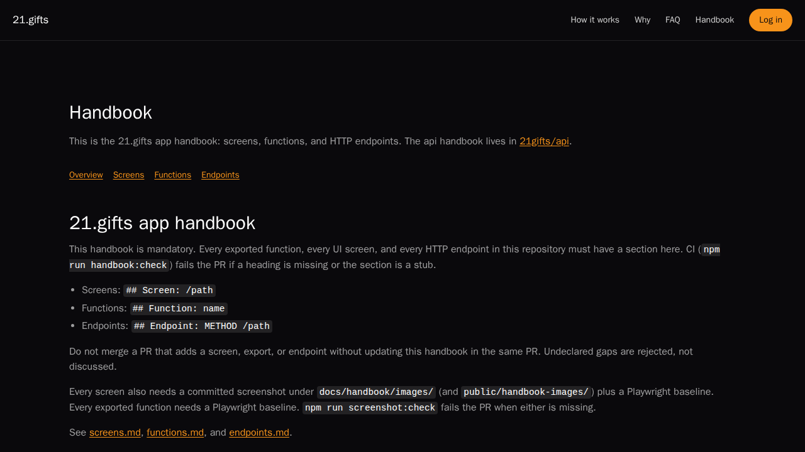

### Variant: copied

After tapping the link icon on a heading or chapter, that button shows the check icon and `data-copied`, and `location.hash` is that id. Other copy buttons stay idle link icons.

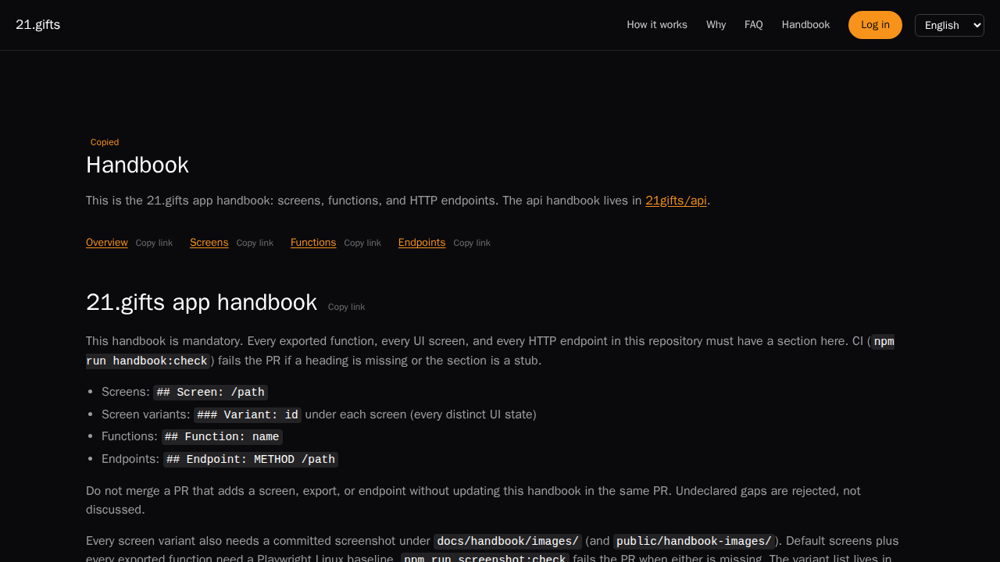

## Screen: /404

- **URL:** any unknown path (App Router `not-found.tsx`). There is no `page.tsx` for `/404`; Playwright uses `page.goto('/404')` which hits this screen.
- **What the user sees:** Marketing chrome with a language switcher, heading **404**, **This page does not exist.**, **Back home**.
- **Actions:** Change language, go home, or use header/footer links.
- **Calls:** `NotFound`, `MarketingHeader`, `MarketingFooter`, `LanguageSwitcher`.

### Variant: default

The only state.

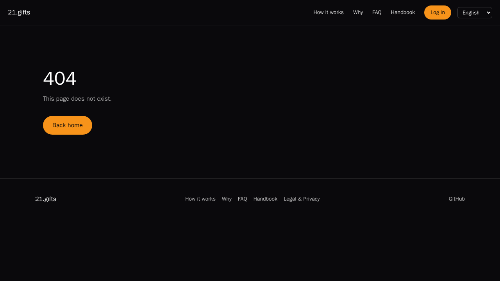
