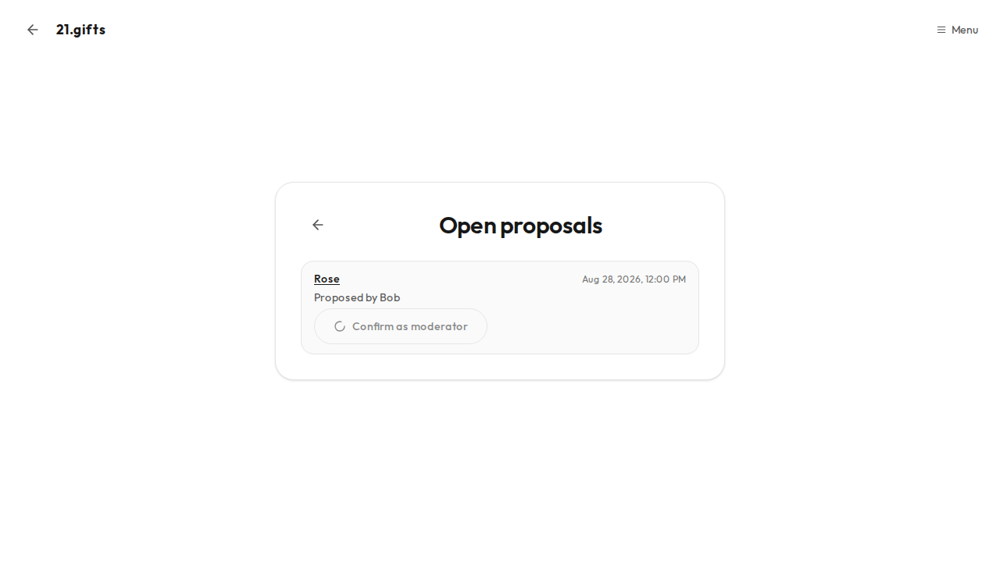

# Screens

Every variant below is captured in all four Linux Chromium combos (desktop/mobile × light/dark). Markdown images are the desktop-light shot. The other combo PNGs are visual-test baselines only.

**Role hierarchy.** Ranks are basis 0, verified 1, moderator 2, initiator 2, founder 3. Initiator is rank 2, equal to moderator. A named minimum means that rank or any higher rank, and an equal rank meets it. The app checks this with `roleAtLeast` (`src/lib/roles.ts`); an equality test on the viewer's role is a defect. Do not write "moderator or initiator" or „Moderator oder Initiator“; permission checks name the minimum rank only.

## Screen: /

- **URL:** `/` — public marketing landing (no auth gate).
- **What the user sees:** Dark 21.gifts header with a language switcher (wordmark `/` when unsigned, `/welcome` when a session is hydrated), headline about peer-to-peer Bitcoin gifts, How it works (login and Wallet of Satoshi address) / Happyland (Father Severin’s account, eight captioned photographs in all four languages; food-stall caption **Pagpag**) / Why / Donate to this project (Wallet of Satoshi address `21gifts@walletofsatoshi.com` to run 21.gifts itself, distinct from `/donate`) / FAQ, CTAs **Ask for help** (`/login`) and **Send help** (`/donate`). **Install app** appears in the header and after Send help only for iPhone Safari/Chrome/Firefox/Edge (not standalone, not in-app) or when Chromium fires `beforeinstallprompt`; idle visual snapshots stay without it because the control renders `null` until after mount detection.
- **Actions:** Read the pitch, change language, open login, open Send help, optionally install the app (Chromium prompt or iPhone three-step Share sheet), jump to in-page sections, open About, open Stats, open Legal & Privacy, open the Handbook.
- **Calls:** `Home` (`src/app/(marketing)/page.tsx`) inside `MarketingLayout`, `LanguageSwitcher`, `PwaInstall`, `HappylandSection`, `HappylandPhoto`.

### Variant: default

Desktop/wide layout (from 1024px): section nav is visible in the header (How it works, Happyland, Why, FAQ, About, Stats, Handbook, Log in). Happyland links to `/#happyland`, including from other marketing pages, and leaves space below the sticky header for the section heading. No hamburger.

### Variant: mobile-nav

Captured at desktop and mobile. Below 1024px the header shows the Menu button; open it to reveal the same links stacked, with Happyland immediately after How it works. Tapping Happyland closes the menu and scrolls to the existing photo essay. On desktop this is the landing without the hamburger.

### Variant: language-open

Open the language switcher in the marketing header. Custom listbox (rounded panel, endonym rows with a check on the current locale) — not OS chrome.

## Screen: /legal

- **URL:** `/legal` — imprint and privacy. `/legal.html` permanently redirects here.
- **What the user sees:** Dark 21.gifts header with a language switcher (wordmark `/` when unsigned, `/welcome` when a session is hydrated), Legal Notice (Switzerland) and Privacy Policy (no analytics; no cookies unless the visitor chooses a language — then a `locale` cookie — or a light/dark appearance — then a `theme` cookie; System appearance clears `theme`; or a number-format style — then a `numberFormat` cookie, absent = Swiss `10'000.23`; session in localStorage; Cloudflare TLS; login on this origin). There is **no published email**; contact is in-app only via `/contact` after login. Legal body copy stays English.
- **Actions:** Change language. Read the legal body. Open **Open the app** (`/contact`). Header **Log in** goes to `/login`.
- **Calls:** `LegalPage` inside `MarketingLayout`, `LanguageSwitcher`.

### Variant: default

The only state: imprint plus privacy, marketing chrome.

## Screen: /about

- **Purpose:** Public foundation of the house — three convictions and Matthew 10:8.
- **URL:** `/about` — public marketing page (no auth gate).
- **What the user sees:** Dark 21.gifts header with a language switcher (wordmark `/` when unsigned, `/welcome` when a session is hydrated), kicker **About**, heading **Three convictions**, a short lead, the Matthew 10:8 verse, then three numbered convictions (Giving is a duty with 1 John 3:18; Direct, with no middleman; Bitcoin is the most effective money) and **Open the living room** (`/welcome`). Visitor copy comes from the catalog.
- **Actions:** Change language. Read the convictions. Open **Open the living room** (`/welcome`). Header **Log in** goes to `/login`.
- **Calls:** `AboutPage` inside `MarketingLayout`, `LanguageSwitcher`, `ButtonLink`.

### Variant: default

The only state: three convictions, verse, and forum CTA, marketing chrome.

## Screen: /stats/[day]

- **URL:** `/stats/YYYY-MM-DD` — public list of outbound gifts that UTC day. Invalid dates 404.
- **What the user sees:** Dark 21.gifts header (wordmark `/` when unsigned, `/welcome` when a session is hydrated), **All stats** back to `/stats`, heading **Gifts on {day}**, a **UTC day** date input, then either the gift table (Time, Recipient, ₿, selected fiat code) with a FiatPicker **only when unsigned**, empty copy **No gifts recorded on this day.**, **Loading…**, or **Try again**. Signed-in visitors still see preferred-fiat amounts and cannot change the code here. Summary `{n} gift(s) · ₿ · formatFiatDisplay(total, preferred fiat, numberFormat)`. Stats body copy stays English.
- **Actions:** Pick another UTC day in the date input (navigates to `/stats/{next}`). When unsigned, pick CHF | EUR | USD | PHP on FiatPicker (writes cookie `fiat`). Open **All stats**. Change language. Number format is a signed-in `/profile` settings row next to theme, not Menu chrome, and not on this public header. Header **Log in** goes to `/login`.
- **Calls:** `GiftDayPage`, `DayLoader`, `GiftDayTable`, `FiatPicker`, `fetchGiftDay` (`GET /gifts?day=`).
- **Auth:** None.

### Variant: default

Loaded day with at least one gift row (recipient **alice**).

### Variant: empty

No gifts that UTC day. Copy **No gifts recorded on this day.**

### Variant: loading

Waiting on `GET /gifts`. Copy **Loading…**

### Variant: error

Fetch failed. Button **Try again**.

## Screen: /stats

- **URL:** `/stats` — public gift totals and a posts total (no auth gate).
- **What the user sees:** Dark 21.gifts header with a language switcher (wordmark `/` when unsigned, `/welcome` when a session is hydrated), heading **Gifts**. When post stats load, a **Posts** total sits above the gift cards: living notes and replies counted together, hidden notes excluded, with a bar on each UTC day that has posts and a gap where a day has none. A failed post fetch omits that block and still shows the gift diagrams. Four KPI cards (total spent as BIP-177 **₿** plus the selected fiat, gifts, people, period), a FiatPicker (CHF | EUR | USD | PHP) above the cards **only when unsigned**, then diagrams: **Total spend over time** (one cumulative chart; days with spend are markers on the series, not a wrapping date list), **By person** and **By month**. Each diagram has a `SegmentedControl tone="gift" shell="dark"` ₿ | selected fiat control that defaults to ₿; over time switches the series, person and month rescale bar size while labels stay both units. Signed-in visitors still display and scale with the preferred code and cannot change it here. Empty database copy: **No gifts recorded yet.** Stats body copy stays English.
- **Actions:** Change language. Read the posts total and the gift charts. Open a spend day (`/stats/{YYYY-MM-DD}`) from **Total spend over time** by clicking a day with spend. When unsigned, pick CHF | EUR | USD | PHP on FiatPicker (writes cookie `fiat`). Switch **Total spend over time** / **By person** / **By month** between ₿ and the selected fiat. Header **Stats** stays on this page; **Log in** goes to `/login`.
- **Calls:** `StatsPage`, `StatsLoader`, `StatsDashboard`, `FiatPicker`, `fetchGiftStats` (same-origin `GET /gifts/stats`), `fetchPostStats` (same-origin `GET /messages/stats`), `LanguageSwitcher`.

### Variant: default

Loaded stats. **Posts** shows notes and replies as one total, with a bar on days that have posts and a gap on days that have none. One cumulative over-time chart is visible. Scale defaults to ₿.

### Variant: usd-scale

Inverted ranking fixture (June tall in ₿ / short in USD, July the reverse). **Posts** stays the same notes-and-replies total. Scale switched to USD on **Total spend over time**, **By person**, and **By month**.

### Variant: empty

Zero gifts and zero posts. **Posts** shows 0 with no bars. KPI zeros and **No gifts recorded yet.**

### Variant: loading

Waiting on `GET /gifts/stats`. Copy **Loading…**

### Variant: error

Fetch failed. Copy **Could not load gift stats. Please try again.** and **Try again**.

## Screen: /trust-chain

- **URL:** `/trust-chain` — signed-in Trust Chain. Same onboarding gate as `/welcome` (`OnboardingGate screen="welcome"`). JSON is `/trust/graph` (Next.js forbids `route.ts` beside this page). Any logged-in completed account may view (not staff-only).
- **What the user sees:** Chrome is the page-frame header (`ProfileChromeLeft` back + wordmark → `/welcome`, and Menu, inside the rounded sheet). Fill `AppShell` (`align="start"`). Open **Menu** for **Home**, **Shops**, **Map**, **Point of sale**, Profile, **Wallet**, **Living room rules**, **Trust Chain**, **Notifications**, **Messages**, **Contact**, optional **Install app**, and **Log out**. Heading **Trust Chain**, a short lead that says to click a person to load everyone linked to them and drag a person to move them, then a chain that starts with the founder. Clicking a person loads one hop of stored links (never the whole thousand-person graph at once). One next person sits to the right; several people hanging off one person (everyone a moderator verified) stack top to bottom. Dragging a person moves that block; already-placed people keep their spot when a hop arrives. Below the diagram, four short explanations: **Verified**, **Moderator**, **Initiator**, and **Founder** (an initiator is named directly, with no proposal step; catalog `trustChain.explainInitiator`). Empty copy: **No one is on the Trust Chain yet.** Loading copy: **Loading…**. Error copy plus **Try again**.
- **Actions:** Click a person to load who they met or appointed. Drag a person to rearrange. Modifier-click a person to open the member card (`/members/{id}`). Back to the forum. Open **Menu** for **Home**, **Shops**, **Map**, **Point of sale**, Profile, **Wallet**, **Living room rules**, **Trust Chain**, **Notifications**, **Messages**, **Contact**, optional **Install app**, or **Log out**.
- **Calls:** `AppShell`, `ProfileChromeLeft`, `TrustChainPage`, `TrustChainLoader`, `TrustChainScreen`, `TrustChainDiagram`, `layoutTrustChain`, `mergeTrustChain`, `fetchTrustChain` (same-origin `GET /trust/graph` and `GET /trust/graph?around=`), `SignedInChrome`, `OnboardingGate`.
- **Auth:** Bearer session; `OnboardingGate screen="welcome"`.

### Variant: default

Founder seed **Cyrill** only. Lead tells the visitor to click a person to load everyone linked to them.

### Variant: expanded

Click **Cyrill**, then **Severin**. The chain grows left to right: Cyrill appointed Severin, who verified Ada and Bob.

### Variant: empty

Zero nodes. Copy **No one is on the Trust Chain yet.**

### Variant: loading

Waiting on `GET /trust/graph`. Copy **Loading…**

### Variant: error

Fetch failed. Copy **Could not load the Trust Chain. Please try again.** and **Try again**.

### Variant: hop-error

Founder seed is on screen. Clicking that person fails the hop fetch. The diagram stays; the same error copy and **Try again** sit above it. Retry re-fetches that hop without re-fetching founder seeds; the banner stays gone only if the hop succeeds.

## Screen: /wallet

- **URL:** `/wallet` — signed-in recovery phrase.
- **What the user sees:** Fill `AppShell` with profile chrome left and **Menu** right. Open **Menu** for **Home**, **Shops**, **Map**, **Point of sale**, Profile, **Wallet**, **Living room rules**, **Trust Chain**, **Notifications**, **Messages**, **Contact**, optional **Install app**, and **Log out**. Heading **Wallet**. The phrase is not a setup step and is not shown at sign-in. Missing or empty `passkeyCredentialId`: primary button **Add recovery phrase** and a hint that the phrase is created on this device and the existing login passkey stays. Set id: **Show recovery phrase** under **Advanced functions**, via PRF get of that id, without `credentials.create` and without seed/begin. Pressing it shows the 12 words and the only-backup line. There is no confirmation and no **Continue** on the words.
- **Actions:** **Add recovery phrase** calls seed/begin and seed/finish and does not replace the login passkey. `walletBackupSeenAt` is not read and not posted. Show the phrase from **Advanced functions**. **Try again** after an error (`role="alert"` plus a reason and a hint). Open **Menu** (Home, Shops, Map, Point of sale, Profile, Wallet, …). Back returns to the in-app page this tab remembered; a tab that has not opened another page goes to the forum (`/welcome`). The wordmark still opens the forum. Opening any other signed-in page shows that page. The 12 words appear only on `/wallet`, after **Show recovery phrase** or right after **Add recovery phrase**.
- **Calls:** `AppShell`, `WalletChromeLeft` (renders `ProfileChromeLeft`), `SignedInChrome`, `OnboardingGate`, `WalletScreen`, `useWalletPhrase`.

### Variant: default

Existing member, no phrase yet. **Add recovery phrase**.

### Variant: phrase

12-word grid from a fixture mnemonic (not live PRF).

### Variant: reveal

Account that can already show a phrase, no phrase in the tab. Closed **Advanced functions** holds **Show recovery phrase**.

### Variant: reveal-open

Account that can already show a phrase, no phrase in the tab. Open **Advanced functions** shows **Show recovery phrase**.

### Variant: error

Generic failure. Alert **The recovery phrase could not be created or opened. Check this device and try again.** plus hint **If this keeps happening, try another browser or the device you already used to sign in.** and labeled **Try again**.

### Variant: timeout

Device prompt timed out. Alert **The device prompt timed out before you finished. Try again.** plus the same muted hint and labeled **Try again**.

### Variant: prf-unsupported

PRF missing. Alert **This browser cannot create a recovery phrase. Try another browser or device.** plus hint **If this keeps happening, try another browser or the device you already used to sign in.** and labeled **Try again**.

## Screen: /login

- **URL:** `/login` — login only.
- **What the user sees:** Chrome is the page-frame header (`HomeWordmark` and the light language switcher inside the rounded sheet; wordmark `/` when unsigned, `/welcome` when a session is hydrated — not the marketing header). Idle **Log in**. After **Log in**, if the browser reports `NotAllowedError`, heading **Do you already have an account?** with **Log in with existing account** and **Open a new account**. In Telegram or another in-app browser, an escape card (**Open this page in your browser**) with **Open in browser** and **Copy link** instead of **Log in**. Generic error is **Something went wrong. Please try again.** A leftover session whose GET `/me` is the wrong-account 403 shows **You signed in with the wrong account. Please try again with the correct account.** Both errors are terminal until **Try again**. After success the visitor goes to `/setup/name`, `/setup/username`, `/setup/address`, `/setup/rules`, or `/welcome`. The recovery phrase is not part of that path.
- **Actions:** Change language. Log in with an existing passkey. After `NotAllowedError`, choose an existing account or open a new one. In an in-app browser: open the page in the system browser or copy the link.
- **Calls:** `AppShell`, `HomeWordmark`, `LoginCard`, `OnboardingGate`, `usePasskeyLogin`, `useAuthStore`, `LanguageSwitcher`, `isInAppBrowser`, `openInSystemBrowser`.

### Variant: idle

Logged out. Heading **Log in with your device**, one **Log in** button.

### Variant: starting

Transient after a login click, before the ceremony finishes: spinner and **Preparing your login…**.

### Variant: error

Login begin or finish failed. Copy **Something went wrong. Please try again.** (`login.error`) and **Try again**.

### Variant: wrong-account

GET `/me` 403 with the api wrong-account copy, or passkey finish with that same string. Alert **You signed in with the wrong account. Please try again with the correct account.** (`login.wrongAccount`) and **Try again**. The leftover session is cleared so the visitor is not left signed in. **Try again** starts authenticate-first login.

### Variant: choice

After **Log in**, the browser reports `NotAllowedError` (no discoverable passkey, or the visitor dismissed the picker). Heading **Do you already have an account?** with labeled **Log in with existing account** and **Open a new account**. No account is created until the visitor clicks **Open a new account** and completes the create ceremony.

### Variant: in-app

Telegram or another in-app WebView detected. Heading **Open this page in your browser**; no **Log in** button; **Open in browser** and **Copy link** instead.

### Variant: language-open

Open the light language switcher top-right. Custom listbox with endonym rows (English / Deutsch / Español / Filipino) — not a native OS select.

## Screen: /donate

- **URL:** `/donate` — public, no auth gate.
- **What the user sees:** Chrome is the page-frame header (`HomeWordmark` and the light language switcher inside the rounded sheet; wordmark `/` when unsigned, `/welcome` when a session is hydrated — not marketing header). Heading **Send help**, short lead about opening **Show reactions** then sending Bitcoin on a payable reaction, CTA **Open the forum** (`/welcome`). No address/amount form. No QR.
- **Actions:** Change language. Open the forum. Unsigned visitors hitting `/welcome` are sent to `/login` by OnboardingGate.
- **Calls:** `AppShell`, `HomeWordmark`, `DonatePage`, `ButtonLink`, `LanguageSwitcher`.

### Variant: default

Heading **Send help**, explainer lead, **Open the forum**.

## Screen: /pl

- **URL:** `/pl?lightning=LNURL…` — public, no auth gate. `/pl` without a usable link stays on this page and does not 404.
- **What the user sees:** Chrome is the page-frame header (`HomeWordmark` and the light language switcher inside the rounded sheet). The welcome gift-and-Bitcoin glyph sits above the person's name, which is the only heading. Under it, an **Amount** field and **Create invoice**. The field has the ₿ / fiat switch, and the other unit sits under it. With no account the switch starts at ₿ and is not stored. A bad link shows **This payment link is not valid.** and no form.
- **Actions:** Type a whole number and press **Create invoice**. An empty or non-whole amount shows **Enter a whole number.** and keeps the form. Success replaces that button with **Pay** (`forum.payOpenWallet`, aria **Pay with Wallet of Satoshi**), which sets `location.href` to the Wallet of Satoshi link (Android Intent on Android). Desktop and smartphone both show the Bitcoin invoice QR. A failed mint keeps the form and shows **Could not create the invoice.** Change language from the header.
- **Calls:** `PayLinkPage`, `PayLinkScreen`, `PageChrome`, `HomeWordmark`, `LanguageSwitcher`, `payLinkUsername`, `GET /pay/[username]`, `POST /pay/[username]/invoice`.

### Variant: default

The person's name, the amount field, and **Create invoice**. No QR yet.

### Variant: invoice

The amount is kept and **Create invoice** is gone. Desktop and smartphone both show the Bitcoin invoice QR and **Pay**.

### Variant: amount-invalid

**Create invoice** with an empty or non-whole amount shows **Enter a whole number.** The form stays.

### Variant: invalid

The gift glyph and **This payment link is not valid.** No amount field.

### Variant: failed

The form stays, and **Could not create the invoice.** is shown under it.

## Screen: /setup/name

- **URL:** `/setup/name` — when `account.setup === 'name'`.
- **What the user sees:** Chrome is the page-frame header (wordmark + Menu inside the rounded sheet). Open **Menu** for **Home**, **Shops**, **Map**, **Point of sale**, Profile, **Wallet**, **Living room rules**, **Trust Chain**, **Notifications**, **Messages**, **Contact**, optional **Install app**, and **Log out**. Heading **Your name**, name form with **Continue** and labeled **Skip**. No Wallet of Satoshi form.
- **Actions:** Enter a name and **Continue**, or **Skip** (`POST /me/setup/skip`); open **Menu** for **Home**, **Shops**, **Map**, **Point of sale**, Profile, **Wallet**, **Living room rules**, **Trust Chain**, **Notifications**, **Messages**, **Contact**, optional **Install app**, or **Log out**. After save or skip, the visitor is sent to the next `account.setup` path (usually `/setup/username`).
- **Calls:** `AppShell`, `Wordmark`, `NameSetup`, `NameForm`, `SignedInChrome`, `OnboardingGate`, `skipSetup`.

### Variant: default

Signed in, no name yet. **Your name** and the name field at the top, **Continue** and labeled **Skip** pinned at the bottom of the screen. One **Menu** top-right; open it for **Home**, **Shops**, **Map**, **Point of sale**, Profile, **Wallet**, **Living room rules**, **Trust Chain**, **Notifications**, **Messages**, **Contact**, optional **Install app**, and **Log out**.

## Screen: /setup/username

- **URL:** `/setup/username` — after the display name (`account.setup === 'username'`). Cannot skip.
- **What the user sees:** Chrome is the page-frame header (wordmark + Menu inside the rounded sheet). Open **Menu** for **Home**, **Shops**, **Map**, **Point of sale**, Profile, **Wallet**, **Living room rules**, **Trust Chain**, **Notifications**, **Messages**, **Contact**, optional **Install app**, and **Log out**. Heading **Your 21.gifts name**, hint that Bitcoin is sent to `you@21.gifts` while Wallet of Satoshi still receives it, username field, **Continue**. No Skip.
- **Actions:** Enter a LUD-16 handle and **Continue** (`POST /me/username`). Taken or invalid handles stay on this screen. After save, the visitor is sent to the next `account.setup` path (usually `/setup/address`).
- **Calls:** `AppShell`, `Wordmark`, `UsernameSetup`, `UsernameForm`, `SignedInChrome`, `OnboardingGate`, `setUsername`.

### Variant: default

Signed in with a display name (or a skipped name) and no username. **Your 21.gifts name**, the username field, and **Continue**. One **Menu** top-right.

## Screen: /setup/address

- **URL:** `/setup/address` — after username (`account.setup === 'address'`). Name may already be saved or skipped; username is required.
- **What the user sees:** Chrome is the page-frame header (wordmark + Menu inside the rounded sheet). Open **Menu** for **Home**, **Shops**, **Map**, **Point of sale**, Profile, **Wallet**, **Living room rules**, **Trust Chain**, **Notifications**, **Messages**, **Contact**, optional **Install app**, and **Log out**. Heading **Your Wallet of Satoshi address**, greeting **Hi, {name}**, address form with **Continue** and labeled **Skip**. No name form.
- **Actions:** Enter an address and **Continue**, or **Skip** (`POST /me/setup/skip`); open **Menu** for **Home**, **Shops**, **Map**, **Point of sale**, Profile, **Wallet**, **Living room rules**, **Trust Chain**, **Notifications**, **Messages**, **Contact**, optional **Install app**, or **Log out**. After save or skip, the visitor is sent to the next `account.setup` path (usually `/setup/rules`).
- **Calls:** `AppShell`, `Wordmark`, `AddressSetup`, `LightningAddressForm`, `SignedInChrome`, `OnboardingGate`, `skipSetup`.

### Variant: default

Signed in with a name (or a skipped name) and no address. **Your Wallet of Satoshi address** and the address field at the top, **Continue** and labeled **Skip** pinned at the bottom of the screen. One **Menu** top-right; open it for **Home**, **Shops**, **Map**, **Point of sale**, Profile, **Wallet**, **Living room rules**, **Trust Chain**, **Notifications**, **Messages**, **Contact**, optional **Install app**, and **Log out**.

## Screen: /setup/rules

- **URL:** `/setup/rules` — when living-room rules are not yet agreed (`account.setup === 'rules'`). Name, username, and address may already be done; username cannot be skipped; rules cannot be skipped.
- **What the user sees:** Chrome is the page-frame header (wordmark + Menu inside the rounded sheet; icon-only chapter back after the first chapter). Open **Menu** for **Home**, **Shops**, **Map**, **Point of sale**, Profile, **Wallet**, **Living room rules**, **Trust Chain**, **Notifications**, **Messages**, **Contact**, optional **Install app**, and **Log out**. Heading **Living room rules**, prompt to read this chapter, progress (`1 of 9` on the first chapter), one rules chapter at a time (lead first) without the public Contact / forum nav, and a full-width **Continue** button. The last chapter shows **I agree to these rules** instead of **Continue**.
- **Actions:** Read the current chapter and **Continue** to advance; icon-only back after the first chapter. Changing chapter (Continue or Back) scrolls the fill inner scroller back to the top. The last **I agree to these rules** POSTs agreement, then the visitor is sent to `/welcome`. Open **Menu** for **Home**, **Shops**, **Map**, **Point of sale**, Profile, **Wallet**, **Living room rules**, **Trust Chain**, **Notifications**, **Messages**, **Contact**, optional **Install app**, or **Log out**.
- **Calls:** `AppShell`, `Wordmark`, `RulesSetup`, `RulesDocument`, `SignedInChrome`, `OnboardingGate`, `agreeToRules` (`POST /me/rules-agreement`) on the last chapter only.

### Variant: default

Signed in with a name and address and `rulesAgreedAt` still null. First chapter (lead paragraph plus the accent-bordered **The test** callout) and **Continue** visible.

### Variant: law1

After one Continue: rule card with kicker **Rule 1**, heading **Only free donations**, body, and **The test** callout. Icon-only back is visible.

### Variant: law2

Rule card **Rule 2** / **Donors come first** with body and **The test** callout.

### Variant: law3

Rule card **Rule 3** / **Contact stays in the app** with body (no test callout).

### Variant: wanted

Heading **Welcome**, muted lead, and the welcome list (app-fg check glyphs, not accent).

### Variant: allowed

Heading **Allowed**, muted lead, and the allowed list (muted check glyphs).

### Variant: ratherNot

Heading **Better not**, muted lead, and the better-not list (minus glyphs).

### Variant: forbidden

Heading **Forbidden**, muted lead, and the three forbidden groups (red cross glyphs).

### Variant: house

Last chapter: muted **Our house** block (body plus emphasised closing paragraph) and **I agree to these rules**. That click POSTs agreement.

### Variant: error

Last-chapter POST failed. Alert **Could not save your agreement**.

### Variant: busy

Last-chapter POST in flight. Agree disabled with a spinner; **Our house** still visible.

## Screen: /welcome

- **URL:** `/welcome` — when `account.setup` is null (name and address may be saved or skipped; username is required; living-room rules agreement is required). New passkey accounts reach this after name, username, address, and rules. The phrase is not on that path.
- **What the user sees:** Chrome is the page-frame header (wordmark + Menu inside the rounded sheet). Content scrolls inside the frame. Open **Menu** for **Home**, **Shops**, **Map**, **Point of sale**, Profile, **Wallet**, **Living room rules**, **Trust Chain**, **Notifications**, **Messages**, **Contact**, optional **Install app**, and **Log out**, then a quiet **Version {version}** line (`app.version`). Gift icon with an integrated Bitcoin symbol, **Welcome, {name}**, dismissible living-room laws hint box with an X when not yet dismissed on the account (two laws plus links to **Living room rules** `/rules` and **Contact** `/contact`; after dismiss the box is gone and the flag persists on the account), then a `ForumModeSelect` dropdown (**Active** / **No gifts yet** / **All** / **Most popular**), default **Active**, not a four-way SegmentedControl and not a two-column grid. First paint is one page of 20 notes for the selected mode; further cursor pages prefetch near the end of the visible list. Page-one polling does not replace older loaded pages. **No gifts yet** shows a count chip on the closed control for loaded zero-sat notes created after the last time that filter was opened; omitted when the count is 0 or the filter is selected. Default is **Active** (paid notes plus unpaid moderator notes plus top-level notes with `goalSats` > 0, newest-first feed: newest at the top). **All** shows every note newest-first. **Most popular** ranks paid notes by sats (highest first). Below the selector: clickable author name (when `accountId` is set) that opens `/members/:id`, optional Founder / Moderator / Initiator / Verified pill when the api `role` is one of those four (`basis` has no pill), a `#Shop` link to `/shops` on top-level shop notes (raw `#21GiftsShop` hidden), timestamp, optional inline photo then caption text below the photo, a link to `/map?pin=<id>` (the label, or coordinates when the label is null) on a top-level note that has a place, optional inline `<video>` playback for notes with video (player follows the clip aspect — portrait stays portrait); note and reply bodies longer than 280 characters show a collapsed preview, an ellipsis, and inline **Show more** (`forum.showMore`), expanding in place with no Show less, while permalink `/messages/[id]` stays full text. Cards also show ₿ amount always, plus optional preferred-fiat `·` from the amount stored when the payment was made (a stored string as-is, `null` is ₿-only with no em dash, a missing field uses the latest gift-day rate) (no FiatPicker), replyCount text, React (`forum.react`, lucide Reply) on every top-level note, copy-link control (**Copy link to this note** → origin `/l/<8 hex>` (first group of that note id); nested replies get their own copy control, **Copy link to this reply** → origin `/l/<8 hex>` (first group of that reply id)), and expand/collapse on the card body (**Show reactions** / **Hide reactions**; the footer ₿ amount and the reaction-count text also expand; React expands a collapsed card and does not collapse an expanded one; Gift on a payable reply / role / copy / delete do not; the card body remains the unique **Show reactions** / **Hide reactions** name). Expanded cards show the replies list (Gift on a payable reply, copy, and moderator trash are also on nested replies) plus an in-card reply composer (**Write a reaction** and an **Amount** field with the ₿ / fiat switch and the other unit under it; the last choice is `account.amountUnit`; empty reply text and an empty amount invoices 21 sats (pay-sheet default); a reply with text and an empty amount is unpaid for a verified member, otherwise 1 sat to 21.gifts on the composer slot (`payHost: composer`); extra gifts stay on the card (`payHost: card`); an amount of 0 is billed as 1 sat); reply authors show the same Founder / Moderator / Initiator / Verified pills (`basis` has none). Pay control / Send Bitcoin only on a payable reply (open **Show reactions**, then Gift on that reply — never on the post); composer under the filters: **Send a post** / **Ask for money** pill, then Post-path **Add a photo or video** (ImagePlus) and **Add a place** (MapPin) left of the textarea, **Post** (Send icon) to the right (Ask path is `ForumAskWizard`), optional photo draft preview with **Remove photo** (X icon), and optional video draft preview with **Remove video** (X icon) — icon-only action controls, catalog `aria-label`s, no visible button text. Top-level notes with `goalSats` show `ForumGoalBar`: **Ask** plus `formatBitcoin(goalSats)` and optional preferred-fiat, then orange 0–100, green overflow, uncapped percent. A missing name, username, Lightning Address, or rules agreement opens `RequirementsOverlay` (no Skip) before a post or reply retries. No always-visible refresh control; there is no visible refresh chrome — while refreshing or pull-armed only a visually hidden (`sr-only`) `role="status"` (`forum.refreshing`) is mounted, and idle markup has no status node. When the visitor is scrolled down and a silent refresh found new ids, a labeled **New posts** pill appears over the feed; it is absent from idle screenshots. When an unread `moderator_appointed` notification exists, a labeled **You are a moderator** pill uses the same chrome (sticky under the frame header); if both pills show, appointment stays at `top-2` and **New posts** moves to `top-14`. Clicking the appointment pill marks that row read and stays on `/welcome`; it is omitted when the flag is falsy and absent from idle screenshots. While the tab is visible the list also silent-refetches every 30 seconds (`FORUM_LIST_POLL_MS`); hidden tabs do not poll. Clicking a role pill toggles a short explanation under that card header. Paying a payable reply opens a sheet with a top-left back control and a **Pay** button that includes the Wallet of Satoshi icon. On a computer the sheet also shows a QR; on a smartphone there is no QR. No name or address form. No guest donate CTA. Signed-in chrome may show `IntroduceYourselfOverlay` when `setup` is null and `hasPosted` is false. **Translate** (Languages icon) / Show original / Show translation sit under the note and reply bodies via `NoteTranslate` when the language differs from the UI locale (not in the footer icon row).
- **Actions:** Dismiss the living-room laws hint (permanent), post a text and/or photo or video message, attach/remove a photo, a video, or a place draft, expand a note to load replies and post a reply, open an author profile at `/members/:id`, open a `#Shop` tag to `/shops`, copy a note link or a reply's own link to origin `/l/<8 hex>` (first group of that note or reply id), click a role pill for its explanation, pay a payable reply in-app, switch the forum view (Active / No gifts yet / All / Most popular), pull down from the top to refresh the forum list, click **You are a moderator** to mark that appointment read and hide the pill, click **New posts** or the wordmark / Menu **Home** (already on `/welcome`) to scroll to top and apply new notes, leave the forum in view for 30 seconds so a visible-tab poll can pick up new ids, return to the web app to refresh the list when it becomes visible again, complete a `RequirementsOverlay` for a missing name, username, Wallet of Satoshi address, or rules agreement, open the rules or contact pages, retry a failed load; open **Menu** for **Home**, **Shops**, **Map**, **Point of sale**, Profile, **Wallet**, **Living room rules**, **Trust Chain**, **Notifications**, **Messages**, **Contact**, optional **Install app**, or **Log out**, then a quiet **Version {version}** line (`app.version`); dismiss `IntroduceYourselfOverlay` for this mount (Close) or **Write an introduction** (dismisses, focuses the welcome composer via `requestForumCompose` / `FORUM_COMPOSE_EVENT`; `router.push('/welcome')` only when the path is not already `/welcome`).
- **Calls:** `PageChrome`, `AppShell`, `ForumHomeWordmark`, `WelcomeScreen`, `ForumLoader`, `ForumBoard`, `ForumModeSelect`, `ForumAskWizard`, `ForumGoalBar`, `parseForumAskAmount`, `RequirementsOverlay`, `SegmentedControl`, `SignedInChrome`, `IntroduceYourselfOverlay`, `OnboardingGate`, `prepareForumPhoto`, `prepareForumVideo`, `fetchMessagePhoto`, `forumVideoSrc`, `fetchReplies`, `visibleForumMessages`, `hasUnseenForumPosts`, `unpaidNewCount`, `fetchGiftStats`, `latestRateDay`, `satsToFiatAmount`, `fetchNotifications`, `markNotificationRead`.

### Variant: default

Gift icon with an integrated Bitcoin symbol, **Welcome, Ada**, without the living-room laws hint (`forumLawsDismissed`), **Active** selected. Paid notes newest-first (Ada ₿5 then Carol ₿21); Bob's unpaid note is not visible. Composer is **Send a post** / **Ask for money**; Post is attach + Send icons, no Ask field on the Post messenger. React (`forum.react`) on every top-level note. Posts do not show Send Bitcoin; Gift appears on a payable reply after **Show reactions**. Founder / Moderator / Initiator / Verified pills beside the name when `role` is one of those four; `basis` has no pill (Carol is `verified`, Ada is `moderator`; Bob is `basis` and hidden on Active). One **Menu** top-right; open it for **Home**, **Shops**, **Map**, **Point of sale**, Profile, **Wallet**, **Living room rules**, **Trust Chain**, **Notifications**, **Messages**, **Contact**, optional **Install app**, and **Log out**.

### Variant: laws

First visit: the dismissible living-room laws hint box is visible (two laws plus links to **Living room rules** and **Contact**). Idle screenshots after dismiss omit it.

### Variant: moderation

A moderator sees an icon-only Delete post control in the note footer icon row with copy; confirming wraps to the next line. Other roles do not see it. The server independently checks the live role.

### Variant: delete-confirm

Delete post opens an inline confirmation: Delete this post and its reactions from 21.gifts? Confirm deletion (check) and Cancel deletion (X) are icon-only controls. Cancel sends no request.

### Variant: deleting

While DELETE is pending, confirmation and cancellation are disabled and a spinner replaces the check. Successful deletion removes the post; stale refresh payloads cannot restore it in this session.

### Variant: delete-error

A failed deletion keeps the post and confirmation visible with an error and retry. Already missing posts (404) are removed from the local view.

### Variant: reply-moderation

A moderator who expands a note sees an icon-only Delete reaction control on each nested reply. Ordinary members do not. Parent still has Delete post.

### Variant: reply-delete-confirm

Delete reaction opens inline confirmation: Delete this reaction from 21.gifts? Confirm deletion (check) and Cancel deletion (X) are icon-only. Cancel sends no request. The parent post stays.

### Variant: reply-deleting

While DELETE of the reply is pending, confirmation and cancellation on that reply are disabled and a spinner replaces the check.

### Variant: reply-delete-error

A failed reply deletion keeps the reply and confirmation visible with `Could not delete the reaction. Please try again.` and retry.

### Variant: all

Click **All** — Bob's unpaid note (`Does anyone have spare sats this week?`) is visible with Ada and Carol; list order newest-first (Ada, Carol, Bob).

### Variant: goal-50

On **All**: top-level Ada note with `sats: 10500` and `goalSats: 21000`. Progress bar at **50%** (orange half-fill). Composer **Send a post** / **Ask for money** pill visible. Gift still not on the post.

### Variant: goal-100

On **All**: top-level Ada note with `sats: 21000` and `goalSats: 21000`. Full orange track, label **100%**, no green overflow.

### Variant: goal-110

On **All**: top-level Ada note with `sats: 23100` and `goalSats: 21000`. `ForumGoalBar` names the ask (**Ask ₿21'000 · $21.00**), then full orange track plus green overflow (10% of track width past the right edge), label **110%**.

### Variant: ask-amount

**Ask for money** selected. Step 1 of 4: **How much?** with the **One-time** / **Daily** pill above the amount (**One-time** pressed) and **1000** typed in bitcoin so the preferred-fiat counterpart (**$1.00**) shows under the field. Continue is enabled. No Post submit on this step.

### Variant: ask-amount-fiat

**Ask for money** selected. Step 1 of 4 with **One-time** pressed and the amount switch on **USD**. **1000** was typed in bitcoin, then the switch moved to fiat, so the field shows **1.00** and **₿1'000** under it. Continue is enabled.

### Variant: ask-daily

**Ask for money** selected. Step 1 of 4 with **Daily** pressed on the pill above the amount and **1000** typed in bitcoin so **$1.00** shows under the field. Continue is enabled.

### Variant: ask-empty

**Ask for money** just opened. Step 1 of 4, **One-time** pressed, amount empty, **Continue** disabled. No bitcoin line yet.

### Variant: ask-empty-daily

**Ask for money** just opened. Step 1 of 4, **Daily** pressed, amount empty, **Continue** disabled.

### Variant: ask-photos

Ask step 2 of 4: **Add photos** with attach and Continue. Photos are optional.

### Variant: ask-one-photo

Ask step 2 of 4 with one selected photo and **Remove photo**. **Continue** stays enabled.

### Variant: ask-several-photos

Ask step 2 of 4 with two selected photos. Each has **Remove photo**.

### Variant: ask-video

Ask step 2 of 4 with a selected video and **Remove video**.

### Variant: ask-preparing

Ask step 2 of 4 while the photo is still preparing. No thumbnail yet. **Continue** stays disabled.

### Variant: ask-unsupported

Ask step 2 of 4 after a file that is not a JPEG, PNG, WebP, MP4, WebM, or MOV. The error sits under the step. No thumbnail.

### Variant: ask-too-large

Ask step 2 of 4 after a photo over 1 MB. The error sits under the step. No thumbnail.

### Variant: ask-too-many

Ask step 2 of 4 after more than 10 photos. The first ten thumbnails stay, and **You can add up to 10 photos** sits under them.

### Variant: ask-text

Ask step 3 of 4: **Write a message** textarea and Continue.

### Variant: ask-text-filled

Ask step 3 of 4 with **Need help with a train ticket** typed in the message field. **Continue** stays enabled.

### Variant: ask-preview

Ask step 4 of 4: the **One-time** / **Daily** pill (**One-time** pressed), then a preview card with photo, caption, `ForumGoalBar` at 0 collected versus **₿1'000** (fiat **$1.00**), labeled **Post**. This is the only Ask submit. The step label **4 of 4** sits on the right of the **Preview** heading.

### Variant: ask-preview-daily

Ask step 4 of 4 with **Daily** pressed, the same photo, caption, and goal bar as the one-time preview.

### Variant: ask-preview-text

Ask step 4 of 4, **One-time** pressed, caption only. No photo. **Post** is enabled.

### Variant: ask-preview-text-daily

Ask step 4 of 4, **Daily** pressed, caption only.

### Variant: ask-preview-one-photo

Ask step 4 of 4, **One-time** pressed, one photo and no caption. **Post** is enabled.

### Variant: ask-preview-one-photo-daily

Ask step 4 of 4, **Daily** pressed, one photo and no caption.

### Variant: ask-preview-several

Ask step 4 of 4, **One-time** pressed, two photos and no caption.

### Variant: ask-preview-several-daily

Ask step 4 of 4, **Daily** pressed, two photos and no caption.

### Variant: ask-preview-several-text

Ask step 4 of 4, **One-time** pressed, two photos and the caption **Need help with a train ticket**.

### Variant: ask-preview-several-text-daily

Ask step 4 of 4, **Daily** pressed, two photos and the caption.

### Variant: ask-preview-video

Ask step 4 of 4, **One-time** pressed, a video and no caption.

### Variant: ask-preview-video-daily

Ask step 4 of 4, **Daily** pressed, a video and no caption.

### Variant: ask-preview-video-text

Ask step 4 of 4, **One-time** pressed, a video and the caption **Need help with a train ticket**.

### Variant: ask-preview-video-text-daily

Ask step 4 of 4, **Daily** pressed, a video and the caption.

### Variant: ask-posting

Ask step 4 of 4, **One-time** pressed, while **Post** is in flight. The button stays disabled.

### Variant: ask-posting-daily

Ask step 4 of 4, **Daily** pressed, while **Post** is in flight.

### Variant: ask-error-request

Ask step 4 of 4, **One-time** pressed, after the post fails. **Could not post your message** sits under the preview.

### Variant: ask-error-request-daily

Ask step 4 of 4, **Daily** pressed, after the post fails.

### Variant: ask-open

Active feed (default). Dana's zero-sat **Ask for money** for **₿1'000** (fiat **$1.00**, photo + caption, `ForumGoalBar` at 0%) sits among ordinary posts. Asks are not hidden on Active.

### Variant: filter-open

The forum view dropdown is open on the default Active feed. **Active** is checked. **No gifts yet**, **All**, and **Most popular** are listed under it. The list stays open.

### Variant: unpaid

Click **No gifts yet** (German: **Noch ohne Geschenk**) — only loaded notes with exactly zero sats appear. Bob is visible; paid Ada and Carol are hidden. This includes notes without a receiving wallet. The four filters are a dropdown; Active is shown closed; open it and choose **No gifts yet**. Active remains the default.

### Variant: unpaid-new-count

Active is shown closed; last-visit stamp older than Bob's unpaid note; the count chip `1` sits on that closed control.

### Variant: empty-unpaid

No zero-sat notes remain in the loaded list. **Every loaded message has already received Bitcoin.** appears; the filters and composer remain available. An entirely empty forum still uses the general empty state.

### Variant: popular

Click **Most popular** — paid notes ordered by sats (Carol ₿21, then Ada ₿5). Unpaid Bob is hidden.

### Variant: empty-paid

Copy **No message has received Bitcoin yet.** Active selected, unpaid notes hidden, composer visible.

### Variant: empty

Empty copy **No messages yet — be the first to write one.** plus composer (**Send a post** / **Ask for money** pill, attach + textarea + Post).

### Variant: loading

Loading copy **Loading…** while the messages fetch is in flight.

### Variant: error

Load error **Could not load messages. Please try again.** plus **Try again**.

### Variant: validation-error

Click **Post** with an empty composer and no photo or video → **Enter a message or add a photo or video**. The composer caps at 500 characters (same as `POST /forum/messages`); over-length drafts show **Keep it to 500 characters** and are not sent.

### Variant: error-ask

**Ask for money**, with **One-time** pressed on the pill above the amount, type **0**: **Continue** stays disabled (the field is numeric; 0 is not a whole-sat ask).

### Variant: error-ask-daily

**Ask for money**, with **Daily** pressed on the pill above the amount, type **0**: **Continue** stays disabled.

### Variant: expanded

On **All**, click **Show reactions** on a note — the note's ₿ amount and the reaction-count text also expand — card expands (`aria-expanded`), replies list loads via `fetchReplies`, and the in-card reply composer shows **Write a reaction** plus an **Amount** sats field. Gift-only replies render as **send ₿…** plus the same optional preferred-fiat `·` as notes (a stored string as-is, ₿-only when that stored field is null, the latest gift-day rate when the field is missing); a reply with text and a gift shows both. Reply authors show the same Founder / Moderator / Initiator / Verified pills as notes (`basis` has none); clicking a pill toggles the same short explanation. Empty reply text and an empty amount invoices 21 sats (pay-sheet default) and opens the pay sheet; a reply with text and an empty amount is unpaid for a verified member, otherwise 1 sat to 21.gifts; an amount of 0 is billed as 1 sat.

### Variant: expanded-gifts

On **All**, expand Ada's note. The thread shows a gift-only reply (**send ₿21**) and a text reply with the gift amount under the body. The in-card composer still has **Write a reaction** and **Amount**.

### Variant: expanded-external

On **All**, expand Ada's note. The thread shows two replies from **Robin**, who has no 21.gifts account: a gift-only reply (**send ₿69**) and a text reply containing `https://example.com/hello`. Each author line shows an **External** button next to the name (same slot as a role pill); clicking it opens a short hint that the person wrote from another app, not from a 21.gifts account, and is shown because they sent bitcoin to a post. The URL is visible as plain text — not a clickable link, no autolink, no quoted-note embed.

### Variant: quoted-note

Signed-in founder Cyrill, living-room laws dismissed, Active. Only Riana Rosello's paid 21-sat verified note is in the list; the card is expanded. Cyrill's reply shows `just for information:` and a nested technical-note post (photo, caption starting **A Quick Technical Note**, Founder pill, ₿43). The raw `https://21.gifts/messages/d8cd22dd-d5c4-46a8-82ed-38b4d2f551ec` URL is not visible.

### Variant: copy

Click **Copy link to this note** — control sets `data-copied` after writing `origin /l/<8 hex>` (first group of that note id) to the clipboard.

### Variant: reply-copy

Signed-in `/welcome` on the default filter; expand Ada's note to show its reply.

- **Trigger:** Click **Copy link to this reply** on a nested reply.
- **Result:** The control sets `data-copied` on that reply's own button after writing the reply's own `origin /l/<8 hex>` (first group of that reply id) permalink to the clipboard — the note's own copy button is unaffected.
- **Scope:** Every reply row has this control regardless of whether Gift or moderator delete are also visible on that row.

### Variant: translate

Signed-in `/welcome` with one paid German note. **Translate** is visible under the body (not in the footer icon row). English notes on other fixtures still hide it.

### Variant: translate-loading

Same German note after clicking **Translate** while POST `/translate` hangs. The control is busy (`aria-busy`) with a spinner.

### Variant: translate-done

Same German note after a successful translation. Translated body plus **Show original**; the German original is not shown.

### Variant: translate-hidden

After **Show original**: translated body hidden, control reads **Show translation**.

### Variant: translate-error

Same German note after POST /translate fails. Alert **Could not translate this note. Please try again.** and the Translate control remains.

### Variant: note-truncated

Signed-in `/welcome` with one paid note whose body is longer than 280 characters. Collapsed preview, ellipsis, and **Show more** are visible; the distinctive tail is hidden.

### Variant: new-posts

Visitor is scrolled down the forum list. A silent refresh found a newer note id. Labeled **New posts** pill is visible; the new note text is not yet in the list.

### Variant: moderator-appointed

Signed-in member with an unread `moderator_appointed` notification. Labeled **You are a moderator** pill is visible under the frame header. Idle screenshots omit the pill. When **New posts** is also shown, this pill stays at `top-2` and **New posts** moves to `top-14` (not a separate variant).

### Variant: photo

On **All** (unpaid photo-only notes are hidden on Active): photo-only forum row from Ada with inline image (**Photo from Ada**) and the attach control visible in the composer.

### Variant: photos

On **All**: photo-only forum row from Ada with two stills (**Photo from Ada** twice, `photoCount: 2`) in `ForumPhotoGallery` (first still in view, next still peeks, `1/2` chip, dots) and the attach control visible in the composer.

### Variant: photo-and-text

After a successful post of caption **Hello with this photo.** plus a JPEG: the row shows **Photo from Ada**, then that text below the photo; the composer is empty again (attach + textarea + Post).

### Variant: photos-and-text

On **All**: forum row from Ada with two stills (**Photo from Ada**) in `ForumPhotoGallery` (first still in view, next still peeks, `1/2` chip, dots) and caption **Hello with these photos.** below the photos; the composer is empty (attach + textarea + Post).

### Variant: composer-text

Typed caption **Caption before attaching a photo.** in the composer; no preview yet; attach + Post idle.

### Variant: keyboard-viewport

Signed-in `/welcome` with the composer focused while `visualViewport.height` is 60% of `innerHeight` and `offsetTop` is 15% (iPhone Safari software-keyboard geometry). The rounded AppShell frame still fills `innerHeight`; it does not shrink to the short visual viewport.

### Variant: composer-photo

JPEG preview (**Selected photo**) and **Remove photo**; textarea empty.

### Variant: place

One unpaid note on **All** with a place. The card shows a MapPin link **Happyland** to `/map?pin=m-place`.

### Variant: composer-place

**Add a place** is open and the map key is empty, so the panel says **The map is not available.**

### Variant: composer-place-map

**Add a place** is open with a map key. The map frame is visible and **Use this place** is not, because the map has not been clicked yet.

### Variant: composer-place-confirm

**Add a place** is open with a map. A click has set a pin, **Place name** is **Stall**, and **Use this place** is still visible. The pin is not confirmed yet.

### Variant: composer-place-set

A confirmed pin **Stall** sits under **Add a place** as a preview with **Remove place**. The panel is closed.

### Variant: composer-photos

Two JPEG previews (**Selected photo**) and per-index **Remove photo**; textarea empty.

### Variant: composer-photo-and-text

Preview plus caption **Caption with selected photo.**, ready to Post.

### Variant: composer-photos-and-text

Two JPEG previews plus caption **Caption with selected photos.**, ready to Post.

### Variant: composer-video

MP4 preview in the composer and **Remove video**; textarea empty.

### Variant: composer-video-and-text

Video preview plus caption **Caption with selected video.**, ready to Post.

### Variant: composer-text-after-remove

After **Remove photo**, caption **Caption kept after removing photo.** remains; preview gone.

### Variant: preparing-photo

Attach in flight (Post disabled + spinner, no preview yet). Native file picker is OS chrome and is not a variant.

### Variant: preparing-photo-and-text

Same spinner, caption **Caption while the photo is preparing.** already in the textarea.

### Variant: posting-photo-and-text

Post in flight: spinner on **Post**, composer disabled, preview and caption **Caption while the post is in flight.** still shown.

### Variant: photo-loading

Forum row for Ada with caption **Caption waiting for the photo to load.** and `hasPhoto`, image bytes not yet loaded so no ``. A failed photo fetch looks the same (text-only row) — not a separate variant.

### Variant: error-unsupported

Attach a GIF → **Use a JPEG, PNG, or WebP photo, or an MP4, WebM, or MOV video**.

### Variant: error-unsupported-with-text

Same alert with caption **Caption with an unsupported photo.** still in the composer.

### Variant: error-too-large

Encoded JPEG over 1 MB → **Keep photos under 1 MB and videos under 32 MB**.

### Variant: error-too-many

Eleven files → **You can add up to 10 photos**.

### Variant: error-too-large-with-text

Same alert with caption **Caption with a photo that is too large.** still in the composer.

### Variant: error-too-many-with-text

Same 11-file tooMany alert with caption **Caption with too many photos.** still in the composer.

### Variant: error-request-photo-and-text

POST fails after caption+JPEG → **Could not post your message**; preview and caption remain.

### Variant: menu-open

Open **Menu** top-right → Menu includes **Home** first (Home, Shops, Map, Point of sale, Profile, Wallet, Living room rules, Trust Chain, Notifications, Messages, Contact, optional Install, Log out, then a quiet **Version {version}** line (`app.version`)). Profile is one line (User + Profile; ₿ totals on the right only when a side is non-zero). Notifications shows an unread count on the right only when `unreadCount` > 0 (Ada’s default shot is 0, so no count). Messages shows a count on the right only when inbox unread > 0; Ada’s default shots are 0 so no number. Ada’s default welcome-menu shot has zeros, so no ₿ totals on the right. Living room rules and Contact each have an icon, optional **Install app** when an install offer exists, Log out, then a quiet **Version {version}** line (`app.version`). Language, theme, and number format live on `/profile`, not in this Menu. With both totals zero, the Profile link’s accessible name is Profile; otherwise it includes only the visible non-zero indicator labels. Other accessible names are unchanged. No English / Deutsch / Español / Filipino option rows. No native language select.

### Variant: menu-unread

Open **Menu** with `unreadCount` 3 stubbed on `GET /forum/notifications` → Notifications shows **3** on the right (`nav.notificationsUnread`, accessible name Notifications, 3 unread). Messages shows a count on the right only when inbox unread > 0; Ada’s default inbox unread is 0 so no number. Other Menu rows match `menu-open` (Ada’s totals still zero). The installed PWA home-screen badge is the sum of notification unread, inbox unread, and staff-room unread (0 or 1). The Menu still splits the counts (Notifications vs Messages vs Moderation).

### Variant: menu-inbox-unread

Open **Menu** with two unread inbox rows stubbed on `GET /conversations` → Messages shows **2** on the right (`nav.inboxUnread`, accessible name Messages, 2 unread). Notifications stay at count 0. Other Menu rows match `menu-open`.

### Variant: menu-moderation-unread

Staff (moderator) Open **Menu** with `GET /conversations/moderator-group` stubbed unread true → Moderation shows **1** on the right (`nav.moderateUnread`, accessible name Moderation, 1 unread). Notifications and Messages stay at count 0. Other Menu rows match `menu-open` except Moderation is present because Ada is seeded as moderator.

### Variant: pay-composer

Empty forum, basis account posts **Hello gifts**. The 1-sat compose invoice stays on the composer (`payHost` `'composer'`), not on a listed note. Desktop shows the Bitcoin payment QR and **Pay with Wallet of Satoshi**. A smartphone shows the same invoice card without a mounted `QrCode`; the wallet button remains. The empty-feed copy stays visible.

### Variant: pay-amount

Payable reply after **Show reactions**, Gift opened, amount filled, not submitted. Amount CTA is **Continue** (`forum.payContinue`) on every user-agent. Live equivalent in the preferred fiat (no picker). No error, no payment QR, no wallet **Pay** button yet. The post itself does not show Send Bitcoin.

### Variant: pay-qr

Payable reply, Gift amount submitted. Captured at desktop and mobile. On desktop the invoice card shows the Bitcoin payment QR, a top-left back control, and a **Pay** button with the Wallet of Satoshi icon. On a smartphone the same invoice card is shown, without a mounted `QrCode`; the wallet **Pay** button remains, with **Waiting for payment…** under it and a top-left back control. The preferred-fiat line is on **pay-amount** (rate stub); these invoice-step shots use the empty stats mock and stay ₿-only.

### Variant: pay-smartphone

Same pay sheet captured at desktop and mobile. On a smartphone user-agent: the same invoice card is shown without a mounted `QrCode`; the **Pay** button with the Wallet of Satoshi icon remains, with **Waiting for payment…** under it and a top-left back control. The preferred-fiat line is on **pay-amount** (rate stub); these invoice-step shots use the empty stats mock and stay ₿-only. On desktop this scenario shows the QR invoice card.

### Variant: pay-author-wallet

Payable reply, Gift amount submitted, but the author's wallet cannot mint a zap invoice. The pay sheet stays on the amount form and shows **The author's wallet cannot receive this Bitcoin payment**. Amount CTA is **Continue** (`forum.payContinue`) on every user-agent. No payment QR and no invoice-step **Pay with Wallet of Satoshi** button.

### Variant: role-hint

Carol's **Verified** tag clicked; the explanation under that card header is visible (**A moderator has met this person in real life and confirmed they are real.**). Bob stays without a pill; Ada still shows **Moderator**.

### Variant: overlay-address

Named member with living-room rules agreed and no Wallet of Satoshi address. Composer filled, **Post** clicked. `RequirementsOverlay` dialog **Add your Wallet of Satoshi address** with the profile Lightning Address field (`LightningAddressForm variant=profile`). No **Skip**. Close (X) is present.

### Variant: overlay-username

Named member with living-room rules agreed and no username. Composer filled, **Post** clicked. `RequirementsOverlay` dialog **Add your 21.gifts name** with `UsernameForm variant=overlay`. No **Skip**. Close (X) is present.

### Variant: overlay-introduce

Named member with living-room rules agreed, a Wallet of Satoshi address, and `hasPosted` false. After login on `/welcome`, `IntroduceYourselfOverlay` dialog **Introduce yourself** with body copy and **Write an introduction**. Close (X) is icon-only.

- **Actions:** Close dismisses this mount only. **Write an introduction** (`Button` `type="button"` `size="lg"`) dismisses the overlay, focuses the welcome composer (`requestForumCompose` / `FORUM_COMPOSE_EVENT`), and `router.push('/welcome')` only when the path is not already `/welcome`.

### Variant: overlay-external-link

Named member with living-room rules dismissed and a paid forum note whose body is `New:` plus `https://example.com/phish`. Clicking that URL opens `ExternalLinkWarning` dialog **Open external link?** with the catalog body, the destination URL as `break-all` text, labeled **Open link**, and icon-only Close. Internal 21.gifts URLs on the same board do not open this overlay.

- **Actions:** Close dismisses without opening. **Open link** (`Button` `type="button"` `size="lg"`) confirms and hands the https URL to `openInSystemBrowser`.

### Variant: shop-tag

Ada's paid note includes `#21GiftsShop`. The card shows a `#Shop` pill linking to `/shops` and the visible body hides the raw hashtag. Other welcome chrome matches default.

## Screen: /shops

- **URL:** `/shops` — signed-in shop listings. Same onboarding gate as `/welcome` (`OnboardingGate screen="welcome"`). There is no `route.ts` beside this page.
- **What the user sees:** Flow `AppShell` (`align="start"`) with back (`ProfileChromeLeft`) + wordmark → `/welcome` top-left and one **Menu** top-right; open it for **Home**, **Shops**, **Map**, **Point of sale**, Profile, **Wallet**, **Living room rules**, **Trust Chain**, **Notifications**, **Messages**, **Contact**, optional **Install app**, and **Log out**. Heading **Shops**, lead **Add a shop the same way you write a living-room post. It appears here and in the forum with a #Shop tag.** There is no Active / No gifts yet / All / Most popular control. The composer sits under the lead as a shop post only (**Add a photo or video**, **Add a place**, text, and **Post**). There is no **Ask for money** pill. The list is every top-level note from `GET /messages?hashtag=21GiftsShop&mode=all` (app proxy `/forum/messages`), newest first, including notes with zero sats. The composer does not show the hashtag; submit appends `#21GiftsShop`. The living-room laws hint is absent. Shop cards show a `#Shop` pill (link `/shops`) and hide the raw token. When that page is empty, empty copy **No shops yet — add the first one.** immediately. Loading copy: **Loading…**. Error copy plus **Try again**.
- **Actions:** Post a shop (text and/or photo or video) and attach or remove an optional place. Expand a note, open Menu including **Shops**, back to the forum.
- **Calls:** `AppShell`, `ProfileChromeLeft`, `SignedInChrome`, `OnboardingGate`, `ShopsScreen`, `ForumLoader`, `ForumBoard`.

### Variant: default

Heading **Shops**, lead, composer (mode selector absent), one shop note **Cafe Luna** with a `#Shop` pill. A zero-sat shop would still be listed. Laws hint absent. Raw `#21GiftsShop` is not visible.

### Variant: empty

Empty copy **No shops yet — add the first one.** Composer still present.

### Variant: loading

**Loading…**

### Variant: error

**Could not load messages. Please try again.** and **Try again**.

### Variant: place

One shop note with a place. The card shows a MapPin link **Happyland** to `/map?pin=m-place`. The raw `#21GiftsShop` token stays hidden.

### Variant: composer-place

**Add a place** is open on an empty shop list and the map key is empty, so the panel says **The map is not available.**

### Variant: composer-place-map

**Add a place** is open on an empty shop list with a map key. The map frame is visible and **Use this place** is not, because the map has not been clicked yet.

### Variant: composer-place-confirm

**Add a place** is open with a map. A click has set a pin, **Place name** is **Stall**, and **Use this place** is still visible. The pin is not confirmed yet.

### Variant: composer-place-set

A confirmed pin **Stall** sits under **Add a place** as a preview with **Remove place**. The panel is closed. The shop list is still empty.

## Screen: /map

- **URL:** `/map` — signed-in map of every forum note that has a pin. Same onboarding gate as `/welcome` (`OnboardingGate screen="welcome"`). There is no `route.ts` beside this page.
- **What the user sees:** Flow `AppShell` (`align="start"`) with back (`ProfileChromeLeft`) + wordmark → `/welcome` top-left and one **Menu** top-right; open it for **Home**, **Shops**, **Map**, **Point of sale**, Profile, **Wallet**, **Living room rules**, **Trust Chain**, **Notifications**, **Messages**, **Contact**, optional **Install app**, and **Log out**. Heading **Map**. A list of pins (author, label or coordinates) linking to `/messages/{id}`. The map frame stays empty when no Google key is set. Empty copy **No places yet.** Loading copy: **Loading…**. Error copy plus **Try again**.
- **Actions:** Open a pin, open Menu including **Map**, back to the forum, try again after an error.
- **Calls:** `AppShell`, `ProfileChromeLeft`, `SignedInChrome`, `OnboardingGate`, `PlacesMapScreen`.

### Variant: default

Heading **Map** and one pin **Ada · Happyland**.

### Variant: pin

`/map?pin=m-pin` selects **Ada · Happyland**. The row is semibold.

### Variant: loading

**Loading…**

### Variant: empty

Empty copy **No places yet.**

### Variant: error

**Could not load places. Please try again.** and **Try again**.

## Screen: /rules

- **URL:** `/rules` — public living-room rules. App chrome (semantic tokens; not the dark marketing shell). No auth gate to view; chrome depends on hydrated session.
- **What the user sees:** Chrome is the page-frame header (wordmark + menu/language inside the rounded sheet). Page heading **Living room rules**, then the lead paragraph with the accent-bordered **The test** callout, three rule cards (kicker **Rule n**, title, body, and a **The test** callout on rules 1 and 2), the Welcome / Allowed / Better not / Forbidden lists as bordered cards with check / minus / cross glyphs (Forbidden has three subheads), the muted **Our house** closing block, and CTAs **Contact 21.gifts** (`/contact`) and **Back to the forum** (`/welcome`). Unsigned (no session): Wordmark → `/`, LanguageSwitcher. Hydrated session: `ProfileChromeLeft` (back + wordmark → `/welcome`) + `SignedInChrome` (Menu with **Home** first). Signed-in chrome may show `IntroduceYourselfOverlay` when `setup` is null and `hasPosted` is false.
- **Actions:** Change language (unsigned), or open **Menu** / back to the forum (signed-in). Read the rules. Open contact or the forum. Dismiss `IntroduceYourselfOverlay` for this mount (Close) or **Write an introduction** (dismisses, focuses the welcome composer via `requestForumCompose` / `FORUM_COMPOSE_EVENT`; `router.push('/welcome')` only when the path is not already `/welcome`).
- **Calls:** `RulesPageChrome`, `PageChrome`, `AppShell`, `Wordmark`, `ProfileChromeLeft`, `SignedInChrome`, `IntroduceYourselfOverlay`, `RulesPage`, `RulesDocument`, `LanguageSwitcher`.
- **Auth:** None required to view; chrome depends on hydrated session.

### Variant: default

Full rules body with rule card **Only free donations** visible.

### Variant: signed-in

Hydrated Ada session: icon-only back + wordmark → `/welcome`, **Menu** top-right (**Home** first). Rule card **Only free donations** still visible.

## Screen: /contact

- **URL:** `/contact` — signed-in in-app contact (the only way to reach 21.gifts). Same onboarding gate as `/welcome` (`account.setup` null; name and address may be skipped; living-room rules agreement required).
- **What the user sees:** Fill `AppShell` with back (`ProfileChromeLeft`) + wordmark → `/welcome` top-left and one **Menu** top-right; open it for **Home**, **Shops**, **Map**, **Point of sale**, Profile, **Wallet**, **Living room rules**, **Trust Chain**, **Notifications**, **Messages**, **Contact**, optional **Install app**, and **Log out**. Heading **Contact**, lead **Write to 21.gifts here — there is no email address. This is the only way to reach us.**, link to **Living room rules**, composer textarea with an icon-only **Send** control (`contact.send` catalog `aria-label`, no visible Send text). A missing name, username, or rules agreement opens `RequirementsOverlay` (no Skip) before the send retries. Lightning Address is not required for contact. A successful send opens the official 21.gifts thread in `/messages`. Signed-in chrome may show `IntroduceYourselfOverlay` when `setup` is null and `hasPosted` is false.
- **Actions:** Send a message, complete a `RequirementsOverlay` for a missing name, username, or rules agreement, open the rules; back to the forum; open **Menu** for **Home**, **Shops**, **Map**, **Point of sale**, Profile, **Wallet**, **Living room rules**, **Trust Chain**, **Notifications**, **Messages**, **Contact**, optional **Install app**, or **Log out**; dismiss `IntroduceYourselfOverlay` for this mount or follow **Write an introduction** to `/welcome`.
- **Calls:** `AppShell`, `ProfileChromeLeft`, `ContactPage`, `ContactLoader`, `ContactScreen`, `RequirementsOverlay`, `SignedInChrome`, `IntroduceYourselfOverlay`, `OnboardingGate`, `postContact` (`POST /contact/submit`), `fetchConversations`.
- **Auth:** Bearer session; `OnboardingGate screen="welcome"`.

### Variant: default

Idle composer with lead and rules link.

### Variant: validation-error

Click **Send** with an empty composer → **Enter a message**.

### Variant: success

After a successful send the app navigates to `/messages?c=` and shows the official **21.gifts** thread (the message body, not a dead-end thank-you sentence). Composer with ImagePlus attach visible. The message and send share one row; the amount sits under the message.

## Screen: /members/[accountId]

- **Purpose:** Signed-in member identity card (chart, About me inside the card — not a forum post, name, location, public `username@21.gifts`, role pill, copy-profile-link, and clickable post/reply counts from `postCount` / `replyCount`) with on-demand activity feeds below the card. Location is read-only. Own profiles use this route too (forum author names navigate here, not `/profile`). When the viewer is a moderator and the subject is someone else, staff Trust Chain actions (Verify, Propose, Confirm, or Appoint) and the already-on-chain link sit behind the closed **Moderator functions** disclosure, not always visible. About me is not a `ForumBoard` post; **Translate** (Languages icon) sits on feed note/reply bodies via `NoteTranslate` when the language differs from the UI locale (not on About me). The in-card reply composer includes an **Amount** sats field; empty text and an empty amount invoices 21 sats; a reply with text and an empty amount is unpaid for a verified member, otherwise 1 sat to 21.gifts on the composer slot (`payHost: composer`, `payMessageId` = compose-target note); extra gifts and Gift-open stay on the card (`payHost: card`); an amount of 0 is billed as 1 sat. Visible inline photos on the posts feed and replies feed (the stacked activity list) load via `fetchMessagePhoto` blob URLs, same as the home forum top-level cards. Top-level posts with a positive `goalSats` show `ForumGoalBar` (orange through 100%, in-flow green overflow, uncapped percent), same as `/welcome`. Blob URLs may also be fetched for expanded thread replies, but ForumBoard does not paint photos on nested replies. A missing name, Lightning Address, or rules agreement on a reply opens `RequirementsOverlay` (no Skip). Signed-in chrome may show `IntroduceYourselfOverlay` when `setup` is null and `hasPosted` is false. When a username is set, a centered `QrCode` (label `profile.giftsQr`) under the address encodes `openCryptoPayQrValue` (`https://<domain>/pl/?lightning=` plus the uppercase LNURL of `https://<domain>/.well-known/lnurlp/<local>`), including on a smartphone. A missing username shows no QR. Under that QR a labeled **Shop sticker** button (`profile.shopSticker`, `Button size="sm" variant="secondary"`) opens `ShopStickerOverlay`: a preview of a printable shop-window sticker carrying the same `openCryptoPayQrValue`, and a download as PDF (vector, 134.4 mm), PNG or JPG (3000 px), or SVG. The files are made in the browser (`shopStickerBlob`); nothing is sent to the api.
- **Inputs:** Bearer session; `accountId` UUID; `GET /forum/members/:id` for the profile and activity counts; `GET /forum/members/:id/activity` even if the Lightning Address is blank; `GET /gifts/stats` for `latestRateDay` on feed notes (display-only preferred fiat, no FiatPicker on the chart or the feed — member profiles are always signed-in); on-demand `GET /forum/members/:id/posts` or `GET /forum/members/:id/replies` for the selected feed.
- **Actions:** Open **Menu** for **Home**, **Shops**, **Map**, **Point of sale**, Profile, **Wallet**, **Living room rules**, **Trust Chain**, **Notifications**, **Messages**, **Contact**, optional **Install app**, or **Log out**, then a quiet **Version {version}** line (`app.version`); icon-only back to the forum; expand role hint; copy the profile link (`profile.copyLink` **Copy link to this profile** → origin `/l/` plus the first 8 hex chars of the account id); Message on the card when another member has a `profileMessage`; translate a foreign-language feed note or reply (**Translate** / Show original / Show translation); click **N posts** or **N reactions** to open that `ForumBoard` feed below the card, or click the pressed count again to collapse it. Posts show React and do not show Send Bitcoin; a payable reply card in the replies feed shows Gift. Expanding a reply with a `parentId` navigates to `/messages/{parentId}`. Verified members may post unpaid replies; below verified a text reply invoices 1 sat to 21.gifts on the composer slot (`payHost: composer`, `payMessageId` = compose-target note); extra gifts and Gift-open stay on the card (`payHost: card`). When a listed feed is shorter than its count, a muted `profile.activityLatest` truncation line shows the displayed and total counts. Inline photos load via `fetchMessagePhoto` blob URLs, same as the forum. Complete a `RequirementsOverlay` for a missing name, Lightning Address, or rules agreement before a reply; dismiss `IntroduceYourselfOverlay` for this mount (Close) or **Write an introduction** (dismisses, focuses the welcome composer via `requestForumCompose` / `FORUM_COMPOSE_EVENT`; `router.push('/welcome')` only when the path is not already `/welcome`). Staff viewing another member can Verify, Propose, Confirm, or Appoint after opening the closed **Moderator functions** disclosure; already-on-chain is a link behind the same disclosure. When a username is set, press **Shop sticker**, pick PDF, PNG, JPG, or SVG, and **Download** the file `21gifts-shop-sticker-<username>.<format>`; a failure shows an alert and the next try clears it. No edit controls.
- **Used by:** Route `/members/[accountId]` (`MemberProfilePage` / `MemberProfileLoader` / `MemberProfileScreen`).
- **Auth:** Bearer; `OnboardingGate screen="profile"`.

### Variant: default

Member identity card with About me inside the card when `aboutMe` is set; read-only location; Message on the card when another member has a `profileMessage`. Not a forum post.

### Variant: posts-open

Identity card with counts; posts button pressed; post card 'Second post from Carol.' in the feed.

### Variant: posts-open-photo

Identity card; posts pressed; profile note hidden; the listed post has `hasPhoto` and shows the inline photo (`Photo from Carol`) above the text, same ForumBoard paint as `/welcome` `photo`.

### Variant: posts-open-goal-110

Identity card; posts pressed; profile note hidden; the listed post has `sats: 23100` and `goalSats: 21000`. `ForumGoalBar` names the ask (**Ask ₿21'000 · $21.00**), then full orange plus in-flow green overflow and label **110%**, same as `/welcome` `goal-110`.

### Variant: posts-open-photos

Identity card; posts pressed; profile note hidden; the listed post has `hasPhoto` and `photoCount: 2` and shows two stills (`Photo from Carol`) in `ForumPhotoGallery` (next still peeks, `1/2` chip, dots) above the text, same ForumBoard paint as `/welcome` `photos`.

### Variant: replies-open

Identity card; replies pressed; no pinned profile-note card; reply card 'A reply from Carol.'

### Variant: posts-loading

Identity card; posts count pressed; feed shows Loading…; no pinned profile-note card.

### Variant: replies-loading

Identity card; replies count pressed; feed shows Loading…; no pinned profile-note card.

### Variant: posts-error

Identity card; posts count pressed; feed error `Could not load messages. Please try again.` and Try again; no pinned profile-note card.

### Variant: replies-error

Identity card; replies count pressed; feed error and Try again; no pinned profile-note card.

### Variant: posts-truncated

Identity card; posts count 3 pressed; one listed post; muted `Showing the latest 1 of 3.`; no pinned profile-note card.

### Variant: replies-truncated

Identity card; replies count 3 pressed; one listed reply; muted `Showing the latest 1 of 3.`; no pinned profile-note card.

### Variant: note-null

Member identity card only (`profileMessage: null`, `aboutMe` null); copy-profile-link still on the card; no About me heading; no forum card.

### Variant: missing

Malformed or unknown id → **This profile could not be found.**

### Variant: error

Failed fetch → error copy and **Try again**.

### Variant: own

Signed-in visitor viewing their own `/members/:id` card.

### Variant: overlay-address

Named visitor with living-room rules agreed and no Wallet of Satoshi address. Posts feed open, listed note expanded, reply filled with the **Amount** field visible, **Post** clicked. `RequirementsOverlay` dialog **Add your Wallet of Satoshi address** with the profile Lightning Address field. No **Skip**. Close (X) is present.

### Variant: overlay-username

Named visitor with living-room rules agreed and no username. Posts feed open, listed note expanded, reply filled with the **Amount** field visible, **Post** clicked. `RequirementsOverlay` dialog **Add your 21.gifts name** with `UsernameForm variant=overlay`. No **Skip**. Close (X) is present.

### Variant: translate

Signed-in `/members/:id` with a German post in the posts feed. **Translate** is visible under the body (not in the footer icon row).

### Variant: translate-loading

Same German post after clicking **Translate** while POST `/translate` hangs. The control is busy (`aria-busy`) with a spinner.

### Variant: translate-done

Same German post after a successful translation. Translated body plus **Show original**; the German original is not shown.

### Variant: translate-hidden

After **Show original**: translated body hidden, control reads **Show translation**.

### Variant: translate-error

Same German post after POST /translate fails. Alert **Could not translate this note. Please try again.** and the Translate control remains.

### Variant: staff-verify

Signed-in **moderator** viewing another member who is **basis**. Staff card with the closed **Moderator functions** disclosure, the same `details` / `summary` as wallet **Advanced functions** (`data-testid="state-members-staff-verify"`); Verify is not visible until it is opened. The pressed result is **staff-verify-open**.

### Variant: staff-verify-open

Same moderator and basis member after pressing **Moderator functions**. The disclosure is expanded and **Verify** is visible. Viewport capture after scrolling **Verify** into view: the member card scrolls inside the page frame, and a full-page stitch leaves **Verify** below the fold. The closed shot does not cover this result.

### Variant: funding-reviewed

Member identity card with a **Verified** role pill and, beside it, one icon-only funding-program button when `fundingReviewedAt` is a number. The accessible name is **Takes part in the 21.gifts funding program since {date}**. The sentence is not visible until the icon is pressed. The resting shot does not cover the press.

### Variant: funding-program-open

Same card after pressing the funding-program icon. One status line **Takes part in the 21.gifts funding program since {date}**. No second line.

### Variant: sticker-open

Desktop member card after pressing **Shop sticker** under the Open CryptoPay QR: `ShopStickerOverlay` (scrim `bg-app-overlay`, `Card maxWidth="xl"`, icon-only **Close**) with the title **Shop sticker**, the lead **Print it for a shop window. The QR code pays {handle}.**, a preview of the printable sticker for this member (orange band with the Bitcoin mark and the English/Filipino scan text, sari-sari shop with the 21.gifts sign, the member's QR with the orange Open CryptoPay mark), the **File format** choice PDF | PNG | JPG | SVG (PDF selected), and a labeled **Download**. Escape also closes. Mobile combos (iPhone UA) open the same dialog as desktop. The closed card does not cover this result.

### Variant: sticker-busy

Same overlay while **Download** is making the file (here PNG, whose canvas encode is still running): **Download** is disabled until `shopStickerBlob` settles; the preview, the format choice and **Close** stay usable. Mobile combos open the same overlay as desktop.

### Variant: sticker-failed

Same overlay after **Download** failed (here PNG with a browser that cannot encode the canvas): `role="alert"` **Could not create the file. Please try again.** above **Download**; the next try clears it. Mobile combos open the same overlay as desktop.

## Screen: /pos

- **Purpose:** Signed-in point of sale. The member sets one amount with the ₿ / fiat switch and the other unit under the field. The saved unit is `account.amountUnit`. What is charged is still whole sats. For five minutes `GET /.well-known/lnurlp/:username` pins min and max to that amount; the QR on this page is the same Open CryptoPay code as the profile card. Cancel or expiry clears the pin. The page keeps the open charge and Cancel until the server returns none. No paid status, because Wallet of Satoshi settles the invoice. Missing username or lightning address links to `/profile`.
- **Layout:** `AppShell` fill with profile chrome. `Card` `surface={false}`: heading, address, Open CryptoPay QR, amount form only when no charge is open, otherwise the open charge (countdown, including 0:00, amount, and Cancel).
- **Actions:** Create payment, Cancel. Menu row `pos.nav`.
- **Auth:** Bearer session via `OnboardingGate screen="profile"`.
- **Used by:** Route `/pos`.

### Variant: default

Signed-in Ada with a username and Wallet of Satoshi address, no open charge. Heading **Point of sale**, address `alice@21.gifts`, amount field, **Create payment**. Desktop, iPad, and smartphone all show the Open CryptoPay QR.

### Variant: open

Signed-in Ada with a pending charge of ₿21 and 5:00 left. Countdown, amount, and **Cancel** stay up. The amount form is gone. Desktop, iPad, and smartphone all show the Open CryptoPay QR.

### Variant: loading

The till request has not returned. Heading **Point of sale**, the address, and the spinner. No amount form yet.

### Variant: error

The till request failed. Alert **Point of sale is unavailable.**

### Variant: bad-amount

**Create payment** with `1.5`. Alert **Enter a whole number.** The form stays.

### Variant: create-outside

**Create payment** with `21`. The till answers that the amount is outside the wallet. Alert **Amount is outside the wallet range.** The form stays.

### Variant: create-already

**Create payment** with `21`. The till answers that a payment is already open. Alert **A payment is already open.** The form stays.

### Variant: create-failed

**Create payment** with `21`. The till does not answer. Alert **Point of sale is unavailable.** The form stays.

### Variant: cancel-failed

Open charge of ₿21 with 5:00 left. **Cancel** fails. The charge and **Cancel** stay. Alert **Point of sale is unavailable.**

### Variant: refresh-failed

The open charge has already run out (0:00). Refreshing it fails. **Cancel** stays. Alert **Point of sale is unavailable.**

### Variant: need-username

Setup is finished and the username is empty. Link **Set a username first.** No address and no amount form.

### Variant: need-address

Username set, no Wallet of Satoshi address. Link **Set a Wallet of Satoshi address first.** No amount form.

## Screen: /profile

- **Purpose:** Signed-in profile after onboarding: compact dual-line Given/Received activity chart (no chart FiatPicker; populated ₿ | selected fiat `SegmentedControl tone="gift"`) inside the identity card, About me inside the same card (not a forum post; owner empty prompt + **Write your About me** when `aboutMe` is null and `aboutMeHasPhoto` is false; filled text and/or photo otherwise, with attach, preview, and remove in the editor), copy-profile-link on the card, edit name and location (Ort), then the same public facts a visitor sees on `/members/:id` (role pill, funding-program icon, `username@21.gifts`, pay QR, Shop sticker, Posts/Reactions counts, and the activity feed; no Message button and no staff actions), then edit the Wallet of Satoshi address, then `FundingStatusCard` (verification / 21 gifts grant), then Notifications pills (All / Active / Mentions `SegmentedControl tone="neutral"`) and, when Push APIs are ready, a second This device On / Off `SegmentedControl tone="neutral"` (incoming pushes always show an OS banner, including when a 21.gifts tab is focused), choose language (uppercase kicker, one-row `SegmentedControl tone="neutral"` same as Theme, endonyms English / Deutsch / Español / Filipino), then appearance (System / Light / Dark), then preferred fiat (`FiatPreferenceSwitcher`, the only signed-in FiatPicker, same pill chrome as Theme, not the compact orange gift picker), then number format (`NumberFormatSwitcher`, uppercase kicker, `SegmentedControl tone="neutral"`, samples `10'000.23` / `10,000.23` / `23.000,33`) as the last identity-card settings row. Chrome is the page-frame header (icon-only back + wordmark + Menu inside the rounded sheet). Menu starts with **Home**; given/received totals only when that side is non-zero. Signed-in chrome may show `IntroduceYourselfOverlay` when `setup` is null and `hasPosted` is false.
- **Inputs:** Session account (name + location + Lightning Address + `viewKey` + `aboutMe` + `aboutMeHasPhoto` + living-room rules agreement + optional `notificationLevel`) via `OnboardingGate` / `useAuthStore`; Given + Received from `GET /me/activity` via `useAccountTotals` / `fetchAccountActivity`. Fetch even with a blank Lightning Address. About me save is `PUT /me/about` (`putAboutMe`). Location save is `POST /me/location` (`setLocation`). Notification level save is `POST /me/notification-level` (`postNotificationLevel`).
- **Actions:** Open **Menu** for **Home**, **Shops**, **Map**, **Point of sale**, Profile (current), **Wallet**, **Living room rules**, **Trust Chain**, **Notifications**, **Messages**, **Contact**, optional **Install app**, or **Log out** (best-effort Web Push unsubscribe while the session is still valid), then a quiet **Version {version}** line (`app.version`); icon-only back (top-left) to the forum; write or edit About me; copy the profile link (`profile.copyLink` **Copy link to this profile** → origin `/view/<viewKey>`, URL/key not shown); save name; save or clear location; link or change address; apply or read grant status on `FundingStatusCard` under the address form; choose All / Active / Mentions on the Notifications `SegmentedControl tone="neutral"` under the grant section, and when Push APIs are ready choose On / Off on a second This device `SegmentedControl tone="neutral"` (`aria.push`); choose language on the Language settings row after notifications (`LanguagePreferenceSwitcher`, uppercase kicker, one-row `SegmentedControl tone="neutral"` same as Theme, endonyms English / Deutsch / Español / Filipino); choose System / Light / Dark (`ThemeSwitcher`, `SegmentedControl tone="neutral"`); choose preferred fiat on the Fiat currency settings row (`FiatPreferenceSwitcher`, same pill chrome as Theme, not the compact orange gift picker — the only signed-in control that writes the `fiat` cookie); choose number format on the last identity-card settings row (`NumberFormatSwitcher`, uppercase kicker, `SegmentedControl tone="neutral"`, samples `10'000.23` / `10,000.23` / `23.000,33`); when the series has data, toggle the activity chart between ₿ and the selected fiat. On iPhone Safari outside standalone, a short install hint (`profile.push.installHint`) appears under the This device pill; dismiss `IntroduceYourselfOverlay` for this mount (Close) or **Write an introduction** (dismisses, focuses the welcome composer via `requestForumCompose` / `FORUM_COMPOSE_EVENT`; `router.push('/welcome')` only when the path is not already `/welcome`).
- **Used by:** Route `/profile` (`ProfilePage`).

### Variant: default

Heading **Profile**, then inside the single `max-w-sm` identity card: no chart FiatPicker. When the series is empty, `profile.chartEmpty` (`role="status"`, **No gifts yet.**) with no axis/SVG / no ₿|fiat scale; otherwise a compact Given/Received chart (legend left, ₿ | selected fiat `SegmentedControl tone="gift"` right; no chart title heading); About me with empty prompt **Tell others who you are.** and **Write your About me** when `aboutMe` is null (not a forum post); icon-only **Copy link to this profile**; name, location (**Location** / **Ort**, unset shows **Not set**), then the public member facts (role pill when the role is verified or above, funding-program icon when `fundingReviewedAt` is a number (pressing it reveals that one sentence; the pressed result is `funding-program-open`), `username@21.gifts`, pay QR and **Shop sticker** when a username is set, including on a smartphone, and **Posts** / **Reactions** count buttons that open the same activity feed as `/members/:id`), then Wallet of Satoshi address fields with icon actions to the right (pencil / check / X / trash), then `FundingStatusCard` (verification / 21 gifts grant) under the address form, then a Notifications section with a three-stage All / Active / Mentions `SegmentedControl tone="neutral"` and, when Push APIs are ready, a second This device On / Off `SegmentedControl tone="neutral"` (selected fill `bg-app-btn`; On / Off visible text), then a Language settings row (uppercase kicker and one-row `SegmentedControl tone="neutral"` same as Theme, English / Deutsch / Español / Filipino), then a Theme settings row (uppercase kicker and `SegmentedControl tone="neutral"` System / Light / Dark), then a Fiat currency settings row (`FiatPreferenceSwitcher`, the only FiatPicker on the card, same pill chrome as Theme, not the compact orange gift picker; CHF|EUR|USD|PHP), then a Number format settings row (uppercase kicker and `SegmentedControl tone="neutral"` samples `10'000.23` / `10,000.23` / `23.000,33`); no **View key** heading and no visible URL/key text. No second panel below the card. Icon-only back and wordmark in the page-frame header (returns to the forum); one **Menu** in that same header row (**Home** first; log out, then a quiet **Version {version}** line (`app.version`); given/received totals only when that side is non-zero). Chart never swaps to **Loading…**.

### Variant: sticker-open

**Shop sticker** is open (`ShopStickerOverlay`, preview for `alice@21.gifts`) on desktop and mobile (smartphone UA). Needle `state-profile-sticker-open`.

### Variant: posts-open

**14 posts** is pressed and the feed shows **Second post from Ada.** Needle `Second post from Ada.`

### Variant: replies-open

**1 reactions** is pressed and the feed shows **A reply from Ada.** Needle `A reply from Ada.`

### Variant: fiat

Viewport after scrolling the identity-card **Fiat currency** row into view (CHF | EUR | USD | PHP). Default capture is full-page on the AppShell inner scroller; this variant is viewport-only after `scrollIntoViewIfNeeded`.

### Variant: receive

Filtered receive series with three UTC days (including a zero-gap day) and received total ₿1'500. Chart shows day ticks such as **2026-06-01**; Given stays flat at zero with a visible legend.

### Variant: usd-scale

Same receive stub as **receive**, with the fiat scale selected and USD pressed (`Given and received in USD`).

### Variant: single-day

One receive day (₿21 on **2026-06-01**). Chart draws a horizontal single-point line.

### Variant: large-usd

Two-day series with cumulative USD **1425.00**, scale switched to USD so the axis shows **$1'425** (Swiss default grouping).

### Variant: given-received

Both series non-zero: received ₿1,500 over three UTC days and given ₿2,100 on **2026-06-02**. Chart shows Given and Received together. Needle `state-profile-given-received`.

### Variant: about-filled

Owner card with a real bio not equal to the display name. Seed GET /me with `name: 'Ada'`, `aboutMe: 'I build on Bitcoin'`, setup complete. Shows filled About me text plus the icon-only pencil (`Edit About me`), not the empty CTA (`Tell others who you are.` / **Write your About me**).

### Variant: about-photo

Owner card with bio and photo. Seed GET /me with `aboutMe: 'I build on Bitcoin'`, `aboutMeHasPhoto: true`. Stub GET `/me/about/photo` 200 JPEG. Shows the stored image (`About me photo`), the bio text, and the icon-only pencil (`Edit About me`), not the empty CTA.

### Variant: about-editing

Owner in the About me textarea editor. From the empty CTA, click **Write your About me** (empty→Write is enough). Needle: `getByRole('textbox', { name: 'About me' })` / **Save About me** icon button. Save/cancel are icon-only IconButtons (`getByRole` + catalog text is not visible). textarea uses `text-base`.

### Variant: about-save-error

Owner editor with `role="alert"` save error after stubbing PUT /me/about to 500, opening the editor from empty, and clicking Save. Copy **Could not save. Please try again.**

### Variant: notification-level-error

Notifications section with `role="alert"` save error after stubbing POST /me/notification-level to 500 and clicking Active. Copy **Could not save notification level.**

### Variant: push-enable-error

Notifications section with `role="alert"` after clicking On on the This device pill when Web Push is present but enable fails. Copy **Notifications are not available in this browser.**

### Variant: funding-not-verified

Basis owner. Grant section after the address form. Copy **You are not verified yet.** plus how in-person verification works. No apply button.

### Variant: funding-none

Verified owner with `funding.status` **none**. Heading **21 gifts grant**, grace copy that daily gifts continue until 25 September 2026, an **About** link, and link **Apply for the 21 gifts grant** to `/profile/apply`. No denial sentence and no conviction titles.

### Variant: funding-pending

Verified owner with `funding.status` **pending**. Copy **Your application is open. A moderator will review your posts.**

### Variant: funding-trial

Verified owner with `funding.status` **trial**. Copy **You are on a one-day trial. Review repeats tomorrow.**

### Variant: funding-admitted

Verified owner with `funding.status` **admitted**. Copy **You are admitted to daily 21.gifts grant payouts.** plus **Takes part in the 21.gifts funding program since {date}**. The funding-program icon on the public facts is closed here. The pressed result is **funding-program-open**.

### Variant: funding-program-open

Same owner after pressing the funding-program icon beside the role pill. One status line **Takes part in the 21.gifts funding program since {date}**. Viewport capture after scrolling that line into view: the public facts sit below name and location, and a full-page stitch leaves the sentence below the fold. The resting shot does not cover this press.

## Screen: /profile/apply

- **Purpose:** Guided 21 gifts grant apply. Missing About me, photo, or location are the next calm steps, not errors. Then the same four principle/truth questions as staff review against the applicant’s living-room posts. Yes submits `POST /funding/apply`. Unmet or No does not submit.
- **Inputs:** Session account; `GET /forum/members/:id/posts`; `PUT /me/about`; `POST /me/location`; `POST /funding/apply`.
- **Actions:** Fill About me, add a photo, set location, walk principles 1–3 and truth, apply or go back to `/profile`.
- **Used by:** Route `/profile/apply` (`FundingApplyPage`).

### Variant: default

Verified none/rejected with empty About me. Copy **First, write a short About me so people can get to know you.** No `role="alert"`.

### Variant: photo

About me filled, no photo. Copy **Next, add a photo to your About me.**

### Variant: location

About me and photo set, location empty. Copy **Next, add the place you live.**

### Variant: principle-1

Profile complete. Copy **Please check whether the posts match principle 1.**

### Variant: principle-2

After Requirement met on principle 1. Copy **Please check whether the posts match principle 2.**

### Variant: principle-3

After Requirement met on principle 2. Copy **Please check whether the posts match principle 3.**

### Variant: truth

After Requirement met on principle 3. Copy **Do these posts, to your knowledge, correspond to the truth?**

### Variant: forbidden

Basis visitor. Copy **You are not verified yet.**

### Variant: pending

Already pending. Copy **Your application is open. A moderator will review your posts.**

### Variant: trial

Already on a one-day trial. Copy **You are on a one-day trial. Review repeats tomorrow.**

### Variant: admitted

Already admitted. Copy **You are admitted to daily 21.gifts grant payouts.**

### Variant: empty-posts

Profile complete, no living-room posts. Copy **No living-room posts.**

### Variant: loading

Posts fetch hanging. Copy **Loading…**

### Variant: error

Posts fetch failed. `role="alert"` **Could not load this application. Please try again.**

### Variant: applying

Yes in flight. Yes button disabled.

### Variant: apply-failed

Yes failed. `role="alert"` **Could not submit your application. Please try again.**

### Variant: unmet

Requirement not met. Copy **When your posts match, you can apply again.** No alert.

## Screen: /messages

- **URL:** `/messages` — signed-in private-message inbox. Same onboarding gate as `/welcome`. Public notes stay at `/messages/[id]`.
- **What the user sees:** Fill `AppShell` (`align="center"`) with `MessagesChromeLeft` + wordmark → `/welcome` top-left and one **Menu** top-right; open it for **Home**, **Shops**, **Map**, **Point of sale**, Profile, **Wallet**, **Living room rules**, **Trust Chain**, **Notifications**, **Messages**, **Contact**, optional **Install app**, and **Log out**. List chrome back is **Back to the forum** → `/welcome`; open thread (`?c=` non-empty) chrome back is **All conversations** → `/messages`; wordmark always `/welcome`. Heading **Messages**. Members see the unfiltered inbound list (all origins) with no `SegmentedControl`. Moderators see **Direct** | **Contact** | **Damus** (default **Direct**, one row) and a list of that origin only. Origin labels on rows stay for everyone. A `moderator_group` row is never listed; the closed staff room lives on `/moderate/group`. Member empty copy is **No private messages yet.** without the control; staff empty stays per-filter (**No private messages yet.** / **No contact messages yet.** / **No Damus messages yet.**) with the control visible. **Loading…** and **Try again** hide the control. Unread inbound rows are semibold with `text-app-fg` last text and a tabular-nums lining-nums unread-message count right of the name before the time when the derived count is greater than zero (`inbox.threadUnread` accessible name `{name}, {count} unread`; no visible word Unread); read inbound last text is a muted left preview; outbound last text is a filled right chip (`You: {text}`); gift-only last messages show the formatted amount. Open a thread (`?c=`) for the newest 20 messages, oldest-first within the page and a 500-character composer plus an amount field with the ₿ / fiat switch and the other unit under it (no filter) with ImagePlus attach (JPEG/PNG/WebP max 10, photo-only send, stills in bubbles; the list has no attach): incoming bubbles are full-width muted note cards, sent bubbles are filled `app-btn` on the right labelled **You**. A pasted `https://21.gifts/messages/<uuid>` in a bubble unfurls as a nested quoted-note card (`ForumQuotedBody` / `fetchPublicMessage`). Older pages prepend near the oldest bubble. The open thread starts scrolled to the bottom (newest + composer) and stays there while the scroller is within 80px of the bottom, including when older pages prepend and when stills on the loaded page finish. Scrolling up unsticks; further prepends keep the same messages in view. A new newest message re-sticks. An open pay sheet is included in that bottom pin. Returning via **All conversations** scrolls the conversation list to the top once. Opening a thread POSTs `/conversations/:id/read` and refreshes the home-screen badge. The open-thread heading is only the counterpart name + origin caption (no in-card back); the origin label sits under it, not inside the h1. Signed-in chrome may show `IntroduceYourselfOverlay` when `setup` is null and `hasPosted` is false. Every settled sats amount in an open thread also shows the preferred-fiat suffix stored when the payment was made (a stored string as-is, ₿-only when that field is null, the latest gift-day rate when the field is missing). Unpaid invoice previews still use the latest gift-day rate. A message whose `giftFor` points at another message renders as a footer inside that message instead of as a separate row. An open thread shows new messages without a reload, about every 5 seconds while the tab is visible, and once when the tab becomes visible again. A hidden tab does not poll.
- **Actions:** Open a thread, send a reply, attach JPEG/PNG/WebP stills on an open thread, return via **All conversations** (chrome link; the list starts at the top), back to the forum. Open the counterpart (and incoming author) name to `/members/:id` when `accountId` is present. Open **Menu** for **Home**, **Shops**, **Map**, **Point of sale**, Profile, **Wallet**, **Living room rules**, **Trust Chain**, **Notifications**, **Messages**, **Contact**, optional **Install app**, or **Log out**. Member-profile Message and `/contact` send land here; dismiss `IntroduceYourselfOverlay` for this mount or follow **Write an introduction** to `/welcome`. Leave an open thread visible so new messages appear without a reload.
- **Calls:** `AppShell`, `MessagesChromeLeft`, `ProfileChromeLeft`, `MessagesPage`, `InboxLoader`, `InboxScreen`, `ForumQuotedBody`, `SignedInChrome`, `IntroduceYourselfOverlay`, `OnboardingGate`, `fetchConversations`, `fetchConversation`, `fetchModeratorGroup` (`roleAtLeast(role, 'moderator')`, unlisted `?c=` only), `fetchConversationMessagePhoto`, `fetchPublicMessage`, `postConversationMessage`, `prepareForumPhoto`, `postConversationInvoice`, `markConversationRead`, `refreshUnreadAppBadge`.
- **Auth:** Bearer session; `OnboardingGate screen="welcome"`.

### Variant: default

Member list. No chooser. All inbound origins: **Bob**, official **21.gifts**, and **npub1abc…xyz**.

### Variant: unread

Member list with an unread Direct row **Bob** (`unread: true`, `unreadMessageCount: 2`; `inbox.threadUnread`, accessible name **Bob, 2 unread**): semibold name, visible **2** with tabular-nums lining-nums, and `text-app-fg` last text. No visible word Unread. Other rows remain read/muted.

### Variant: contact

Staff (moderator). Contact selected. List shows official **21.gifts**. Chooser present. No pinned Staff room / Moderators row.

### Variant: damus

Staff (moderator). Damus selected. List shows **npub1abc…xyz**. Chooser present. No pinned Staff room / Moderators row.

### Variant: sent-preview

Member. No chooser. Loaded list whose last text is the viewer's own send (**Bob**, `Hello team`). Preview **You: Hello team** as a compact filled chip on the right of the muted row, not muted body text.

### Variant: empty

Member. No threads. Copy **No private messages yet.** Chooser absent.

### Variant: loading

Waiting on `GET /conversations`. Copy **Loading…** Chooser absent.

### Variant: error

List fetch failed. Button **Try again**. Chooser absent.

### Variant: thread

Open official thread. Heading **21.gifts** (a profile control when the api sent `accountId`), origin **Contact** under the heading, inbound **Hello team** as a full-width muted note card and a sent filled `app-btn` bubble on the right labelled **You**, composer visible: ImagePlus, the message, and send on one row; the **Amount** field (₿ | fiat, other unit under it) on the next row. Chooser absent.

### Variant: sent-sats

Member list. One conversation (**Bob**), gift-only last preview **₿21** (empty lastText, lastFromMe, lastSats 21). Chooser absent.

### Variant: thread-gift

Open official thread. fromMe gift-only bubble **send ₿21**. Composer still visible: ImagePlus on the message row, **Amount** on the row under the message. Chooser absent.

### Variant: thread-text-sats

Open thread. Inbound **Hi** with amount **₿21** under the body. Composer visible: ImagePlus on the message row, **Amount** on the row under the message.

### Variant: thread-pay-qr

Open thread, Amount **21** submitted. Pay sheet open with **Pay with Wallet of Satoshi**. Composer behind the sheet includes ImagePlus attach. Captured at desktop and mobile (same variant, four combos). Desktop and smartphone both show the Bitcoin payment QR plus the wallet **Pay** button. **Waiting for payment…** is acceptable while the pay poll hangs.

### Variant: thread-quoted-note

Open Direct thread. Incoming bubble text includes a public forum note URL; the nested quoted-note card shows **A Quick Technical Note** and hides the raw `https://21.gifts/messages/<uuid>` URL.

### Variant: thread-composer-photo

Open Direct thread. One JPEG selected in the composer; **Remove photo** visible; textarea empty. Amount field still visible.

### Variant: thread-composer-photos

Open Direct thread. Two JPEGs selected in the composer; two **Selected photo** thumbs. Amount field still visible.

### Variant: thread-photo

Open Direct thread. Incoming bubble is a still with no text. Image alt **Photo from Bob**. Composer with attach visible.

### Variant: thread-preparing-photo

Open Direct thread. JPEG attach in flight; **Send** disabled; no **Selected photo** yet. Amount field visible.

### Variant: thread-error-unsupported

Open Direct thread. Attach a GIF → **Use a JPEG, PNG, or WebP photo**. No **Selected photo**.

### Variant: thread-error-too-large

Open Direct thread. Encoded JPEG over 1 MB → **Keep photos under 1 MB**.

### Variant: thread-error-too-many

Open Direct thread. Eleven files → **You can add up to 10 photos**.

## Screen: /notifications

- **URL:** `/notifications` — signed-in notifications for living-room posts, replies, payments, moderator appointment, and moderator proposal. Same onboarding gate as `/welcome`. Public notes stay at `/messages/[id]`. JSON is `/forum/notifications` (Next.js forbids `route.ts` beside this page).
- **What the user sees:** Chrome is the page-frame header (`ProfileChromeLeft` back + wordmark → `/welcome`, and Menu, inside the rounded sheet). Fill `AppShell` (`align="center"`). Open **Menu** for **Home**, **Shops**, **Map**, **Point of sale**, Profile, **Wallet**, **Living room rules**, **Trust Chain**, **Notifications**, **Messages**, **Contact**, optional **Install app**, and **Log out**. Heading **Notifications**, a list of posts, replies, payments, moderator appointment, and moderator proposal (actor `{name} posted` / `{name} replied` / `{name} sent bitcoin` / `{name} proposed a moderator`, or **You are a moderator** without `{name}`; post or reply text or **Photo** / **Photo reaction**; zap amount as stored; appointment or proposal with empty text has no body line; time), empty copy **No notifications yet.**, **Loading…**, or **Try again**. Unread rows are semibold; read rows muted. No composer and no filter. Signed-in chrome may show `IntroduceYourselfOverlay` when `setup` is null and `hasPosted` is false. Visiting this screen / mark-all-read treats notification unread as 0; the badge becomes remaining inbox unread plus remaining staff-room unread (0 or 1). Visiting this screen does not clear staff-room unread.
- **Actions:** Click a `moderator_proposal` row to open `/moderate/proposals` (does **not** mark that notification read). Click a `moderator_appointed` row to open `/welcome` (mark that notification read). Click any other row to open the public forum note `/messages/{parentId}` (mark that notification read). Back to the forum. Open **Menu** for **Home**, **Shops**, **Map**, **Point of sale**, Profile, **Wallet**, **Living room rules**, **Trust Chain**, **Notifications**, **Messages**, **Contact**, optional **Install app**, or **Log out**. Dismiss `IntroduceYourselfOverlay` for this mount or follow **Write an introduction** to `/welcome`. Visiting this screen / mark-all-read treats notification unread as 0; the badge becomes remaining inbox unread plus remaining staff-room unread (0 or 1). Visiting this screen does not clear staff-room unread.
- **Calls:** `AppShell`, `ProfileChromeLeft`, `NotificationsPage`, `NotificationsLoader`, `NotificationsScreen`, `SignedInChrome`, `IntroduceYourselfOverlay`, `OnboardingGate`, `fetchNotifications`, `fetchConversations`, `fetchModeratorGroup`, `markNotificationRead`, `markAllNotificationsRead`.
- **Auth:** Bearer session; `OnboardingGate screen="welcome"`.

### Variant: default

Loaded list with at least one unread forum reply (actor **Bob**, copy **Bob replied**).

### Variant: empty

No notifications. Copy **No notifications yet.**

### Variant: loading

Waiting on `GET /forum/notifications`. Copy **Loading…**

### Variant: error

List fetch failed. Button **Try again**. Copy **Could not load notifications. Please try again.**

### Variant: moderator-proposal

Unread `moderator_proposal` row (actor **Bob**, copy **Bob proposed a moderator**).

## Screen: /moderate

- **URL:** `/moderate` — signed-in moderation hub for moderators. Same onboarding gate as `/welcome` (`OnboardingGate screen="welcome"`). HTML `/moderate` is the hub, not a GET proxy; this page does not fetch hidden notes, proposals, or applications. The Open proposals count comes from `useUnreadCount` (`GET /trust/proposals`); the queue itself is `/moderate/proposals`. JSON for hidden notes lives under `/forum/messages/hidden`; JSON for open proposals lives under `/trust/proposals`; JSON for grant applications lives under `/funding/applications` (Next.js forbids `route.ts` beside this page).
- **What the user sees:** Chrome is the page-frame header (`ProfileChromeLeft` back + wordmark → `/welcome`, and Menu, inside the rounded sheet). Fill `AppShell` (`align="center"`). Heading **Moderation**. Staff (moderator) see the daily payout-goal widget (yesterday’s official 21.gifts payouts as a percent of 100, with the 100-a-day label and the yesterday count on one line; tap expands explanation plus a 30-UTC-day count chart), a labeled **Hidden notes** `ButtonLink` (`variant="secondary"` `size="lg"`) to `/moderate/hidden`, a labeled **Open proposals** `ButtonLink` (`variant="secondary"` `size="lg"`) to `/moderate/proposals` that shows a count when `proposalCount` > 0 (`moderate.proposals.unread`, accessible name like Open proposals, 1 unread), a labeled **Open applications** `ButtonLink` (`variant="secondary"` `size="lg"`) to `/moderate/applications`, **Moderators chat group** `ButtonLink` → `/moderate/group`, and **Handbook** `ButtonLink` → `/moderate/handbook`. Hub **Moderators chat group** ButtonLink shows a count when staff-room unread (`moderationUnreadCount - proposalCount`) is greater than zero (`moderate.groupUnread`, accessible name like Moderators chat group, 1 unread); href stays `/moderate/group`. Non-staff signed-in visitors see the heading plus **This page is for moderators.** and no tools list. Menu row **Moderation** (`nav.moderate`, lucide `Shield`, `/moderate`) only when `roleAtLeast(role, 'moderator')`, after Trust Chain. Staff Menu row **Moderation** shows a count when staff-room unread plus open-proposal count is greater than zero (`nav.moderateUnread`, accessible name like Moderation, 1 unread); href stays `/moderate`. Menu has no Open proposals row.
- **Actions:** Tap the goal widget to open or close the explanation and chart. Open **Hidden notes** to `/moderate/hidden`. Open **Open proposals** to `/moderate/proposals`. Open **Open applications** to `/moderate/applications`. Moderators also open **Moderators chat group** to `/moderate/group`. Open **Handbook** to `/moderate/handbook`. Back to the forum. Open **Menu**. No list fetch and no un-hide control on this page. Hub does not fetch proposals or applications itself (Open proposals count comes from `useUnreadCount`).
- **Calls:** `AppShell`, `ProfileChromeLeft`, `ModeratePage`, `ModerateScreen`, `SignedInChrome`, `OnboardingGate`, `fetchGiftStats`, `useUnreadCount`.
- **Auth:** Bearer session; `OnboardingGate screen="welcome"`. Hub tools only when `roleAtLeast(role, 'moderator')`; others see forbidden copy and do not fetch. Staff fetch `GET /gifts/stats` for the goal widget.

### Variant: default

Staff (moderator) hub with heading **Moderation**, collapsed payout-goal widget, labeled **Hidden notes** control → `/moderate/hidden`, labeled **Open proposals** control → `/moderate/proposals`, labeled **Open applications** control → `/moderate/applications`, **Moderators chat group** control → `/moderate/group`, and **Handbook** control → `/moderate/handbook`.

### Variant: group-unread

Staff hub with an unread Moderators chat group. Collapsed payout-goal widget unchanged. **Moderators chat group** control shows **1** and accessible name **Moderators chat group, 1 unread** (`moderate.groupUnread`). Hidden notes, Open proposals, Open applications, and Handbook unchanged.

### Variant: proposals-unread

Staff hub with one open proposal. Collapsed payout-goal widget unchanged. **Open proposals** control shows **1** and accessible name **Open proposals, 1 unread** (`moderate.proposals.unread`). Hidden notes and Moderators chat group unchanged.

### Variant: forbidden

Signed-in basis account. Copy **This page is for moderators.** No tools list.

### Variant: goal-open

Staff (moderator) hub with the payout-goal widget expanded: explanation copy and the 30-UTC-day official-payout count chart (goal line at 100).

### Variant: loading

Staff (moderator) hub with the payout-goal widget showing **Loading…** while `GET /gifts/stats` is in flight. Tools list still visible.

### Variant: error

Staff (moderator) hub with the payout-goal widget showing **Could not load payouts. Please try again.** and labeled **Try again**. Tools list still visible.

## Screen: /moderate/hidden

- **URL:** `/moderate/hidden` — signed-in hidden-notes list for moderators. Same onboarding gate as `/welcome` (`OnboardingGate screen="welcome"`). HTML `/moderate/hidden` is the hidden-notes page, not a GET proxy. JSON is `/forum/messages/hidden` (Next.js forbids `route.ts` beside this page).
- **What the user sees:** Fill `AppShell` (`align="center"`) with back (`ProfileChromeLeft`) + wordmark → `/welcome` top-left and one **Menu** top-right. In-card icon back to `/moderate`. Heading **Hidden notes**. Staff (moderator) see the lead copy about a soft hide (the note and its untagged direct replies leave the living room; not a hard delete), then the hidden-note list newest-hidden first (author, a non-interactive **External** badge next to the name when the row has a `via` value, text, **Hidden by {name}** / **Unnamed**, created and hidden times), empty copy **No hidden notes.**, **Loading…**, or **Try again**. Non-staff signed-in visitors see the heading plus **This page is for moderators.** and no list. No un-hide control. No hidden photo/video fetch.
- **Actions:** In-card icon back to the hub `/moderate`. Tap a hidden-note row to open `/messages/:id` (staff permalink shows the note plus who hid it and when). Back to the forum. Open **Menu**. Staff **Try again** on list error. No un-hide control on this page.

- **Calls:** `AppShell`, `ProfileChromeLeft`, `HiddenNotesPage`, `HiddenNotesScreen`, `SignedInChrome`, `OnboardingGate`, `listHiddenMessages`.
- **Auth:** Bearer session; `OnboardingGate screen="welcome"`. List only when `roleAtLeast(role, 'moderator')`; others see forbidden copy and do not fetch.

### Variant: default

Staff (moderator) loaded list with at least one hidden note (author **Bob**, text **Hidden note**, **Hidden by Ada**).

### Variant: external

Staff (moderator) loaded list with one hidden note written without a 21.gifts account (author **Robin**, text **Hidden external note**, the non-interactive **External** badge next to the name, **Hidden by Ada**).

### Variant: forbidden

Signed-in basis account. Copy **This page is for moderators.** No list.

### Variant: empty

Staff (moderator) loaded list with zero hidden notes. Copy **No hidden notes.**

### Variant: loading

Staff (moderator) waiting on `GET /forum/messages/hidden`. Copy **Loading…**

### Variant: error

Staff (moderator) list fetch failed. Button **Try again**.

## Screen: /moderate/proposals

- **URL:** `/moderate/proposals` — signed-in staff confirm/reject queue. Same onboarding gate as `/moderate`. JSON is `/trust/proposals`. Hub is `/moderate`.
- **What the user sees:** Fill `AppShell` (`align="center"`) with `ProfileChromeLeft` + **Menu**. In-card icon back to `/moderate`. Heading **Open proposals**. Staff rows: subject name (link `/members/{id}`), **Proposed by {name}**, time, **Reject** on every open row, **Confirm as moderator** only when not self-proposed, or **Waiting for another moderator to confirm.** plus **Reject** when self-proposed. Empty / Loading… / error+Try again. Failed confirm or reject: **Could not update this member. Please try again.** Non-staff: heading + forbidden copy, no list. Menu: **Moderation** only (no Open proposals row).
- **Actions:** In-card icon back to hub. Staff confirm, reject, or Try again. Busy disables Confirm and Reject. Open Menu. Back to the forum.
- **Calls:** `AppShell`, `ProfileChromeLeft`, `ProposalsPage`, `ProposalsScreen`, `SignedInChrome`, `OnboardingGate`, `fetchTrustProposals`, `postTrustConfirm`, `postTrustReject`.
- **Auth:** Bearer; list only when `roleAtLeast(role, 'moderator')`.

### Variant: default

Staff (moderator) loaded queue with at least one open proposal (subject **Rose**, **Proposed by Bob**, **Confirm as moderator**, **Reject**).

### Variant: forbidden

Signed-in basis account. Copy **This page is for moderators.** No list.

### Variant: empty

Staff (moderator) loaded list with zero open proposals. Copy **No open proposals.**

### Variant: loading

Staff (moderator) waiting on `GET /trust/proposals`. Copy **Loading…**

### Variant: error

Staff (moderator) list fetch failed. Copy **Could not load open proposals. Please try again.** Button **Try again**.

### Variant: waiting-confirm

Staff (moderator) row they proposed themselves. Copy **Waiting for another moderator to confirm.** No Confirm button. **Reject** visible.

### Variant: confirm-error

Staff (moderator) Confirm as moderator failed. Copy **Could not update this member. Please try again.**

### Variant: reject-error

Staff (moderator) Reject failed. Copy **Could not update this member. Please try again.** Confirm still visible (someone else proposed).

### Variant: reject-error-self

Staff (moderator) Reject failed on a row they proposed themselves. Copy **Waiting for another moderator to confirm.** and **Could not update this member. Please try again.** No Confirm button. **Reject** visible.

### Variant: confirming

Staff (moderator) Confirm as moderator POST in flight. Confirm and Reject disabled; spinner on Confirm; proposal row still visible.

### Variant: rejecting

Staff (moderator) Reject POST in flight. Confirm and Reject disabled; spinner on Reject; proposal row still visible.

### Variant: rejecting-self

Staff (moderator) Reject POST in flight on a row they proposed themselves. Copy **Waiting for another moderator to confirm.** No Confirm button. Reject disabled with spinner; proposal row still visible.

## Screen: /moderate/applications

- **URL:** `/moderate/applications` — signed-in staff grant-application queue. Same onboarding gate as `/moderate`. JSON is `/funding/applications`. Hub is `/moderate`.
- **What the user sees:** Fill `AppShell` (`align="center"`) with `ProfileChromeLeft` + **Menu**. In-card icon back to `/moderate`. Heading **Open applications**. Staff rows: applicant name (link `/moderate/applications/{id}`), applied time. Empty / Loading… / error+Try again. Non-staff: heading + forbidden copy, no list. Menu: **Moderation** only.
- **Actions:** In-card icon back to hub. Open an applicant to `/moderate/applications/{id}`. Staff **Try again** on list error. Open Menu. Back to the forum.
- **Calls:** `AppShell`, `ProfileChromeLeft`, `FundingApplicationsPage`, `FundingApplicationsScreen`, `SignedInChrome`, `OnboardingGate`, `fetchFundingApplications`.
- **Auth:** Bearer; list only for founder|moderator.

### Variant: default

Staff (founder) loaded queue with at least one open application (subject **Rose**).

### Variant: forbidden

Signed-in basis account. Copy **This page is for moderators.** No list.

### Variant: empty

Staff (founder) loaded list with zero open applications. Copy **No open applications.**

### Variant: loading

Staff (founder) waiting on `GET /funding/applications`. Copy **Loading…**

### Variant: error

Staff (founder) list fetch failed. Copy **Could not load open applications. Please try again.** Button **Try again**.

## Screen: /moderate/applications/[accountId]

- **URL:** `/moderate/applications/[accountId]` — signed-in staff grant-application review. Same onboarding gate as `/moderate`. JSON is `/funding/applications/:accountId`.
- **What the user sees:** Fill `AppShell` (`align="center"`) with `ProfileChromeLeft` + **Menu**. In-card icon back to `/moderate/applications`. Heading **Grant application**. Staff walk four steps: principles 1–3 (lead, title, summary, living-room posts, **Requirement met** / **Requirement not met**), then whether the posts are true (**Yes** / **No**). Empty posts / Loading… / error+Try again. Failed decision: **Could not update this member. Please try again.** Non-staff: heading + forbidden copy, no fetch.
- **Actions:** In-card icon back to the queue. Staff **Requirement met** advances; **Requirement not met** or **No** posts reject; **Yes** on the last step posts admit. Try again. Open Menu. Back to the forum.
- **Calls:** `AppShell`, `ProfileChromeLeft`, `FundingApplicationDetailPage`, `FundingApplicationDetailScreen`, `SignedInChrome`, `OnboardingGate`, `fetchFundingApplication`, `postFundingAdmit`, `postFundingReject`.
- **Auth:** Bearer; review only for founder|moderator.

### Variant: default

Staff (founder) loaded application for **Rose** with a living-room post on principle 1. **Requirement met** / **Requirement not met**.

### Variant: forbidden

Signed-in basis account. Copy **This page is for moderators.** No fetch.

### Variant: empty

Staff (founder) loaded application for **Rose** with zero living-room posts. Copy **No living-room posts.** Principle 1 and **Requirement met** / **Requirement not met** still visible.

### Variant: loading

Staff (founder) waiting on `GET /funding/applications/:accountId`. Copy **Loading…**

### Variant: error

Staff (founder) detail fetch failed. Copy **Could not load this application. Please try again.** Button **Try again**.

### Variant: decide-failed

Staff (founder) Reject POST failed after **Requirement not met**. Copy **Could not update this member. Please try again.**

### Variant: deciding

Staff (founder) Reject POST in flight. **Requirement not met** disabled with a spinner; application still visible.

### Variant: principle-2

Staff (founder) after **Requirement met** on principle 1. Copy **Please check whether the posts match principle 2.**

### Variant: principle-3

Staff (founder) after **Requirement met** on principles 1 and 2. Copy **Please check whether the posts match principle 3.**

### Variant: truth

Staff (founder) after **Requirement met** on principles 1–3. Copy **Do these posts, to your knowledge, correspond to the truth?** Buttons **Yes** / **No**.

## Screen: /moderate/group

- **URL:** `/moderate/group` — signed-in closed moderator group thread. Same onboarding gate as `/welcome` (`OnboardingGate screen="welcome"`). HTML `/moderate/group` is the group page, not a GET proxy. JSON is `/conversations/moderator-group` (Next.js forbids `route.ts` beside this page).
- **What the user sees:** Fill `AppShell` (`align="center"`) with icon back **Moderation** → `/moderate` (`ProfileChromeLeft` `backHref="/moderate"`) + wordmark → `/welcome` top-left and one **Menu** top-right. No in-card back. Heading **Moderators chat group**. Moderators fetch the singleton group then the newest 20-message page and reuse `InboxScreen` (no origin filter; no in-card back). The loaded heading is the catalog label **Moderators chat group** (never the api row name); the composer has **Add a photo** (JPEG/PNG/WebP, up to 10) and no **Amount** field (no gifts). A pasted `https://21.gifts/messages/<uuid>` unfurls as a nested quoted-note card. The loaded staff-room thread starts scrolled to the bottom (newest + composer) and stays there while the scroller is within 80px of the bottom, including when older pages prepend and when stills on the loaded page finish. Scrolling up unsticks; further prepends keep the same messages in view. A new newest message re-sticks. Older pages prepend near the oldest bubble. After a successful group+thread load, opening the room POSTs `/conversations/:id/read` (same as opening an inbox thread), bumps the badge epoch, and refreshes the home-screen badge with staff-room unread 0. Other signed-in visitors see heading **Moderators chat group** plus **This room is for moderators.** and do not fetch. Loading **Loading…**. Error **Try again**. Empty thread: composer visible, no messages. A thread message that another message's `giftFor` points at shows that gift attached under it as a compact `role="note"` line (name, ₿ amount, preferred-fiat suffix, time) instead of as its own bubble. Every sats amount in the thread (gift-only, text+sats, and the nested line) shows the same preferred-fiat suffix the forum already shows, (a stored string as-is, ₿-only when that field is null, the latest gift-day rate when the field is missing). The open room shows new messages without a reload, about every 5 seconds while the tab is visible, and once when the tab becomes visible again. A hidden tab does not poll.
- **Actions:** Chrome icon back **Moderation** → `/moderate`; wordmark → `/welcome`. Open **Menu**. Moderators attach photos, send a reply (text and/or photos), and **Try again** on fetch error. After a successful group+thread load, opening the room POSTs `/conversations/:id/read` (same as opening an inbox thread), bumps the badge epoch, and refreshes the home-screen badge with staff-room unread 0. Leave the room open so new messages appear without a reload.
- **Calls:** `AppShell`, `ProfileChromeLeft`, `ModeratorGroupPage`, `ModeratorGroupScreen`, `InboxScreen`, `ForumQuotedBody`, `SignedInChrome`, `OnboardingGate`, `fetchModeratorGroup`, the newest 20-message page via `fetchConversation`, `fetchConversationMessagePhoto`, `fetchPublicMessage`, `postConversationMessage`, `prepareForumPhoto`, `markConversationRead`, `refreshUnreadAppBadge`.
- **Auth:** Bearer session; `OnboardingGate screen="welcome"`. Thread only when `roleAtLeast(role, 'moderator')`; others see forbidden copy and do not fetch.

### Variant: default

Moderator. Loaded group thread with message **Hello mods**. Composer visible. No origin filter.

### Variant: stipend

Moderator. Loaded group thread with **Rose Otero**'s message **Great work today, moderators!**
and the paid stipend as a footer line inside that bubble (not a separate bubble): **21.gifts**,
the ₿ amount plus preferred-fiat suffix, and the payment time. Composer visible.

### Variant: forbidden

Signed-in non-staff visitor (verified or basis). Heading **Moderators chat group**. Copy **This room is for moderators.** No thread fetch.

### Variant: empty

Moderator. Group exists, zero messages. Composer **Your message** visible.

### Variant: loading

Moderator waiting on `GET /conversations/moderator-group`. Copy **Loading…**

### Variant: error

Moderator fetch failed. Button **Try again**.

### Variant: composer-photo

Moderator. Empty thread. One JPEG selected in the composer; **Remove photo** visible; textarea empty.

### Variant: composer-photos

Moderator. Empty thread. Two JPEGs selected in the composer; two **Selected photo** thumbs.

### Variant: quoted-note

Moderator. Loaded group thread whose body is a public forum note URL. Nested quoted-note card shows **A Quick Technical Note**; the raw URL is hidden.

### Variant: photo

Moderator. Loaded group thread with one attached still and no text. Image alt **Photo from Ada**.

### Variant: preparing-photo

Moderator. Empty thread. JPEG attach in flight; **Send** disabled; no **Selected photo** yet.

### Variant: error-unsupported

Moderator. Empty thread. Attach a GIF → **Use a JPEG, PNG, or WebP photo**. No **Selected photo**.

### Variant: error-too-large

Moderator. Empty thread. Encoded JPEG over 1 MB → **Keep photos under 1 MB**.

### Variant: error-too-many

Moderator. Empty thread. Eleven files → **You can add up to 10 photos**.

## Screen: /moderate/handbook

- **URL:** `/moderate/handbook` — signed-in staff handbook of how 21.gifts works. Same onboarding gate as `/welcome` (`OnboardingGate screen="welcome"`). HTML `/moderate/handbook` is the handbook page, not a GET proxy. Hub is `/moderate`.
- **What the user sees:** Fill `AppShell` (`align="center"`) with `ProfileChromeLeft` + wordmark → `/welcome` top-left and one **Menu** top-right. In-card icon back to `/moderate`. Heading **Handbook**. Staff (moderator) see TOC **Chapters** and three chapters **21.gifts login** (`#login`), **Verified** (`#verified`), and **Official funding program** (`#funding`). Each chapter heading is a permalink with a copy-link control (`handbook.copyLink`). Non-staff signed-in visitors see the heading plus **This page is for moderators.** and no chapters. No fetch.
- **Actions:** In-card icon back to the hub `/moderate`. Open a chapter permalink (`#login`, `#verified`, `#funding`) or copy its absolute URL. Back to the forum. Open **Menu**. No fetch.
- **Calls:** `AppShell`, `ProfileChromeLeft`, `ModerateHandbookPage`, `ModerateHandbookScreen`, `SignedInChrome`, `OnboardingGate`, `HandbookCopyLink`.
- **Auth:** Bearer session; `OnboardingGate screen="welcome"`. Chapters only when `roleAtLeast(role, 'moderator')`; others see forbidden copy.

### Variant: default

Staff (moderator) handbook with heading **Handbook**, TOC **Chapters**, and chapters **21.gifts login**, **Verified**, **Official funding program**, each with a copy-link control.

### Variant: forbidden

Signed-in basis account. Copy **This page is for moderators.** No chapters.

## Screen: /messages/[id]

- **Purpose:** Public HTML thread by forum message UUID. Unsigned visitors see a read-only thread. A top-level note with a positive `goalSats` shows `ForumGoalBar` (orange through 100%, green overflow; not on replies). Signed-in (hydrated session and account): same per-note actions as `/welcome` (React on the root note, copy link on the root note and on every reply, Gift on a payable nested reply, expand/replies + reply composer, staff delete, author link when `accountId`). A founder or moderator opening a soft-hidden note (root or highlighted reply) sees the note plus `forum.hiddenNotice` (who hid it and when) instead of `view.missing`; React/Gift/Delete/reply composer are omitted on that card. A compose-fee reply invoices 1 sat to 21.gifts on the composer slot (`payHost: composer`, `payMessageId` = compose-target note) even though the top-level composer is hidden; extra gifts and Gift-open stay on the card (`payHost: card`). Still no `OnboardingGate`, no top-level composer, no envelope, no FiatPicker, no feed filters. Auto-expand when signed in. Fill `AppShell` (`align="center"`) via `PublicMessageChrome`. No auth gate to view; chrome depends on hydrated session. Unsigned (no session): Wordmark → `/`, light LanguageSwitcher. Hydrated session: `ProfileChromeLeft` (back + wordmark → `/welcome`) + `SignedInChrome` (Menu with **Home** first). Amounts are `formatBitcoin` plus optional preferred-fiat `·` `formatFiatDisplay` of the amount stored when the payment was made (a stored string as-is, `null` is ₿-only, a missing field uses the latest gift-day rate). Unsent goal-bar labels still use the latest gift-day rate. **Translate** (Languages icon) / Show original / Show translation sit under the note and reply bodies via `NoteTranslate` when the language differs from the UI locale (not in the footer icon row).
- **Inputs:** Dynamic route `id` (UUID). After hydrate: staff (moderator/founder) load `GET /forum/messages/:id` (`fetchForumMessage`) and Bearer replies; everyone else uses same-origin `GET /public-messages/:id` (`fetchPublicMessage`) and `GET /public-messages/:id/replies`. If the opened note has `parentId`, a second GET loads that parent, then its replies. Opening a reply UUID shows the parent post and all live replies; opening a parent UUID shows that post and all live replies. Opening a hidden reply UUID as staff still shows the parent, live replies, AND the opened hidden reply (merged if Bearer replies omit it). Both URLs stay valid (no redirect). Signed-in also auto-expands via Bearer `GET /forum/messages/:id/replies`. Optional photo via `fetchPublicMessagePhoto` or signed-in `fetchMessagePhoto` (via `PublicMessageThread`) → blob URL. Invalid UUID → missing without a fetch. A replies 404 after a successful parent GET is an error, not empty. Server `generateMetadata` loads api `GET /messages/:id` (via `loadPublicMessageForOg`) and sets Open Graph / Twitter tags. Unsigned/non-staff hidden ids stay `view.missing`.
- **Actions:** Change language (unsigned), or open **Menu** / **Back to the forum** (signed-in). Unsigned **Log in** → `/login` (`login.submit`) below the thread. Signed-in **Back to the forum** → `/welcome` (`profile.back`) in chrome and below the thread, plus the per-note actions above (React on the root note, copy link on the root note and on every reply, Gift on a payable nested reply, expand/replies + reply composer, staff delete, author link when `accountId`). A compose-fee reply invoices 1 sat to 21.gifts on the composer slot (`payHost: composer`); extra gifts stay on the card (`payHost: card`). On fetch error, **Try again**. States reuse `view.missing` / `view.error`+retry / `forum.loading`.

- **Used by:** Route `/messages/[id]` (`PublicMessagePage`). Shared links copied from the forum board.
- **Calls:** `PublicMessagePage`, `PublicMessageChrome`, `PublicMessageLoader`, `PublicThreadCard`, `PublicMessageThread`, `ForumGoalBar`, `forumGoalPercent`, `ForumQuotedBody`, `NoteTranslate`, `LanguageSwitcher`.

### Variant: default

Valid known UUID. Thread may be parent-only when replies are empty. Card with author name, timestamp, text (`Hello from Ada`), sats via `formatBitcoin` plus optional preferred-fiat `·` `formatFiatDisplay` of the amount stored when the payment was made (otherwise ₿-only, no ` · —`), optional photo or clip-aspect `<video>`. Auth CTA below the card.

### Variant: goal-110

Unsigned permalink of a top-level Ada note with `sats: 23100` and `goalSats: 21000`. `ForumGoalBar` sits after the amount line and names the ask (**Ask ₿21'000 · $21.00**): full orange track plus green overflow (10% of track width past the right edge), label **110%**. Auth CTA below the card. No composer Ask.

### Variant: photos

Unsigned permalink. Ada note with `photoCount` 2 and empty text. `ForumPhotoGallery` shows earlier stills at 88% so the next photo peeks, the last still full width, a `1/2` chip, and dots.

### Variant: signed-in

Hydrated Ada session: icon-only back + wordmark → `/welcome`, **Menu** top-right (**Home** first). Thread card **Hello from Ada**, React, copy link, and **Write a reaction** (auto-expanded). Posts do not show Gift or an envelope.

### Variant: hidden

Hydrated founder or moderator session on a soft-hidden note. Thread shows the original body plus **This note was hidden by {name} on {time}.** React, Gift, delete, and the reply composer are omitted.

### Variant: missing

Unknown or malformed id. Copy **This profile could not be found.**

### Variant: loading

Waiting on the public message fetch. Copy **Loading…**

### Variant: error

Public message fetch failed. Copy **Could not load this profile. Please try again.** and **Try again**.

### Variant: translate

Public German note. Body is the German fixture; **Translate** is visible.

### Variant: translate-loading

After clicking **Translate** while POST `/translate` hangs. The control is busy.

### Variant: translate-done

After successful translation: **Show original**; the German original is not shown.

### Variant: translate-hidden

After **Show original**: control reads **Show translation**.

### Variant: translate-error

After POST /translate 502: **Could not translate this note. Please try again.**

### Variant: thread

Parent Ada “Hello from Ada” plus gift reply Pater Severin (empty text, sats 3000) showing `formatBitcoin` (`₿3'000`). Opened on the parent UUID.

### Variant: external-reply

Unsigned permalink card (`PublicThreadCard`). Parent Ada “Hello from Ada” plus two replies from **Robin**, who has no 21.gifts account: a gift-only reply (`₿69`) and a text reply containing `https://example.com/hello`. Each author line shows a non-interactive **External** span next to the name (same slot as a role pill; not a button, no hint). The URL is visible as plain text — not a clickable link, no autolink, no quoted-note embed.

### Variant: quoted-note

Public permalink of Riana Rosello's note. Cyrill's reply shows `just for information:` plus the same nested technical-note post (photo, caption, Founder, ₿43). Raw URL not visible.

### Variant: reply

Same thread opened on the reply UUID. Parent + gift; permalink target ring (`data-permalink-target="true"`, `ring-1 ring-app-fg`) on the gift reply.

## Screen: /view/[viewKey]

- **Purpose:** Public read-only copy of the signed-in profile card (heading Profile, AccountActivityChart Given/Received with FiatPicker only while `useHydrateSession().ready && session === null`, CHF|EUR|USD|PHP, `shell="app"`; unsigned empty = picker + `profile.chartEmpty` with no SVG / no ₿|fiat scale; signed-in empty = `profile.chartEmpty` alone; populated ₿ | selected fiat; About me inside the identity card — not a forum post, with the photo when `aboutMeHasPhoto` — name + location + public `username@21.gifts` (`view.noGiftsAddress` when unset)) without edit/Message/back/menu/logout. Copy-profile-link on the card. Capability URL `/view/<64-hex>`; key/URL not shown as visible text. No `OnboardingGate` on this route. When a username is set, a centered `QrCode` (label `profile.giftsQr`) under the address encodes `openCryptoPayQrValue` (`https://<domain>/pl/?lightning=` plus the uppercase LNURL of `https://<domain>/.well-known/lnurlp/<local>`), including on a smartphone. A missing username shows no QR.
- **Inputs:** Dynamic route `viewKey` (must be 64 lowercase hex). Profile from same-origin `GET /view-key/:viewKey` (`fetchViewProfile`); Given + Received from `GET /view-key/:viewKey/activity` (`fetchViewActivity`). Fetch even when address is blank; activity failure keeps the card with empty series. Identity still `GET /view-key/:viewKey`.
- **Actions:** Change language (`HomeWordmark` top-left: `/` when unsigned, `/welcome` when a session is hydrated; light language switcher top-right). Copy the profile link on the card (`profile.copyLink` **Copy link to this profile** → the current view URL). On profile fetch error, **Try again**. Unsigned empty series shows FiatPicker + `profile.chartEmpty`; signed-in empty is `profile.chartEmpty` alone. A filled series can switch scale between ₿ and the selected fiat. When unsigned, pick CHF|EUR|USD|PHP on the chart FiatPicker. When the card is ready and `hasPasskey` is false in a real browser: yellow banner under the card via `ViewProfileClaim` with **Action required, the account must be activated** and **Activate** — including when another 21.gifts account is already signed in. **Activate** clears that session (if any) then starts `register(viewKey)`. In Telegram or another in-app browser, the shared escape card (**Open this page in your browser**, **Open in browser**, **Copy link**) appears on mount instead of the banner. Hidden when the profile already has a passkey. After a successful claim → `/setup/rules`. No edit/Message/back/menu/logout on the card.
- **Used by:** Route `/view/[viewKey]` (`ViewProfilePage`).

### Variant: default

Valid known key. Heading **Profile**, FiatPicker only while unsigned; empty series shows FiatPicker + `profile.chartEmpty` when unsigned (**No gifts yet.**, no legend/SVG / no ₿|fiat scale; never **Loading…** on the chart) and `profile.chartEmpty` alone when signed in, About me inside the card when `aboutMe` is a string (not a forum post), icon-only **Copy link to this profile**, name, location, and Wallet of Satoshi address field labels, yellow **Action required, the account must be activated** / **Activate** banner under the card when unclaimed (even if signed in), no visible view-key URL/text, no back arrow.

### Variant: about-filled

Valid known key with a filled About me (`aboutMe` is a real bio, not a name-copy). Same read-only card as default plus the About me heading and body text. Copy-profile-link remains. No edit.

### Variant: about-photo

Valid known key with About me text and photo (`aboutMe: 'I build on Bitcoin'`, `aboutMeHasPhoto: true`). Same read-only card as default plus the About me heading, bio, and photo (`About me photo`). Copy-profile-link remains. No edit.

### Variant: missing

Unknown or malformed key. Copy **This profile could not be found.**

### Variant: loading

Waiting on the profile fetch. Copy **Loading…**

### Variant: error

Profile fetch failed. Copy **Could not load this profile. Please try again.** and **Try again**.

### Variant: claimed

Valid known key whose profile already has a passkey (`hasPasskey: true`). Same read-only card as default, no yellow activation banner, no **Activate** button.

### Variant: in-app

Telegram or another in-app WebView detected on an unclaimed profile. Escape card under the profile (**Open this page in your browser**, **Open in browser**, **Copy link**); no yellow **Activate** banner.

## Screen: /handbook

- **URL:** `/handbook` — public app handbook hub (no auth gate). Header **Handbook** stays here.
- **What the user sees:** Localized heading **Handbook** and intro chrome, language switcher in the marketing header (wordmark `/` when unsigned, `/welcome` when a session is hydrated), intro with a link to the api handbook on GitHub (`21gifts/api`), nav links to **Screens**, **Functions**, and **Endpoints**, plus a short lead for each part. Does not dump those three markdown files. After tapping the link icon on the Handbook heading, that button shows the check icon and `data-copied`.
- **Actions:** Change language, open a part, copy the hub heading URL, follow the api handbook link.
- **Calls:** `HandbookPage`, `HandbookIntro`, `HandbookCopyLink`, `LanguageSwitcher`.
- **Screenshots:** none. Documentation page, not a product screen.

## Screen: /handbook/screens

- **URL:** `/handbook/screens` — public screens handbook (no auth gate).
- **What the user sees:** Heading **Screens**, a three-level table of contents (chapter = first path segment, screen, variant), and nested compact cards (`HandbookFigure` via `HandbookImageViewer`) under global **Desktop** / **Mobile** and **Light** / **Dark** switches. Switches appear only when those baselines exist somewhere in the catalog. Each card has a ~220px preview, a written description of what the picture shows, a permalink label, and a copy-link. Clicking the preview opens the same PNG at full size in `HandbookLightbox` (close via X, backdrop, or Escape). Topics that lack the selected combo are omitted. No topic picker. Marketing header wordmark goes to `/` when unsigned and `/welcome` when a session is hydrated.
- **Actions:** Jump via the contents nav, switch viewport/theme when available (applies to every card), open a preview at full size, step through every visible variant with Left/Right arrows or lightbox chevrons, copy a chapter/screen/card deep link, follow a hash deep link, return to the hub.
- **Calls:** `HandbookScreensPage`, `HandbookImageViewer`, `HandbookOutline`, `HandbookSectionHeading`, `HandbookFigure`, `HandbookLightbox`, `HandbookIntro`, `HandbookCopyLink`, `buildHandbookOutline`, `nextOutlineIndex`, `topicAnchor`, `parseScreenVariantDescriptions`, `loadHandbookDocuments`.
- **Screenshots:** none. This page _shows_ product-screen goldens; it is not itself a golden.

## Screen: /handbook/functions

- **URL:** `/handbook/functions` — public functions handbook (no auth gate).
- **What the user sees:** Heading **Functions** and the functions markdown (`## Function: name`) only. No image switches. Marketing header wordmark goes to `/` when unsigned and `/welcome` when a session is hydrated.
- **Actions:** Read the markdown, return to the hub.
- **Calls:** `HandbookFunctionsPage`, `HandbookMarkdown`, `loadHandbookDocuments`.
- **Screenshots:** none.

## Screen: /handbook/endpoints

- **URL:** `/handbook/endpoints` — public endpoints handbook (no auth gate).
- **What the user sees:** Heading **Endpoints** and the endpoints markdown only. No image switches. Marketing header wordmark goes to `/` when unsigned and `/welcome` when a session is hydrated.
- **Actions:** Read the markdown, return to the hub.
- **Calls:** `HandbookEndpointsPage`, `HandbookMarkdown`, `loadHandbookDocuments`.
- **Screenshots:** none.

## Screen: /404

- **URL:** any unknown path (App Router `not-found.tsx`). There is no `page.tsx` for `/404`; Playwright uses `page.goto('/404')` which hits this screen.
- **What the user sees:** Marketing chrome with a language switcher (wordmark `/` when unsigned, `/welcome` when a session is hydrated), heading **404**, **This page does not exist.**, **Back home**.
- **Actions:** Change language, go home, or use header/footer links.
- **Calls:** `NotFound`, `MarketingHeader`, `MarketingFooter`, `LanguageSwitcher`.

### Variant: default

The only state.

