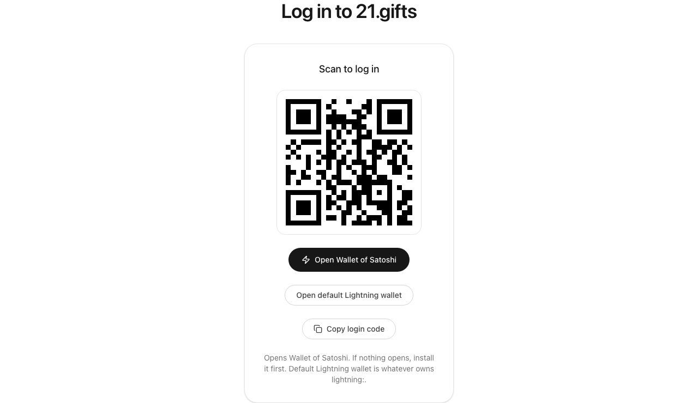
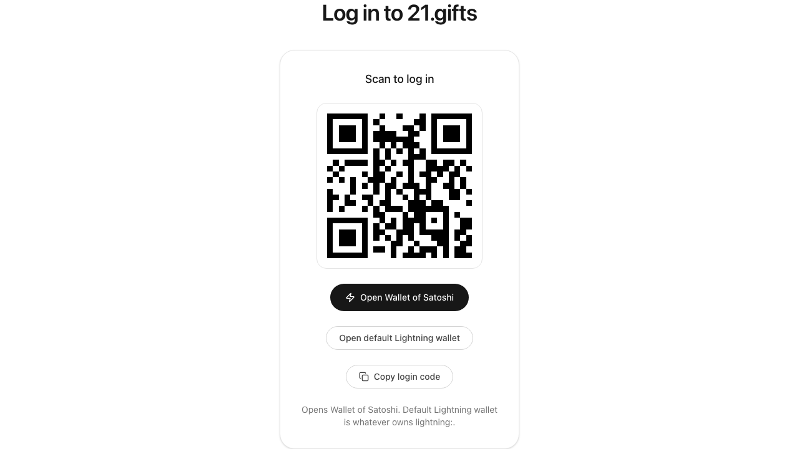
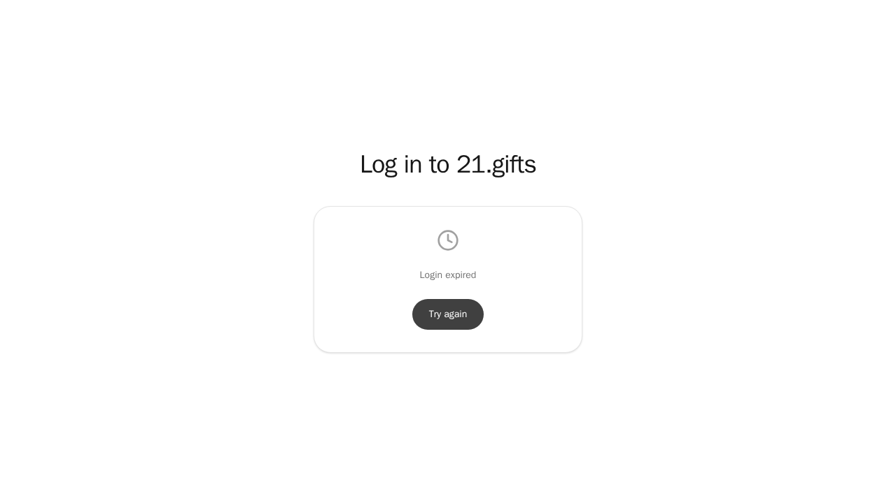
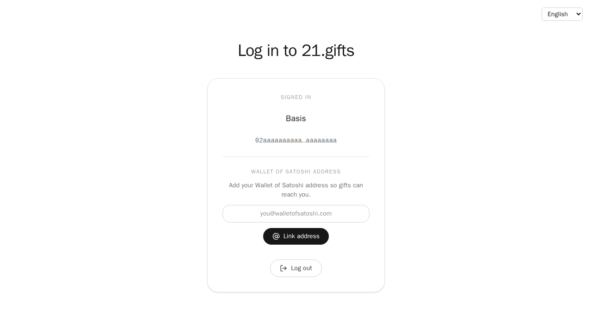
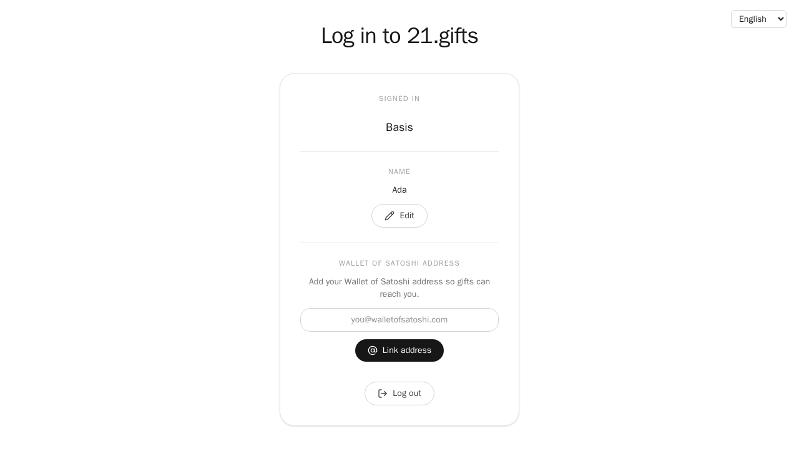
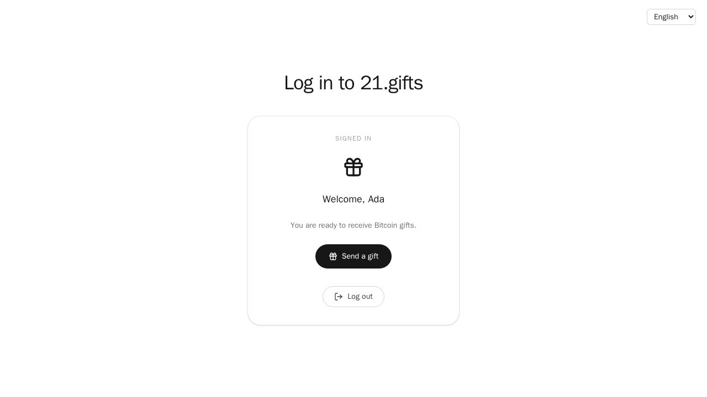
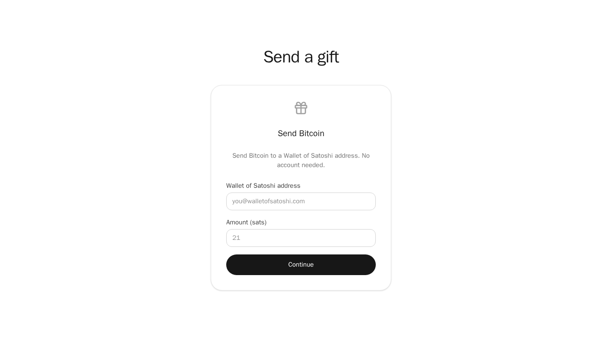
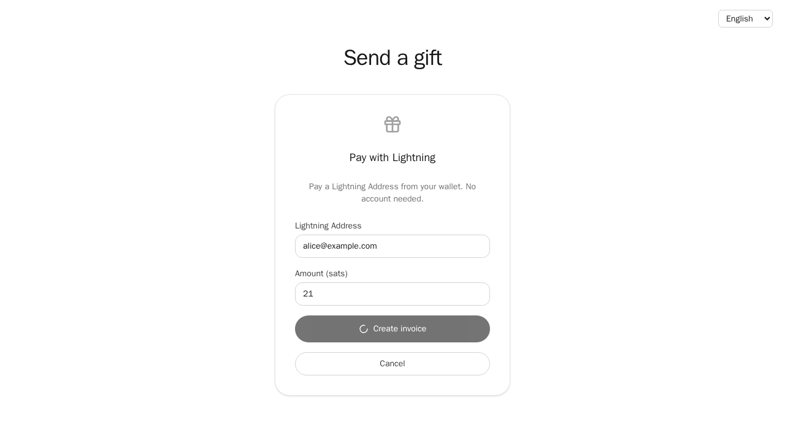
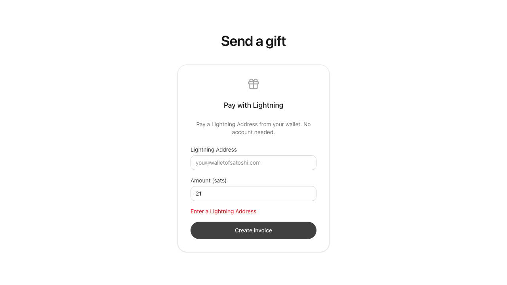
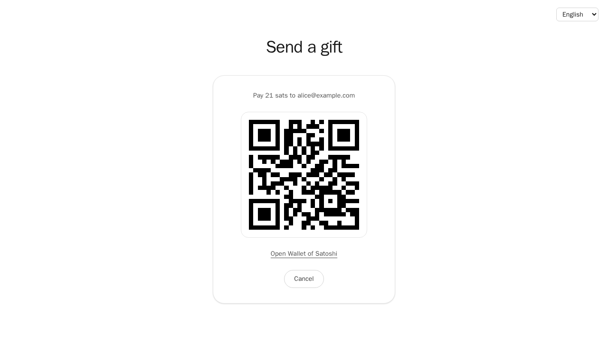

# Screens

## Screen: /

- **URL:** `/` — public marketing landing (no auth gate).
- **What the user sees:** Dark 21.gifts header with a language switcher, headline about peer-to-peer Bitcoin gifts, How it works (Wallet of Satoshi login and address) / Why / FAQ, CTAs **Ask for help** (`/login`) and **Send help** (`/donate`).
- **Actions:** Read the pitch, change language, open login or donate, jump to in-page sections, open Stats, open Legal & Privacy, open the Handbook.
- **Calls:** `Home` (`src/app/(marketing)/page.tsx`) inside `MarketingLayout`, `LanguageSwitcher`.

### Variant: default

Desktop/wide layout: section nav is visible in the header (How it works, Why, FAQ, Stats, Handbook, Log in). No hamburger.

### Variant: mobile-nav

Narrow viewport: header shows the Menu button. Open it to reveal the same links stacked. Tapping a link closes the menu.

## Screen: /legal

- **URL:** `/legal` — imprint and privacy. `/legal.html` permanently redirects here.
- **What the user sees:** Dark 21.gifts header with a language switcher, Legal Notice (Switzerland, info@21.gifts) and Privacy Policy (no analytics; no cookies unless the visitor chooses a language — then a `locale` cookie; session in localStorage; Cloudflare TLS; Wallet of Satoshi login on this origin). Legal body copy stays English.
- **Actions:** Change language. Read the legal body. Header **Log in** goes to `/login`.
- **Calls:** `LegalPage` inside `MarketingLayout`, `LanguageSwitcher`.

### Variant: default

The only state: imprint plus privacy, marketing chrome.

## Screen: /stats

- **URL:** `/stats` — public gift totals (no auth gate).
- **What the user sees:** Dark 21.gifts header with a language switcher, heading **Gifts**, four KPI cards (total spent, gifts, people, period), then diagrams: **Total spend over time** (hero cumulative chart), **By person**, **By month**. Empty database copy: **No gifts recorded yet.** Stats body copy stays English.
- **Actions:** Change language. Read the charts. Header **Stats** stays on this page; **Log in** goes to `/login`.
- **Calls:** `StatsPage`, `StatsLoader`, `StatsDashboard`, `fetchGiftStats` (same-origin `GET /gifts/stats`), `LanguageSwitcher`.

### Variant: default

Loaded stats with the cumulative spend chart visible.

### Variant: empty

Zero gifts. KPI zeros and **No gifts recorded yet.**

### Variant: loading

Waiting on `GET /gifts/stats`. Copy **Loading…**

### Variant: error

Fetch failed. Copy **Could not load gift stats. Please try again.** and **Try again**.

## Screen: /login

- **URL:** `/login` — Wallet of Satoshi sign-in.
- **What the user sees:** Light language switcher top-right on the page (not the marketing header). Idle start button, then QR and **Open Wallet of Satoshi**, or signed-in account. Error and expiry are terminal until **Try again**. There is no generic wallet link and no copy control.
- **Actions:** Change language. Scan the QR or tap **Open Wallet of Satoshi**. When signed in, set a display name, link/unlink a Wallet of Satoshi address, and log out. No client redirect to `/`.
- **Calls:** `LoginCard`, `NameForm`, `LightningAddressForm`, `useLnurlLogin`, `startLnurlAuth`, `pollSession`, `walletOfSatoshiHref`, `walletOfSatoshiIntentHref`, `uppercaseLnurl`, `QrCode`, `useAuthStore`, `LanguageSwitcher`.

### Variant: idle

Logged out, no challenge yet. Heading **Sign in to 21.gifts**, button **Log in with Wallet of Satoshi**.

### Variant: starting

Transient after the start click, before `/auth/lnurl` returns: spinner and **Preparing your login…**.

### Variant: qr

Challenge pending on desktop/iOS. QR and **Open Wallet of Satoshi**. No generic wallet link and no copy control.

### Variant: qr-android

Same QR card, but **Open Wallet of Satoshi** is an Android Intent that pins package `com.livingroomofsatoshi.wallet`.

### Variant: expired

Poll returned `expired` or `used`. Copy **Login expired** and **Try again** (calls `start()`).

### Variant: error

Challenge start or a later request failed. Copy **Something went wrong. Please try again.** and **Try again**.

### Variant: signed-in

Session present, no name and no Wallet of Satoshi address yet. **Signed in**, role, shortened linking key, name form, address form, **Log out**.

### Variant: signed-in-named

Signed in with a display name set. Shows the name plus **Edit**, and the empty address form.

### Variant: signed-in-linked

Signed in with an address on the account. Name form (set or **Edit**) plus the address with **Edit** / **Unlink** (no verification UI).

## Screen: /donate

- **URL:** `/donate` — guest Bitcoin gift. No login required.
- **What the user sees:** Light language switcher top-right on the page (not the marketing header). Page heading **Send a gift**, form heading **Send Bitcoin**, Wallet of Satoshi address field, sat amount (no comment), **Continue**, then a QR and **Open Wallet of Satoshi** — or a validation/range error on the form.
- **Actions:** Change language. Enter a Wallet of Satoshi address and amount, continue, pay with Wallet of Satoshi.
- **Calls:** `DonateForm`, `resolveLightningAddress`, `requestDonateInvoice`, `satsToMsat`, `QrCode`, `isAndroidUserAgent`, `walletOfSatoshiHref`, `walletOfSatoshiIntentHref`, `LanguageSwitcher`.

### Variant: form

Empty/idle form, submit enabled.

### Variant: busy

Payment request in flight: spinner on **Continue**, extra **Cancel** button.

### Variant: validation-error

Submit with a blank address (or invalid amount). An alert explains what to fix; no payment QR yet.

### Variant: invoice

Successful create: **Pay N sats to address**, Bitcoin payment QR, **Open Wallet of Satoshi**.

### Variant: invoice-android

Same payment card, but **Open Wallet of Satoshi** is an Android Intent that pins package `com.livingroomofsatoshi.wallet`. The pixels match the desktop invoice variant.

## Screen: /handbook

- **URL:** `/handbook` — public app handbook (no auth gate).
- **What the user sees:** Localized heading **Handbook** and intro chrome, language switcher in the marketing header, intro with a link to the api handbook on GitHub (`21gifts/api`), in-page nav (Overview / Screens / Functions / Endpoints) each with a link icon, then the four `docs/handbook/` markdown files rendered as HTML (English bodies). Every markdown heading has a sibling link icon.
- **Actions:** Change language, read the docs, jump via the section nav, copy a chapter or heading URL (click the link icon → check icon for 1.2s, hash updates), follow the api handbook link, follow in-page markdown links.
- **Calls:** `HandbookPage`, `HandbookIntro`, `HandbookCopyLink`, `loadHandbookDocuments`, `HandbookMarkdown` (`parseHandbookMarkdown`), `LanguageSwitcher`.

### Variant: default

Idle copy buttons: every heading and chapter shows the link icon.

### Variant: copied

After tapping the link icon on a heading or chapter, that button shows the check icon and `data-copied`, and `location.hash` is that id. Other copy buttons stay idle link icons.

## Screen: /404

- **URL:** any unknown path (App Router `not-found.tsx`). There is no `page.tsx` for `/404`; Playwright uses `page.goto('/404')` which hits this screen.
- **What the user sees:** Marketing chrome with a language switcher, heading **404**, **This page does not exist.**, **Back home**.
- **Actions:** Change language, go home, or use header/footer links.
- **Calls:** `NotFound`, `MarketingHeader`, `MarketingFooter`, `LanguageSwitcher`.

### Variant: default

The only state.

