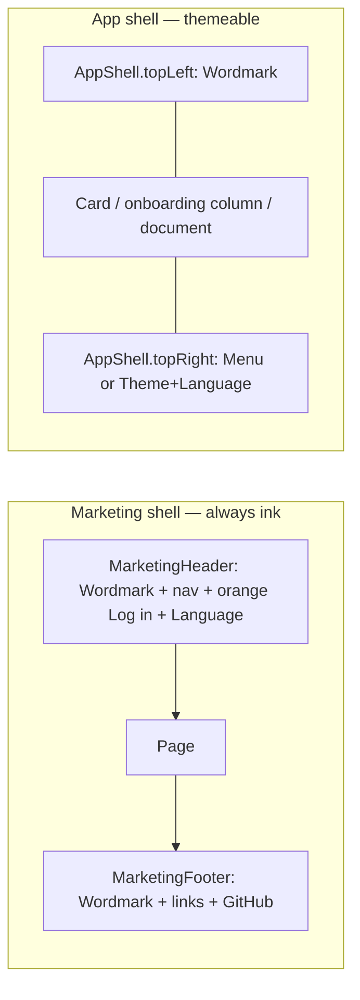
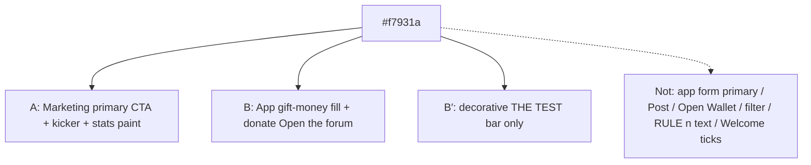
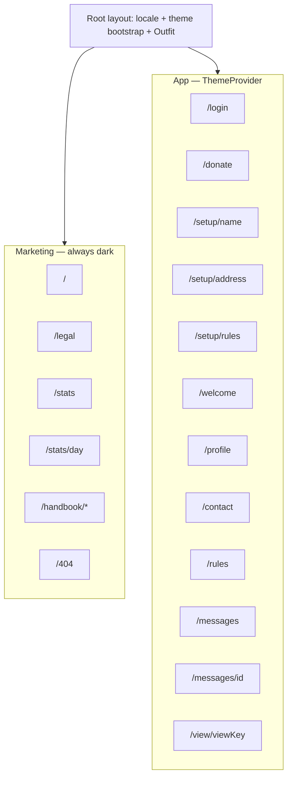

# 21.gifts visual design system

Current inventory of the shipped 21.gifts web UI. New UI composes the parts
named here. Do not invent a second look. This file is the **current inventory**,
not a target-only RFC. Reviewers follow the control-grammar table in this file
and in `CONTRIBUTING.md`.

Brand source: the API concept document, section **Brand**. Visual source: live
marketing at `/` plus the app-shell recipes in §12.

## Overview

21.gifts ships one visual family across marketing and app: Outfit via
`next/font`, ink/paper/accent plus `app-*` tokens, Wordmark on app chrome,
catalog primitives (`Button`, `ButtonLink`, `IconButton`, `Field`, `Card`,
`PageChrome`, `Wordmark`, `SegmentedControl`), Gift pay beside BIP-177 amount
text (no second ₿), marketing always-dark, app light/dark in the same family,
and empty profile charts that show copy instead of a null axis.

---

## Background & Motivation

**Why this file.** Reviewers need one inventory of shipped tokens, type, chrome, control grammar, and catalog primitives. `CONTRIBUTING.md` **Icon controls** points here.

**Current state (SHA `209486fe`).**

- Marketing: `src/app/(marketing)/layout.tsx` uses `bg-ink text-paper`. Header `Wordmark` + nav + accent **Log in** `ButtonLink` + `LanguageSwitcher` + optional `PwaInstall tone="dark" placement="header"`. Hero CTAs are `ButtonLink` (accent / secondary dark) plus `PwaInstall` hero. Kickers use `text-sm font-medium tracking-widest text-accent uppercase`. Leftover raw `#f7931a` / `text-white` on listed marketing surfaces move to `text-accent` / `text-paper/*`.
- App: `src/app/layout.tsx` loads Outfit via `next/font/google`; `body` is `font-sans bg-app-bg text-app-fg antialiased`. Tokens live in `src/app/globals.css` `@theme` / `html.dark`. Primitives: `src/components/ui/{Button,ButtonLink,IconButton,Card,Field,PageChrome,Wordmark,SegmentedControl}.tsx`.
- Theme: cookie `theme` (`src/lib/theme.ts`), bootstrap script in `<head>`, `html.dark`. Marketing never mounts `ThemeSwitcher`. Unsigned app routes mount ThemeSwitcher + LanguageSwitcher.
- Money: `formatBitcoin` in `src/lib/stats-money.ts` (BIP 177, leading `₿` U+20BF). Forum amount is text-only (`font-medium`); pay is lucide `Gift` `IconButton` (`forum.pay` “Send Bitcoin”). Empty profile charts show `profile.chartEmpty`, not a null axis.
- Locales: four catalogs in `src/lib/messages.ts` (`en`, `de`, `es`, `fil`). The API concept document says “English only”; the app already ships four. This system does not pretend otherwise.

**Shipped in #125.** Contact Send → IconButton; Gift pay; Open Wallet ButtonLink; IconButton sm slop; public ThemeSwitcher; claim banner; NameForm buttons; empty chart.

---

## Goals & Non-Goals

### Goals

- One visual family across marketing and app, with two shells (always-dark marketing; themeable app).
- Every color, type size, radius, space, and control state is a named token or a number.
- Wordmark `21.gifts` on app chrome, same family as marketing.
- Closed control grammar that **wins over** CONTRIBUTING “everything new is an icon”.
- Orange is the marketing-shell primary **and** app-shell gift-money; app form primaries stay ink/paper (`app-btn`).
- Pay control is not a second ₿. Profile empty chart is not an axis with `₿0`.
- Screen recipes name primitives top-to-bottom for every shipped route.
- Incremental PRs; first PR is markdown-only (no golden churn).

### Non-Goals

- Rebrand, new palette, purple, neon, gradients, decorative serif, Inter/Roboto/Open Sans/Arial as the brand face.
- Killing light theme or forcing the app always-dark.
- Figma as source of truth.
- Shipping profile photo/story HTTP or UI beyond a reserved slot.
- New donate flow, recurring-gift UI, or any new JSON field.
- Local Playwright golden generation on the session host.
- A fifth locale. Brand-voice examples in this document are English; UI copy stays in the four catalogs.

---

## Principles

Closed set. Each principle is one sentence plus one implication in this codebase.

1. **One family.** The product is a single geometric grotesque, not a marketing face plus a system-ui app. _Implication:_ load Outfit via `next/font/google` in `src/app/layout.tsx`; `body` uses `font-sans`; do not leave app pages on the Tailwind default stack.

2. **Two shells, one origin.** Marketing is always ink; app is themeable paper/ink. _Implication:_ routes under `src/app/(marketing)/` (and `/404`) use `bg-ink text-paper` with no `ThemeSwitcher`. All other pages use `app-*` tokens only.

3. **Orange is shell-split, not “gift-only.”** On the **marketing shell**, `#f7931a` is the primary filled CTA (header **Log in**, **Ask for help**, 404 **Back home**) plus kickers. On the **app shell**, it is gift-money only (charts, ₿ selected, donate **Open the forum**). _Implication:_ do not call marketing **Log in** a gift. App form primaries (`Button variant="primary"`) stay `bg-app-btn`. `Button variant="accent"` is the orange fill; marketing uses it as shell primary, the app uses it for gift-intent only.

4. **Tech is invisible.** Visitors are never asked about keys, relays, NOSTR, invoices, or sats-as-jargon. _Implication:_ UI says “Bitcoin”, “Wallet of Satoshi”, `formatBitcoin` (`₿1,500`). No `npub`, no “zap”, no “LNURL” on any screen (the API flows document).

5. **People first.** Receiver names, notes, and (later) photos are the hero; chrome is quiet. _Implication:_ forum note body is `text-sm text-app-fg`; chrome labels are `text-app-muted`. When photo/story lands, it occupies the reserved profile slot, not a new layout.

6. **Wordmark is chrome, not a logo file.** The brand is the text `21.gifts`. _Implication:_ `Wordmark` component in both shells; do not draw a mark unless it is the existing favicon “21” on ink.

7. **Primitives, not class soup.** New or migrated surfaces compose catalog parts. _Implication:_ reject raw `rounded-full bg-app-btn px-6 py-3` and raw `bg-neutral-900` outside `src/components/ui/` and the marketing header/footer (until those are tokenized).

8. **Do not canonize defects.** Goldens document current pixels; this system documents the target. _Implication:_ `₿21 ₿`, empty profile axis, app chrome without wordmark, `ViewProfileClaim` `bg-neutral-900` are **fix**. Login double-title and welcome “Forum” heading are **already gone in SHA `96d184d4` source** (`LoginPage` / `WelcomeScreen`); do not re-add them.

---

## Proposed Design

### 1. Wordmark & chrome

**Wordmark.** The string `21.gifts` in Outfit, weight 700, tracking `0`. Not an SVG logotype. The drawn asset is only the favicon/app-icon “21” (see below).

| Context                | Size                                | Weight | Color                                    | Element                                                                                                                     |
| ---------------------- | ----------------------------------- | ------ | ---------------------------------------- | --------------------------------------------------------------------------------------------------------------------------- |
| Marketing header       | 17px / 1.06rem                      | 700    | `paper` (`#ffffff`)                      | `<Link href="/">`                                                                                                           |
| Marketing footer       | 15px / 0.9375rem                    | 700    | `paper`                                  | `<span>` (not a second home link if header is present; keep as today)                                                       |
| App chrome (unsigned)  | 17px / 1.06rem                      | 700    | `app-fg`                                 | `<Link href="/">`                                                                                                           |
| App chrome (signed-in) | 17px / 1.06rem                      | 700    | `app-fg`                                 | `<Link href="/welcome">`, except `/setup/*` (`<span>` — `OnboardingGate` would bounce an incomplete account off `/welcome`) |
| OG / social            | existing `public/og.png` (1200×630) | —      | ink field, white wordmark, orange kicker | do not redraw in v1 of this system                                                                                          |

**Clear space.** Minimum 8px (`spacing-2`) on all sides of the glyph bounds. Do not place controls closer than 12px (`spacing-3`) to the wordmark.

**Do not.** Orange wordmark, outline wordmark, stacked “21” over “gifts”, a gift-box logo next to the wordmark in chrome. The lucide `Gift` on `/welcome` is a **page glyph**, not the brand mark.

**Favicon / apple-touch / OG (keep).**

- `public/favicon.svg` — 64×64, fill `#0A090C`, text `21` at 32px/700, fill `#f7931a`. This is the only drawn mark. When Outfit ships, update `font-family` in the SVG to Outfit, fallback `system-ui`.
- `public/favicon.ico` — 48×48, same composition.
- `public/apple-touch-icon.png` / `icon-192.png` / `icon-512.png` — ink field, orange `21`, no rounded-squircle decoration beyond what iOS applies.
- `public/og.png` — ink, orange kicker `PEER-TO-PEER · BITCOIN · WALLET OF SATOSHI`, white `21.gifts`, subtitle, orange-outline pill. Keep. A later isolated PR may regenerate with Outfit; not required to land tokens.

**App chrome today** (`screen-welcome`, `screen-profile`, `screen-contact`): no wordmark; **Menu** top-right (`SignedInChrome`); profile has a ghost back arrow top-left. **Target:** every app page uses `AppShell` with both chrome slots (`PageChrome` is only the flow-mode wrapper).

**`AppShell` slots (target).**

```
[ topLeft: Wordmark | Back+Wordmark ]     [ topRight: Menu | Theme+Language ]
[                         children                                      ]
```

| Slot       | Unsigned app (`/login`, `/donate`, `/rules`, `/messages/[id]`, `/view/*`)                                                                                                            | Signed-in app (`/welcome`, `/profile`, `/contact`, `/messages`, `/setup/*`)                                                                      |
| ---------- | ------------------------------------------------------------------------------------------------------------------------------------------------------------------------------------ | ------------------------------------------------------------------------------------------------------------------------------------------------ |
| `topLeft`  | `Wordmark` → `/`                                                                                                                                                                     | `Wordmark` → `/welcome`, except `/setup/*` (span, not a link). On `/profile` and `/setup/rules` (index > 0): `IconButton` back **then** wordmark |
| `topRight` | `ThemeSwitcher` + `LanguageSwitcher tone="light"` — **every** unsigned app route, including `/messages/[id]` and `/view/*` (SHA mounts language only; **add** ThemeSwitcher in PR 3) | `SignedInChrome` (Menu)                                                                                                                          |

App shell today (`src/components/AppShell.tsx`); `PageChrome` is a thin `mode="flow"` wrapper:

```tsx
// fill — locks to --app-height; header / scroll / footer slots
<main className="relative flex h-[var(--app-height)] flex-col overflow-hidden overscroll-y-none px-6">
  {/* absolute topLeft / topRight */}
  <header className="flex-none">{/* AppShellHeader */}</header>
  <div className="min-h-0 flex-1 overflow-y-auto">{/* children */}</div>
  <footer className="flex-none pb-8">{/* AppShellFooter */}</footer>
</main>

// flow — min-height --app-height; document scroll
<main className="relative flex min-h-[var(--app-height)] flex-col items-center px-6">
  {/* absolute topLeft / topRight */}
  <div className="flex w-full flex-none flex-col items-center pt-24 pb-8">{/* children */}</div>
</main>
```

**API.** Prefer `AppShell` directly (`mode`, `align`, `topLeft`, `topRight`, `className`). Absolute chrome stays `top-4` / `left-5` / `right-5` (16px / 20px). `fill` + `align="center"` centers short cards inside the inner scroller (never `justify-center` on `<main>`). Onboarding CTAs register via `AppShellFooter` (and headings via `AppShellHeader`) instead of stretching the form column.

Signed-in **Menu** trigger stays labeled (“Menu” + lucide `Menu` 16px). It is chrome, not an in-card action. Hit target ≥ 44×44px (pad the current `text-sm` trigger). Panel: `min-w-[18rem] rounded-xl border border-app-border bg-app-card p-2 shadow-lg` — keep.

Marketing header stays dedicated (`MarketingHeader`): sticky, `bg-ink/85 backdrop-blur-xl`, `border-b border-paper/10`, `px-5 py-3.5`. Do not reuse `PageChrome` on marketing.



---

### 2. Color

**Sacred hexes (do not shift).**

| Name   | Hex       | Role                                                                  |
| ------ | --------- | --------------------------------------------------------------------- |
| Ink    | `#0a090c` | Marketing canvas; app dark `app-bg`                                   |
| Paper  | `#ffffff` | App light canvas; marketing type                                      |
| Accent | `#f7931a` | Bitcoin orange — marketing primary + app gift-money (not “gift-only”) |
| Given  | `#525252` | Profile “Given” series (neutral; not accent)                          |

**Shell-stable tokens** (do not flip with `html.dark`; marketing uses these):

| Token    | Hex       | Tailwind                   |
| -------- | --------- | -------------------------- |
| `ink`    | `#0a090c` | `bg-ink`, `text-ink`       |
| `paper`  | `#ffffff` | `text-paper`, `bg-paper`   |
| `accent` | `#f7931a` | `bg-accent`, `text-accent` |

**App semantic tokens** (extend `src/app/globals.css`; light `@theme`, dark under `html.dark`):

| Token                | Light                | Dark                     | Use                                                      |
| -------------------- | -------------------- | ------------------------ | -------------------------------------------------------- |
| `app-bg`             | `#ffffff`            | `#0a090c`                | Page canvas                                              |
| `app-fg`             | `#171717`            | `#ffffff`                | Body, titles, primary type                               |
| `app-muted`          | `#525252`            | `#a3a3a3`                | Secondary sentences, leads                               |
| `app-subtle`         | `#737373`            | `#a3a3a3`                | Overlines, timestamps ≥ 12px                             |
| `app-border`         | `#e5e5e5`            | `rgb(255 255 255 / 0.2)` | Card edge, hairlines                                     |
| `app-border-strong`  | `#d4d4d4`            | `rgb(255 255 255 / 0.3)` | Fields, secondary buttons                                |
| `app-card`           | `#ffffff`            | `#121116`                | Raised panel                                             |
| `app-card-muted`     | `#fafafa`            | `#1a191e`                | Note cards, laws banner, composer well                   |
| `app-btn`            | `#171717`            | `#ffffff`                | Form primary fill                                        |
| `app-btn-fg`         | `#ffffff`            | `#0a090c`                | Form primary label                                       |
| `app-btn-hover`      | `#404040`            | `#e5e5e5`                | Form primary hover                                       |
| `app-hover`          | `#fafafa`            | `rgb(255 255 255 / 0.1)` | Row/ghost hover                                          |
| `app-accent`         | `#f7931a`            | `#f7931a`                | App gift-money fill + ₿ selected; not body text on paper |
| `app-accent-fg`      | `#0a090c`            | `#0a090c`                | Text on accent fill (always ink)                         |
| `app-focus`          | `#171717`            | `#ffffff`                | `:focus-visible` ring (2px)                              |
| `app-danger`         | `#b91c1c`            | `#f87171`                | Alert text/border                                        |
| `app-success`        | `#15803d`            | `#4ade80`                | Future success copy (unused on current screens)          |
| `app-overlay`        | `rgb(10 9 12 / 0.4)` | `rgb(10 9 12 / 0.6)`     | Future modal scrim                                       |
| `app-chart-given`    | `#525252`            | `#a3a3a3`                | Given series                                             |
| `app-chart-received` | `#f7931a`            | `#f7931a`                | Received / spend series                                  |
| `app-notice`         | `#fff7ed`            | `#2a1f12`                | Invite/activation banner fill                            |
| `app-notice-fg`      | `#171717`            | `#ffffff`                | Notice body                                              |
| `app-qr-bg`          | `#ffffff`            | `#ffffff`                | QR plate — **always paper**                              |
| `app-qr-fg`          | `#000000`            | `#000000`                | QR modules — always black                                |

**Changes vs today’s `globals.css`.** Keep every current `app-*` hex except:

- Light `app-muted`: `#737373` → `#525252` (hierarchy + AAA).
- New tokens: `ink`, `paper`, `accent`, `app-accent-fg`, `app-focus`, `app-danger`, `app-success`, `app-overlay`, `app-chart-given`, `app-chart-received`, `app-notice`, `app-notice-fg`, `app-qr-bg`, `app-qr-fg`.
- Dark `app-subtle`: keep `#a3a3a3` (today `#737373` fails AA on ink; see contrast).

Marketing replacements: `bg-[#0a090c]` → `bg-ink`; `text-[#f7931a]` → `text-accent`; `bg-[#f7931a] text-[#0a090c]` → `bg-accent text-ink`; `text-white/60` stays as `text-paper/60` (passes AA — see below).

**Orange rule (closed, two shells).** Do not pretend this is one “gift” job. Live marketing already uses orange as the **dark-shell primary**; the pay-sheet **Open Wallet of Satoshi** is `bg-app-btn` at the SHA and **stays** that way (labeled sentence-length, not accent). App **Log in** stays `app-btn`.

**(A) Marketing shell** (`bg-ink`): orange is the primary filled CTA plus kickers.

| Orange                                                                                              | Not orange                                                |
| --------------------------------------------------------------------------------------------------- | --------------------------------------------------------- |
| Header **Log in**, hero **Ask for help**, 404 **Back home**, stats **Try again**                    | Hero **Send help** (outline `border-paper/20 text-paper`) |
| Kickers: `HOW IT WORKS`, `WHY THIS EXISTS`, `FAQ`, `TOTAL SPEND OVER TIME`, `BY PERSON`, `BY MONTH` | Nav links, footer links                                   |
| Stats chart paint (spend series)                                                                    | KPI tile chrome                                           |

This is **not** “Log in is a gift.” It is “ink pages have one filled accent, and it is Bitcoin orange.” Changing header Log in to outline would be a visual change to `/` — **out of scope**. Canonize the live pill.

**(B) App shell** (`app-*`): orange is **gift-money** only — fills and chart paint, never body/kicker **text** on paper (2.3:1).

| Orange                                                               | Not orange                                                                                                                                    |
| -------------------------------------------------------------------- | --------------------------------------------------------------------------------------------------------------------------------------------- |
| `/donate` **Open the forum** (`ButtonLink` accent fill + `text-ink`) | Card **Log in**, **Try again**, **Continue**, **I agree**, **Activate**, forum **Post**, contact send, **Open Wallet of Satoshi** (`app-btn`) |
| Charts: received series, ₿ selected in ₿\|USD                        | Forum Active/All/Most popular selected (`app-btn`)                                                                                            |
|                                                                      | Menu, language/theme, app body links (`text-app-fg underline`)                                                                                |
|                                                                      | **Rules kickers and ticks** — see (B′)                                                                                                        |

**(B′) Living-room house chrome (closed exception, not a third job).** SHA `RulesDocument.tsx` paints `text-app-accent` on “RULE n”, Welcome `Check` icons, and `border-l-2 border-app-accent` on “THE TEST”. That is orange **text** on paper and it is **not** gift-money. **Do not keep it.** Target:

| Part                            | SHA today                      | Target                                                                                                                                                                                                                                                  |
| ------------------------------- | ------------------------------ | ------------------------------------------------------------------------------------------------------------------------------------------------------------------------------------------------------------------------------------------------------- |
| `RULE n` / `THE TEST` overlines | `text-app-accent`              | **overline** `text-app-subtle` (same as `NAME`)                                                                                                                                                                                                         |
| Welcome-list `Check`            | `text-app-accent`              | `text-app-fg` (the check glyph is the encoding; not orange, not a new green job)                                                                                                                                                                        |
| Forbidden `X`                   | danger red                     | `text-app-danger` (keep)                                                                                                                                                                                                                                |
| “THE TEST” left bar             | `border-l-2 border-app-accent` | **keep** `border-app-accent` as a **decorative** 2px stripe beside the overline. Not a contrast-dependent encoding (1.4.11 does not apply to pure decoration). Dark `/rules` still shows a thin orange rail; light does too, without using orange type. |

Do **not** list `text-app-accent` on paper as an allowed AA fail. Lands in the PR that tokenizes `RulesDocument.tsx` (PR 2).

Orange fill always uses `text-ink`.



**QR plates.** Always `bg-app-qr-bg` (`#ffffff`) + `border-app-border` (replace today’s `border-neutral-200` in `QrCode.tsx`). Dark theme does **not** invert the QR. Module color `app-qr-fg` (`#000000`). Quiet zone: `p-4` on a 232px module grid (`QR_SIZE = 232`).

**Contrast (WCAG 2.2 AA).**

| Pair                                      | Ratio (approx.) | AA body (4.5:1)     | Notes                                                                                                                                      |
| ----------------------------------------- | --------------- | ------------------- | ------------------------------------------------------------------------------------------------------------------------------------------ |
| `app-fg` `#171717` on `app-bg` `#ffffff`  | ~16:1           | Pass AAA            |                                                                                                                                            |
| `app-fg` `#ffffff` on `app-bg` `#0a090c`  | ~19:1           | Pass AAA            |                                                                                                                                            |
| Light muted **today** `#737373` on white  | ~4.7:1          | Pass AA             | Keep as `app-subtle` light                                                                                                                 |
| Light muted **target** `#525252` on white | ~7.0:1          | Pass AAA            | New `app-muted` light                                                                                                                      |
| Light subtle **today** `#a3a3a3` on white | ~2.5:1          | **Fail**            | Inherited. Do not use for text < 18px. Target: subtle light = `#737373`                                                                    |
| Dark muted `#a3a3a3` on ink               | ~7.9:1          | Pass                |                                                                                                                                            |
| Dark subtle **today** `#737373` on ink    | ~4.2:1          | **Fail** small text | Inherited. Target: dark subtle = `#a3a3a3`                                                                                                 |
| `paper/60` on ink (marketing lead)        | ~7.4:1          | Pass                | Keep                                                                                                                                       |
| Accent `#f7931a` on ink                   | ~8.6:1          | Pass                | Kickers, orange type on marketing                                                                                                          |
| Accent on paper                           | ~2.3:1          | **Fail**            | Never orange _text_ on light paper — including `/rules` “RULE n”. Orange is fill + `text-ink`, chart paint, or the decorative THE TEST bar |
| `text-ink` on accent fill                 | ~8.6:1          | Pass                | Accent buttons                                                                                                                             |
| `text-red-600` `#dc2626` on white         | ~4.5:1          | Bare AA             | Replace with `app-danger`                                                                                                                  |
| `text-red-600` on ink                     | ~5:1            | Marginal            | Replace with `app-danger` dark `#f87171`                                                                                                   |
| Given `#525252` on white                  | ~7.0:1          | Pass                | Legend + series                                                                                                                            |

**Allowed inherited failures (until the token PR):** light `#a3a3a3` overlines (`NAME`, `WALLET OF SATOSHI ADDRESS`, `THE TEST`) and dark `#737373` timestamps. The token PR must fix `app-subtle` as in the table. Do not introduce new `#a3a3a3` on white type.

Destructive alerts: `role="alert"` + `text-app-danger` (replace `text-red-600` on migrated surfaces).

---

### 3. Typography

**Family (one).** [Outfit](https://fonts.google.com/specimen/Outfit), SIL Open Font License 1.1. Geometric grotesque. Matches the live marketing: large, tight, quiet, no decoration. Outfit on Google Fonts is a **variable** face (`wght` 100–900). Load 400–700 only.

`next/font/google` treats a **weight array as the non-variable API**. An array can fail `next build` (`Missing weight` / “cannot specify weights as an array”). Use the variable range string (or omit `weight` to take the full axis, then subset via CSS).

```tsx
// src/app/layout.tsx
import { Outfit } from 'next/font/google';

const outfit = Outfit({
  subsets: ['latin'],
  weight: 'variable',
  display: 'block', // avoid FOUT in visual goldens; swap is allowed only with fonts.ready in shotScreen
  variable: '--font-outfit',
});

export default async function RootLayout({ children }: { children: ReactNode }): Promise<ReactElement> {
  const locale = await getRequestLocale();
  return (
    <html lang={locale} suppressHydrationWarning className={outfit.variable}>
      …
      <body className="font-sans bg-app-bg text-app-fg antialiased">
```

`className={outfit.variable}` **must** sit on `<html>` so `--font-outfit` exists. Without it, `@theme` interpolation is a no-op and pages stay on system-ui.

```css
@theme {
  --font-sans: var(--font-outfit), ui-sans-serif, system-ui, sans-serif;
}
```

**Build-time Google Fonts.** `next/font/google` downloads at **`next build`**, then self-hosts at runtime (good). CI and the `Dockerfile` image-build stage must reach `fonts.google.com` (or the Next font endpoint). If that is blocked, vendor the files and switch to `next/font/local` (see Alternatives F). Do not fetch Google Fonts from the browser at runtime.

**Visual goldens (PR 2).** `e2e/visual.spec.ts` `shotScreen` today only unsticks sticky headers and sets `animations: 'disabled'`. With `display: 'block'` the first paint waits for the face. If anyone uses `display: 'swap'`, `shotScreen` **must** `await page.evaluate(() => document.fonts.ready)` before `toHaveScreenshot`, or Linux goldens flake on FOUT.

**Forbidden as the brand face:** Inter, Roboto, Arial, Open Sans, system-ui. `system-ui` / `ui-sans-serif` are **fallback only**. Do not add a display serif. Do not add IBM Plex / Geist / another second family in v1.

**Why not keep the current stack.** Linux Chromium goldens render Tailwind `font-sans` as the distro grotesque. That is not a brand. Marketing _wants_ large typography; without `next/font` the app cannot share a face with the wordmark.

**Ramp.** 16px root. Use these classes (or a later `@utility` if one is added; until then, write the utilities on the JSX as CONTRIBUTING requires).

| Token          | px      | rem          | Weight | Line-height            | Letter-spacing              | Max measure                                        | Tailwind recipe                                                   | Use                                                                                                                                                   |
| -------------- | ------- | ------------ | ------ | ---------------------- | --------------------------- | -------------------------------------------------- | ----------------------------------------------------------------- | ----------------------------------------------------------------------------------------------------------------------------------------------------- |
| **display**    | 36 / 60 | 2.25 / 3.75  | 600    | 1.15 (`leading-tight`) | -0.025em (`tracking-tight`) | 20em                                               | `text-4xl sm:text-6xl font-semibold leading-tight tracking-tight` | Marketing H1 (`/`, `/stats` “Gifts”, `/stats/[day]`, 404 “404” uses `text-5xl` = 48px — keep 404 at 48/600)                                           |
| **h1**         | 24 / 30 | 1.5 / 1.875  | 600    | 1.25                   | -0.025em                    | 22em                                               | `text-2xl sm:text-3xl font-semibold tracking-tight text-center`   | App page title **inside a card or setup column**: welcome, profile, contact, inbox, setup. **Not login** (see **card-title**)                         |
| **card-title** | 18      | 1.125        | 500    | 1.3                    | 0                           | 22em                                               | `text-lg font-medium text-center text-app-fg`                     | Login card heading (`LoginCard` `login.heading`, SHA already `text-lg font-medium`). Keep this smaller step so the card is an action, not a billboard |
| **h1-lg**      | 30 / 36 | 1.875 / 2.25 | 600    | 1.2                    | -0.025em                    | 22em                                               | `text-3xl sm:text-4xl font-semibold tracking-tight text-center`   | `/donate`, `/rules` (document titles on a full page, not inside a card)                                                                               |
| **h2**         | 20      | 1.25         | 600    | 1.3                    | 0                           | 28em                                               | `text-xl font-semibold`                                           | Marketing step titles, legal H2, handbook H2                                                                                                          |
| **h3**         | 18      | 1.125        | 600    | 1.35                   | 0                           | 28em                                               | `text-lg font-semibold`                                           | Marketing why-grid titles, legal H3                                                                                                                   |
| **kicker**     | 14      | 0.875        | 500    | 1.3                    | 0.1em (`tracking-widest`)   | —                                                  | `text-sm font-medium tracking-widest uppercase text-accent`       | **Marketing shell only:** `HOW IT WORKS`, stats `TOTAL SPEND OVER TIME`. Not `/rules`                                                                 |
| **overline**   | 12      | 0.75         | 500    | 1.3                    | 0.1em                       | —                                                  | `text-xs font-medium tracking-widest uppercase text-app-subtle`   | `NAME`, `WALLET OF SATOSHI ADDRESS`, `THE TEST`, `RULE n` (app; **not** `text-accent`)                                                                |
| **body**       | 16      | 1            | 400    | 1.5                    | 0                           | 36em (`max-w-2xl` ~42rem for marketing lead is OK) | `text-base leading-normal`                                        | App body. Marketing lead is **body-lg**                                                                                                               |
| **body-lg**    | 18      | 1.125        | 400    | 1.5                    | 0                           | 36em                                               | `text-lg text-paper/60` (marketing) or `text-lg text-app-muted`   | Hero lead, stats subtitle                                                                                                                             |
| **body-sm**    | 14      | 0.875        | 400    | 1.45                   | 0                           | 36em                                               | `text-sm`                                                         | Forum note body, card sentences, field labels, button labels, FAQ answers                                                                             |
| **caption**    | 12      | 0.75         | 400    | 1.4                    | 0                           | —                                                  | `text-xs text-app-subtle`                                         | Forum timestamp, pay “Waiting for payment…”                                                                                                           |
| **numeric**    | inherit | inherit      | 600    | 1.2                    | 0                           | —                                                  | `font-semibold tabular-nums lining-nums`                          | `formatBitcoin`, USD, KPI values, chart ticks                                                                                                         |
| **code**       | 14      | 0.875        | 400    | 1.4                    | 0                           | —                                                  | `font-mono text-sm` (Tailwind default mono, fallback only)        | `you@walletofsatoshi.com` on marketing; Lightning Address _value_ on profile uses `font-mono text-sm` as today                                        |

**One title per page.** The document outline has one `h1` (or `card-title` used as the sole heading). Card must not repeat a page title. SHA `96d184d4` `LoginPage` already has no outer “Log in to 21.gifts”; the only heading is `LoginCard` `login.heading` at **card-title**. `login/page.test.tsx` does not assert the old string. Do not add the outer title back after wordmark lands. `login.pageTitle` in catalogs, if unused, is out of this freeze.

**`formatBitcoin`.** `src/lib/stats-money.ts`: leading U+20BF `₿`, locale-grouped integer, no space, no fraction. Example: `₿1,500`. JSON stays `sats` / `totalSats`. Render in a `span` with `tabular-nums lining-nums`. Do not replace U+20BF with lucide `Bitcoin`. Do not put a second ₿ beside the string. Product phrase **Wallet of Satoshi** unchanged (catalog exception / proper name).

USD: `formatUsdDisplay` → `$1.43` / `$1,425.00` (en-US currency). Axis ticks: `formatUsdTick` (`$0`, `$1.43`, `$1,425`). Toggle anatomy in §10.

**Link type.** Marketing inline links: `text-accent underline underline-offset-2`. App inline links (rules, contact): `text-app-fg underline underline-offset-2 font-medium`. Do not make app body links orange (fails on paper; also not a gift CTA).

---

### 4. Space, radius, elevation, motion

**Spacing scale** (4px base = Tailwind default). Use only these on new surfaces:

| Token   | px        | Tailwind              | Typical                                  |
| ------- | --------- | --------------------- | ---------------------------------------- |
| 1       | 4         | `p-1` `gap-1`         | Badge padding-y                          |
| 1.5     | 6         | `gap-1.5`             | Icon+label in Menu                       |
| 2       | 8         | `p-2` `gap-2`         | IconButton inner, composer gap           |
| 3       | 12        | `p-3` `gap-3`         | Pay sheet padding, field stack           |
| 4       | 16        | `p-4` `top-4` `gap-4` | Note card `px-4 py-3` (y=12), chrome top |
| 5       | 20        | `px-5` `right-5`      | Marketing horizontal, chrome right       |
| 6       | 24        | `px-6` `gap-6` `p-6`  | App page padding, card gap               |
| 8       | 32        | `p-8` `gap-8`         | Card padding                             |
| 10      | 40        | `gap-10` `py-10`      | PageChrome gap, footer py                |
| 12      | 48        | `mt-12` `gap-12`      | Section rhythm, stats `space-y-12`       |
| 16      | 64        | `pt-16`               | Stats top                                |
| 20      | 80        | `py-20`               | Marketing section py                     |
| 24      | 96        | `py-24`               | Legal/handbook top                       |
| 28 / 36 | 112 / 144 | `pt-28 sm:pt-36`      | Marketing hero                           |

App page padding is `px-6` (24px), not `px-5`. Marketing content padding is `px-5` (20px) as live. Do not mix.

**Radius.**

| Token     | px   | Tailwind                    | Use                                                                      |
| --------- | ---- | --------------------------- | ------------------------------------------------------------------------ |
| `pill`    | 9999 | `rounded-full`              | Buttons, switcher triggers, segmented thumbs, header Log in, badges      |
| `card`    | 24   | `rounded-3xl`               | `Card`, profile/login/welcome panels                                     |
| `note`    | 16   | `rounded-2xl`               | Forum notes, laws banner, fields, onboarding inputs, KPI tiles, QR plate |
| `panel`   | 12   | `rounded-xl`                | Menu, listbox, pay-sheet inner, photo preview, role hint                 |
| `control` | 8    | `rounded-lg`                | Menu rows                                                                |
| `chart`   | 6    | `rounded-md` / SVG `rx={6}` | ₿\|USD track (`rounded-md` today), person bars `rx={6}`                  |
| `none`    | 0    | —                           | Marketing month bars (keep square as live)                               |

**Elevation.**

| Level   | Recipe                               | Use                                                  |
| ------- | ------------------------------------ | ---------------------------------------------------- |
| 0       | border only                          | Marketing KPI tiles (`border-paper/10`), forum notes |
| 1       | `border border-app-border shadow-sm` | `Card`                                               |
| 2       | `border border-app-border shadow-lg` | Menu, language/theme listbox                         |
| Overlay | `bg-app-overlay`                     | Not used on current screens; reserved                |

Do not add drop shadows on marketing. Do not use colored shadows.

**Motion.**

| Event                | Duration                               | Easing                | Notes                                                      |
| -------------------- | -------------------------------------- | --------------------- | ---------------------------------------------------------- |
| Color hover          | 150ms                                  | `ease` (`transition`) | Buttons, rows, pills                                       |
| Menu / listbox mount | instant (conditional render, as today) | —                     | No fade required                                           |
| Theme switch         | instant                                | —                     | Class toggle on `html`; do not animate `color` on `<body>` |
| Pay sheet open       | instant                                | —                     | Insert in-card; no slide                                   |
| Spinner              | 1000ms linear infinite                 | `animate-spin`        | `Loader2`                                                  |
| Copy check flash     | 1200ms then revert                     | —                     | `ForumBoard` `COPY_RESET_MS`                               |

```css
@media (prefers-reduced-motion: reduce) {
  *,
  *::before,
  *::after {
    animation-duration: 0.01ms !important;
    animation-iteration-count: 1 !important;
    transition-duration: 0.01ms !important;
    scroll-behavior: auto !important;
  }
}
```

This global `*` hammer is WCAG 2.3.3-compliant and **does freeze** `Loader2` and the 1200ms copy-check flash (they become static). That is acceptable. Forum `scrollIntoView({ behavior: 'auto' })` is already correct and does **not** depend on this CSS. Do not introduce `behavior: 'smooth'` without a reduced-motion guard. Add the block to `globals.css` in the token PR.

---

### 5. Two shells

**Marketing** — `src/app/(marketing)/layout.tsx` + `/404` (`src/app/not-found.tsx`, which duplicates the shell because it sits outside the group).

- Canvas: `min-h-[var(--app-height)] bg-ink text-paper [color-scheme:dark]`.
- No `ThemeSwitcher`. Cookie theme must not lighten `/`, `/legal`, `/stats`, `/handbook`, `/404`.
- Header + footer always mounted.
- Hardcoded `#0a090c` / `#f7931a` migrate to `ink` / `accent` / `paper`.

**App** — every other `page.tsx`. Tokens only. `ThemeProvider` + `THEME_BOOTSTRAP_SCRIPT` already in root layout. Never `bg-neutral-900`, never `dark:bg-[#0a090c]` dual-writes outside primitives (`ViewProfileClaim.tsx` is the known offender).



`/rules` is **app shell** (themeable, no marketing header) even though it is public — goldens (`screen-rules-desktop-light-linux.png`) and `src/app/rules/page.tsx` already do this. Keep. Footer links from marketing _into_ `/rules`.

`/donate` is app shell (themeable, unsigned chrome). Keep.

---

### 6. Layout

| Measure            | Value                                       | Use                                              |
| ------------------ | ------------------------------------------- | ------------------------------------------------ |
| Marketing max      | `max-w-[1100px]`                            | Home, stats, handbook, 404 content, footer inner |
| Legal max          | `max-w-3xl` (48rem)                         | `/legal` reading column                          |
| App card `sm`      | `max-w-sm` (24rem)                          | Login, profile, view, onboarding name/address    |
| App card `md`      | `max-w-md` (28rem)                          | Donate inner (today a non-Card column)           |
| App card `xl`      | `max-w-xl` (36rem)                          | Welcome/forum, contact, inbox                    |
| Rules document     | `max-w-3xl`                                 | `/rules`, `/setup/rules`                         |
| App page pad       | `px-6`                                      | `AppShell` / flow `PageChrome`                   |
| Marketing pad      | `px-5`                                      | Header, sections, footer                         |
| Vertical app shell | `AppShell` fill/flow + `--app-height`       | Centered cards and long documents                |
| Onboarding column  | fill `AppShell` + `AppShellFooter` CTA slot | `/setup/name`, `/setup/address`, `/setup/rules`  |
| Marketing hero     | `pt-28 pb-20 sm:pt-36`                      | `/`                                              |
| Marketing section  | `py-20`                                     | how / why / faq                                  |
| Stats / handbook   | `pt-16 pb-24` / `py-24`                     |                                                  |

**Mobile vs desktop.** Marketing nav hides below `md`, hamburger `md:hidden` (keep). App cards are single-column at all breakpoints. Forum `Card maxWidth="xl"` is the widest app panel. Playwright viewports: desktop and mobile combos already in `scripts/screen-variants.mjs` (`BASELINE_COMBOS`). Do not add a third breakpoint.

**Safe area / visualViewport.** `AppShell` plus `--app-height` from `visualViewport` (bootstrap script + `useAppHeight` / `AppHeightSync`) is the height source. Do not add `env(safe-area-inset-*)` here.

---

### 7. Iconography

**Set.** `lucide-react` only (already a runtime dependency). No second icon pack. No custom SVG icons except favicon “21”, `public/wos-icon.png` (Wallet of Satoshi, 20×20 in the pay CTA), and handbook images.

**Stroke.** Default lucide 2px. At 16px glyph use stroke 2; at 20–24px use stroke 1.75 if the glyph looks heavy on goldens after Outfit — otherwise leave default. Do not mix fills.

**Sizes (glyph, not hit target).**

| Glyph | px  | Tailwind      | Use                                                 |
| ----- | --- | ------------- | --------------------------------------------------- |
| 14    | 14  | `h-3.5 w-3.5` | Menu row icons, ₿\|USD is text not icon             |
| 16    | 16  | `h-4 w-4`     | Button leading icon, Field-adjacent, pay-sheet back |
| 20    | 20  | `h-5 w-5`     | IconButton md/lg default, profile back              |
| 24    | 24  | `h-6 w-6`     | unused in chrome; skip                              |
| 32    | 32  | `h-8 w-8`     | Login fingerprint / error / spinner                 |
| 48    | 48  | `h-12 w-12`   | Welcome `Gift`                                      |

**Decorative vs control.** Decorative: `aria-hidden="true"` (Gift on welcome, Fingerprint on login, AlertTriangle on error, legend swatches). Control: `IconButton` with required `aria-label` from the catalog. Indicators (given/received arrows in Menu): `aria-label` on the wrapping `span`, not a button — already correct in `SignedInChrome`.

**Welcome Gift glyph.** **Keep.** Lucide `Gift`, `h-12 w-12 text-app-fg`, `aria-hidden`. It is the forum’s page glyph, not the brand mark. Do not color it orange. Do not duplicate it in chrome.

**Pay control glyph.** Lucide **`Gift`**, not `Bitcoin`. Accessible name stays catalog `forum.pay` = **“Send Bitcoin”** (`de` Bitcoin senden, `es` Enviar Bitcoin, `fil` Magpadala ng Bitcoin). Do **not** retune that string to “Pay” in the pay PR (`e2e/visual.spec.ts` uses `getByRole('button', { name: 'Send Bitcoin' })`). Two Gift glyphs on `/welcome` is intentional: 48px decorative identity vs 16px in-card control with a different name. Sizes + `aria-hidden` vs `aria-label` prevent collision. A labeled **Pay** control was considered and rejected (see Alternatives I).

**Hit targets.** WCAG 2.2 AA 2.5.8 is **24×24px**. Today’s `IconButton` `sm` `h-6 w-6` **meets AA**. 44×44 is 2.5.5 AAA. Target: **44px minimum hit** for every `IconButton`, but in-card `sm` must **not** become a 44px _painted_ circle (forum note footers: pay + copy + PM). See §10.

---

### 8. Photography (reserved slot)

Profile photo and story are **Sketch** (API flows document, journey 2). Do not ship UI that pretends they exist. When they land, they occupy this slot so the screen does not invent a look:

| Part         | Spec                                                                                                                                                                                                         |
| ------------ | ------------------------------------------------------------------------------------------------------------------------------------------------------------------------------------------------------------ |
| Avatar       | 96×96px (`h-24 w-24`), circle (`rounded-full`), `object-cover`, 1:1 crop, above the profile `h1` or immediately under it, centered                                                                           |
| Aspect       | 1:1 only for the profile portrait. Forum message photos stay `max-h-80 w-full rounded-xl object-contain` (already)                                                                                           |
| Fallback     | Two-letter initials from `name` (first grapheme of first two words, else first two), Outfit 600 24px, on `bg-app-card-muted text-app-fg`. If no name: lucide `Gift` 32px `text-app-muted` in the same circle |
| Story        | `body-sm text-app-muted`, centered, under the name row, max 4 lines (`line-clamp-4`) on the card; full text on a future expanded view — not designed here                                                    |
| Forum photos | Already specified in `ForumBoard`; not the profile portrait                                                                                                                                                  |

Do not use a colored placeholder, a camera badge, or a progress ring.

---

### 9. Money

**Visitor amounts.** Always `formatBitcoin(sats, locale)` from `src/lib/stats-money.ts`. Leading `₿` (U+20BF), locale grouping, no fraction, no extra ₿. Class: `tabular-nums lining-nums`. JSON fields remain `sats` / `totalSats`.

**Pay control is not a second ₿.** Forum cards today: `formatBitcoin` + lucide `Bitcoin` `IconButton` (`ForumBoard.tsx` amount row). Goldens: `₿21` then a ₿ glyph. **Defect.**

Target anatomy of the note footer:

```
[ ₿21 ]  [ Gift IconButton aria-label=Send Bitcoin ] [ Copy ] [ PM ]  [ N replies ]
```

- Amount: `<p className="text-xs font-medium text-app-muted tabular-nums lining-nums">{formatBitcoin(message.sats, locale)}</p>` — **not a button**.
- Pay: `IconButton` `variant="ghost"` `size="sm"` (24px painted glyph, 44px hit slop — §10), lucide `Gift` 16px, `aria-label={t('forum.pay')}` (**Send Bitcoin**, frozen). Disabled while `payBusy`.
- Do not put the amount inside the pay control.
- Do not change `forum.pay` copy in PR 4.

Pay sheet confirm sentence (`forum.payConfirm`) keeps one `formatBitcoin`. Sheet CTAs: **Continue** (`Button` primary) then labeled **Open Wallet of Satoshi** (`ButtonLink` `variant="primary"` `size="md"` `tone="app"` — sentence-length, **not** accent; today a raw `<a className="… bg-app-btn px-5 py-2">`, leftover). Smartphone: no QR (`isSmartphoneUserAgent`, not viewport). Desktop: QR + deep link. Unchanged product rule from CONTRIBUTING.

**USD.** `$1.43` via `formatUsdDisplay`. Stats KPI shows ₿ on the first line and USD on the second (keep).

**₿ \| USD segmented control** — shipped as `SegmentedControl` (see catalog).

| Part       | Spec                                                                                                               |
| ---------- | ------------------------------------------------------------------------------------------------------------------ |
| Track      | Gift app: `inline-flex overflow-hidden rounded-md border border-app-border text-xs`. Gift dark: `border-paper/20`. |
| Segment    | `min-h-11 min-w-11 px-2 py-1` on mobile **and** desktop                                                            |
| Selected   | Gift app: `bg-app-accent text-app-accent-fg`. Gift dark: `bg-accent text-ink`                                      |
| Unselected | Gift app: `text-app-muted`. Gift dark: `text-paper/70`                                                             |
| Labels     | `₿` and `USD` (not “sats”). `aria-pressed` on each. Group `role="group"` with catalog name                         |

Forum Active/All/Most popular uses the **same primitive** with `tone="neutral"` so selected is `bg-app-btn` not orange. Profile uses `tone="gift"` (app shell). Stats uses `tone="gift" shell="dark"`.

---

### 10. Control grammar

The design system **wins** for **new** work. CONTRIBUTING **Icon controls** matches this table. Reviewers follow the table, not “everything new is an icon”.

**Shipped conversions (#125).** The eight grandfathered migrations below already landed. Do not re-grandfather them as future work.

| Labeled (`Button` / `ButtonLink`)                                                                                                                                                                                                                                                                                                           | Icon-only (`IconButton`, required `aria-label`)                                                                                                                                                                                                                                                    |
| ------------------------------------------------------------------------------------------------------------------------------------------------------------------------------------------------------------------------------------------------------------------------------------------------------------------------------------------- | -------------------------------------------------------------------------------------------------------------------------------------------------------------------------------------------------------------------------------------------------------------------------------------------------- |
| Consent (**I agree to these rules**), **Continue**, **Log in**, **Log out**, **Try again**, **Activate**, sentence-length links (**Open Wallet of Satoshi**, **Open the forum**, **Open the app**, **Back home**, **Ask for help**, **Send help**), marketing-shell primary (**Log in** pill, 404 **Back home**), donate **Open the forum** | Actions **inside** a card: edit, delete, attach, send/post (forum + contact + inbox composers), copy, dismiss, **pay** (Gift icon, `aria-label` = `forum.pay` “Send Bitcoin”), push bell, profile back, rules-setup back, inbox thread back, Menu **row** icons (the Menu _trigger_ stays labeled) |

| Conversion (shipped in #125)                              | Result                                   |
| --------------------------------------------------------- | ---------------------------------------- |
| Contact **Send** labeled `Button` (`ContactScreen.tsx`)   | `IconButton` primary `lg`, lucide `Send` |
| Pay lucide `Bitcoin` `IconButton` `sm` (`ForumBoard.tsx`) | lucide `Gift`, same `forum.pay` name     |
| `IconButton` `sm` `h-6 w-6`                               | 24px paint + 44px hit slop               |
| Open Wallet raw `<a className="… bg-app-btn px-5 py-2">`  | `ButtonLink` primary md                  |
| Public ThemeSwitcher on unsigned app routes               | ThemeSwitcher + LanguageSwitcher         |
| Claim banner `bg-neutral-900` leftovers                   | `app-notice` + `Button`                  |
| NameForm / RulesSetup leftover buttons                    | `Button` / `IconButton`                  |
| Empty profile chart null axis                             | `profile.chartEmpty` status copy         |

**Skip** (onboarding name/address only) is a labeled `Button` in the same column as **Continue**. There is no Skip on `/setup/rules` or on the post overlay.

**Menu trigger** stays labeled (icon + “Menu”). It is page chrome. Do not convert **Log out**, **Continue**, **Skip**, **Activate**, **Try again**.

**Button size scale (one).** Today primitives use `px-6 py-3`; leftovers use `px-5 py-2` / `py-2.5` (`NameForm` onboarding, `RulesSetup`, `ViewProfileClaim`). Unify.

| Size           | Padding                | Type     | Min height        | Use                                                                                                             |
| -------------- | ---------------------- | -------- | ----------------- | --------------------------------------------------------------------------------------------------------------- |
| `sm`           | `px-4 py-2`            | 14px/500 | 44px (`min-h-11`) | Compact labeled (rare; marketing header **Log in** stays `px-4 py-2` but must still be ≥ 44px — use `min-h-11`) |
| `md` (default) | `px-6 py-3`            | 14px/500 | 44px              | Login, Try again, secondary                                                                                     |
| `lg`           | `px-6 py-3` + `w-full` | 14px/500 | 44px              | Onboarding Continue / I agree (full width in the column)                                                        |

Do not add a 36px button. Marketing header Log in visual may stay slightly smaller in width but not in height.

**`IconButton` size scale.** Prefer **hit slop**, not a 44px painted disc, for in-card `sm`. Forum pay/copy/PM/laws-dismiss/pay-back all use `size="sm"` today; three 44px painted ghosts would reflow every note footer and churn welcome goldens twice (PR 2 then PR 4).

**`sm` class (copy-paste; `::before` without `content` does not generate a box):**

```
relative isolate inline-flex h-6 w-6 shrink-0 items-center justify-center rounded-full leading-none
before:absolute before:content-[''] before:block before:-inset-2.5 before:min-h-11 before:min-w-11 before:rounded-full
```

The painted control stays `h-6 w-6` (absolute `::before` does not grow flex layout). The `::before` is inside the `<button>`, so it is the hit target. Put the lucide node in `relative z-10` so it paints above the slop.

**Clustered `sm` must not overlap.** `-inset-2.5` is 10px slop per side → 44px hit. SHA note footer is `gap-1.5` (6px) → center-to-center 30px → **14px overlap**. **Do not accept overlap.** Any row of two or more `sm` IconButtons uses `gap-5` (20px): 24px paint + 20px gap = 44px center-to-center, hits **touch, do not overlap**. Isolated `sm` (laws dismiss, pay-sheet back) keep their absolute position; no gap change.

| Size           | Layout / paint               | Hit target           | Glyph | SHA today                        | Tests to update                                                                                                                 |
| -------------- | ---------------------------- | -------------------- | ----- | -------------------------------- | ------------------------------------------------------------------------------------------------------------------------------- |
| `sm`           | `h-6 w-6` + slop class above | 44×44 via `::before` | 16px  | `h-6 w-6` — **AA 2.5.8 already** | `IconButton.test.tsx`: keep `toContain('h-6')`; **add** `toContain("before:content-['']")` and `toContain('before:-inset-2.5')` |
| `md` (default) | `h-11 w-11` (44px painted)   | 44×44                | 20px  | `h-10 w-10` (40)                 | `toContain('h-10')` → `h-11`                                                                                                    |
| `lg`           | `h-12 w-12` (48px painted)   | 48×48                | 20px  | `h-11 w-11` (44)                 | `toContain('h-11')` for `lg` → `h-12`                                                                                           |

PR 2: `md`/`lg` painted boxes, `sm` slop class, **and** `ForumBoard` note-footer `gap-1.5` → `gap-5` (small welcome golden shift, not a painted-circle redesign). Do **not** paint `sm` as `h-11`. Gift-vs-Bitcoin is PR 4.

---

### 11. Component catalog

Every primitive: anatomy, tokens, states, React API. New or migrated surfaces compose these. Raw duplicate class strings are rejected.

Shared focus: `:focus-visible { outline: 2px solid var(--color-app-focus); outline-offset: 2px }`. **No `outline-none` on controls** (Field, composer, switchers, buttons). Add a `@layer base` rule in `globals.css` for `button`, `a`, `input`, `textarea`, `summary`, `[role="button"]`.

Disabled: `opacity-50` + `cursor-not-allowed` (IconButton already; Button should match).

Loading: leading `Loader2` `h-4 w-4 animate-spin` (labeled) or replacing the glyph (icon). Control stays disabled.

---

#### `AppShell` / `PageChrome`

**Anatomy.** `AppShell` owns the app `<main>`: optional absolute `topLeft` / `topRight`, `fill` (locked height + header/scroll/footer) or `flow` (min-height + document scroll). `PageChrome` is the flow-mode wrapper; prefer `AppShell` on new routes.

**Tokens.** `h-[var(--app-height)]` (`fill`) or `min-h-[var(--app-height)]` (`flow`), `px-6`, `bg` inherited from `body`. Never Tailwind viewport-height utilities on app routes.

**States.** None of its own.

**API.**

```tsx
export interface AppShellProps {
  children: ReactNode;
  mode: 'fill' | 'flow';
  topLeft?: ReactNode;
  topRight?: ReactNode;
  className?: string;
  align?: 'start' | 'center'; // fill only
}

export interface PageChromeProps {
  children: ReactNode;
  topRight?: ReactNode;
  topLeft?: ReactNode;
  className?: string;
}
```

Those routes use `AppShell` (`fill` or `flow`); `PageChrome` is the flow-mode wrapper only. Prefer `AppShell` directly so chrome positions cannot drift.

---

#### `Wordmark` (new primitive)

**Anatomy.** Text `21.gifts` as `Link`.

**Tokens.** Header `text-[17px] font-bold no-underline`; footer `text-[15px] font-bold no-underline`. Color: `text-paper` (marketing) or `text-app-fg` (app).

**API.**

```tsx
export function Wordmark(props: {
  href?: string; // omit → <span>, not a link (marketing footer)
  tone?: 'app' | 'dark'; // app = app-fg; dark = paper on ink
  size?: 'header' | 'footer'; // header 17px (default); footer 15px
}): ReactElement;
```

Do not over-type `href` as `'/' | '/welcome'` — unsigned app also uses `/` from `/rules` and `/donate`, and the footer is not a link. Use in `MarketingHeader` (`href="/"`), `MarketingFooter` (no `href`), app `AppShell` `topLeft` (`/` or `/welcome`).

---

#### `Card`

**Anatomy.** `<section>` panel: children in a column, centered, `gap-6`, `p-8`, `rounded-3xl`, `border border-app-border bg-app-card shadow-sm`, `w-full` + max width.

**API (keep).** `maxWidth?: 'sm' | 'md' | 'xl'` default `sm`. `className?`.

**States.** None. Nested notes use `app-card-muted`, not a second `Card`.

**Do not** put page chrome inside `Card`.

---

#### `Button` (labeled)

**Anatomy.** `inline-flex items-center justify-center gap-2 rounded-full font-medium text-sm`. Optional leading `icon` (decorative). Optional `tone?: 'app' | 'dark'` (default `app`), same shell split as `ButtonLink`.

**Variants (app tone).**

| Variant     | Default                                                   | Hover              | Disabled   | Use                                              |
| ----------- | --------------------------------------------------------- | ------------------ | ---------- | ------------------------------------------------ |
| `primary`   | `bg-app-btn text-app-btn-fg`                              | `bg-app-btn-hover` | opacity 50 | Log in, Continue, Try again, I agree, Activate   |
| `secondary` | `border border-app-border-strong bg-app-card text-app-fg` | `bg-app-hover`     | opacity 50 | Retry on forum, inbox                            |
| `accent`    | `bg-app-accent text-app-accent-fg`                        | `opacity-90`       | opacity 50 | App donate **Open the forum**; gift-intent fills |

**Dark tone.** Secondary `border border-paper/20 text-paper hover:bg-paper/10`; primary `bg-paper text-ink`; accent `bg-accent text-ink`. Used by `PwaInstall` header/hero (and iOS sheet Close) on marketing ink.

**States:** default, hover, `:focus-visible` (ring), active (`scale` **not** used — color only), disabled, loading (`icon={<Loader2 className="h-4 w-4 animate-spin" />}` + disabled).

**API.**

```tsx
export type ButtonVariant = 'primary' | 'secondary' | 'accent';
export type ButtonTone = 'app' | 'dark';
export interface ButtonProps extends ButtonHTMLAttributes<HTMLButtonElement> {
  variant?: ButtonVariant;
  size?: 'sm' | 'md' | 'lg'; // default md
  tone?: ButtonTone; // default app
  icon?: ReactNode;
  children: ReactNode;
}
```

`lg` adds `w-full`.

---

#### `ButtonLink` (new)

Same visual variants/sizes as `Button`, rendered as `next/link` `Link`. Used by marketing CTAs, 404, donate **Open the forum**, legal **Open the app**, pay-sheet **Open Wallet of Satoshi**. Stops `<Link className="rounded-full bg-[#f7931a] …">` drift.

`tone` is **required for `secondary`** so marketing **Send help** can be paper-on-ink without a raw class string. Default `app`.

```tsx
export function ButtonLink(props: {
  href: string;
  variant?: ButtonVariant;
  size?: 'sm' | 'md' | 'lg';
  tone?: 'app' | 'dark'; // default 'app'; 'dark' = paper/20 border + text-paper (marketing secondary)
  children: ReactNode;
  className?: string;
}): ReactElement;
```

| `tone`          | `variant="secondary"`                                         | `variant="accent"` / `primary`                            |
| --------------- | ------------------------------------------------------------- | --------------------------------------------------------- |
| `app` (default) | `border-app-border-strong bg-app-card text-app-fg`            | accent = `bg-app-accent text-ink`; primary = `bg-app-btn` |
| `dark`          | `border-paper/20 bg-transparent text-paper hover:bg-paper/10` | accent fill unchanged (`text-ink` on orange)              |

Hero **Send help**: `ButtonLink href="/donate" variant="secondary" tone="dark"`. Header **Log in** / **Ask for help** / 404 **Back home**: `variant="accent"` (tone irrelevant). Pay **Open Wallet of Satoshi**: `variant="primary" tone="app"` (not accent).

---

#### `IconButton`

**Anatomy.** Round control, glyph only, required `aria-label`.

**Variants:** `primary` (`bg-app-btn text-app-btn-fg`), `secondary` (border), `ghost` (`text-app-muted hover:bg-app-hover hover:text-app-fg`). Default `secondary`.

**Sizes:** see table in §10. **`sm` class is the full list there** (`before:content-['']` is required). **Breaking for `md`/`lg` painted boxes** (`h-10`→`h-11`, `h-11`→`h-12`). Update `src/__tests__/components/ui/IconButton.test.tsx` in the same PR (`h-6` + slop classes; default `h-11`; `lg` `h-12`).

**States:** default, hover, focus-visible, active, disabled (`disabled:cursor-not-allowed disabled:opacity-50`), loading (spinner replaces glyph).

**API.** Keep `IconButtonProps`; `size` default `md`.

Glyph: `aria-hidden` on the lucide node (callers already do this).

---

#### `Field`

**Anatomy.** `<label className="flex flex-col gap-1 text-left text-sm text-app-fg">` + control.

**Control class (target).**

```
w-full min-h-11 rounded-2xl border border-app-border-strong bg-app-card
px-4 py-2 text-sm text-app-fg
transition
focus-visible:border-app-fg
disabled:opacity-50
```

**Drop `outline-none`.** SHA `Field` `CONTROL_CLASS` includes `outline-none` and `focus:border-app-border-strong` (not `:focus-visible`). Tailwind `outline-none` on the control **wins** over a weakly ordered `@layer base` ring, so inputs stay keyboard-invisible. The global `:focus-visible` ring **replaces** it. Same for composer textareas and switcher triggers: no per-control `outline-none`.

Textarea: add `min-h-11 resize-none`. Composer textareas that sit beside an IconButton may omit the visible label and use `aria-label` only — that is a **composer**, not `Field`. Prefer `Field` when a label is visible (pay amount).

**States.** Default, hover (border-strong), focus-visible (global ring + border-fg), disabled, error (`border-app-danger` + `aria-invalid` + sibling `p role="alert" text-sm text-app-danger`).

**API.** Keep `FieldProps` input/textarea union. Add optional `error?: string` that sets `aria-invalid` and renders the alert — optional; screens may keep external alerts as today.

Placeholder: `text-app-subtle`.

---

#### LanguageSwitcher / ThemeSwitcher pills

**Standalone trigger (unsigned chrome, marketing language):**

```
inline-flex items-center gap-1.5 rounded-full border px-3 py-1.5 text-sm min-h-11
```

- Dark tone: `border-paper/20 text-paper hover:bg-paper/10`
- Light tone: `border-app-border-strong text-app-fg hover:bg-app-hover`

Glyph 14px (`h-3.5`) + label + `ChevronDown` 14px. `role="combobox"` + listbox as today.

**Panel:** `absolute right-0 z-50 mt-2 min-w-[12rem] rounded-xl border p-2 shadow-lg` — dark: `border-paper/10 bg-ink`; light: `border-app-border bg-app-card`.

**Option row:** `flex w-full items-center gap-2 rounded-lg px-3 py-2 text-sm min-h-11`. Selected: `font-medium` + `Check` 16px. Dark selected check: `text-accent` (today). App selected check: `text-app-fg` (not orange — choosing Deutsch is not a gift).

**Embedded (Menu):** full-width row, `text-app-muted`, same as today. Keep `embedded?: boolean`.

ThemeSwitcher is **app only**. Marketing never mounts it.

Promote shared listbox styles only if a third switcher appears; until then, keep the two components but match the recipes above (including `min-h-11` on the trigger).

---

#### Signed-in Menu

**Trigger.** Labeled, `inline-flex items-center gap-1.5 text-sm text-app-muted hover:text-app-fg min-h-11 px-2`. Lucide `Menu` 14px + catalog `aria.menu` (“Menu”). `aria-expanded`, `aria-controls="signed-in-menu"`.

**Panel.** `absolute right-0 z-50 mt-2 min-w-[18rem] rounded-xl border border-app-border bg-app-card p-2 shadow-lg`.

**Rows.** `flex items-center gap-1.5 rounded-lg px-3 py-2 text-sm font-medium text-app-fg no-underline hover:bg-app-hover min-h-11`. Leading lucide 14px. Profile row: name + given/received `formatBitcoin` with `ArrowUpRight` / `ArrowDownLeft` (indicators, not buttons).

**Order (keep):** Profile, Living room rules, Messages (inbox), Contact, optional Install app, Language, Theme, Log out.

Escape and outside-click already implemented — keep.

---

#### `SegmentedControl` (shipped)

Two tones. Gift also takes `shell?: 'app' | 'dark'` (default `app`; ignored for `neutral`).

```tsx
export type SegmentedControlTone = 'gift' | 'neutral';
export type SegmentedControlShell = 'app' | 'dark';

export function SegmentedControl<T extends string>(props: {
  value: T;
  options: readonly { value: T; label: string }[];
  onChange: (value: T) => void;
  ariaLabel: string;
  tone: SegmentedControlTone;
  /** Gift on marketing-dark. Default `app`. Ignored for `neutral`. */
  shell?: SegmentedControlShell;
  className?: string;
}): ReactElement;
```

| Tone + shell    | Track                                                                     | Selected                                  | Unselected       | Use                               |
| --------------- | ------------------------------------------------------------------------- | ----------------------------------------- | ---------------- | --------------------------------- |
| `gift` + `app`  | `inline-flex overflow-hidden rounded-md border border-app-border text-xs` | `bg-app-accent text-app-accent-fg`        | `text-app-muted` | Profile ₿\|USD                    |
| `gift` + `dark` | `inline-flex overflow-hidden rounded-md border border-paper/20 text-xs`   | `bg-accent text-ink`                      | `text-paper/70`  | Stats ₿\|USD                      |
| `neutral`       | `flex w-full rounded-full border border-app-border bg-app-card-muted p-1` | `bg-app-btn text-app-btn-fg rounded-full` | `text-app-muted` | Forum Active / All / Most popular |

Gift options: `min-h-11 min-w-11 px-2 py-1` on mobile **and** desktop. Each option: `type="button"` `aria-pressed`. Forum: `tone="neutral"`. Profile: `tone="gift"` (omit `shell`). Stats: `tone="gift" shell="dark"`.

---

#### Banner (living-room laws)

**Anatomy.** `relative rounded-2xl border border-app-border bg-app-card-muted px-4 py-3 pr-10`. Dismiss `IconButton` ghost `sm` (24px paint, 44px hit slop) `absolute right-2 top-2`. Body: two `text-sm text-app-fg` centered sentences + nav links `text-sm font-medium underline underline-offset-2`.

**States.** Visible / dismissed (parent). No error state.

Do not use orange. This is law, not a gift CTA.

---

#### Note card (forum message)

**Anatomy.** `<li className="rounded-2xl border border-app-border bg-app-card-muted px-4 py-3">`.

1. Row: `name` (`text-sm font-medium`) + optional **Badge** + `time` (`text-xs text-app-subtle`).
2. Optional role hint `text-xs text-app-muted`.
3. Optional photo/video (`rounded-xl`, `max-h-80`).
4. Body `text-sm text-app-fg whitespace-pre-wrap`.
5. Footer: `flex items-center gap-5` (20px — required so `sm` 44px hits do not overlap; SHA is `gap-1.5`) + amount + IconButtons (pay, copy, PM) + reply count `ml-auto text-xs text-app-subtle`.

Expand: the whole card is `role="button"` today (click to expand replies). Keep the behavior; ensure inner controls `stopPropagation` (already). Focus ring on the expandable region.

Inbox thread rows reuse this note recipe.

---

#### Composer

**Anatomy.** `flex items-center gap-2` (forum) or `items-end` (contact/inbox).

- Attach: `IconButton` lg secondary, lucide `ImagePlus`, `aria-label` attach. Forum only.
- Textarea: `min-h-11 flex-1 resize-none rounded-2xl border border-app-border-strong px-4 py-2.5 text-sm`. `aria-label` from catalog. `maxLength` from API constants.
- Send/Post: `IconButton` lg primary, lucide `Send`. Loading: `Loader2`.
- Preview row: `rounded-2xl border bg-app-card-muted p-3` + 80×80 thumb + remove `IconButton`.

**States.** Default, disabled (`posting`), validation `role="alert"` under the row (`text-sm text-app-danger`).

Contact migrates its labeled Send to this icon send.

---

#### Pay sheet

**Amount step.** Inner `rounded-xl border bg-app-card p-3`. Back `IconButton`. `Field` amount. Alerts. `Button` primary **Continue** (`forum.payContinue`).

**Invoice step.** Centered column, back, confirm sentence with one `formatBitcoin`, then:

- Desktop (`!isSmartphoneUserAgent`): `QrCode` 232px on white plate (`border-app-border`, not `border-neutral-200`) + `ButtonLink` **Open Wallet of Satoshi** `variant="primary"` `size="md"` `tone="app"` with `wos-icon.png` 20×20 (`rounded-md ring-1 ring-white/30`) as `icon`.
- Smartphone: deep link only (`walletofsatoshi:` / Android intent). **No QR.** Detection is UA, not viewport.

Waiting: `text-xs text-app-muted`. Author-wallet error: `role="alert"` `text-app-danger`.

Do not restyle QR for dark mode.

---

#### Badge (Verified, Moderator, Founder)

**Anatomy.** `rounded-full border border-app-border-strong px-2 py-0.5 text-xs font-medium text-app-muted`. Button when the hint is togglable (`aria-expanded`). Basis role: **no badge**.

**Do not** color-code roles (no green verified, no orange founder). Type + optional hint is the encoding. Hint copy already in catalogs (`forum.role.*Hint`).

---

#### Chart

**Stats (marketing, ink).** KPI tiles: `rounded-2xl border border-paper/10 p-5`. dt `text-sm text-paper/60`, dd `text-2xl font-semibold tabular-nums`. Charts: stroke/fill `accent`, grid `paper/8`, ticks `paper/50` 12px Outfit. Person bars `rx={6}` height 12. Month bars square fill accent. Empty: copy “No gifts recorded yet.” — **no empty SVG axis**. Loading: `text-paper/60` “Loading…”. Error: copy + `ButtonLink`/`Button` accent **Try again**.

**Profile activity.** Legend Given (`app-chart-given`) + Received (`app-chart-received`) with 10px swatches + text (color is **not** the only encoding — labels exist; keep). ₿\|USD `SegmentedControl tone="gift"`. SVG height 110 viewBox 400×110, ticks 9px `app-muted`.

**Empty profile (defect).** Today a lone `₿0` axis is painted (`screen-profile-desktop-light-linux.png`). **Target:** if both series empty, do **not** render the SVG. Render `<p className="text-sm text-app-muted">{t('profile.chartEmpty')}</p>` and still show the legend+toggle **or** hide the whole group. **Decision:** hide SVG and toggle; show one muted sentence. Legend without data is noise.

---

#### Alert / error

```
<p role="alert" className="text-center text-sm text-app-danger">
```

Login error also uses decorative `AlertTriangle` `h-8 w-8 text-app-subtle` above the sentence, then `Button` **Try again**. Do not use `text-red-600` on new surfaces. Do not use color alone — the sentence is required.

---

#### Marketing header / footer / CTA pair

**Header.** Sticky `z-50 flex items-center justify-between border-b border-paper/10 bg-ink/85 px-5 py-3.5 backdrop-blur-xl`. Left: `Wordmark`. Right: `nav` (how, why, faq, stats, handbook) `text-sm text-paper/80 gap-6` + `ButtonLink variant="accent" size="sm"` **Log in** + `PwaInstall tone="dark" placement="header"` (`Button tone="dark" variant="secondary" size="sm"`) + `LanguageSwitcher tone="dark"` + hamburger (`flex min-h-11 min-w-11 flex-col items-center justify-center gap-1.5 md:hidden`, keep three `h-0.5 w-5` bars, `aria-label` menu, `aria-expanded`).

Mobile open nav: `absolute top-full inset-x-0 flex flex-col border-b border-paper/10 bg-ink px-5 py-4`. Log in pill is inside the nav on mobile (keep).

**Footer.** `border-t border-paper/10 px-5 py-10`. Inner `max-w-[1100px]` flex wrap. Wordmark bold. Nav `text-sm text-paper/70 gap-4`. GitHub `text-sm text-paper/70`.

**Hero CTA pair.** `flex flex-wrap gap-4 mt-10`. Primary `ButtonLink href="/login" variant="accent"` **Ask for help**. Secondary `ButtonLink href="/donate" variant="secondary" tone="dark"` **Send help**. Then `PwaInstall tone="dark" placement="hero"` (`Button tone="dark" variant="secondary"`).

**Signed-in menu Install.** `PwaInstall placement="menu"` stays the labeled row (Download icon + `t('pwa.install')`) — app shell, not dark Button.

---

#### Empty states

| Surface            | Copy pattern                                     | Control                   |
| ------------------ | ------------------------------------------------ | ------------------------- |
| Forum no messages  | muted `text-sm` catalog `forum.empty`            | Composer still shown      |
| Forum no paid      | `forum.emptyPaid`                                | Mode switcher still shown |
| Inbox none         | `inbox.empty`                                    | None                      |
| Stats none         | “No gifts recorded yet.”                         | None                      |
| Profile chart none | `profile.chartEmpty` (new key, all four locales) | None                      |
| View missing       | `view.missing`                                   | None                      |
| 404                | `notFound.body`                                  | Accent **Back home**      |

Do not illustrate empty states with extra glyphs except the welcome `Gift` which is always present.

---

#### Focus ring

Global (see above). 2px `app-focus`, offset 2px. On ink, ring is paper; on paper, ring is `#171717`. Do not use orange rings (fails 3:1 on white — WCAG 1.4.11).

---

### 12. Screen recipes

Composition is top-to-bottom. **Keep** vs **fix**.

#### `/` — marketing home — **keep look, tokenize**

`MarketingHeader` → hero (`display` H1 two lines, `body-lg` lead, CTA pair) → `#how` (kicker, h2, lead, 3 numbered steps) → `#why` (kicker, h2, 2×2 h3+body) → `#faq` (kicker, h2, `details/summary` `border-b border-paper/10 py-4`) → `MarketingFooter`.

Fix: replace hex with `ink`/`paper`/`accent`; CTAs become `ButtonLink`; load Outfit so the golden type matches the spec. Do not change copy, numbered steps, or layout measures.

#### `/legal` — **keep**

`MarketingHeader` → `main max-w-3xl px-5 py-24` → H1 Legal Notice, H2 Imprint, body, accent links → H1 Privacy Policy… → footer. English legal body is a catalog exception. Fix: `text-accent` instead of `text-[#f7931a]`.

#### `/stats` — **keep look**

Header → `main max-w-[1100px] px-5 pt-16 pb-24` → display/h1 “Gifts” → body-lg subtitle → `StatsDashboard` (KPI grid, then charts or empty). Fix: tokenize; `SegmentedControl tone="gift"`; numeric figures; Outfit.

#### `/stats/[day]` — **keep**

Back link `text-accent underline` “All stats” → display “Gifts on YYYY-MM-DD” → subtitle → `DayLoader` / `GiftDayTable`. Invalid day: `notFound()` (404 shell).

#### `/handbook` (+ screens/functions/endpoints) — **keep**

Marketing shell, `max-w-[1100px] px-5 py-24`, `HandbookIntro`, orange section links. Handbook markdown is English (catalog exception). Fix: `text-accent` token. FullPage visual unsticks sticky header (already).

#### `/login` — **chrome + card-title** (title stack already gone in SHA source)

`PageChrome` `topLeft=Wordmark` `topRight=Theme+Language` → `OnboardingGate` → `Card` (`Fingerprint` 32px subtle, **one** heading `login.heading` at **card-title** `text-lg font-medium`, `Button` primary md with Fingerprint icon **Log in**).

Starting: `Loader2` + `login.preparing`. Error: `AlertTriangle` + alert + **Try again**. In-app: `InAppBrowserView`.

SHA `LoginPage` has no outer title; `login/page.test.tsx` does not assert “Log in to 21.gifts”. If SHA goldens already match source, PR 2 font regen is the only visual work. Do not restyle login onto **h1** 24/600.

#### `/donate` — **fix chrome primitive**

Today: hand-rolled `main` + absolute switchers, no wordmark, accent **Open the forum**. Target: `PageChrome` + Wordmark + `h1-lg` + muted lead + `ButtonLink variant="accent"` to `/welcome`. Keep copy. Keep orange (gift-intent).

#### `/setup/name` — **fix button leftover**

Fill `AppShell` + Wordmark + Menu → `AppShellHeader` “Your name” → `NameForm onboarding` (prompt, `Field`/`input` recipe, alert, **Continue** and labeled **Skip** in `AppShellFooter`). Replace raw `px-5 py-2.5` with `Button`.

#### `/setup/address` — **keep structure, primitives**

Same column. `h1` “Your Wallet of Satoshi address”. Hello line muted. `LightningAddressForm onboarding` already uses `Button` (**Continue** and labeled **Skip**). Placeholder `you@walletofsatoshi.com` stays (product token). Wordmark + Menu.

#### `/setup/rules` — **fix button leftover**

Back `IconButton` (when index > 0) + Wordmark + Menu. `h1` Living room rules. Prompt. Progress `1 of 9`. Chapter body (`RulesDocument` slice). Alert. `Button` primary lg **Continue** or **I agree to these rules**. “THE TEST”: overline `text-app-subtle` + decorative `border-l-2 border-app-accent` — **not** `text-app-accent` (B′).

#### `/welcome` (forum) — **pay + chrome** (Forum heading already gone in SHA source)

`PageChrome` Wordmark + Menu → `Card max-w-xl` → decorative `Gift` 48px → **one** `h1` “Welcome, {name}” → `ForumLoader`/`ForumBoard`:

- SHA `WelcomeScreen`: “Forum heading is omitted on the board.” Do not re-add it. Do not re-add a Forum heading.
- Laws `Banner`.
- `SegmentedControl tone="neutral"` Active / All / Most popular.
- Note cards; **fix** `₿21 ₿` → amount + Gift pay (`forum.pay` = “Send Bitcoin”).
- Composer.
- Empty/loading/error recipes.

#### `/profile` — **fix empty chart, chrome, icon size**

`PageChrome` back + Wordmark + Menu → `Card sm` → `h1` Profile → `AccountActivityChart` (empty state, not ₿0 axis) → Name overline + value + edit `IconButton` → Address overline + mono value + edit/delete → `PushToggle` bell → `ViewKeyCopy` link icon. ₿\|USD `tone="gift"`. Given/Received labels stay so color is not the only encoding.

NameForm profile still uses raw 40×40 rounded-2xl buttons — **fix** to `IconButton` (LightningAddressForm already did).

#### `/contact` — **fix Send to icon, add wordmark**

`PageChrome` Wordmark + Menu → `Card xl` → `h1` Contact → lead → rules link → Composer (textarea + `IconButton` Send). Alerts. Success navigates to inbox (product; do not invent a success card unless already shipped).

#### `/rules` — **fix chrome primitive**

Unsigned `PageChrome` Wordmark + Theme + Language (today absolute switchers, no wordmark). `h1-lg` Living room rules. `RulesDocument` (rule cards, Welcome/Allowed/Better not/Forbidden lists with check/x, house card, CTA pair **Contact 21.gifts** primary + **Back to the forum** secondary). Keep content. **Fix (B′):** “RULE n” / “THE TEST” overlines → `text-app-subtle`; Welcome `Check` → `text-app-fg`; keep only the THE TEST `border-l-2 border-app-accent`. Do not tokenize those overlines as `text-accent`.

#### `/messages` — **add wordmark**

`PageChrome` Wordmark + Menu → `Card xl` `InboxScreen`: `h1` + list of note-like rows, or thread with back `IconButton` + composer icon send. Empty/loading/error as catalog.

#### `/messages/[id]` — **add wordmark + ThemeSwitcher**

`PageChrome` `topLeft=Wordmark` `topRight=ThemeSwitcher + LanguageSwitcher` (SHA: language only — **add ThemeSwitcher** in PR 3; matches the slot table). Public note card, no pay, no composer.

#### `/view/[viewKey]` — **fix Activate tokens, add wordmark + ThemeSwitcher**

`PageChrome` `topLeft=Wordmark` `topRight=ThemeSwitcher + LanguageSwitcher` (SHA: language only — **add ThemeSwitcher** in PR 3). `ViewProfileScreen` card (chart + name + address, no actions). Below: `ViewProfileClaim`.

- Unclaimed: `app-notice` banner (replace `bg-yellow-200`) + `Button` primary **Activate** (replace `bg-neutral-900 px-5 py-2`).
- Loading: `Loader2` `text-app-subtle` (replace `text-neutral-400`).
- Already claimed: muted sentence + fingerprint `IconButton` primary (replace `bg-neutral-900 p-3`).
- Error: alert + `Button` **Try again**.
- In-app: `InAppBrowserView` in a Card.

`referrer: 'no-referrer'` metadata stays (privacy).

#### `/404` — **keep, tokenize**

Marketing shell (duplicated in `not-found.tsx`). `text-5xl font-semibold` “404”, `text-paper/60` body, `ButtonLink variant="accent"` **Back home**.

---

**Defects not to canonize (checklist).**

| Defect                                                   | Evidence                                                  | Target                                                             | PR     |
| -------------------------------------------------------- | --------------------------------------------------------- | ------------------------------------------------------------------ | ------ |
| `₿21 ₿`                                                  | SHA `ForumBoard.tsx` + welcome goldens                    | `formatBitcoin` + Gift `IconButton` (`forum.pay`)                  | 4      |
| Empty profile chart axis                                 | `AccountActivityChart` `dataMax === 0` still draws tick 0 | Copy, no SVG                                                       | 5      |
| App chrome without wordmark                              | SHA pages + goldens                                       | `Wordmark` top-left                                                | 3      |
| `bg-neutral-900` / `bg-yellow-200` / `text-neutral-400`  | `ViewProfileClaim.tsx`                                    | `Button` / `app-notice` / `app-subtle`                             | 5      |
| `IconButton` `md` 40px / `lg` 44px                       | `IconButton.tsx`; tests `h-10` / `h-11`                   | 44 / 48 painted; `sm` stays 24px + hit slop                        | 2      |
| CONTRIBUTING vs docs/ui.md                               | both files                                                | target table + grandfather                                         | 1      |
| `text-red-600`                                           | many screens                                              | `app-danger` on migrate                                            | 2/5    |
| NameForm/RulesSetup `px-5 py-2.5`                        | those files                                               | `Button` lg                                                        | 5      |
| Pay-sheet Open Wallet raw `<a … px-5 py-2>`              | `ForumBoard.tsx`                                          | `ButtonLink` primary md                                            | 4      |
| QrCode `border-neutral-200`                              | `QrCode.tsx`                                              | `border-app-border`                                                | 2 or 4 |
| Contact labeled Send                                     | `ContactScreen.tsx`                                       | icon send                                                          | 5      |
| Rules orange **text** on paper (`RULE n`, Welcome ticks) | `RulesDocument.tsx`                                       | overline `text-app-subtle`; Check `text-app-fg`; keep THE TEST bar | 2      |
| Forum note footer `gap-1.5`                              | `ForumBoard.tsx`                                          | `gap-5` so `sm` hits do not overlap                                | 2      |

**Already fixed in SHA `96d184d4` source (do not re-implement):** login outer title; welcome “Forum” heading. If goldens already match source, nothing to do; if they lag, regen is the font PR, not a title patch.

---

### 13. Voice

Short, warm, direct. People helping people. English examples (catalogs translate).

| Do                                      | Don’t                                                 |
| --------------------------------------- | ----------------------------------------------------- |
| Ask for help / Send help                | “Start disrupting philanthropy” / “On-ramp to giving” |
| Direct human-to-human gifts in Bitcoin  | “The needy”, “beneficiaries”, “unbanked”              |
| Log in with your device                 | “Authenticate with your passkey credential”           |
| Wallet of Satoshi address               | “LUD-16”, “LNURL-pay endpoint”                        |
| Something went wrong. Please try again. | “Request failed with 500”                             |
| You are a guest in a living room…       | “Community guidelines / ToS summary”                  |
| Open the forum                          | “Go to messenger surface”                             |
| `₿1,500`                                | “1500 sats” as the visitor-facing string              |

Never on any screen: keys, relays, NOSTR, npub, nsec, zap (except engineers’ handbook), invoice jargon. Push copy stays English `{ title, body }` as the API already sends — out of this freeze.

---

### 14. Accessibility

- **Focus order:** Wordmark → back (if any) → skip is not required on these short pages → main title → fields → primary action → chrome Menu/switchers. Menu open: focus stays on trigger; Escape closes (already).
- **Hit targets:** labeled buttons and `IconButton` `md`/`lg` ≥ 44×44 **painted**. In-card `sm` stays 24px paint (WCAG 2.2 AA 2.5.8) with the §10 `::before` slop (`content-['']` + `-inset-2.5`). Clustered `sm` rows use `gap-5` so 44px hits touch and do not overlap. Forum mode segments: `py-1.5` on a full-width pill is tall enough; ₿\|USD on **app** profile grows to 44px; marketing stats toggle may stay compact `px-2 py-1` on desktop.
- **Contrast:** §2. Fix `app-subtle`. No orange text on paper.
- **`aria-label`:** required on every `IconButton`; catalog key, all four locales. Decorative glyphs `aria-hidden`.
- **Color not the only encoding:** profile Given/Received have text labels; forum payable is a Gift button plus amount, not color; errors have text; role badges have text + optional hint.
- **Reduced motion:** global CSS in token PR; keep `scrollIntoView` auto; no theme fade.
- **QR:** `role="img"` + catalog label (`QrCode`). Not mounted on smartphone UA.
- **Expandable notes:** `aria-expanded` already. Ensure keyboard Enter/Space (already).
- **Language listbox:** already combobox/listbox; keep.

---

## API / Interface Changes

No HTTP changes. React-level:

| Module                                   | Change                                                                                             |
| ---------------------------------------- | -------------------------------------------------------------------------------------------------- |
| `src/app/layout.tsx`                     | Outfit variable **on `<html> className`**, `weight: 'variable'`                                    |
| `src/app/globals.css`                    | Complete `@theme` + `html.dark` + reduced-motion + focus-visible base; **no** Field `outline-none` |
| `src/components/ui/Button.tsx`           | `size`, `variant="accent"`, accent hover `opacity-90`                                              |
| `src/components/ui/ButtonLink.tsx`       | **New** (`tone?: 'app' \| 'dark'`)                                                                 |
| `src/components/ui/IconButton.tsx`       | `md`/`lg` painted 44/48; `sm` hit slop, keep `h-6`                                                 |
| `src/components/ui/PageChrome.tsx`       | `topLeft`                                                                                          |
| `src/components/ui/Wordmark.tsx`         | **New** (`href?: string`)                                                                          |
| `src/components/ui/SegmentedControl.tsx` | **New**                                                                                            |
| `src/components/ui/Field.tsx`            | `min-h-11`, `bg-app-card`, drop `outline-none`                                                     |
| `src/components/ui/index.ts`             | Barrel exports                                                                                     |
| `ForumBoard.tsx`                         | Gift pay; drop `Bitcoin` icon import for pay                                                       |
| `ViewProfileClaim.tsx`                   | tokens + `Button`                                                                                  |
| `NameForm.tsx` / `RulesSetup.tsx`        | `Button` / `IconButton`                                                                            |
| `AccountActivityChart.tsx`               | empty state                                                                                        |
| `ContactScreen.tsx`                      | icon send                                                                                          |
| `docs/ui.md`                             | this system (English)                                                                              |
| `CONTRIBUTING.md`                        | control-grammar table                                                                              |
| `Review.md`                              | point at the table, not “new = icon”                                                               |
| `src/lib/messages.ts`                    | `profile.chartEmpty` (+ 3 locales); any new aria strings                                           |

---

## Data Model Changes

None. No schema, no JSON, no cookies beyond existing `theme` and `locale`.

---

## Alternatives Considered

### A — Specify-only freeze (docs + CONTRIBUTING), tokens later

Write `docs/ui.md` and the control table, leave CSS/fonts alone.

- **For:** Zero golden churn; PR 1 merges on a quiet day.
- **Against:** App still looks like a second product; engineers still invent padding; orange still has five jobs.
- **Use:** this is **PR 1 only**, not the whole program.

### B — Unify app to always-dark marketing (kill light theme)

Ship one ink canvas everywhere; delete `ThemeSwitcher`.

- **For:** Perfect visual unity with `/`; fewer goldens (2 combos not 4); no light-orange-on-white problem.
- **Against:** App goldens and `ThemeProvider` already ship light/dark; login/forum in light is a real, readable product (see `screen-login-desktop-light-linux.png`); killing it is a product fork the brand brief does not require. Forum QR on white already works in both.
- **Reject.** Keep light/dark on the app shell.

### C — Full rebrand (new palette / type)

Pick a “nicer” orange, add a serif display, or adopt Inter.

- **For:** Fashion.
- **Against:** Live marketing is already distinctive and correct; CONCEPT says minimal, photo-driven, large type, Bitcoin orange. Inter is forbidden as the brand face. Hue-shifting `#f7931a` is forbidden.
- **Reject.**

### D — Figma as source of truth

Design in Figma, implement from frames.

- **For:** Visual QA with a designer tool.
- **Against:** No Figma file exists; goldens + primitives + this markdown _are_ the inventory; a parallel Figma will drift in a week. Revisit after the catalog is implemented and goldens match.
- **Reject for now.**

### E — Two families (display Outfit + UI Figtree/IBM Plex)

Slightly better tabular figures from IBM Plex.

- **For:** Stats ticks.
- **Against:** Two families is allowed but Outfit `tabular-nums` is enough; a second face reintroduces “marketing vs app”.
- **Reject in v1.** Revisit only if Outfit lining figures break stats goldens.

### F — `next/font/google` vs `next/font/local` / `@fontsource-variable/outfit`

- **Google (`next/font/google`):** one import, self-hosted after build, matches Next 15 docs. **Against:** `next build` must reach Google; Docker/CI without egress fails.
- **Local / fontsource:** vendor `woff2` in-repo, `next/font/local`, no build-time network. **Against:** license file + font bytes in git; extra bump work.
- **Choose Google first.** If CI cannot fetch, switch to `next/font/local` in the same PR without a new RFC. Do not load the face from the browser at runtime.

### G — Marketing primary = orange vs gift-only orange

- **Gift-only:** header **Log in** and 404 **Back home** become outline/paper; orange only for Ask for help / donate / charts. **Against:** live `/` goldens change; smuggles a rebrand into “one job.”
- **Shell-split (chosen):** marketing orange = primary CTA + kicker + stats paint; app orange = gift-money + donate **Open the forum**. Do not call marketing Log in a gift. App form primaries stay `app-btn`. Pay **Open Wallet of Satoshi** stays `app-btn`.

### H — 44px painted box vs 44px hit slop

- **Painted 44px every size:** AAA 2.5.5, simple API. **Against:** forum footers reflow; `IconButton.test.tsx` `h-6` dies; welcome goldens churn in PR 2 and again in PR 4.
- **Hit slop on `sm` (chosen):** keep `h-6` paint (already AA 2.5.8), 44×44 transparent hit; `md`/`lg` become 44/48 painted. Update tests by path: `src/__tests__/components/ui/IconButton.test.tsx`.

### I — Pay as labeled **Pay** vs Gift icon

- **Labeled Pay:** no second ₿, no Gift-on-Gift. **Against:** in-card grammar says icon-only; four-locale copy + needles if `forum.pay` changes.
- **Gift icon + frozen “Send Bitcoin” (chosen):** glyph change only in PR 4. Decorative 48px Gift vs 16px control. Do not rename `forum.pay`.

### J — Figtree or Instrument Sans as the first face (not only an escape hatch)

- **Figtree / Instrument Sans:** OFL, Google, `next/font`, not Inter; Instrument is a strong grotesque; Figtree is UI-first. Outfit is OFL-legal but is also outfit.io’s product face.
- **Keep Outfit as the specified first face** (geometric, tight, matches live marketing headlines). Figtree remains the **no-RFC escape hatch** if goldens look too circular. Instrument Sans is a valid second hatch (same rules: one family, not Inter, tabular lining). Do not pick a serif.

**Chosen direction:** Canonize live marketing + specify tokens/type/chrome; keep app light/dark; shell-split orange (B′: no orange **text** on `/rules`; THE TEST bar only); Outfit via `next/font/google` (local if CI blocks); `sm` hit slop with `content-['']` + clustered `gap-5`; ThemeSwitcher on all unsigned app routes; Gift pay + frozen “Send Bitcoin”; do not kill light theme; do not use Figma until the inventory exists in-repo.

---

## Security & Privacy Considerations

- **QR scannability.** QR stays high-contrast black on white in both themes, 232px plus 16px quiet zone. Never render a payment QR on a smartphone UA (`isSmartphoneUserAgent`). A QR the visitor would need to scan with the same device is a product defect.
- **View key.** `/view/[viewKey]` already sets `referrer: 'no-referrer'`. Copy control copies the URL, never displays the raw key (`ViewKeyCopy`). Do not add the key to visible chrome.
- **Passkey copy.** Login says “Log in with your device” / “Log in”. Do not mention WebAuthn, PRF, or credentials. In-app browsers get `InAppBrowserView` (open in browser / copy link) — keep.
- **No secrets in UI.** Session token stays in `localStorage`; never print it. BOLT11 in the QR is a payment request, not a key.
- **Activation banner.** Invite claim is a labeled **Activate** (consent-level), not an icon.

Threats out of scope for this document: XSS in forum text (already escaped via React), photo XSS, CSP.

---

## Observability

This is a visual system, not a metrics pipeline.

| Gate                                | What it proves                                                                                                                                     |
| ----------------------------------- | -------------------------------------------------------------------------------------------------------------------------------------------------- |
| `e2e/visual.spec.ts`                | Four combos: desktop/mobile × light/dark. Linux Chromium goldens under `e2e/visual.spec.ts-snapshots/`. `maxDiffPixelRatio` 0 except handbook 0.05 |
| `npm run screenshot:check`          | Every screen/variant has a PNG; every variant has a `visual.spec.ts` shot (`scripts/check-screenshots.mjs`)                                        |
| `scripts/screen-variants.mjs`       | Closed list of UI states; omitting a state is an undeclared deviation                                                                              |
| `npm run handbook:check`            | Every screen/function/endpoint has a handbook section                                                                                              |
| `docs/handbook/screens.md`          | Update **only when that screen actually changes**                                                                                                  |
| `docs/handbook/functions.md`        | `## Function: <Name>` for **every new or changed export** in the **same PR**                                                                       |
| `e2e/` `test('Function: <Name> …')` | Required for every new export (CONTRIBUTING E2E)                                                                                                   |
| `npm run handbook:images`           | Copies desktop-light (or first allowed combo) into `public/handbook-images/`                                                                       |

**Never** regenerate goldens on the session host. Regen is CI / Linux `docker run --platform linux/amd64 mcr.microsoft.com/playwright:v1.61.1-noble`. A font/token PR will rewrite many PNGs — isolate that (PR 2). New primitives (`ButtonLink`, `Wordmark`, `SegmentedControl`) are full export-surface PRs: unit test + handbook Function + `Function:` e2e, not “CSS only.”

No Datadog. Visual drift is the alert.

---

## Rollout Plan

Feature flags: none. Visual change is the product. Staging is `develop` → DEV.

1. **Docs PR** — `docs/ui.md` + CONTRIBUTING + Review.md. No CSS. Goldens unchanged.
2. **Type + tokens PR** — Outfit (variable API on `<html>`), `@theme`, primitive class unification, focus ring, reduced motion, `ButtonLink` export gates, `IconButton` `md`/`lg` boxes + `sm` hit slop. **CI golden regen** in the same PR.
3. **Chrome PR** — Wordmark + `PageChrome.topLeft` on remaining screens (Wordmark export gates).
4. **Money/pay PR** — Gift pay control; kill `₿21 ₿`; Open Wallet → `ButtonLink`. `forum.pay` copy frozen.
5. **Screen migrations** — profile empty chart, ViewProfileClaim tokens, contact icon send, leftover `px-5 py-2.5`. Not login/welcome titles (already gone in SHA source).

Rollback: revert the PR. Tokens are CSS variables; a revert restores goldens and look together. No data migration.

---

## Open Questions

Only true forks. Brand brief already answered most.

1. **None on palette, shells, light theme, wordmark-as-text, pay-not-₿, or control grammar** — decided above.

2. **Outfit vs another OFL grotesque.** Outfit is specified. If CI goldens after `next/font` look too geometric vs the current Linux system face, the implementer may switch to **Figtree** or **Instrument Sans** (SIL OFL, Google Fonts, `next/font`) without a new RFC, as long as it remains **one** grotesque family, not Inter, and tabular lining figures still apply. Do not add a serif.

3. **Safe area / iOS keyboard.** Out of freeze. If `/setup/*` footer CTAs hide behind the software keyboard on iPhone, that is a separate product PR (`visualViewport`), not a token change.

4. **CI Google Fonts egress.** If `next build` in Docker cannot reach Google, vendor + `next/font/local` in PR 2. Not a product fork.

Orange is decided: **shell-split**, not gift-only. Marketing Log in stays orange. App form primaries stay `app-btn`. `/rules` kickers are **not** orange text (B′).

---

## Key Decisions

1. **Canonize live marketing, do not rebrand.** `/` is the product face: ink, Outfit-class grotesque, `#f7931a`, wordmark `21.gifts`. App light/dark must join that family, not replace it with Inter/gray SaaS or a serif.

2. **Two shells remain.** Marketing always-dark, no theme switcher. App keeps `ThemeProvider` / cookie / `html.dark`. Killing light theme was considered and rejected.

3. **One family: Outfit (SIL OFL) via `next/font/google`.** Variable API (`weight: 'variable'`), `className={outfit.variable}` on `<html>`. `display: 'block'` (or `swap` + `document.fonts.ready` in `shotScreen`). Build-time download; `next/font/local` if CI cannot reach Google. Forbidden brand faces: Inter, Roboto, Arial, Open Sans, system-ui.

4. **Orange is shell-split.** Marketing: primary filled CTA (Log in, Ask for help, Back home) + kickers + stats paint. App: gift-money **fill** (charts, ₿ selected, donate Open the forum). Marketing Log in is **not** a gift. App form primaries and Open Wallet stay `app-btn`. **Never orange text on paper** — `/rules` “RULE n” and Welcome ticks move to `app-subtle` / `app-fg`; only the decorative THE TEST bar stays `border-app-accent` (B′). Accent hover is `opacity-90`, no `#e08618`.

5. **Wordmark is chrome on every app page.** Text `21.gifts`, 17px/700. `PageChrome.topLeft`. Signed-in wordmark links to `/welcome` except during `/setup/*` (span — `OnboardingGate` would bounce an incomplete account); unsigned to `/`. Favicon stays ink + orange “21”.

6. **Control grammar wins over CONTRIBUTING for new work.** Labeled for consent/continue/login/logout/retry/activate/sentence-length/marketing primary/donate Open the forum. Icon-only inside cards. PR 1 rewrites CONTRIBUTING **as the target** and **grandfathers** Contact Send, Bitcoin pay glyph, and `sm` `h-6` until PRs 2/4/5.

7. **Pay control is lucide Gift, not ₿.** Amount is a single `formatBitcoin` string. Accessible name stays **Send Bitcoin** (`forum.pay`). Do not retune copy in the glyph PR.

8. **QR plates stay white.** Both themes. `border-app-border`. No QR on smartphone UA.

9. **IconButton `sm` keeps 24px paint + a real 44px `::before` hit** (`before:content-[''] before:-inset-2.5`). Clustered `sm` (forum note footer) uses `gap-5` so hits do not overlap. `md`/`lg` become 44/48 painted. Tests: `IconButton.test.tsx` keeps `h-6` and asserts the slop classes; `h-10`→`h-11`; `lg` `h-11`→`h-12`.

10. **Empty profile chart is copy, not an axis.** Do not paint `₿0` gridlines without data.

11. **Four locales stay.** Brand-voice examples in English. No fifth locale. Do not revert to CONCEPT “English only” in the UI.

12. **Markdown in-repo is the source of truth.** Figma later, if ever. Public `docs/ui.md` must not name private repositories or internal hostnames.

13. **Goldens regen only in CI/Linux Docker.** Font/token PR isolates PNG churn. No local visual runs on the session host.

14. **Photo/story is a reserved 96×96 circle + story clamp, not a shipped feature.**

---

## Implementation mapping

| Concern            | File                                                                                          |
| ------------------ | --------------------------------------------------------------------------------------------- |
| Canonical system   | `docs/ui.md` (this document, English, public-repo safe)                                       |
| Tokens             | `src/app/globals.css` `@theme` + `html.dark`                                                  |
| Font               | `src/app/layout.tsx` `next/font/google` Outfit                                                |
| Primitives         | `src/components/ui/*`                                                                         |
| Control grammar    | `CONTRIBUTING.md` (replace Icon controls section) + `Review.md`                               |
| Handbook screens   | `docs/handbook/screens.md` only in the PR that changes that screen                            |
| Handbook functions | `docs/handbook/functions.md` `## Function: <Name>` in the **same PR** as a new/changed export |
| Function e2e       | `test('Function: <Name> …')`                                                                  |
| Variants / goldens | `scripts/screen-variants.mjs`, `e2e/visual.spec.ts`, `e2e/visual.spec.ts-snapshots/`          |

**Public-repo hygiene.** In-repo docs never name private repositories, internal hostnames, or infra internals. Say “the API concept document (Brand)” without a private path. CONTRIBUTING already links the public API repo; that link may stay. Mermaid is fine. Keep numbers.

---

## Visual regression

Four Playwright projects: `desktop-light`, `desktop-dark`, `mobile-light`, `mobile-dark`. Filenames `${visual}-${combo}-linux.png`. Marketing pages are visually identical in “light” and “dark” jobs (always ink) — that duplication is accepted; do not special-case combos except where UI cannot exist (`state-root-mobile-nav` mobile-only; `state-welcome-pay-qr` desktop-only; `state-welcome-pay-smartphone` mobile-only).

Font + token PR: expect hundreds of PNG diffs. Budget CI visual jobs (10 minutes each) accordingly. `screenshot:check` still runs in Check.

`scripts/check-screenshots.mjs` and handbook images remain the operator-facing proof. Do not add a second screenshot stack.

---

## References

- App `develop` SHA `209486fe85ae9d601c598e63a957ed349e4df6ca`
- API `develop` SHA `0e04f84e289c28e21b223d8b30bbc7c982284237`
- API concept document, sections Vision, Brand, Core Principles
- API flows document, journeys 1–7 (photo/story Sketch)
- `docs/ui.md` (current inventory — to be replaced)
- `CONTRIBUTING.md` Styling, Icon controls, Payment QR vs deep links, Screenshot baselines
- `Review.md`
- `src/app/globals.css`, `src/app/layout.tsx`, `src/app/(marketing)/layout.tsx`
- `src/components/ui/{Button,IconButton,Card,Field,PageChrome}.tsx`
- `src/components/{MarketingHeader,MarketingFooter,LanguageSwitcher,ThemeSwitcher,SignedInChrome,ForumBoard,AccountActivityChart,ViewProfileClaim}.tsx`
- `src/lib/{theme.ts,stats-money.ts,messages.ts}`
- Playwright goldens: `screen-root`, `screen-stats`, `screen-login` light/dark, `screen-welcome` light/dark, `screen-profile`, `screen-donate`, `screen-contact`, `screen-rules`, `screen-setup-name`, `screen-setup-address`, `screen-setup-rules`, `screen-legal`, `screen-handbook`, `screen-view-viewKey`, `screen-404`, `state-welcome-pay-qr`, `state-welcome-menu`, `state-login-error`
- `public/favicon.svg`, `public/apple-touch-icon.png`, `public/og.png`
- Outfit, SIL OFL 1.1, Google Fonts
- WCAG 2.2 AA (contrast 1.4.3, target size 2.5.8, non-text contrast 1.4.11, contrast non-text, reduced motion 2.3.3)

---

## PR Plan

PRs 1–5 in the original sequence **shipped in 21gifts/app#125** (Outfit, tokens, primitives, Wordmark chrome, Gift pay, Contact icon send, empty chart, claim banner, public ThemeSwitcher). Grandfather rows for those conversions are closed.

**This PR** finishes the remaining target:

- `SegmentedControl` primitive (`tone` gift|neutral, optional `shell` app|dark) wired to forum Active/All/Most popular, profile ₿|USD, and stats ₿|USD.
- `Button.tone` (`app` | `dark`) so marketing PwaInstall header/hero is a real dark secondary, not class soup.
- Marketing leftover `text-white` / `#f7931a` → `paper` / `accent` on legal, handbook, stats, day table.
- PwaInstall documented on marketing header, `/` hero, and signed-in menu.
- Chrome/a11y nits: THE TEST rail on law callouts, claim errors as `role="alert"`, QR fg/bg, 44px marketing hamburger, embedded Language `min-h-11`, Field placeholder, app `h1` `sm:text-3xl`.

**Later, not in this program:** profile photo/story slot (blocked on HTTP); Figma; safe-area; optional Figtree/Instrument swap if Outfit goldens fail the “same grotesque as marketing” test.

---
