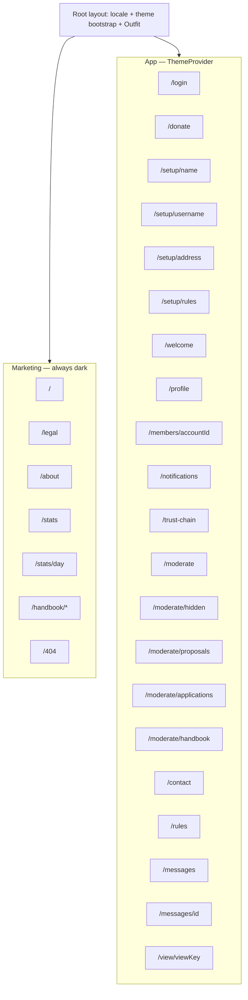
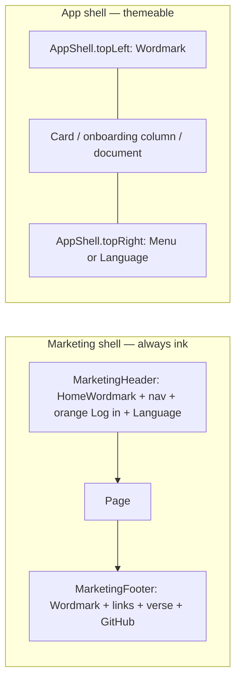

# 21.gifts visual design system

## How to use this document

This file is the **current inventory** of the shipped 21.gifts web UI plus the **binding** grammar for new work.

- New or migrated surfaces compose the parts named here. Do not invent a second look.
- Reviewers follow the control-grammar table here and in `CONTRIBUTING.md` **Icon controls**.
- Product behaviour, variants, and goldens live in `docs/handbook/screens.md` and `e2e/visual.spec.ts`. This file owns visual language.
- Brand copy source: the API concept document, section Brand. Visual source: live marketing at `/` plus the recipes in Screen recipes.
- Markdown in this public repo is the source of truth. Figma is not.
- Never name private repositories, internal hostnames, or infra internals.

## Principles

Closed set. Each principle is one sentence plus one implication in this codebase.

1. **One family.** The product is a single geometric grotesque, not a marketing face plus a system-ui app. _Implication:_ Outfit loads via `next/font/google` in `src/app/layout.tsx`; `body` uses `font-sans`; do not leave app pages on the Tailwind default stack.

2. **Two shells, one origin.** Marketing is always ink; app is themeable paper/ink. _Implication:_ routes under `src/app/(marketing)/` (and `/404` / `not-found.tsx`) use `bg-ink text-paper` with no `ThemeSwitcher`. All other pages use `app-*` tokens only.

3. **Orange is shell-split.** On the **marketing shell**, `#f7931a` is the primary filled CTA (header **Log in**, **Ask for help**, 404 **Back home**) plus kickers. On the **app shell**, it is gift-money fill only (charts, ₿ selected, donate **Open the forum**). _Implication:_ do not call marketing **Log in** a gift. App form primaries (`Button variant="primary"`) stay `bg-app-btn`. `Button variant="accent"` is the orange fill; marketing uses it as shell primary, the app uses it for gift-intent only.

4. **Tech is invisible.** Visitors are never asked about keys, relays, NOSTR, invoices, or sats-as-jargon. _Implication:_ UI says “Bitcoin”, “Wallet of Satoshi”, `formatBitcoin` (`₿1'500`; visitor may pick US `10,000.23` / German `23.000,33`). No `npub`, no “zap”, no “LNURL” on any screen.

5. **People first.** Receiver names and notes are the hero; chrome is quiet. _Implication:_ forum note body is `text-sm text-app-fg`; chrome labels are `text-app-muted`. When photo/story lands, it occupies the reserved profile slot, not a new layout.

6. **Wordmark is chrome, not a logo file.** The brand is the text `21.gifts`. _Implication:_ `Wordmark` in both shells; do not draw a mark unless it is the existing favicon “21” on ink. The one exception is the printed shop-sticker artwork (see **Brand**).

7. **Primitives, not class soup.** New or migrated surfaces compose catalog parts. _Implication:_ reject raw `rounded-full bg-app-btn px-6 py-3` and raw `bg-neutral-900` outside `src/components/ui/`.

8. **Do not canonize defects.** Goldens document current pixels; this file is the system. _Implication:_ do not reintroduce double ₿, an empty-chart axis, orange **text** on paper, a forum-paysheet QR on smartphone UA, or hard-coded Inter/gray SaaS.

9. **Staff action stacks stay closed.** A stack of labeled moderator or founder actions on a member card is not painted as loose buttons. _Implication:_ one closed disclosure, catalog `staff.functions` ("Moderator functions" / "Moderatorenfunktionen"), the same `details` / `summary` as wallet **Advanced functions** (`wallet.advanced`), not a full-width button. Opening it reveals only the actions that viewer may use on that person. The opened disclosure is its own screenshot state, not only the closed summary. Founder-only actions such as appoint use the same disclosure. Delete on a note stays the icon in the footer icon row. Routes under `/moderate` are the opened workspace and do not add a second disclosure around their own tools. The Menu row **Moderation** stays. The staff inbox origin filter stays. Role pills are identity, not actions.

10. **Amount fields carry the unit switch.** Every typed amount uses the gift ₿ / fiat-code control, and the other unit sits under the field. The last choice is stored on the account and is the default everywhere. A signed-out pay link still shows the switch and starts at ₿. What is sent is always whole sats. _Implication:_ a new amount field without the switch or the counter is an undeclared deviation. Fiat mode is its own screenshot state. The input box, its placeholder, and the start of the digits do not change when the unit changes; the switch and the counter do.

11. **A press that changes the screen has its own baseline.** The picture before the press does not count. _Implication:_ an icon-only status mark whose press reveals or hides its meaning is that kind of control. The same PR adds the handbook variant, the e2e needle, the `shotScreen` call, and a Playwright Linux baseline for every combo. The resting shot alone is rejected.

## Brand

**Wordmark.** The string `21.gifts` in Outfit, weight 700, tracking `0`. Not an SVG logotype. The drawn assets are the favicon/app-icon “21” and, only inside the printed shop sticker (`src/lib/shop-sticker-artwork.ts`, see **Overlay** › Shop sticker), the outlined Outfit 700 `21.gifts` shop sign with an orange **21** — a print product, never app chrome.

| Context                | Size             | Weight | Color               | Element                                                                                                                       |
| ---------------------- | ---------------- | ------ | ------------------- | ----------------------------------------------------------------------------------------------------------------------------- |
| Marketing header       | 17px / 1.06rem   | 700    | `paper` (`#ffffff`) | `HomeWordmark tone="dark"` (`/` unsigned, `/welcome` when a session is hydrated)                                              |
| Marketing footer       | 15px / 0.9375rem | 700    | `paper`             | `Wordmark tone="dark" size="footer"` as `<span>`                                                                              |
| App chrome (unsigned)  | 17px / 1.06rem   | 700    | `app-fg`            | `HomeWordmark` on `/login`, `/donate`, `/pl`, `/view/*`; `Wordmark` link `/` on unsigned `/rules` and `/messages/[id]`        |
| App chrome (signed-in) | 17px / 1.06rem   | 700    | `app-fg`            | `Wordmark` link `/welcome`, except `/setup/*` (`<span>` — `OnboardingGate` would bounce an incomplete account off `/welcome`) |

**Clear space.** Minimum 8px (`spacing-2`) on all sides of the glyph bounds. Do not place controls closer than 12px (`spacing-3`) to the wordmark.

**Do not.** Orange wordmark, outline wordmark, stacked “21” over “gifts”, a gift-box logo next to the wordmark in chrome. The combined gift-and-Bitcoin SVG on `/welcome` is a **page glyph**, not the brand mark.

**Favicon / apple-touch / OG (keep).**

- `public/favicon.svg` — 64×64, fill `#0A090C`, text `21` at 32px/700, fill `#f7931a`. This is the only drawn mark in the app; the shop sticker's outlined sign is print artwork (see **Wordmark**).
- `public/favicon.ico` — 48×48, same composition.
- `public/apple-touch-icon.png` / `icon-192.png` / `icon-512.png` — ink field, orange `21`, no rounded-squircle decoration beyond what iOS applies.
- `public/og.png` — ink, orange kicker `PEER-TO-PEER · BITCOIN · WALLET OF SATOSHI`, white `21.gifts`, subtitle, orange-outline pill. Keep.

## Color

Live tokens from `src/app/globals.css` `@theme` and `html.dark`.

**Sacred hexes (do not shift).**

| Name   | Hex       | Role                                                     |
| ------ | --------- | -------------------------------------------------------- |
| Ink    | `#0a090c` | Marketing canvas; app dark `app-bg`                      |
| Paper  | `#ffffff` | App light canvas; marketing type                         |
| Accent | `#f7931a` | Bitcoin orange — marketing primary + app gift-money fill |
| Given  | `#525252` | Profile “Given” series (neutral; not accent)             |

**Shell-stable tokens** (do not flip with `html.dark`; marketing uses these):

| Token    | Hex       | Tailwind                   |
| -------- | --------- | -------------------------- |
| `ink`    | `#0a090c` | `bg-ink`, `text-ink`       |
| `paper`  | `#ffffff` | `text-paper`, `bg-paper`   |
| `accent` | `#f7931a` | `bg-accent`, `text-accent` |

**App semantic tokens.**

| Token                | Light (`@theme`)     | Dark (`html.dark`)       | Use                                                      |
| -------------------- | -------------------- | ------------------------ | -------------------------------------------------------- |
| `app-bg`             | `#ffffff`            | `#0a090c`                | Page canvas                                              |
| `app-fg`             | `#171717`            | `#ffffff`                | Body, titles, primary type                               |
| `app-muted`          | `#525252`            | `#a3a3a3`                | Secondary sentences, leads                               |
| `app-subtle`         | `#737373`            | `#a3a3a3`                | Overlines, timestamps ≥ 12px                             |
| `app-border`         | `#e5e5e5`            | `rgb(255 255 255 / 0.2)` | Card edge, hairlines                                     |
| `app-border-strong`  | `#d4d4d4`            | `rgb(255 255 255 / 0.3)` | Fields, secondary buttons                                |
| `app-card`           | `#ffffff`            | `#121116`                | Raised panel                                             |
| `app-card-muted`     | `#fafafa`            | `#1a191e`                | Note cards, laws banner, composer well                   |
| `app-btn`            | `#171717`            | `#ffffff`                | Form primary fill                                        |
| `app-btn-fg`         | `#ffffff`            | `#0a090c`                | Form primary label                                       |
| `app-btn-hover`      | `#404040`            | `#e5e5e5`                | Form primary hover                                       |
| `app-hover`          | `#fafafa`            | `rgb(255 255 255 / 0.1)` | Row/ghost hover                                          |
| `app-accent`         | `#f7931a`            | `#f7931a`                | App gift-money fill + ₿ selected; not body text on paper |
| `app-accent-fg`      | `#0a090c`            | `#0a090c`                | Text on accent fill (always ink)                         |
| `app-focus`          | `#171717`            | `#ffffff`                | `:focus-visible` ring (2px)                              |
| `app-danger`         | `#b91c1c`            | `#f87171`                | Alert text/border                                        |
| `app-success`        | `#15803d`            | `#4ade80`                | Goal-bar overflow fill past 100%                         |
| `app-overlay`        | `rgb(10 9 12 / 0.4)` | `rgb(10 9 12 / 0.6)`     | Modal / overlay scrim                                    |
| `app-chart-given`    | `#525252`            | `#a3a3a3`                | Given series                                             |
| `app-chart-received` | `#f7931a`            | `#f7931a`                | Received / spend series                                  |
| `app-notice`         | `#fff7ed`            | `#2a1f12`                | Invite/activation banner fill                            |
| `app-notice-fg`      | `#171717`            | `#ffffff`                | Notice body                                              |
| `app-qr-bg`          | `#ffffff`            | `#ffffff`                | QR plate — **always paper**                              |
| `app-qr-fg`          | `#000000`            | `#000000`                | QR modules — always black                                |

**Orange rule (closed, two shells).** Live marketing uses orange as the **dark-shell primary**. Pay-sheet **Pay** (`forum.payOpenWallet`, aria `forum.payOpenWalletAria` “Pay with Wallet of Satoshi”) is `bg-app-btn` (labeled sentence-length, not accent). App **Log in** stays `app-btn`.

**(A) Marketing shell** (`bg-ink`): orange is the primary filled CTA plus kickers.

| Orange                                                                                              | Not orange                                                |
| --------------------------------------------------------------------------------------------------- | --------------------------------------------------------- |
| Header **Log in**, hero **Ask for help**, 404 **Back home**, stats **Try again**                    | Hero **Send help** (outline `border-paper/20 text-paper`) |
| Kickers: `HOW IT WORKS`, `WHY THIS EXISTS`, `FAQ`, `TOTAL SPEND OVER TIME`, `BY PERSON`, `BY MONTH` | Nav links, footer links                                   |
| Stats chart paint (spend series)                                                                    | KPI tile chrome                                           |

This is not “Log in is a gift.” Ink pages have one filled accent, and it is Bitcoin orange.

**(B) App shell** (`app-*`): orange is **gift-money** only — fills and chart paint, never body/kicker **text** on paper (~2.3:1).

| Orange                                                               | Not orange                                                                                                                                  |
| -------------------------------------------------------------------- | ------------------------------------------------------------------------------------------------------------------------------------------- |
| `/donate` **Open the forum** (`ButtonLink` accent fill + `text-ink`) | Card **Log in**, **Try again**, **Continue**, **I agree**, **Activate**, forum **Post**, contact send, forum **Pay** (`app-btn`)            |
| Charts: received series, ₿ selected in ₿ \| selected fiat            | Closed forum view is a field (`bg-app-card`), not a selected pill; Post/Ask selected stays `bg-app-btn`; check is `text-app-fg`, not orange |
|                                                                      | Menu, language, app body links (`text-app-fg underline`)                                                                                    |
|                                                                      | **Rules kickers and ticks** — see (B′)                                                                                                      |

**(B′) Living-room house chrome (closed exception, not a third job).** `RulesDocument` paints:

| Part                            | Token                                                                                                                                                     |
| ------------------------------- | --------------------------------------------------------------------------------------------------------------------------------------------------------- |
| `RULE n` / `THE TEST` overlines | **overline** `text-app-subtle` (same as `NAME`)                                                                                                           |
| Welcome-list `Check`            | `text-app-fg` (the check glyph is the encoding)                                                                                                           |
| Forbidden `X`                   | `text-app-danger`                                                                                                                                         |
| “THE TEST” left bar             | `border-l-2 border-app-accent` — decorative 2px stripe beside the overline. Not a contrast-dependent encoding (1.4.11 does not apply to pure decoration). |

Do **not** list `text-app-accent` on paper as an allowed AA fail. Orange fill always uses `text-ink`.

```mermaid
flowchart TD
  acc["#f7931a"]
  acc --> M[A: Marketing primary CTA + kicker + stats paint]
  acc --> G[B: App gift-money fill + donate Open the forum]
  acc --> H["B′: decorative THE TEST bar only"]
  acc -.-> X[Not: app form primary / Post / Pay (pay sheet) / filter / RULE n text / Welcome ticks]
```

**QR plates.** Always `bg-app-qr-bg` (`#ffffff`) + `border-app-border`. Dark theme does **not** invert the QR. Module color `app-qr-fg` (`#000000`). Quiet zone: `p-4` on a 232px module grid (`QR_SIZE = 232`). QR is shown on a smartphone. A specific invoice omits it (`isSmartphoneUserAgent`, not viewport): the forum-post pay sheet and the public pay link, the same card as desktop, without a mounted `QrCode`.

**Contrast (WCAG 2.2 AA)** against current tokens.

| Pair                                     | Ratio (approx.) | AA body (4.5:1) | Notes                                                                                                        |
| ---------------------------------------- | --------------- | --------------- | ------------------------------------------------------------------------------------------------------------ |
| `app-fg` `#171717` on `app-bg` `#ffffff` | ~16:1           | Pass AAA        |                                                                                                              |
| `app-fg` `#ffffff` on `app-bg` `#0a090c` | ~19:1           | Pass AAA        |                                                                                                              |
| Light muted `#525252` on white           | ~7.0:1          | Pass AAA        |                                                                                                              |
| Light subtle `#737373` on white          | ~4.7:1          | Pass AA         | Overlines, timestamps ≥ 12px                                                                                 |
| Dark muted `#a3a3a3` on ink              | ~7.9:1          | Pass            |                                                                                                              |
| Dark subtle `#a3a3a3` on ink             | ~7.9:1          | Pass            |                                                                                                              |
| `paper/60` on ink (marketing lead)       | ~7.4:1          | Pass            | Keep                                                                                                         |
| Accent `#f7931a` on ink                  | ~8.6:1          | Pass            | Kickers, orange type on marketing                                                                            |
| Accent on paper                          | ~2.3:1          | **Fail**        | Never orange _text_ on light paper. Orange is fill + `text-ink`, chart paint, or the decorative THE TEST bar |
| `text-ink` on accent fill                | ~8.6:1          | Pass            | Accent buttons                                                                                               |
| Given `#525252` on white                 | ~7.0:1          | Pass            | Legend + series                                                                                              |

Destructive alerts: `role="alert"` + `text-app-danger`. Do not use `text-red-600` on new surfaces.

## Typography

**Family (one).** [Outfit](https://fonts.google.com/specimen/Outfit), SIL Open Font License 1.1. Geometric grotesque. Outfit on Google Fonts is a **variable** face (`wght` 100–900).

`next/font/google` treats a **weight array as the non-variable API**. An array can fail `next build`. Use the variable range string.

```tsx
// src/app/layout.tsx
import { Outfit } from 'next/font/google';

const outfit = Outfit({
  subsets: ['latin'],
  weight: 'variable',
  display: 'block', // avoid FOUT in visual goldens; swap is allowed only with fonts.ready in shotScreen
  variable: '--font-outfit',
});

export default async function RootLayout({ children }: { children: ReactNode }): Promise<ReactElement> {
  const locale = await getRequestLocale();
  return (
    <html lang={locale} suppressHydrationWarning className={outfit.variable}>
      …
      <body className="font-sans bg-app-bg text-app-fg antialiased">
```

`className={outfit.variable}` **must** sit on `<html>` so `--font-outfit` exists. Without it, `@theme` interpolation is a no-op and pages stay on system-ui.

```css
@theme {
  --font-sans: var(--font-outfit), ui-sans-serif, system-ui, sans-serif;
}
```

`next/font/google` downloads at **`next build`**, then self-hosts at runtime. CI and the image-build stage must reach `fonts.google.com` (or the Next font endpoint). If that is blocked, vendor the files and switch to `next/font/local`. Do not fetch Google Fonts from the browser at runtime.

If anyone uses `display: 'swap'`, `shotScreen` **must** `await page.evaluate(() => document.fonts.ready)` before `toHaveScreenshot`, or Linux goldens flake on FOUT.

**Forbidden as the brand face:** Inter, Roboto, Arial, Open Sans, system-ui. `system-ui` / `ui-sans-serif` are **fallback only**. Do not add a display serif. Do not add IBM Plex / Geist / another second family.

**Ramp.** 16px root. Use these classes (write the utilities on the JSX as CONTRIBUTING requires).

| Token          | px      | rem          | Weight | Line-height            | Letter-spacing              | Max measure                                        | Tailwind recipe                                                   | Use                                                                                                                                                                      |
| -------------- | ------- | ------------ | ------ | ---------------------- | --------------------------- | -------------------------------------------------- | ----------------------------------------------------------------- | ------------------------------------------------------------------------------------------------------------------------------------------------------------------------ |
| **display**    | 36 / 60 | 2.25 / 3.75  | 600    | 1.15 (`leading-tight`) | -0.025em (`tracking-tight`) | 20em                                               | `text-4xl sm:text-6xl font-semibold leading-tight tracking-tight` | Marketing H1 (`/`, `/stats` “Gifts”, `/stats/[day]`). 404 “404” stays `text-5xl` = 48px / 600                                                                            |
| **h1**         | 24 / 30 | 1.5 / 1.875  | 600    | 1.25                   | -0.025em                    | 22em                                               | `text-2xl sm:text-3xl font-semibold tracking-tight text-center`   | App page title **inside a card or setup column**: welcome, profile, wallet, contact, inbox, notifications, setup. **Not login** (see **card-title**)                     |
| **card-title** | 18      | 1.125        | 500    | 1.3                    | 0                           | 22em                                               | `text-lg font-medium text-center text-app-fg`                     | Login card heading (`LoginCard` `login.heading`, or `login.choiceHeading` on the account-choice state). Keep this smaller step so the card is an action, not a billboard |
| **h1-lg**      | 30 / 36 | 1.875 / 2.25 | 600    | 1.2                    | -0.025em                    | 22em                                               | `text-3xl sm:text-4xl font-semibold tracking-tight text-center`   | `/donate`, `/rules` (document titles on a full page, not inside a card)                                                                                                  |
| **display-sm** | 36 / 48 | 2.25 / 3     | 600    | 1.15 (`leading-tight`) | -0.025em (`tracking-tight`) | 22em                                               | `text-4xl sm:text-5xl font-semibold leading-tight tracking-tight` | `/about` H1 (reading-width marketing page; not the home 60px display)                                                                                                    |
| **h2-lg**      | 24      | 1.5          | 600    | 1.3                    | 0                           | 28em                                               | `text-2xl font-semibold`                                          | `/about` conviction titles                                                                                                                                               |
| **h2**         | 20      | 1.25         | 600    | 1.3                    | 0                           | 28em                                               | `text-xl font-semibold`                                           | Marketing step titles, legal Imprint H2, handbook H2. `/legal` Privacy Policy is an h2 at `text-3xl` so the page keeps one outline h1 (Legal Notice)                     |
| **h3**         | 18      | 1.125        | 600    | 1.35                   | 0                           | 28em                                               | `text-lg font-semibold`                                           | Marketing why-grid titles, legal H3. `/legal` Overview is an h3 at `text-xl font-semibold` as the first subsection under Privacy Policy                                  |
| **kicker**     | 14      | 0.875        | 500    | 1.3                    | 0.1em (`tracking-widest`)   | —                                                  | `text-sm font-medium tracking-widest uppercase text-accent`       | **Marketing shell only:** `HOW IT WORKS`, stats `TOTAL SPEND OVER TIME`. Not `/rules`                                                                                    |
| **overline**   | 12      | 0.75         | 500    | 1.3                    | 0.1em                       | —                                                  | `text-xs font-medium tracking-widest uppercase text-app-subtle`   | `NAME`, `WALLET OF SATOSHI ADDRESS`, `THE TEST`, `RULE n` (app; **not** `text-accent`)                                                                                   |
| **body**       | 16      | 1            | 400    | 1.5                    | 0                           | 36em (`max-w-2xl` ~42rem for marketing lead is OK) | `text-base leading-normal`                                        | App body. Marketing lead is **body-lg**. Form control text (inputs/textareas) uses body / `text-base` because iOS auto-zooms below 16px. **body-sm** keeps field labels. |
| **body-lg**    | 18      | 1.125        | 400    | 1.5                    | 0                           | 36em                                               | `text-lg text-paper/60` (marketing) or `text-lg text-app-muted`   | Hero lead, stats subtitle                                                                                                                                                |
| **body-sm**    | 14      | 0.875        | 400    | 1.45                   | 0                           | 36em                                               | `text-sm`                                                         | Forum note body, card sentences, field labels, button labels, FAQ answers                                                                                                |
| **caption**    | 12      | 0.75         | 400    | 1.4                    | 0                           | —                                                  | `text-xs text-app-subtle`                                         | Forum timestamp, pay “Waiting for payment…”                                                                                                                              |
| **numeric**    | inherit | inherit      | 600    | 1.2                    | 0                           | —                                                  | `font-semibold tabular-nums lining-nums`                          | `formatBitcoin`, USD, KPI values, chart ticks                                                                                                                            |
| **code**       | 14      | 0.875        | 400    | 1.4                    | 0                           | —                                                  | `font-mono text-sm`                                               | `you@walletofsatoshi.com` on marketing; Lightning Address _value_ on profile uses `font-mono text-sm`                                                                    |

**One title per page.** The document outline has one `h1` (or `card-title` used as the sole heading). Card must not repeat a page title. `LoginPage` has no outer “Log in to 21.gifts”; the only heading is `LoginCard` at **card-title** (`login.heading`, or `login.choiceHeading` on the account-choice state). Do not add the outer title back. Welcome has no Forum heading; the only `h1` is “Welcome, {name}”.

**`formatBitcoin`.** `src/lib/stats-money.ts`: leading U+20BF `₿`, style-grouped via `NumberFormatStyle`, no space, no fraction. Default Swiss `₿1'500`. JSON stays `sats` / `totalSats`. Render in a `span` with `tabular-nums lining-nums`. Do not replace U+20BF with lucide `Bitcoin`. Do not put a second ₿ beside the string. Product phrase **Wallet of Satoshi** unchanged (catalog exception / proper name).

Fiat: `formatFiatDisplay` → `$1.43` / `CHF 1'425.00` / `EUR 1.30` / `₱80.00` (null → em dash; Swiss grouping default). USD wrapper `formatUsdDisplay` still used for the stats KPI when USD is selected. Axis ticks: stats and profile fiat ticks use `formatFiatTick` (USD selected may still call `formatUsdTick` as a wrapper; `$0`, `$1.43`, `$1'425`). Visitor styles `us` / `de` change grouping, not the currency. Toggle anatomy in §10.

**Link type.** Marketing inline links: `text-accent underline underline-offset-2`. App inline links (rules, contact): `text-app-fg underline underline-offset-2 font-medium`. Do not make app body links orange (fails on paper; also not a gift CTA).

## Space, radius, elevation, motion

**Spacing scale** (4px base = Tailwind default). Use only these on new surfaces:

| Token   | px        | Tailwind                 | Typical                                          |
| ------- | --------- | ------------------------ | ------------------------------------------------ |
| 1       | 4         | `p-1` `gap-1`            | Badge padding-y                                  |
| 1.5     | 6         | `gap-1.5`                | Icon+label in Menu                               |
| 2       | 8         | `p-2` `gap-2`            | IconButton inner, composer gap                   |
| 3       | 12        | `p-3` `gap-3`            | Pay sheet padding, field stack                   |
| 4       | 16        | `p-4` `top-4` `gap-4`    | Note card `px-4 py-3` (y=12)                     |
| 5       | 20        | `px-5` `right-5` `gap-5` | Marketing horizontal, clustered `sm` IconButtons |
| 6       | 24        | `px-6` `gap-6` `p-6`     | App page padding, card gap                       |
| 8       | 32        | `p-8` `gap-8`            | Card padding                                     |
| 10      | 40        | `gap-10` `py-10`         | PageChrome gap, footer py                        |
| 12      | 48        | `mt-12` `gap-12`         | Section rhythm, stats `space-y-12`               |
| 16      | 64        | `pt-16`                  | Stats top                                        |
| 20      | 80        | `py-20`                  | Marketing section py                             |
| 24      | 96        | `py-24`                  | Legal/handbook top                               |
| 28 / 36 | 112 / 144 | `pt-28 sm:pt-36`         | Marketing hero                                   |

App page padding is `px-6` (24px), not `px-5`. Marketing content padding is `px-5` (20px). Do not mix.

**Radius.**

| Token     | px   | Tailwind                    | Use                                                                      |
| --------- | ---- | --------------------------- | ------------------------------------------------------------------------ |
| `pill`    | 9999 | `rounded-full`              | Buttons, switcher triggers, segmented thumbs, header Log in, badges      |
| `card`    | 24   | `rounded-3xl`               | AppShell page frame; default `Card` overlays and note panels             |
| `note`    | 16   | `rounded-2xl`               | Forum notes, laws banner, fields, onboarding inputs, KPI tiles, QR plate |
| `panel`   | 12   | `rounded-xl`                | Menu, listbox, pay-sheet inner, photo preview, role hint                 |
| `control` | 8    | `rounded-lg`                | Menu rows                                                                |
| `chart`   | 6    | `rounded-md` / SVG `rx={6}` | ₿\|USD track, person bars `rx={6}`                                       |
| `none`    | 0    | —                           | Marketing month bars (square)                                            |

**Elevation.**

| Level   | Recipe                               | Use                                                                                                              |
| ------- | ------------------------------------ | ---------------------------------------------------------------------------------------------------------------- |
| 0       | border only                          | Marketing KPI tiles (`border-paper/10`), forum notes                                                             |
| 1       | `border border-app-border shadow-sm` | `Card`                                                                                                           |
| 2       | `border border-app-border shadow-lg` | Menu, language listbox                                                                                           |
| Overlay | `bg-app-overlay`                     | `HandbookLightbox`, `PwaInstall`, `IntroduceYourselfOverlay`, `RequirementsOverlay`, `ExternalLinkWarning` scrim |

Do not add drop shadows on marketing. Do not use colored shadows.

**Motion.**

| Event            | Duration                     | Easing                | Notes                                                      |
| ---------------- | ---------------------------- | --------------------- | ---------------------------------------------------------- |
| Color hover      | 150ms                        | `ease` (`transition`) | Buttons, rows, pills                                       |
| Menu panel       | instant (`hidden` class)     | —                     | Stays mounted so `PwaInstall` is not remounted             |
| Listbox mount    | instant (conditional render) | —                     | LanguageSwitcher; no fade required                         |
| Theme switch     | instant                      | —                     | Class toggle on `html`; do not animate `color` on `<body>` |
| Pay sheet open   | instant                      | —                     | Insert in-card; no slide                                   |
| Spinner          | 1000ms linear infinite       | `animate-spin`        | `Loader2`                                                  |
| Copy check flash | 1200ms then revert           | —                     | `ForumBoard` `COPY_RESET_MS`                               |

```css
@media (prefers-reduced-motion: reduce) {
  *,
  *::before,
  *::after {
    animation-duration: 0.01ms !important;
    animation-iteration-count: 1 !important;
    transition-duration: 0.01ms !important;
    scroll-behavior: auto !important;
  }
}
```

This global `*` hammer is WCAG 2.3.3-compliant and **does freeze** `Loader2` and the 1200ms copy-check flash (they become static). That is acceptable. Forum `scrollIntoView({ behavior: 'auto' })` is already correct and does **not** depend on this CSS. Do not introduce `behavior: 'smooth'` without a reduced-motion guard.

**Hit targets.** WCAG 2.2 AA 2.5.8 is **24×24px**. 44×44 is 2.5.5 AAA.

| Size           | Layout / paint              | Hit target           | Glyph |
| -------------- | --------------------------- | -------------------- | ----- |
| `sm`           | `h-6 w-6` + `::before` slop | 44×44 via `::before` | 16px  |
| `md` (default) | `h-11 w-11` (44px painted)  | 44×44                | 20px  |
| `lg`           | `h-12 w-12` (48px painted)  | 48×48                | 20px  |

`sm` class (`::before` without `content` does not generate a box):

```
relative isolate inline-flex h-6 w-6 shrink-0 items-center justify-center rounded-full leading-none
before:absolute before:content-[''] before:block before:-inset-2.5 before:min-h-11 before:min-w-11 before:rounded-full
```

The painted control stays `h-6 w-6`. The lucide node sits in `relative z-10`. Do **not** paint `sm` as `h-11`.

**Clustered `sm` must not overlap.** `-inset-2.5` is 10px slop per side → 44px hit. Any row of two or more `sm` IconButtons uses `gap-5` (20px): 24px paint + 20px gap = 44px center-to-center, hits **touch, do not overlap**. Isolated `sm` (laws dismiss, pay-sheet back) keep their absolute position.

## Two shells

**Marketing** — `src/app/(marketing)/layout.tsx` + `/404` (`src/app/not-found.tsx`, which duplicates the shell because it sits outside the group).

- Canvas: `min-h-[var(--app-height)] bg-ink text-paper [color-scheme:dark]`.
- No `ThemeSwitcher`. Cookie theme must not lighten `/`, `/about`, `/legal`, `/stats`, `/handbook`, `/404`.
- Header + footer always mounted.

**App** — every other `page.tsx`. Tokens only. `ThemeProvider` + `THEME_BOOTSTRAP_SCRIPT` in the root layout (`html.dark`, cookie `theme`). Unsigned app: Wordmark or `HomeWordmark` + LanguageSwitcher. Signed-in: `ProfileChromeLeft` or Wordmark + `SignedInChrome` Menu. ThemeSwitcher and LanguagePreferenceSwitcher are Profile identity-card settings rows, not chrome.



`/rules` is **app shell** (themeable, no marketing header) even though it is public. Footer links from marketing _into_ `/rules`.

`/donate` is app shell (themeable, unsigned chrome).

## Layout and chrome

| Measure            | Value                                       | Use                                                                    |
| ------------------ | ------------------------------------------- | ---------------------------------------------------------------------- |
| Marketing max      | `max-w-[1100px]`                            | Home, stats, handbook, 404 content, footer inner                       |
| Legal max          | `max-w-3xl` (48rem)                         | `/legal` and `/about` reading column                                   |
| App card `sm`      | `max-w-sm` (24rem)                          | Login, profile, wallet, view, member identity, onboarding name/address |
| App card `md`      | `max-w-md` (28rem)                          | Donate inner, public note                                              |
| App card `xl`      | `max-w-xl` (36rem)                          | Welcome/forum, contact, inbox, notifications, moderation               |
| Rules document     | `max-w-3xl`                                 | `/rules`, `/setup/rules`                                               |
| App page pad       | `px-6`                                      | `AppShell` / flow `PageChrome`                                         |
| Marketing pad      | `px-5`                                      | Header, sections, footer                                               |
| Vertical app shell | `AppShell` fill/flow + `--app-height`       | Centered cards and long documents                                      |
| Onboarding column  | fill `AppShell` + `AppShellFooter` CTA slot | `/setup/name`, `/setup/username`, `/setup/address`, `/setup/rules`     |
| Marketing hero     | `pt-28 pb-20 sm:pt-36`                      | `/`                                                                    |
| Marketing section  | `py-20`                                     | how / why / project / faq                                              |
| Stats / handbook   | `pt-16 pb-24` / `py-24`                     |                                                                        |

**Mobile vs desktop.** Marketing nav hides below `md`, hamburger `md:hidden`. App cards are single-column at all breakpoints. Forum `Card maxWidth="xl"` is the widest app panel. Playwright viewports: desktop and mobile combos already in `scripts/screen-variants.mjs` (`BASELINE_COMBOS`). Do not add a third breakpoint.

**Safe area / visualViewport.** `AppShell` plus `--app-height` (bootstrap script + `useAppHeight` / `AppHeightSync`) is the height source. `--app-height` is `max(innerHeight, visualViewport.height + offsetTop)` so a stuck-short visual viewport cannot shrink the rounded page frame — including while the software keyboard is open (`offsetTop` > 0). Do not shrink to `visualViewport.height` alone when a text field is focused: that leaves a white gap above the keyboard on iPhone Safari. Pinch-zoom skip is unchanged: do not follow a visual viewport whose `scale` is present and not ≈ 1. `html { touch-action: manipulation }` disables double-tap-zoom; pinch-zoom stays. Do not add `env(safe-area-inset-*)` here.

**`AppShell` slots.** `AppShell` always draws the page frame: a viewport-height `<main>` with one `rounded-3xl` `<section>`. Chrome (wordmark + Menu / language) is that frame’s first row (`[data-app-chrome]`). `fill` and `flow` share this geometry (`h-[var(--app-height)]`, frame `grow shrink basis-0 self-stretch` not `flex-1`, inner `overflow-y-auto` scroller). `mode` stays on the API so call sites compile. `PageChrome` still passes `mode="flow"`. Card never hosts page chrome. `surface={false}` is the page-body column (no radius/border/bg/shadow/`p-8`). Default Card is still a nested visual panel for overlays and notes. Never `justify-center` on `<main>` or the overflow scroller. The center wrapper sets `justify-content: center` and then `safe center`, so content that fits stays centered, and where `safe` is supported a thread taller than the frame starts at the top and remains scrollable. Onboarding CTAs register via `AppShellFooter` (and headings via `AppShellHeader`) instead of stretching the form column. Child `AppShellTopLeft` registration wins over the page `topLeft` prop.

```
[ topLeft: Wordmark | Back+Wordmark ]     [ topRight: Menu | Language ]
[                         children                                      ]
```

| Slot       | Unsigned app (`/login`, `/donate`, `/rules` without session, `/messages/[id]`, `/view/*`)                                                                              | Signed-in app                                                                                                                                                                                                                                                                                                                                                                                                                                                                                                                                                                                                                                                                                                                                                                                                                               |
| ---------- | ---------------------------------------------------------------------------------------------------------------------------------------------------------------------- | ------------------------------------------------------------------------------------------------------------------------------------------------------------------------------------------------------------------------------------------------------------------------------------------------------------------------------------------------------------------------------------------------------------------------------------------------------------------------------------------------------------------------------------------------------------------------------------------------------------------------------------------------------------------------------------------------------------------------------------------------------------------------------------------------------------------------------------------- |
| `topLeft`  | `HomeWordmark` on `/login`, `/donate`, `/pl`, `/view/*` (`/` unsigned, `/welcome` when hydrated). `Wordmark` → `/` on unsigned `/rules` and unsigned `/messages/[id]`. | `Wordmark` → `/welcome`, except `/setup/*` (span, not a link). On `/profile`, `/profile/apply`, `/members/[accountId]`, `/notifications`, `/moderate`, `/moderate/hidden`, `/moderate/proposals`, `/moderate/applications`, `/moderate/applications/[accountId]`, `/moderate/handbook`, `/trust-chain`, `/contact`, `/shops`, `/map`, `/pos`, signed-in `/rules`, and signed-in `/messages/[id]`: `ProfileChromeLeft` (back **then** wordmark). On `/wallet`: the page passes `WalletChromeLeft`; the Back on screen is `WalletScreenView`'s `ProfileChromeLeft` via `AppShellTopLeft`. On `/messages`: `MessagesChromeLeft` (list: back `/welcome`; `?c=` non-empty: back `/messages`, aria All conversations). `/setup/rules`: page does **not** pass `topLeft`; `RulesSetup` portals Wordmark span + optional back via `AppShellTopLeft` |
| `topRight` | `LanguageSwitcher tone="light"`                                                                                                                                        | `SignedInChrome` (Menu; no ThemeSwitcher, no LanguageSwitcher)                                                                                                                                                                                                                                                                                                                                                                                                                                                                                                                                                                                                                                                                                                                                                                              |

**`ProfileChromeLeft`.** Link `h-11 w-11` lucide `ArrowLeft` to `/welcome` (optional `backHref` / `backLabelKey`) + `Wordmark href="/welcome"`.

**`MessagesChromeLeft`.** Client `/messages` chrome over `ProfileChromeLeft`: list uses the default forum back; a non-empty `?c=` uses `backHref="/messages"` and `backLabelKey="inbox.back"` (**All conversations**).

**Signed-in Menu** (`SignedInChrome`). Labeled Menu trigger (lucide `Menu` 14px + catalog `aria.menu`). Rows icon+label, in this order:

| Row                  | Icon                          | Href / control                                                                      |
| -------------------- | ----------------------------- | ----------------------------------------------------------------------------------- |
| Home                 | `Home`                        | `/welcome`                                                                          |
| Shops                | `Store`                       | `/shops`                                                                            |
| Map                  | `Map`                         | `/map`                                                                              |
| Point of sale        | `Banknote`                    | `/pos`                                                                              |
| Profile              | `User`                        | `/profile` — given/received `formatBitcoin` amounts only when that side is non-zero |
| Wallet               | `Wallet`                      | `/wallet` — Add recovery phrase, or Show recovery phrase under Advanced functions   |
| Living room rules    | `ScrollText`                  | `/rules`                                                                            |
| Trust Chain          | `Share2`                      | `/trust-chain`                                                                      |
| Moderation           | `Shield`                      | `/moderate` — moderator only                                                        |
| Notifications        | `Bell`                        | `/notifications` — unread count `ml-auto` only when greater than zero               |
| Messages             | `Inbox`                       | `/messages` — unread count `ml-auto` only when greater than zero                    |
| Contact              | `MessageCircle`               | `/contact`                                                                          |
| optional Install app | `PwaInstall placement="menu"` | labeled row                                                                         |
| Log out              | `LogoutButton`                | labeled                                                                             |
| Version              | —                             | quiet `text-xs text-app-muted` `app.version` after Log out; not a control           |

Trigger: `inline-flex min-h-11 items-center gap-1.5 px-2 text-sm text-app-muted` in `[data-app-chrome]`. Panel is in-tree `absolute right-0 z-50 mt-2 w-[min(18rem,calc(100vw-7rem))] rounded-xl border border-app-border bg-app-card p-2 shadow-lg` (sibling of the trigger, not createPortal / not fixed). `7rem` is AppShell `px-6` plus chrome `px-8` on both sides so the panel stays on-screen at 320 CSS pixels. AppShell `<main>` has no `overflow-hidden` so the panel is not clipped; the inner scroller is still `overflow-y-auto`. Rows: `flex min-h-11 items-center gap-1.5 rounded-lg px-3 py-2 text-sm font-medium`. Escape and outside-click close the panel.

**Marketing header** stays dedicated (`MarketingHeader`): sticky, `bg-ink/85 backdrop-blur-xl`, `border-b border-paper/10`, `px-5 py-3.5`. Do not reuse `PageChrome` on marketing.



## Iconography

**Set.** `lucide-react` only. No second icon pack. Drawn exceptions: favicon “21”, `public/wos-icon.png` (Wallet of Satoshi, 20×20 PNG in the pay CTA), the welcome gift-and-Bitcoin SVG, the shop-sticker storefront on every valid pay link, and handbook images.

**Stroke.** Default lucide 2px. At 16px glyph use stroke 2; at 20–24px use stroke 1.75 if the glyph looks heavy on goldens after Outfit — otherwise leave default. Do not mix fills.

**Sizes (glyph, not hit target).**

| Glyph | px  | Tailwind      | Use                                                  |
| ----- | --- | ------------- | ---------------------------------------------------- |
| 14    | 14  | `h-3.5 w-3.5` | Menu row icons, ₿\|USD is text not icon              |
| 16    | 16  | `h-4 w-4`     | Button leading icon, Field-adjacent, pay-sheet back  |
| 20    | 20  | `h-5 w-5`     | IconButton md/lg default, profile back               |
| 32    | 32  | `h-8 w-8`     | Login fingerprint / error / spinner                  |
| 48    | 48  | `h-12 w-12`   | Welcome gift-and-Bitcoin SVG; pay-link shop sticker  |

**Decorative vs control.** Decorative: `aria-hidden="true"` (gift-and-Bitcoin SVG on welcome, Fingerprint on login, AlertTriangle on error, legend swatches). Control: `IconButton` with required `aria-label` from the catalog. Indicators (given/received arrows in Menu): `aria-label` on the wrapping `span`, not a button.

**Welcome gift-and-Bitcoin glyph.** Combined gift outline and Bitcoin symbol, `h-12 w-12 text-app-fg`, `aria-hidden`. It is the forum’s page glyph, not the brand mark. Do not color it orange. Do not duplicate it in chrome. On `/pl` it appears only when the link is not valid.

**Pay-link shop glyph.** The shop sticker's storefront, the same paths the printable sticker paints (awning, counter, goods, 21.gifts sign). Not the Open CryptoPay mark from the QR centre, and not a lucide store icon. `h-12 w-12`, `aria-hidden`, on every valid `/pl` (the amount step and the active payment). Colours stay `#F99602`, `#000000`, and `#FFFFFF`.

**React control glyph.** Lucide **`Reply`**. Accessible name is catalog `forum.react` = **“React”** (DE **Reagieren**). Icon-only on every top-level note (`parentId` unset). Click expands the reply composer when the card is collapsed and focuses the reply textarea when it is already expanded. Nested replies have no React control.

**Pay control glyph.** Lucide **`Gift`**, not `Bitcoin`. Accessible name stays catalog `forum.pay` = **“Send Bitcoin”**. Do **not** retune that string to “Pay” (`e2e/visual.spec.ts` uses `getByRole('button', { name: 'Send Bitcoin' })`). Only on payable replies (`parentId` set). The `/welcome` heading uses a 48px decorative gift-and-Bitcoin SVG; the in-card pay control remains a 16px `Gift`.

## Photography

Profile photo and story are a **reserved slot**, not a shipped feature. Do not ship UI that pretends they exist. Do not spec HTTP. When they land, they occupy this slot so the screen does not invent a look:

| Part         | Spec                                                                                                                                                                                                                                                                                                                                                                                                                                             |
| ------------ | ------------------------------------------------------------------------------------------------------------------------------------------------------------------------------------------------------------------------------------------------------------------------------------------------------------------------------------------------------------------------------------------------------------------------------------------------ |
| Avatar       | 96×96px (`h-24 w-24`), circle (`rounded-full`), `object-cover`, 1:1 crop, above the profile `h1` or immediately under it, centered                                                                                                                                                                                                                                                                                                               |
| Aspect       | 1:1 only for the profile portrait. A single forum still is `block h-auto max-h-80 w-full shrink-0 rounded-xl object-contain`. A forum video is `mx-auto block h-auto w-auto max-h-80 max-w-full shrink-0 rounded-xl object-contain`. When `photoCount > 1`, stills sit in `ForumPhotoGallery`: earlier stills 88% so the next photo peeks, last still full width, `current/total` chip, dots — not a full-width stack that hides further stills. |
| Fallback     | Two-letter initials from `name` (first grapheme of first two words, else first two), Outfit 600 24px, on `bg-app-card-muted text-app-fg`. If no name: lucide `Gift` 32px `text-app-muted` in the same circle                                                                                                                                                                                                                                     |
| Story        | `body-sm text-app-muted`, centered, under the name row, max 4 lines (`line-clamp-4`) on the card; full text on a future expanded view — not designed here                                                                                                                                                                                                                                                                                        |
| Forum photos | Already specified in `ForumBoard`; not the profile portrait                                                                                                                                                                                                                                                                                                                                                                                      |

Do not use a colored placeholder, a camera badge, or a progress ring.

## Money

**Two currencies, when a second figure exists.** Every visitor has one default fiat in settings (CHF, EUR, USD, or PHP). A value is never shown in only one currency when a stored string or a loaded gift-day rate exists. If neither exists, the amount stays bitcoin, because there is no second number.

- Defined in that default fiat: show that amount and the bitcoin counterpart. Do not repeat the fiat.
- Not defined in that default fiat (bitcoin, or another fiat): also show the default fiat. An ask defined in another fiat shows three: the defined amount, bitcoin, and the default fiat.
- The default-fiat figure is the string stored for that currency on the row. When that field is null or missing, use the latest gift-day rate if one is loaded. If that rate is not loaded either, the amount stays bitcoin. Do not recompute a stored string.

**Visitor amounts.** Always `formatBitcoin(sats, numberFormat)` from `src/lib/stats-money.ts`. Leading `₿` (U+20BF), `NumberFormatStyle` grouping (`ch` / `us` / `de`), no fraction, no extra ₿. Class: `tabular-nums lining-nums`. JSON fields remain `sats` / `totalSats`.

**Pay control is not a second ₿.** Post footer has no Gift. Nested replies and top-level cards with `parentId` (profile replies feed) show Gift when `payable`:

```
[ ₿21 ]  [ React ]  [ Copy ]  [ N reactions ]
```

- Amount: ₿ via `formatBitcoin`, then `·` plus the visitor's default fiat — button that toggles expand (`aria-expanded`; accessible name is the visible ₿ text, not `forum.expand` / `forum.collapse`). A stored string is shown as-is. A null or missing field uses the last gift-day rate, so the amount is not bitcoin alone while a rate exists (no ` · —` when that rate is unusable). Unsent previews (pay sheet, unpaid invoice, Ask wizard, goal bar) omit the stored amount and use the latest gift-day rate. The posted Ask line follows the same pair rule.
- React (posts only): `IconButton` `variant="ghost"` `size="sm"` (24px painted glyph, 44px hit slop — §10), lucide `Reply` 16px, `aria-label={t('forum.react')}` (**React**). Tests locate it with `getByRole('button', { name: /^React$/ })`.
- Pay (replies only): `IconButton` `variant="ghost"` `size="sm"` (24px painted glyph, 44px hit slop — §10), lucide `Gift` 16px, `aria-label={t('forum.pay')}` (**Send Bitcoin**, frozen). Disabled while `payBusy`.
- Do not put the amount inside the pay control.
- Do not change `forum.pay` copy.

Pay sheet amount step shows a live fiat line in the preferred fiat (no picker; after mint the line uses the invoice amount). Pay sheet confirm sentence (`forum.payConfirm`) is one `formatBitcoin` plus optional `·` `formatFiatDisplay` when the conversion is non-null. Amount-step CTA is **Continue** (`forum.payContinue`) on every user-agent. Continue only requests the invoice. After mint every user-agent sees the invoice card (confirm sentence, wallet `Button` that sets `location.href` to the Android Intent or `walletofsatoshi:`). The card mounts `QrCode` only when the user-agent is not a smartphone (`isSmartphoneUserAgent`, not viewport). Wallet CTA is a **Pay** `Button` (`variant="primary"` `size="md"` `tone="app"`; visible `forum.payOpenWallet`, aria `forum.payOpenWalletAria` “Pay with Wallet of Satoshi” — sentence-length, **not** accent) that sets `window.location.href` to the WoS href (not a custom-scheme `<a>` / `ButtonLink`).

**Fiat.** Cookie `fiat` (otherwise locale default). Switchers: Profile settings (`FiatPreferenceSwitcher`) is the only signed-in writer. `FiatPicker` remains on unsigned `AccountActivityChart` (public `/view`), unsigned `/stats`, and unsigned `/stats/[day]` (`useHydrateSession().ready && session === null`). Signed-in chart, member, and stats/day omit it; ₿|{code} scale stays. Forum notes, nested replies, and the pay sheet **display** that code only (no picker). Stats KPI shows ₿ on the first line and the selected fiat on the second via `formatFiatDisplay` (USD uses `formatUsdDisplay`). Populated profile chart is ₿ | selected FiatCode.

**₿ \| selected-fiat segmented control** — shipped as `SegmentedControl` (see catalog). Stats charts: ₿ and the preferred FiatCode. Profile: ₿ and the preferred FiatCode (same as stats charts, app shell).

| Part       | Spec                                                                                                                                                                                                                  |
| ---------- | --------------------------------------------------------------------------------------------------------------------------------------------------------------------------------------------------------------------- |
| Track      | Gift app: `inline-flex overflow-hidden rounded-md border border-app-border text-xs`. Gift dark: `border-paper/20`.                                                                                                    |
| Segment    | `min-h-11 min-w-11 px-2 py-1` on mobile **and** desktop                                                                                                                                                               |
| Selected   | Gift app: `bg-app-accent text-app-accent-fg`. Gift dark: `bg-accent text-ink`                                                                                                                                         |
| Unselected | Gift app: `text-app-muted`. Gift dark: `text-paper/70`                                                                                                                                                                |
| Labels     | Stats charts: `₿` and the preferred FiatCode (CHF/EUR/USD/PHP). Profile: `₿` and the preferred FiatCode (CHF/EUR/USD/PHP), group `profile.chartScale`. `aria-pressed` on each. Group `role="group"` with catalog name |

The closed forum view is a field (`bg-app-card`), not a selected pill. Post/Ask selected pill stays `bg-app-btn`. The check is `text-app-fg`, not orange. Profile uses `tone="gift"` (app shell). Stats uses `tone="gift" shell="dark"`.

**Empty profile chart.** If both series empty/all-zero sats: unsigned shows FiatPicker plus `profile.chartEmpty` `role="status"`; signed-in empty is `profile.chartEmpty` alone; **no SVG / no ₿|fiat scale**. Legend without data is noise.

## Control grammar

The labeled vs icon-only table is the **binding** rule. Reviewers follow this table and `CONTRIBUTING.md` **Icon controls**, not “everything new is an icon”.

| Labeled (`Button` / `ButtonLink` / inline `Link`)                                                                                                                                                                                                                                                                                                                                                                                                                                                                                                                                                                                                                                                                                                                                                                                                  | Icon-only (`IconButton`, required `aria-label`)                                                                                                                                                                                                                                                                                                                                                                                                                                 |
| -------------------------------------------------------------------------------------------------------------------------------------------------------------------------------------------------------------------------------------------------------------------------------------------------------------------------------------------------------------------------------------------------------------------------------------------------------------------------------------------------------------------------------------------------------------------------------------------------------------------------------------------------------------------------------------------------------------------------------------------------------------------------------------------------------------------------------------------------- | ------------------------------------------------------------------------------------------------------------------------------------------------------------------------------------------------------------------------------------------------------------------------------------------------------------------------------------------------------------------------------------------------------------------------------------------------------------------------------- |
| Consent (**I agree to these rules**), **Continue**, **Skip** (onboarding name/address), Ask-preview labeled **Post**, **Log in**, **Log in with existing account**, **Open a new account**, **Log out**, **Try again**, **Activate**, pay-sheet **Pay** (`forum.payOpenWallet` / aria `forum.payOpenWalletAria` “Pay with Wallet of Satoshi”; a `Button` that sets `location.href`, not a `ButtonLink`), sentence-length empty-state CTA (**Write your About me**), **Message** (member profile DM CTA), member profile **Shop sticker** and the sticker overlay's **Download**, sentence-length links (**Open the forum**, **Open the app** (inline `text-accent` `Link` on `/legal`, not `ButtonLink`), **Back home**, **Ask for help**, **Send help**), marketing-shell primary (**Log in** pill, 404 **Back home**), donate **Open the forum** | Actions **inside** a card: edit, delete, attach, send/post (forum Post-path + contact + inbox composers), copy, dismiss, **react** (Reply icon, `forum.react` “React”) on posts, **pay** (Gift icon, `aria-label` = `forum.pay` “Send Bitcoin”) on payable replies, **translate** (Languages icon in the footer icon row, `aria-label` = `forum.translate`), profile/rules-setup back, Ask-wizard back (`forum.askBack`), Menu **row** icons (the Menu _trigger_ stays labeled) |

**Skip** (onboarding name/address) is a labeled `Button` in the same column as **Continue**. There is no Skip on `/setup/username`, `/setup/rules`, or on `RequirementsOverlay`. Ask preview **Post** is a labeled `Button` (`forum.post`); the Post-path messenger send control stays icon-only.

**Notifications** list rows are full-row links/buttons with visible text (not icon-only).

Content translation **Translate** is icon-only (`IconButton` + Languages, `aria-label` = `forum.translate`). Signed forum cards (`ForumBoard`) place it in the footer icon row with react / pay / copy. Surfaces without that row — unsigned public cards, About me, inbox, funding, and hidden notes — stack the control under the body. **Show original** / **Show translation** stay the same Languages icon. The accessible name is the only label; no visible text.

**Member profile** has no edit. Back is icon-only like profile (`ProfileChromeLeft`). Member profile **Message** is a labeled `Button` (`profile.message`), not icon-only. Member profile **Shop sticker** is a labeled `Button size="sm" variant="secondary"` (`profile.shopSticker`), not icon-only; its overlay closes with the icon-only ghost `IconButton` like every overlay. **Moderator functions** is the same `details` / `summary` as wallet **Advanced functions**, not a `Button`.

**Menu trigger** stays labeled (icon + “Menu”). It is page chrome. Do not convert **Log out**, **Continue**, **Skip**, **Activate**, **Try again**.

Moderator **Trash2** on notes and nested replies is icon-only with inline confirm (`DeletePostControl`).

**Button size scale (one).**

| Size           | Padding                | Type     | Min height        | Use                                                                                      |
| -------------- | ---------------------- | -------- | ----------------- | ---------------------------------------------------------------------------------------- |
| `sm`           | `px-4 py-2`            | 14px/500 | 44px (`min-h-11`) | Compact labeled (marketing header **Log in** stays `px-4 py-2` but must still be ≥ 44px) |
| `md` (default) | `px-6 py-3`            | 14px/500 | 44px              | Login, Try again, secondary                                                              |
| `lg`           | `px-6 py-3` + `w-full` | 14px/500 | 44px              | Onboarding Continue / I agree (full width in the column)                                 |

Do not add a 36px button. Marketing header Log in visual may stay slightly smaller in width but not in height.

## Component catalog

Every primitive: anatomy, tokens, states, React API. New or migrated surfaces compose these. Raw duplicate class strings are rejected.

Shared focus: `:focus-visible { outline: 2px solid var(--color-app-focus); outline-offset: 2px }` in `globals.css`. **No `outline-none` on controls** (Field, composer, switchers, buttons).

Disabled: `opacity-50` + `cursor-not-allowed`.

Loading: leading `Loader2` `h-4 w-4 animate-spin` (labeled) or replacing the glyph (icon). Control stays disabled.

### `AppShell` / `PageChrome`

**Anatomy.** `AppShell` always draws one `rounded-3xl` page frame. Chrome (wordmark + Menu / language) is the frame’s first row (`[data-app-chrome]`). `fill` and `flow` share locked-height inner-scroller geometry. Card never hosts page chrome. `PageChrome` is the flow-mode wrapper (`mode="flow"`); prefer `AppShell` on new routes.

**Tokens.** `h-[var(--app-height)]` for both `fill` and `flow`, `px-6` `py-4`, inner `overflow-y-auto`, `bg` inherited from `body`. Never Tailwind viewport-height utilities on app routes.

**API.**

```tsx
export interface AppShellProps {
  children: ReactNode;
  mode: 'fill' | 'flow';
  topLeft?: ReactNode;
  topRight?: ReactNode;
  className?: string;
  align?: 'start' | 'center';
}

export interface PageChromeProps {
  children: ReactNode;
  topRight?: ReactNode;
  topLeft?: ReactNode;
  className?: string;
}
```

Slot registrars: `AppShellHeader`, `AppShellFooter`, `AppShellTopLeft` (child registration wins over page `topLeft`). `useAppShellScroller` returns the inner `overflow-y-auto` node, or `null` outside AppShell.

### `Wordmark`

**Anatomy.** Text `21.gifts` as `Link` when `href` is set, otherwise a `<span>`.

**Tokens.** Header `text-[17px] font-bold no-underline`; footer `text-[15px] font-bold no-underline`. Color: `text-paper` (`tone="dark"`) or `text-app-fg` (`tone="app"`).

**API.**

```tsx
export function Wordmark(props: {
  href?: string; // omit → <span>, not a link
  tone?: 'app' | 'dark'; // app = app-fg; dark = paper on ink
  size?: 'header' | 'footer'; // header 17px (default); footer 15px
}): ReactElement;
```

`HomeWordmark` is the session-aware wrapper (`/` until hydrate, `/welcome` when `ready && session !== null`). Do not over-type primitive `href` as `'/' | '/welcome'` — unsigned `/rules` still uses `/`, and the footer is not a link.

### `Card`

**Anatomy.** Default `<section>` is a nested visual panel: children in a column, centered, `gap-6`, `p-8`, `rounded-3xl`, `border border-app-border bg-app-card shadow-sm`, `w-full` + max width. `surface={false}` is the page-body column (width + flex + gap only; no radius, border, bg, shadow, or `p-8`). Page chrome lives on AppShell `[data-app-chrome]`, never on Card. The AppShell frame is the only page-level `rounded-3xl`.

**API.** `maxWidth?: 'sm' | 'md' | 'xl'` default `sm`. `className?`. `surface?: boolean` default `true` (`false` omits panel classes).

**States.** None. Nested notes use `app-card-muted`, not a second `Card`.

### `Button` (labeled)

**Anatomy.** `inline-flex items-center justify-center gap-2 rounded-full font-medium text-sm`. Optional leading `icon` (decorative). Optional `tone?: 'app' | 'dark'` (default `app`).

**Variants (app tone).**

| Variant     | Default                                                   | Hover              | Disabled   | Use                                                               |
| ----------- | --------------------------------------------------------- | ------------------ | ---------- | ----------------------------------------------------------------- |
| `primary`   | `bg-app-btn text-app-btn-fg`                              | `bg-app-btn-hover` | opacity 50 | Log in, Continue, Try again, I agree, Activate, pay-sheet **Pay** |
| `secondary` | `border border-app-border-strong bg-app-card text-app-fg` | `bg-app-hover`     | opacity 50 | Retry on forum, inbox, notifications                              |
| `accent`    | `bg-app-accent text-app-accent-fg`                        | `opacity-90`       | opacity 50 | App donate **Open the forum**; gift-intent fills                  |

**Dark tone.** Secondary `border border-paper/20 text-paper hover:bg-paper/10`; primary `bg-paper text-ink`; accent `bg-accent text-ink`. Used by `PwaInstall` header/hero (and iOS sheet Close) on marketing ink.

**States:** default, hover, `:focus-visible` (ring), active (color only — no `scale`), disabled, loading (`icon={<Loader2 className="h-4 w-4 animate-spin" />}` + disabled).

**API.** `variant?: 'primary' | 'secondary' | 'accent'`; `size?: 'sm' | 'md' | 'lg'` (default `md`; `lg` adds `w-full`); `tone?: 'app' | 'dark'`; optional `icon`.

### `ButtonLink`

Same visual variants/sizes as `Button`, rendered as `next/link` `Link` (or `<a>` for external). Used by marketing CTAs, 404, donate **Open the forum**. Optional `icon`. Optional `aria-label`. Legal **Open the app** is an inline `text-accent` link, not `ButtonLink`. Pay-sheet **Pay** is a `Button`, not `ButtonLink`.

| `tone`          | `variant="secondary"`                                         | `variant="accent"` / `primary`                            |
| --------------- | ------------------------------------------------------------- | --------------------------------------------------------- |
| `app` (default) | `border-app-border-strong bg-app-card text-app-fg`            | accent = `bg-app-accent text-ink`; primary = `bg-app-btn` |
| `dark`          | `border-paper/20 bg-transparent text-paper hover:bg-paper/10` | accent fill unchanged (`text-ink` on orange)              |

Hero **Send help**: `ButtonLink href="/donate" variant="secondary" tone="dark"`. Header **Log in** / **Ask for help** / 404 **Back home**: `variant="accent"`.

### `IconButton`

**Anatomy.** Round control, glyph only, required `aria-label`.

**Variants:** `primary` (`bg-app-btn text-app-btn-fg`), `secondary` (border), `ghost` (`text-app-muted hover:bg-app-hover hover:text-app-fg`). Default `secondary`.

**Tone:** `app` (default) or `dark` (marketing ink). Ghost + `dark` is `text-paper/40 hover:bg-paper/10 hover:text-paper` with `focus-visible:outline-paper`. Handbook copy-link uses this; do not layer `hover:bg-app-hover` on ink.

**Sizes:** `sm` `h-6` + 44px slop; `md` `h-11 w-11`; `lg` `h-12 w-12`. Default `md`.

**States:** default, hover, focus-visible, active, disabled (`disabled:cursor-not-allowed disabled:opacity-50`), loading (spinner replaces glyph).

Glyph: `aria-hidden` on the lucide node.

### Overlay

**Anatomy.** Full-viewport scrim `fixed inset-0 z-50 flex items-center justify-center bg-app-overlay p-4`. Panel is catalog `Card maxWidth="sm"` (`rounded-3xl border border-app-border bg-app-card p-8 shadow-sm`, `gap-6`). Close is `IconButton` ghost. `role="dialog"` `aria-modal="true"`.

**Introduce yourself.** Title, body, labeled `Button` CTA **Write an introduction**. The CTA dismisses the overlay, focuses the welcome composer (`FORUM_COMPOSE_EVENT` / `requestForumCompose`), and `router.push('/welcome')` only when the path is not already `/welcome`. Close dismisses this mount. No Skip.

**Requirements.** Name, username, Wallet of Satoshi address, or living-room rules before a pending post retries. Close dismisses without posting. No Skip. Username has no Skip.

**External link.** Title **Open external link?**, body warning, destination URL as `text-sm text-app-fg break-all` (user content, not catalogized), labeled **Open link**. Close dismisses without opening. No Skip. App body links stay `font-medium underline underline-offset-2` and inherit colour — not `text-accent`.

**States.** Open / dismissed (parent).

**Shop sticker.** `ShopStickerOverlay` uses the same anatomy with `Card maxWidth="xl"` so the sticker preview is readable: title, muted lead, preview `` (`rounded-xl border-app-border`), neutral `SegmentedControl` for PDF | PNG | JPG | SVG (file-format tokens, like the fiat codes), labeled `Button size="lg"` **Download**, `role="alert"` + `text-app-danger` on failure. Escape closes it too. The **sticker artwork** inside the preview and the downloaded files is a printed shop-window product, not app chrome: it keeps its own three-colour palette (orange `#F99602`, black, white), the classic Bitcoin wordmark type (Ubuntu) and the Open CryptoPay scan text (Barlow) as outlines, and the orange Open CryptoPay mark inside its QR. App tokens and the Outfit-only rule do not apply to that artwork; the 21.gifts sign on its shop is the Outfit 700 wordmark with an orange **21**.

### `Field`

**Anatomy.** `<label className="flex flex-col gap-1 text-left text-sm text-app-fg">` + control.

**Control class.**

```
w-full min-h-11 rounded-2xl border border-app-border-strong bg-app-card
px-4 py-2 text-base text-app-fg placeholder:text-app-subtle
transition focus-visible:border-app-fg disabled:opacity-50
```

16px (`text-base`) so iOS Safari does not auto-zoom on focus. No `outline-none`. The global `:focus-visible` ring is the keyboard encoding. No `error` prop; screens keep external `role="alert"` siblings.

Textarea: add `min-h-11 resize-none`. Composer textareas that sit beside an IconButton may omit the visible label and use `aria-label` only — that is a **composer**, not `Field`. An amount the person types is `AmountEntry`, not `Field`: the gift `SegmentedControl` (₿ | fiat code) and the other unit under the field. The inbox composer keeps attach, the message, and send on one row and puts that amount on the next row (`layout="composer"`: switch beside the input, counter under the input, label for assistive tech only).

**API.** `FieldProps` input/textarea union (`multiline?: false` / `multiline: true`).

### `SegmentedControl`

Two tones. Gift also takes `shell?: 'app' | 'dark'` (default `app`; ignored for `neutral`).

```tsx
export function SegmentedControl<T extends string>(props: {
  value: T;
  options: readonly {
    value: T;
    label: string;
    badge?: number;
    badgeAriaLabel?: string;
  }[];
  onChange: (value: T) => void;
  ariaLabel: string;
  tone: 'gift' | 'neutral';
  shell?: 'app' | 'dark';
  className?: string;
}): ReactElement;
```

Chip: an `aria-hidden` span with `ml-1 inline-flex min-w-5 items-center justify-center rounded-full bg-app-btn px-1.5 text-xs font-semibold leading-5 text-app-btn-fg`. Omitted when `badge` is missing or ≤ 0. The option button gets `aria-label` only when `badge` > 0 and `badgeAriaLabel` is non-empty.

| Tone + shell    | Track                                                                                                                                                                                                              | Selected                                  | Unselected       | Use                                                                                                                                                                                                                                                                        |
| --------------- | ------------------------------------------------------------------------------------------------------------------------------------------------------------------------------------------------------------------ | ----------------------------------------- | ---------------- | -------------------------------------------------------------------------------------------------------------------------------------------------------------------------------------------------------------------------------------------------------------------------- |
| `gift` + `app`  | `inline-flex overflow-hidden rounded-md border border-app-border text-xs`                                                                                                                                          | `bg-app-accent text-app-accent-fg`        | `text-app-muted` | Profile ₿ \| selected FiatCode                                                                                                                                                                                                                                             |
| `gift` + `dark` | `inline-flex overflow-hidden rounded-md border border-paper/20 text-xs`                                                                                                                                            | `bg-accent text-ink`                      | `text-paper/70`  | Stats ₿ \| selected FiatCode                                                                                                                                                                                                                                               |
| `neutral`       | `flex w-full rounded-full border border-app-border bg-app-card-muted p-1` on the `role="group"` (so the forum composer Post/Ask `className="!grid grid-cols-2 !rounded-2xl"` still lays out those option buttons). | `bg-app-btn text-app-btn-fg rounded-full` | `text-app-muted` | Forum composer Post/Ask (`className="!grid grid-cols-2 !rounded-2xl"`); staff inbox Direct / Contact / Damus (three pills, one row, no extra `className`); Profile Notifications two pills (All / Active / Mentions always; This device On / Off when Push APIs are ready) |

The forum composer Post/Ask still uses `className="!grid grid-cols-2 !rounded-2xl"` (two-column grid, not the rounded-full flex pill). The four forum view filters are `ForumModeSelect`, not this control. Staff inbox (moderator) uses the default one-row flex track (three pills, not a 2×2 grid). Members do not mount it. Profile Notifications uses two default one-row flex pills (All / Active / Mentions always, including while Push APIs are inspected; This device On / Off when Push APIs are ready).

Gift options: `min-h-11 min-w-11 px-2 py-1`. Each option: `type="button"` `aria-pressed`.

### ForumModeSelect

Closed full-width combobox for the living-room forum view (Active / No gifts yet / All / Most popular). Not a pill grid. Shops does not mount it. Post/Ask stays a SegmentedControl.

```tsx
export function ForumModeSelect<T extends string>(props: {
  value: T;
  options: readonly {
    value: T;
    label: string;
    badge?: number;
    badgeAriaLabel?: string;
  }[];
  onChange: (value: T) => void;
  ariaLabel: string;
}): ReactElement;
```

**Trigger** (`type="button"` `role="combobox"` `aria-expanded` `aria-controls="forum-mode-listbox"` `aria-haspopup="listbox"`):

```
flex w-full min-h-11 items-center justify-between gap-2 rounded-2xl border border-app-border bg-app-card px-4 py-2 text-left text-base text-app-fg
```

Visible text is the selected label. `ChevronDown` is `h-4 w-4 shrink-0 text-app-muted`, aria-hidden. Not `rounded-full` and not `bg-app-btn` on the whole control.

**Panel** (only while open, `role="listbox"` `id="forum-mode-listbox"`):

```
absolute left-0 right-0 z-50 mt-2 rounded-xl border border-app-border bg-app-card p-2 shadow-lg
```

**Option row** (`type="button"` `role="option"` `tabIndex={-1}` `aria-selected`):

```
flex min-h-11 w-full items-center gap-2 rounded-lg px-3 py-2 text-left text-sm text-app-fg hover:bg-app-hover
```

Selected row adds `font-medium` and a lucide Check `h-4 w-4 shrink-0 text-app-fg` (not orange). Pointer hover moves the keyboard highlight, so Enter or Space selects the row under the pointer.

**Chip** (same as SegmentedControl): `ml-1 inline-flex min-w-5 items-center justify-center rounded-full bg-app-btn px-1.5 text-xs font-semibold leading-5 text-app-btn-fg`, `aria-hidden`. Shown on the closed trigger when any option badge is greater than 0 (the unpaid count, even while another mode is selected). Shown on an option only when that option's badge is greater than 0. Omitted when the badge is missing or not positive. Option `aria-label` is `badgeAriaLabel` only when the badge is greater than 0 and `badgeAriaLabel` is a non-empty string.

### LanguageSwitcher

**Standalone trigger (unsigned chrome, marketing language):**

```
inline-flex items-center gap-1.5 rounded-full border px-3 py-1.5 text-sm min-h-11
```

- Dark tone: `border-paper/20 text-paper hover:bg-paper/10`
- Light tone: `border-app-border-strong text-app-fg hover:bg-app-hover`

Glyph 14px (`h-3.5`) + label + `ChevronDown` 14px. `role="combobox"` + listbox.

**Panel:** `absolute right-0 z-50 mt-2 min-w-[12rem] rounded-xl border p-2 shadow-lg` — dark: `border-paper/10 bg-ink`; light: `border-app-border bg-app-card`.

**Option row:** `flex w-full items-center gap-2 rounded-lg px-3 py-2 text-sm min-h-11`. Selected: `font-medium` + `Check` 16px. Dark selected check: `text-accent`. App selected check: `text-app-fg` (not orange — choosing Deutsch is not a gift).

#### ThemeSwitcher profile settings section

ThemeSwitcher is **app + Profile only**. Anatomy = PushToggle section: uppercase kicker (`theme.label`), then `SegmentedControl tone="neutral"` with System / Light / Dark. Not a labeled chrome pill. Not a Menu disclosure. Marketing never mounts it. Unsigned visitors follow the cookie if one exists, otherwise the OS.

#### LanguagePreferenceSwitcher profile settings section

LanguagePreferenceSwitcher is **app + Profile only**. Anatomy = PushToggle section: uppercase kicker (`language.label`), then `SegmentedControl tone="neutral"` (default one-row `rounded-full`, same as ThemeSwitcher) with endonyms English / Deutsch / Español / Filipino. Not chrome. Not a Menu disclosure. Marketing never mounts it. Public / unsigned pages keep `LanguageSwitcher` (Globe pill + popover).

#### FiatPreferenceSwitcher profile settings section

FiatPreferenceSwitcher is **app + Profile settings**. Anatomy = PushToggle section: uppercase kicker (`profile.fiatCurrency`), then `FiatPicker` `shell="app"` `tone="neutral"` with CHF | EUR | USD | PHP (selected `bg-app-btn`, not orange). The **only** signed-in control that writes the `fiat` cookie. Unsigned stats, day view, and unsigned `AccountActivityChart` (public `/view`) still mount `FiatPicker` against the same cookie with `tone="gift"` (compact orange). Signed-in chart, member, and stats/day omit it. Not a Menu disclosure. Forum and the pay sheet display the code only.

#### NumberFormatSwitcher profile settings section

NumberFormatSwitcher is **app + Profile only**. Anatomy = PushToggle section: uppercase kicker (`numberFormat.label`), then `SegmentedControl tone="neutral"` with sample labels `10'000.23` / `10,000.23` / `23.000,33`. Not a Hash pill. Not a Menu disclosure. Marketing never mounts it. Unsigned visitors keep the Swiss default unless a cookie exists.

### Signed-in Menu

See Layout and chrome. Trigger stays labeled. Profile row amounts only when non-zero. Notifications unread count only when greater than zero. Messages unread count only when greater than zero. Menu has no language, theme, or number format.

### Banner (living-room laws)

**Anatomy.** `relative rounded-2xl border border-app-border bg-app-card-muted px-4 py-3 pr-10`. Dismiss `IconButton` ghost `sm` `absolute right-2 top-2`. Body: two `text-sm text-app-fg` centered sentences + nav links `text-sm font-medium underline underline-offset-2`.

**States.** Visible / dismissed (parent). No error state.

Do not use orange. This is law, not a gift CTA.

### Note card (forum message)

**Anatomy.** `<li className="rounded-2xl border border-app-border bg-app-card-muted px-4 py-3">`.

1. Row: `name` (`text-sm font-medium`) + optional **Badge** + `time` (`text-xs text-app-subtle`).
2. Optional role hint `text-xs text-app-muted`.
3. Optional photo/video (`rounded-xl`, `max-h-80`, `block h-auto shrink-0`, `object-contain`). Multiple stills (`photoCount > 1`) use `ForumPhotoGallery` (earlier stills 88% peek, last still full width, `current/total` chip, dots).
4. Body stays `text-sm text-app-fg whitespace-pre-wrap`; when longer than 280 characters, collapsed preview + `…` + inline **Show more** (`forum.showMore`, app inline link). Expand-in-place, no Show less. Permalink `/messages/[id]` is full text. When `place` is set on a top-level note, a MapPin link to `/map?pin=<id>` shows the label, or coordinates when the label is null. Replies do not show a place link.
5. Optional `ForumGoalBar` on a top-level note with a positive `goalSats`: **Ask**, then defined fiat only when `goalCurrency` is USD/CHF/EUR/PHP, then `formatBitcoin(goalSats)`, then the visitor's default fiat unless the ask was defined in that same fiat (the stored snapshot when the string is present, otherwise the gift-day rate), joined with `·`; orange `app-accent` through 100%, green `app-success` overflow, uncapped percent label. A legacy or BTC ask shows bitcoin plus the visitor's default fiat (frozen snapshot, or the gift-day rate when that string is missing). An ask defined in the visitor's fiat shows that amount and bitcoin, not a second copy of the fiat. Not on replies. On `/welcome` it sits between body and footer; on unsigned `/messages/[id]` it sits after the amount line. The welcome composer is a **Send a post** / **Ask for money** pill: Post is attach + text + send; Ask is the four-step wizard (amount starting with the One-time / Daily pill, photos, text, preview with labeled **Post**). There is no leftover Ask field on the Post messenger.
6. Footer: `flex flex-wrap items-center gap-5` + amount button (`aria-expanded`, visible `formatBitcoin` text, `text-xs font-medium tabular-nums lining-nums text-app-muted`) + IconButtons (Translate Languages `forum.translate` when offered; React when `parentId` is unset, lucide `Reply`, `forum.react` “React”; copy; delete when present; Gift only when `parentId` is set and `payable`) + reply-count button when `parentId` is unset (`aria-expanded`, visible `forum.replyCount` text, `ml-auto text-xs text-app-subtle`). Confirming delete uses `order-last basis-full w-full` so the bordered confirm group wraps to the next line.

Expand: header, media, and body text sit in a `role="button"` (click to expand replies). Footer amount and reply count are buttons that also call `onToggleExpand` (accessible names stay the visible ₿ text and reply-count text, not `forum.expand` / `forum.collapse`). React expands a collapsed card and focuses the reply composer when already expanded; it does not collapse. Copy/delete/Translate stay sibling IconButtons that do not expand. The copy control always copies the card's own `/messages/<uuid>`; its label is `forum.copyLink`, or `forum.copyReplyLink` when the card is a reply (`parentId` set, e.g. the reactions feed of a member profile). Gift is only on a payable reply, never on a post. The action row is a sibling after that control, still inside the `li`. Inner React/pay/copy/delete/Translate controls `stopPropagation`. Focus ring on the expandable region.
Inbox thread rows use **Inbox thread bubbles**, not this full-width forum chrome.

**Forum moderation.** Moderator `DeletePostControl`: icon-only `Trash2` `IconButton` ghost `sm` with inline confirm (Check / X IconButtons + `forum.deleteConfirm` copy). Nested replies: Translate slot, Gift `IconButton` (`forum.pay`) when `payable`, a copy `IconButton` (`forum.copyReplyLink`, always present, copies that reply's own `/messages/<id>` permalink), plus the same `DeletePostControl` with `kind="reply"` (`forum.deleteReply` / `forum.deleteReplyConfirm`). Row is always `mt-2 flex flex-wrap items-center gap-5`. The pay sheet can sit inside that reply `li` when its id is `payMessageId`. No nested reply composer. Not a labeled button.

### Inbox thread bubbles

Inbox direction is unmistakable without a Sent folder and without orange. Incoming is a full-width muted note card; sent is a content-sized filled `app-btn` bubble on the right. Do not use `bg-app-accent` here: sending a message is not a gift CTA. Inbox does not reuse the forum footer (amount, Gift pay, copy, expand). Every settled ₿ amount shown in an inbox/moderator-group thread (gift-only bubble, text+sats line, and the nested gift line below) carries the preferred-fiat suffix stored when that payment was made (` · $X.XX`; a stored string as-is, a null or missing stored field uses the gift-day rate) via the shared `preferredFiatSuffix` helper. Unpaid invoice previews still use the latest gift-day rate.

**Incoming (`fromMe === false`).** Full-width muted note card (same chrome as the forum note card body): `rounded-2xl border border-app-border bg-app-card-muted px-4 py-3`. Inner: name `text-sm font-medium text-app-fg`, time `text-xs text-app-subtle`, body through `ForumQuotedBody` (`mt-2 whitespace-pre-wrap text-sm text-app-fg`, conversation remainder, nested forum quotes still translate) so a pasted `/messages/<uuid>` URL unfurls; attached stills `inbox.photoAlt` under the body.

**Sent (`fromMe === true`).** Filled form-primary, right, content-sized: `self-end w-fit max-w-[85%] rounded-2xl rounded-br-md bg-app-btn px-4 py-3 text-app-btn-fg`. No border, no muted fill. Inner: name `text-sm font-medium text-app-btn-fg`, time `text-xs text-app-btn-fg/70`, body through `ForumQuotedBody` (`text-app-btn-fg`, conversation remainder). Label `inbox.you`.

**List outbound last-text.** Compact sent chip on the right of the conversation row, same fill: `self-end w-fit max-w-full line-clamp-2 rounded-2xl rounded-br-md bg-app-btn px-3 py-1.5 text-sm text-app-btn-fg`. Copy stays `inbox.sentPreview`. When `lastMessageId` is a non-empty string and `lastText` is non-empty, Languages **Translate** (`aria-label` `forum.translate`) sits outside the row button and can replace that preview; a gift-only row (`lastText` empty) has no control. Unread inbound rows use a semibold counterpart name (`font-semibold`) and last text `line-clamp-2 text-sm text-app-fg`; read inbound last text stays `line-clamp-2 text-sm text-app-muted`. When the derived unread message count is greater than zero, digits sit right of the name, before the time, `text-sm font-semibold tabular-nums lining-nums` (same as the Menu unread count); the word Unread is not visible text. Accessible name is `inbox.threadUnread` (`{name}, {count} unread`). Empty `lastText` omits the preview (gift-only last rows with `lastSats > 0` show the formatted amount with the same chip vs muted split). Thread bubbles above are unchanged.

**Attached gift (`giftFor`).** A message whose `giftFor` points at another message renders
inside that parent's bubble (the parent `<li>`), as a footer line below the parent's text — not
a second bubble — so it reads as part of that message. A hairline separates it: `mt-3 border-t
pt-2`, `border-app-border` in an incoming bubble and `border-app-btn-fg/20` in an own
(`fromMe`) bubble. Text follows the bubble it sits in: name/amount `text-xs tabular-nums
lining-nums text-app-muted` (incoming) or `text-app-btn-fg/80` (own), time `text-xs
text-app-subtle` or `text-app-btn-fg/70`. `role="note"`. Content: `{name} ·
{formatBitcoin}` plus the preferred-fiat suffix, and a right-aligned `formatForumTime`. The
gift's own `text` is never shown here (the parent already names the person).
`aria-label` is catalog `inbox.giftForLabel` (**Paid by {name}: {amount}**), `amount` being
the ₿ text plus fiat suffix text when present. `data-message-id` stays the gift's own id;
`data-gift-for` is the parent message's id.

### Composer

**Anatomy.** Top-level forum note: **Send a post** / **Ask for money** `SegmentedControl tone="neutral"` (`forum.composePost` / `forum.composeAsk`, 2-col `!rounded-2xl`). Post is attach + textarea + Send. Ask is `ForumAskWizard` (amount → photos → text → preview with labeled **Post**; step 1 and the preview start with the One-time / Daily pill). There is no leftover Ask field on the Post messenger. Forum reply: two rows. The first is `AmountEntry` `layout="inline"` (`forum.replyAmountLabel`, `id="forum-reply-amount"`): the amount field and the bitcoin/fiat switch share that line. The second is one text line and Post, the same height, side by side (`flex items-center gap-2`). If that form would sit past the shell, it scrolls into view. Contact/inbox list: `items-end`. Inbox open thread and Moderators group (`showAttach`): form `flex-col gap-2`; first row is attach `IconButton` + textarea + send (`flex items-center gap-2` when there is no amount, so the staff room stays centered; `items-end` when the amount row is shown); when `showAmount` (inbox Direct/Contact/Damus, not the staff room) the amount is the next row (`AmountEntry` `layout="composer"`, switch beside the input, other unit under it, indented to the message); the staff room hides the amount; still previews are a row below.

- Ask wizard (forum note only, when Ask is selected): heading + `{step} of {total}` on one row (step on the right). Step 1 and the preview begin with the same neutral two-column pill (`forum.askOnce` / `forum.askDaily`, aria `forum.askCadenceLabel`). Step 1 then shows `AmountEntry` `id="forum-ask-amount"` `forum.askAmountLabel` (Continue disabled until the parsed sats are 1..10_000_000; bitcoin entry shows the preferred fiat under the field, fiat entry shows the bitcoin equivalent); step 2 photos (Continue, photos optional); step 3 text; step 4 preview card with photo/text, `ForumGoalBar` at 0 collected (fiat draft: typed amount plus local Bitcoin; Bitcoin draft: Bitcoin plus live fiat) and labeled **Post** (the only Ask submit).
- Attach: `IconButton` lg secondary, lucide `ImagePlus`, `aria-label` attach. Forum note composer (Post path and Ask step 2), and inbox composer when `showAttach` (Moderators group; JPEG/PNG/WebP, max 10).
- Place: `IconButton` lg secondary, lucide `MapPin`, `aria-label` `forum.addPlace`, immediately after the photo button on the forum note composer only (not replies, not inbox). Optional. Confirming a pin stores it with the note. No Google key: the panel says the map is not available and does not set a pin.
- Textarea: `min-h-11 flex-1 resize-none rounded-2xl border border-app-border-strong px-4 py-2.5 text-base`. 16px so iOS Safari does not auto-zoom on focus. `aria-label` from catalog. `maxLength` from API constants. The forum reply line is the exception: `h-12 px-4 text-base leading-6` and no vertical padding, so the one line matches the send button.
- Amount (forum reply only): `AmountEntry` `layout="inline"` `forum.replyAmountLabel`. The field and the bitcoin/fiat switch are one row above the text. Empty stays empty and invoices 1 sat for non-exempt visitors; `0` becomes 1.
- Send/Post: Post path `IconButton` lg primary, lucide `Send`. Ask preview: labeled `Button` `forum.post`. Loading: `Loader2`.
- Preview row: `rounded-2xl border bg-app-card-muted p-3` + 80×80 thumb + remove `IconButton`.
- Goal bar lives on the note card and on Ask preview, not on the Post messenger (see Note card).

**States.** Default, disabled (`posting`), validation `role="alert"` under the row (`text-sm text-app-danger`) including empty-post. Invalid Ask keeps Continue disabled on step 1.

### Pay sheet

**Amount step.** Inner `rounded-xl border bg-app-card p-3`. Back `IconButton`. `AmountEntry` (`forum.payAmountLabel`): bitcoin entry shows the preferred fiat under the field, fiat entry shows the bitcoin equivalent. A blank field is 21 sats in either unit. Alerts. `Button` primary:

- Every user-agent: **Continue** (`forum.payContinue`). Click only requests the invoice, then the invoice card.

**Invoice step.** Centered column, back, confirm sentence with one `formatBitcoin` and optional `·` plus `formatFiatDisplay` when the conversion is non-null, then the invoice card on every user-agent:

- Confirm sentence, then **Pay** `Button` `variant="primary"` `size="md"` `tone="app"` with `wos-icon.png` 20×20 (`rounded-md ring-1 ring-white/30`) as `icon` (visible `forum.payOpenWallet`, aria `forum.payOpenWalletAria` “Pay with Wallet of Satoshi”). Click sets `window.location.href` to the Android Intent URL or `walletofsatoshi:` (not a custom-scheme `<a>`). `QrCode` 232px on white plate (`border-app-border`) is mounted only when the user-agent is not a smartphone (`isSmartphoneUserAgent`, not viewport).

Waiting: `text-xs text-app-muted`. Author-wallet error: `role="alert"` `text-app-danger`.

Do not restyle QR for dark mode.

### Badge (Verified, Moderator, Founder)

**Anatomy.** `rounded-full border border-app-border-strong px-2 py-0.5 text-xs font-medium text-app-muted`. Button when the hint is togglable (`aria-expanded`). Basis role: **no badge**.

**Do not** color-code roles (no green verified, no orange founder). Type + optional hint is the encoding. Hint copy already in catalogs (`forum.role.*Hint`).

The same anatomy is reused for an **External** badge (`forum.via.nostr`), shown for a row with `via: 'nostr'` — written by someone with no 21.gifts account (shown because they sent bitcoin to a post). The badge word is technology-neutral because of Principles §4 (visitors are never shown the underlying protocol). On the forum board it is an interactive button with a togglable hint paragraph (`forum.via.nostrHint`, same slot and one-open toggle as a role pill); on the unsigned permalink card, the quoted/nested note card, and the moderators' hidden list (`/moderate/hidden`, `HiddenNotesScreen`) it is a non-interactive `<span>` with no hint. Never color-coded, same as role badges.

### Chart

**Stats (marketing, ink).** KPI tiles: `rounded-2xl border border-paper/10 p-5`. dt `text-sm text-paper/60`, dd `text-2xl font-semibold tabular-nums`. Charts: stroke/fill `accent`, grid `paper/8`, ticks `paper/50` 12px Outfit. Person bars `rx={6}` height 12. Month bars square fill accent. Empty: copy “No gifts recorded yet.” — **no empty SVG axis**. Loading: `text-paper/60` “Loading…”. Error: copy + `ButtonLink`/`Button` accent **Try again**.

**Profile activity.** FiatPicker only when `useHydrateSession().ready && session === null` (unsigned public view). Signed-in mounts omit it. Legend Given (`app-chart-given`) + Received (`app-chart-received`) with 10px swatches + text (color is **not** the only encoding — labels exist). Populated: ₿|{FiatCode} `SegmentedControl tone="gift"`. SVG height 110 viewBox 400×110, ticks 9px `app-muted`. Unsigned empty: FiatPicker plus `profile.chartEmpty` `role="status"`, no SVG. Signed-in empty: `profile.chartEmpty` alone.

### Alert / error

```
<p role="alert" className="text-center text-sm text-app-danger">
```

Load and request failures next to labeled **Try again** use this grammar (`login.error`, `forum.error`, `forum.repliesError`, `inbox.error`, `notifications.error`, `view.error`, `map.error`). Login error also uses decorative `AlertTriangle` `h-8 w-8 text-app-subtle` above the sentence, then `Button` **Try again**. Validation alerts already use the same `role="alert"` + `text-app-danger`. Missing (`view.missing`) stays muted, not danger. Do not use color alone — the sentence is required.

### Marketing header / footer / CTA pair

**Header.** Sticky `z-50 flex items-center justify-between border-b border-paper/10 bg-ink/85 px-5 py-3.5 backdrop-blur-xl`. Left: `HomeWordmark tone="dark"`. Right: `nav` (how, happyland, why, faq, about, stats, handbook) `text-sm text-paper/80 gap-6` + `ButtonLink variant="accent" size="sm"` **Log in** + `PwaInstall tone="dark" placement="header"` + `LanguageSwitcher tone="dark"` + hamburger (`flex min-h-11 min-w-11 flex-col items-center justify-center gap-1.5 lg:hidden`, three `h-0.5 w-5` bars, `aria-label` menu, `aria-expanded`).
Below the `lg` breakpoint, use the menu toggle so the translated links fit without horizontal overflow. Mobile open nav: `absolute top-full inset-x-0 flex flex-col border-b border-paper/10 bg-ink px-5 py-4`. Log in pill is inside the nav on mobile. Happyland follows How it works in both layouts, uses the shared `nav.happyland` catalog label in all four locales, and links to `/#happyland`. The existing photo essay uses `scroll-mt-24` to keep its anchor clear of the sticky header. Selecting the link closes the mobile menu.

**Footer.** `border-t border-paper/10 px-5 py-10`. Inner `mx-auto flex max-w-[1100px] flex-col items-start gap-6 sm:flex-row sm:items-center sm:justify-between`; the nav wraps (`flex flex-wrap gap-4`). Wordmark footer size, not a link. Nav `text-sm text-paper/70 gap-4` (how, why, faq, about, handbook, legal, rules). GitHub `text-sm text-paper/70`. Below the row: centered italic `text-sm text-paper/50` verse plus uppercase `text-xs tracking-widest text-accent` reference (`footer.verse` / `footer.verseRef`).

**Hero CTA pair.** `flex flex-wrap gap-4 mt-10`. Primary `ButtonLink href="/login" variant="accent"` **Ask for help**. Secondary `ButtonLink href="/donate" variant="secondary" tone="dark"` **Send help**. Then `PwaInstall tone="dark" placement="hero"`.

**Signed-in menu Install.** `PwaInstall placement="menu"` stays the labeled row — app shell, not dark Button.

### Empty states

| Surface                     | Copy pattern                          | Control                   |
| --------------------------- | ------------------------------------- | ------------------------- |
| Forum no messages           | muted `text-sm` catalog `forum.empty` | Composer still shown      |
| Forum no paid               | `forum.emptyPaid`                     | Mode switcher still shown |
| Forum no gifts yet / unpaid | `forum.emptyUnpaid`                   | Mode switcher still shown |
| Shops none                  | `shops.empty`                         | Composer still shown      |
| Map none                    | muted `text-sm` `map.empty`           | None                      |
| Inbox none (member)         | `inbox.empty`                         | None                      |
| Inbox none (staff Direct)   | `inbox.empty`                         | Filter still shown        |
| Inbox none (staff Contact)  | `inbox.empty.contact`                 | Filter still shown        |
| Inbox none (staff Damus)    | `inbox.empty.damus`                   | Filter still shown        |
| Notifications none          | `notifications.empty`                 | None                      |
| Stats none                  | “No gifts recorded yet.”              | None                      |
| Profile chart none          | `profile.chartEmpty`                  | None                      |
| View / member missing       | `view.missing`                        | None                      |
| 404                         | `notFound.body`                       | Accent **Back home**      |

Do not illustrate empty states with extra glyphs except the welcome gift-and-Bitcoin SVG which is always present.

### Focus ring

Global. 2px `app-focus`, offset 2px. On ink, ring is paper; on paper, ring is `#171717`. Do not use orange rings (fails 3:1 on white — WCAG 1.4.11).

### Notifications list

**Anatomy.** `Card maxWidth="xl"` `surface={false}` + **h1** `notifications.heading` at the **h1** ramp. List of posts, replies, and payments as full-width buttons (`w-full` `rounded-2xl border border-app-border bg-app-card-muted px-4 py-3`): actor title (`{name} posted` / `{name} replied` / `{name} sent bitcoin`) + time. Unread: semibold `text-app-fg`. Read: actor `font-medium`, body `text-app-muted`. Time: `text-xs text-app-subtle`. Photo-only post body: `notifications.photoPost` (**Photo**). Photo-only reply body: `notifications.photoOnly` (**Photo reaction**). Zap body is the stored amount. Empty: `notifications.empty`. Loading: `notifications.loading`. Error: `role="alert"` `text-app-danger` + labeled **Try again** (`Button` secondary). Click row → `/messages/{parentId}`. No composer.

### Member identity card

**Anatomy.** Identity page column `Card` `max-w-sm` `surface={false}` (no nested `rounded-3xl`; the AppShell frame is the page panel): **h1** `profile.title` at the **h1** ramp, then chart, About me (not a forum post; Languages **Translate** on the filled read-only text when the note id is set; the editor has no control; copy-profile-link lives inside `AboutMeSection`), optional Message, name, location (read-only; `location.unset` when empty), public `username@21.gifts` (`profile.giftsHeading`; Wallet of Satoshi stays on owner `/profile`), optional role pill. Activity **Posts** / **Reactions** are labeled `Button size="sm"` toggles (`type="button"` `aria-pressed`; pressed = `variant="primary"`, otherwise `variant="secondary"`). They are not the 2-col forum `SegmentedControl` (that requires always-one-selected). Labeled staff Trust Chain actions (`MemberTrustActions`: Verify / Propose / Confirm / Appoint) sit inside the closed **Moderator functions** disclosure, not always visible, when the viewer is staff and the subject is someone else. Failed staff writes use `role="alert"` + `text-app-danger`. On-demand post/reply `ForumBoard` feeds below the card. No edit. `RequirementsOverlay` without Skip when a reply is missing a requirement. When a username is set, a centered `QrCode` (label `profile.giftsQr`) under the address encodes `openCryptoPayQrValue` (`https://<domain>/pl/?lightning=` plus the uppercase LNURL of `https://<domain>/.well-known/lnurlp/<local>`), including on a smartphone. A missing username shows no QR. Under the QR a labeled `Button size="sm" variant="secondary"` **Shop sticker** (`profile.shopSticker`) opens `ShopStickerOverlay`, including on a smartphone.

## Screen recipes

Composition is top-to-bottom. Source of visual composition: the `page.tsx` plus the screen component. Source of variants: `docs/handbook/screens.md` (name the states; do not duplicate every screenshot). **Do not reintroduce** Gift-as-₿, empty-chart axis, missing Wordmark, orange **text** on paper, labeled Contact Send, or claim `bg-neutral-900`.

### `/` — marketing home

`MarketingHeader` → hero (`display` H1 two lines, `body-lg` lead, CTA pair **Ask for help** / **Send help** / `PwaInstall`) → `#how` (kicker, h2, lead, 3 numbered steps) → `#happyland` (localized photo essay; accent kicker, h2 and lead, full-width lead photograph, asymmetric text/image groups, three portraits; intrinsic image proportions and visible captions; stacked on mobile) → `#why` (kicker, h2, three h3+body in `sm:grid-cols-2`) → `#project` (kicker, h2, lead, Lightning Address as `text-accent` code link) → `#faq` (kicker, h2, `details/summary` `border-b border-paper/10 py-4`) → `MarketingFooter`.

Handbook states: live marketing home.

### `/about`

`MarketingHeader` → `main` → first section `px-5 pt-28 pb-12 sm:pt-36` `max-w-3xl` (accent kicker, H1 `text-4xl sm:text-5xl font-semibold leading-tight tracking-tight` — reading width, not the home display 60px, `body-lg` lead, `blockquote border-l-2 border-accent` italic verse + uppercase accent reference) → second section `max-w-3xl px-5 py-16` (three `article`s, each accent number + h2 + `text-paper/60` body; first article also a second paragraph and a verse blockquote; then `ButtonLink href="/welcome" variant="accent" tone="dark"` **Open the living room**) → `MarketingFooter`. Visitor copy is catalogized; English `title`/`description` metadata is the documented exception. No second typeface, no cross. No separate “origin” section — the convictions carry it.

### `/legal`

`MarketingHeader` → `main max-w-3xl px-5 py-24` → H1 Legal Notice, H2 Imprint (`text-xl font-semibold`), body, accent **Open the app** → H2 Privacy Policy (`text-3xl font-semibold`), H3 Overview (`text-xl font-semibold`)… → footer. English legal body is a catalog exception. Inline links `text-accent underline underline-offset-2`.

### `/stats`

Header → `main max-w-[1100px] px-5 pt-16 pb-24` → display/h1 “Gifts” (`text-4xl sm:text-6xl font-semibold leading-tight tracking-tight`) → body-lg subtitle → `StatsDashboard` (KPI grid, then charts or empty). `SegmentedControl tone="gift" shell="dark"`. Numeric figures.

Handbook states: loading, empty, error + **Try again**, populated charts.

### `/trust-chain`

Fill `AppShell` `align="start"`; `topLeft={<ProfileChromeLeft />}` `topRight={<SignedInChrome />}`. `OnboardingGate screen="welcome"`; heading at in-app title (`text-2xl font-semibold tracking-tight text-app-fg sm:text-3xl`), lead `text-app-muted`; `TrustChainLoader` / `TrustChainScreen` / `TrustChainDiagram`; app tokens not paper/ink; founder seeds then hop-on-click; empty/loading/error + **Try again**; hop-error keeps the diagram. Modifier-click opens `/members/{id}`.

Handbook states: default, expanded, empty, loading, error, hop-error.

### `/stats/[day]`

Back link `text-accent underline underline-offset-2` “All stats” → display “Gifts on YYYY-MM-DD” (`text-4xl sm:text-6xl font-semibold leading-tight tracking-tight`) → subtitle → `DayLoader` / `GiftDayTable`. Invalid day: `notFound()` (404 shell).

### `/handbook` (+ screens / functions / endpoints)

Marketing shell, `max-w-[1100px] px-5 py-24`, `HandbookIntro`, accent section links. Screens page: three-level contents (chapter / screen / variant), compact cards with ~220px thumbs, description, permalink/copy-link, and click-to-lightbox full size. Handbook markdown is English (catalog exception). No Playwright goldens of these documentation pages. `/handbook/screens` shows product-screen goldens and is not itself a golden.

### `/login`

Fill `AppShell` `align="center"`; `topLeft={<HomeWordmark />}` `topRight={<LanguageSwitcher tone="light" />}`. `OnboardingGate screen="login"` → `LoginCard` (`Fingerprint` 32px subtle, **one** heading `login.heading` at **card-title**, `Button` primary md with Fingerprint icon **Log in**). After login `NotAllowedError` (not in-app): heading `login.choiceHeading` at **card-title**, labeled `Button` primary **Log in with existing account** (Fingerprint icon allowed) and `Button` `variant="secondary"` **Open a new account** (no icon, no viewKey). No auto-create.

Starting: `Loader2` + `login.preparing`. Error: `AlertTriangle` + alert + **Try again**. Choice: as above. In-app: `InAppBrowserView`.

**Do not reintroduce** an outer “Log in to 21.gifts” title.

### `/donate`

Fill `AppShell` `align="center"`; `HomeWordmark` + LanguageSwitcher. Inner `max-w-md` column: **h1-lg** `donate.pageTitle` (**Send help**), muted lead, `ButtonLink variant="accent"` **Open the forum** to `/welcome`. Keep orange (gift-intent).

### `/setup/name`

Fill `AppShell` `align="start"`; `topLeft={<Wordmark />}` (span) `topRight={<SignedInChrome />}`. `OnboardingGate screen="name"` → `NameSetup`: `AppShellHeader` **h1** “Your name” → `NameForm onboarding` (prompt, `Field`, alert, **Continue** and labeled **Skip** in `AppShellFooter`).

### `/setup/username`

Fill `AppShell` `align="start"`; `topLeft={<Wordmark />}` (span) `topRight={<SignedInChrome />}`. `OnboardingGate screen="username"` → `UsernameSetup`: `AppShellHeader` **h1** “Your 21.gifts name”, hint, `UsernameForm onboarding` (field, alert, **Continue** in `AppShellFooter`). No Skip.

### `/setup/address`

Same column. Wordmark span + Menu. **h1** “Your Wallet of Satoshi address”. Hello line muted when a name exists. `LightningAddressForm onboarding` (**Continue** and labeled **Skip**). Placeholder `you@walletofsatoshi.com` stays (product token).

### `/setup/rules`

Fill `AppShell` `align="start"` with **`topRight={<SignedInChrome />}` only** — the page does not pass `topLeft`. `OnboardingGate screen="rules"` → `RulesSetup` portals `AppShellTopLeft`: Wordmark **span** + optional back `IconButton` (when chapter index > 0). `AppShellHeader`: **h1** Living room rules, prompt, progress `1 of 9`. Chapter body (`RulesDocument` slice). Alert. `Button` primary lg **Continue** or **I agree to these rules**. No Skip. B′: overlines `text-app-subtle`; Welcome `Check` `text-app-fg`; THE TEST `border-l-2 border-app-accent`.

### `/welcome` (forum)

`PageChrome` `topLeft={<Wordmark href="/welcome" />}` `topRight={<SignedInChrome />}`. `OnboardingGate screen="welcome"` → `Card surface={false}` `max-w-xl` (page column inside the AppShell frame; the frame is the only page-level `rounded-3xl`) → decorative gift-and-Bitcoin SVG 48px → **one** `h1` “Welcome, {name}” → `ForumLoader` / `ForumBoard`:

- No Forum heading. **Do not reintroduce** one.
- Laws `Banner`.
- `ForumModeSelect`: one closed full-width combobox showing the selected label and ChevronDown; open listbox with a check on the selected row; unpaid count chip on the closed trigger when the count is positive and unpaid is not selected; omitted at 0 and when unpaid is selected. Not a pill grid.
- Composer.
- Note cards / empty / loading / error (`middle`): amount `formatBitcoin` plus optional `·` `formatFiatDisplay` of the amount stored when the payment was made (string as-is, a null or missing stored field uses the gift-day rate). Top-level notes tagged `#21GiftsShop` show a `#Shop` pill (`forum.shopTag` → `/shops`) and hide the raw token. Posts show React (`forum.react`) and do not show Gift / Send Bitcoin. Nested replies show Gift pay (`forum.pay` = “Send Bitcoin”) when `payable`. Load error is `role="alert"` `text-app-danger` + labeled **Try again**. Footer `gap-5`. Moderator: icon-only Trash2 + inline confirm.
- `IntroduceYourselfOverlay` (scrim `bg-app-overlay`, Card panel, IconButton close, labeled `Button` CTA) when setup is complete and the member has not posted.
- `RequirementsOverlay` (same overlay chrome, no Skip) when a post is missing a name, username, Wallet of Satoshi address, or rules agreement.
- `ExternalLinkWarning` (same overlay chrome, no Skip) when a visitor clicks an external http(s) URL in note, About me, or inbox text. Internal 21.gifts URLs navigate in-app with no overlay.

Author names with `accountId` open `/members/[accountId]`.

Handbook states: place, place-coords, composer-place, composer-place-map, composer-place-pending, composer-place-confirm, composer-place-unlabeled, composer-place-set, composer-place-set-coords.

### `/wallet`

Fill `AppShell` (page frame); `topLeft={<WalletChromeLeft />}`; the Back on screen is `WalletScreenView`'s `ProfileChromeLeft` via `AppShellTopLeft`. `topRight={<SignedInChrome />}`. `OnboardingGate screen="wallet"` → `Card` `surface={false}` → **h1** Wallet. Missing or empty `passkeyCredentialId`: labeled **Add recovery phrase** and a hint that the phrase is created on this device and the existing login passkey stays. Set id: **Show recovery phrase** inside **Advanced functions**. Pressing it shows the 12-word grid and the only-backup line (no Continue). Error: `role="alert"` `text-app-danger` reason + muted hint + labeled **Try again** (no Add button beside it).

Handbook states: default (Add recovery phrase), phrase, reveal (closed Advanced functions), reveal-open (Show recovery phrase), error, timeout, prf-unsupported.

### `/pos`

Signed-in till. `AppShell` fill, same chrome as `/profile`. `OnboardingGate screen="profile"`. `Card` `surface={false}`: **h1** `pos.title`, the public `username@21.gifts` row, and the same Open CryptoPay QR as the member card (`profileQrLogo` centered), including on a smartphone. Amount field and **Create payment** when nothing is open. While a charge is open: remaining `m:ss`, the amount in ₿, **Cancel**. History lists recent rows as open, cancelled, or expired. There is no paid state. Missing username or Wallet of Satoshi address links to `/profile`.

### `/profile`

Fill `AppShell` (page frame); `topLeft={<ProfileChromeLeft />}` `topRight={<SignedInChrome />}`. `OnboardingGate screen="profile"` → `Card sm` `surface={false}` → **h1** Profile → `AccountActivityChart` has no FiatPicker (signed-in); empty = `profile.chartEmpty`, no SVG; populated ₿ | selected fiat `tone="gift"` → About me (`AboutMeSection` owner: empty prompt + **Write your About me**, or filled text + pencil; Languages **Translate** on the filled read-only text when `aboutMessageId` is set; the editor has no control; copy-profile-link on the card — never a forum post) → Name overline + value + edit `IconButton` → Location overline + value or `location.unset` + edit/clear `IconButton` (pencil / check / X / trash) → the same public facts as the member card (`MemberProfileScreen` `factsOnly`: role pill, funding-program icon (press reveals the sentence; screenshot state `funding-program-open`), `username@21.gifts`, pay QR, Shop sticker, Posts/Reactions, activity feed; no Message, no staff actions) → Wallet of Satoshi address overline + mono value + edit/delete → `FundingStatusCard` (verification / 21 gifts grant; Apply is a `ButtonLink` to `/profile/apply`) → `PushToggle` (Notifications heading, first pill All/Active/Mentions plus muted hint, second pill This device On/Off when Push APIs are ready; selected fill `bg-app-btn`; On/Off text so color is not the only encoding) → `LanguagePreferenceSwitcher` (overline + `SegmentedControl tone="neutral"` English / Deutsch / Español / Filipino, one-row `rounded-full` like Theme) → `ThemeSwitcher` (overline + `SegmentedControl tone="neutral"` System / Light / Dark) → `FiatPreferenceSwitcher` (overline + `FiatPicker` `tone="neutral"` CHF|EUR|USD|PHP) → `NumberFormatSwitcher` last (overline + `SegmentedControl tone="neutral"` with samples `10'000.23` / `10,000.23` / `23.000,33`). Given/Received labels stay.

### `/profile/apply`

Fill `AppShell` `align="center"`; `ProfileChromeLeft` + `SignedInChrome`. `OnboardingGate screen="profile"` → `Card xl` `surface={false}` → in-card back to `/profile` → **h1** **Apply for the 21 gifts grant**. Missing About me, photo, or location are the next calm steps (not alerts). Then the same four principle/truth questions as staff review (Languages **Translate** on living-room post text; the name, location, and composer have no control). **Yes** applies; unmet/No does not.

Handbook states: default, photo, location, principle-1, principle-2, principle-3, truth, forbidden, pending, trial, admitted, empty-posts, loading, error, applying, apply-failed, unmet.

### `/members/[accountId]`

Fill `AppShell` (page frame); `topLeft={<ProfileChromeLeft />}` `topRight={<SignedInChrome />}`. `OnboardingGate screen="profile"` → `MemberProfileLoader` → identity `Card` `surface={false}` (**h1** `profile.title`, chart, About me inside the card — not a forum post; copy-profile-link inside About me — optional Message, name, location (read-only; `location.unset` when empty), public `username@21.gifts`, optional role pill, optional funding-program icon-only button (pressing it reveals that one sentence; that result is the separate screenshot state `funding-program-open`) when `fundingReviewedAt` is a number, activity **Posts** / **Reactions** as labeled `Button sm` toggles, staff Verify / Propose / Confirm / Appoint via `MemberTrustActions` behind the closed **Moderator functions** disclosure when the viewer is staff and the subject is someone else) + on-demand post/reply feeds. Own profiles use this route too (forum author names navigate here, not `/profile`). No edit. Back is icon-only like profile. Feed posts/replies keep **Translate** via `NoteTranslate`. Filled read-only About me also keeps Languages **Translate** when `profileMessage.id` is set. `RequirementsOverlay` (scrim `bg-app-overlay`, Card panel, IconButton close, no Skip) when a reply is missing a requirement. When a username is set, a centered `QrCode` (label `profile.giftsQr`) under the address encodes `openCryptoPayQrValue` (`https://<domain>/pl/?lightning=` plus the uppercase LNURL of `https://<domain>/.well-known/lnurlp/<local>`), including on a smartphone. A missing username shows no QR. Under the QR a labeled `Button size="sm" variant="secondary"` **Shop sticker** opens `ShopStickerOverlay`, including on a smartphone (the preview is a payment QR).
Handbook states: default (About me when set), `note-null`, missing (`view.missing`), error + labeled **Try again**, own, `overlay-address` (posts feed open, listed note expanded, Amount filled, Post → `RequirementsOverlay` **Add your Wallet of Satoshi address**, no Skip), `staff-verify`, `staff-verify-open`, `funding-reviewed`, `funding-program-open`, `sticker-open`, `sticker-busy`, `sticker-failed`, `translate*` (German post in the posts feed). Overlay-address is reachable from a posts-feed reply; About me is not a replyable forum note.

### `/notifications`

Fill `AppShell` `align="center"`; `topLeft={<ProfileChromeLeft />}` `topRight={<SignedInChrome />}`. `OnboardingGate screen="welcome"` → `NotificationsLoader` → `NotificationsScreen`: **h1** **Notifications** (`h1` ramp), list of posts, replies, and payments (`{name} posted` / `{name} replied` / `{name} sent bitcoin`, post text or `notifications.photoPost` (**Photo**), reply text or `notifications.photoOnly` (**Photo reaction**), zap amount as stored, time). Unread semibold / read muted. Empty `notifications.empty`. Loading. Error + labeled **Try again**. Click row → `/messages/{parentId}`. No composer.

Handbook states: default list, empty, loading, error.

### `/moderate`

Fill `AppShell` `align="center"`; `topLeft={<ProfileChromeLeft />}` `topRight={<SignedInChrome />}`. `OnboardingGate screen="welcome"` → `Card xl` `surface={false}` → **h1** **Moderation** (`h1` ramp). Staff (moderator) see the daily payout-goal widget (yesterday UTC vs 100 from `GET /gifts/stats`; the 100-a-day label and the yesterday count share one line; tap expands explanation plus a 30-UTC-day count chart), a labeled **Hidden notes** `ButtonLink` (`variant="secondary"` `size="lg"`) → `/moderate/hidden`, a labeled **Open proposals** `ButtonLink` → `/moderate/proposals`, a labeled **Open applications** `ButtonLink` → `/moderate/applications`, **Moderators chat group** `ButtonLink` → `/moderate/group`, and **Handbook** `ButtonLink` → `/moderate/handbook` (last tool). Non-staff signed-in visitors see the heading plus forbidden copy and no tools list. Menu row **Moderation** (`nav.moderate`, lucide `Shield`, `/moderate`) only when `roleAtLeast(role, 'moderator')`, after Trust Chain. Staff fetch `GET /gifts/stats` for the widget. Does not fetch the hidden list. No un-hide control.

Handbook states: default hub, forbidden, goal-open, loading, error.

### `/moderate/applications`

Fill `AppShell` `align="center"`; `topLeft={<ProfileChromeLeft />}` `topRight={<SignedInChrome />}`. `OnboardingGate screen="welcome"` → `Card xl` `surface={false}` → in-card icon back to `/moderate` → **h1** **Open applications**. Staff list pending grant applications (name → `/moderate/applications/{id}`, applied time). Empty / Loading… / error+Try again. Non-staff: heading + forbidden copy, no list.

Handbook states: default, forbidden, empty, loading, error.

### `/moderate/applications/[accountId]`

Fill `AppShell` `align="center"`; `topLeft={<ProfileChromeLeft />}` `topRight={<SignedInChrome />}`. `OnboardingGate screen="welcome"` → `Card xl` `surface={false}` → in-card icon back to `/moderate/applications` → **h1** **Grant application**. Staff: four-step review (principles 1–3 then truth) with living-room posts (Languages **Translate** on the post text; the applicant name stays plain); **Requirement met** advances, **Requirement not met** / **No** reject, last-step **Yes** admits. Failed decision uses `trustChain.actionFailed`. Non-staff: heading + forbidden copy.

Handbook states: default, forbidden, empty, loading, error, decide-failed, deciding, principle-2, principle-3, truth.

### `/moderate/hidden`

Fill `AppShell` `align="center"`; `topLeft={<ProfileChromeLeft />}` `topRight={<SignedInChrome />}`. `OnboardingGate screen="welcome"` → `Card xl` `surface={false}` → in-card icon back to `/moderate` → **h1** **Hidden notes** (`h1` ramp) → lead (soft hide of the note and its untagged direct replies; not a hard delete). Staff (moderator) list newest-hidden first (author name and time are the link; note text and Languages **Translate** sit outside that link, **Hidden by {name}** / **Unnamed**, created and hidden times); a row with a `via` value shows the non-interactive **External** badge next to the author name. Empty `moderate.empty`. Loading. Error + labeled **Try again**. Non-staff signed-in visitors see the heading plus forbidden copy and no list. No un-hide control. No hidden photo/video fetch.

Handbook states: default list, forbidden, empty, loading, error, external.

### `/moderate/group`

Fill `AppShell` `align="center"`; `topLeft={<ProfileChromeLeft backHref="/moderate" backLabelKey="moderate.heading" />}` (the only back control; no in-card back) `topRight={<SignedInChrome />}`. `OnboardingGate screen="welcome"` → founders and moderators get `InboxScreen` as one open thread (`Card xl` `surface={false}`, `showFilter` false, `showAmount` false, `showAttach` true): **h1** **Moderators chat group** from `moderate.groupLabel` (never the api row name) + origin caption + **Inbox thread bubbles** (stills + quoted-note unfurl) + composer with **Add a photo** (JPEG/PNG/WebP, max 10, photo-only send) and icon send. Direct/Contact/Damus inbox threads attach the same stills on `/messages`; this page is the closed staff room only. Other signed-in visitors see `Card xl` `surface={false}` → **h1** **Moderators chat group** → `moderate.groupForbidden` and no fetch. Loading **Loading…**; error copy + **Try again**.
Handbook states: default, stipend, forbidden, empty, loading, error, composer-photo, composer-photos, quoted-note, photo, preparing-photo, error-unsupported, error-too-large, error-too-many.

### `/moderate/handbook`

Fill `AppShell` `align="center"`; `topLeft={<ProfileChromeLeft />}` `topRight={<SignedInChrome />}`. `OnboardingGate screen="welcome"` → `Card xl` `surface={false}` → in-card icon back to `/moderate` → **h1** **Handbook** (`h1` ramp). Staff (moderator) see TOC **Chapters** and three chapters **21.gifts login** (`#login`), **Verified** (`#verified`), **Official funding program** (`#funding`), each with a permalink and a copy-link control (`HandbookCopyLink` `tone="app"`). Non-staff signed-in visitors see the heading plus forbidden copy and no chapters. No fetch.

Handbook states: default, forbidden.

### `/contact`

Fill `AppShell` `align="center"`; `ProfileChromeLeft` + `SignedInChrome`. `OnboardingGate screen="welcome"` → `Card xl` `surface={false}` → **h1** Contact → lead → rules link (`text-app-fg underline`) → Composer (textarea + `IconButton` Send). Alerts. Success navigates to inbox.

### `/map`

Flow `AppShell` `align="start"`; `ProfileChromeLeft` + `SignedInChrome`. `OnboardingGate screen="welcome"` → `Card xl` `surface={false}` → **h1** Map. One list of every note that has a pin (author, label or coordinates, link `/messages/{id}`). The map frame is `data-testid="places-map"`. Without a key, with a blank key, when the script fails, or when Google rejects the key, the frame stays empty and the list remains. A usable key draws the map in that frame. `?pin=` makes that row semibold. Empty `map.empty`. Error `map.error` plus **Try again**.

Handbook states: default, pin, with-key, pin-with-key, coords, coords-pin, coords-with-key, coords-pin-with-key, empty, loading, error.

### `/shops`

Flow `AppShell` `align="start"`; `ProfileChromeLeft` + `SignedInChrome`. `OnboardingGate screen="welcome"` → `Card xl` `surface={false}` → **h1** Shops → lead `shops.lead` → post composer under the lead. There is no **Ask for money** pill and no Active / No gifts yet / All / Most popular control. The list is every top-level shop note, newest first, including notes with zero sats. Laws hint absent. Shop cards: `#Shop` pill. Listing is `GET /messages?hashtag=21GiftsShop&mode=all` (`ForumLoader feed="shops"`, `modeSelector` false). Empty `shops.empty` immediately when that page is empty. Error + Try again.

Handbook states: default, empty, loading, error, place, place-coords, composer-place, composer-place-map, composer-place-pending, composer-place-confirm, composer-place-unlabeled, composer-place-set, composer-place-set-coords.

### `/rules`

App shell via `RulesPageChrome`. Unsigned: Wordmark href `/` + LanguageSwitcher. Signed-in: `ProfileChromeLeft` + `SignedInChrome`. **h1-lg** Living room rules. `RulesDocument` (rule cards, Welcome/Allowed/Better not/Forbidden lists with check/x, house card, CTA pair **Contact 21.gifts** primary + **Back to the forum** secondary). B′ overlines and ticks as in Color.

### `/messages`

Fill `AppShell` `align="center"`; `MessagesChromeLeft` + `SignedInChrome`. `OnboardingGate screen="welcome"` → `Card xl` `surface={false}` `InboxScreen`: **h1** + inbound list with origin captions on rows. The Direct / Contact / Damus filter is founder/moderator only (`SegmentedControl tone="neutral"`, three pills, one row, not the forum-view dropdown; default Direct; selected `bg-app-btn`). Members see every inbound conversation, no chooser. Staff list is that origin only. Unread inbound rows are semibold with `text-app-fg` last text and, when the derived unread message count is greater than zero, a `text-sm font-semibold tabular-nums lining-nums` digit count right of the name (accessible name `inbox.threadUnread`); read inbound last text muted; last outbound text a filled sent chip. Open thread: counterpart name as heading + origin caption + **Inbox thread bubbles** (incoming full-width muted note card, sent filled `app-btn` right) + composer with ImagePlus attach (`IconButton`, JPEG/PNG/WebP, max 10) and icon send (no filter on the open thread; no in-card back). Member empty is `inbox.empty` with no control; staff empty is per-filter catalog copy with the control still visible. Loading / error / open thread hide the control. Open-thread chrome back is **All conversations** → `/messages`; list chrome back goes to welcome.

### `/messages/[id]` — public note

App shell via `PublicMessageChrome`. Unsigned: Wordmark href `/` + LanguageSwitcher `tone="light"`. Signed-in: `ProfileChromeLeft` + `SignedInChrome`. Unsigned `PublicMessageLoader` stack: public note card (`Card md`), photo/video `rounded-xl`, a MapPin link when the top-level note has a place (label, or coordinates when the label is null; not on replies), amount `formatBitcoin` as text plus optional preferred-fiat `·` `formatFiatDisplay` of the amount stored when the payment was made (string as-is, a null or missing stored field uses the gift-day rate; number format from the cookie, otherwise the locale default), no pay, no composer, no copy, no FiatPicker. Signed-in mounts `PublicMessageThread` (`ForumBoard` `composerHidden`, auto-expand): same per-note footer as `/welcome` (React on the root note, copy on the note and on every nested reply, Gift on a payable nested reply, reply composer, staff delete). Hydrated: **Log in** or **Back to the forum** as `text-app-fg underline underline-offset-2`. Loading / missing / error (`role="alert"` `text-app-danger`) + **Try again**.

### `/view/[viewKey]`

Fill `AppShell` (page frame); `HomeWordmark` + LanguageSwitcher. `ViewProfileLoader` → identity `Card` `surface={false}` (chart, About me with Languages **Translate** when `aboutMessageId` is set, icon-only copy-profile-link, name, location, address; no edit/Message; location uses `location.unset` when empty). When a username is set, a centered Open CryptoPay QR (`profile.giftsQr`, center mark `profileQrLogo`) sits under the address, including on a smartphone. A missing username shows no QR. Below: `ViewProfileClaim`.

- Unclaimed: `bg-app-notice` banner + labeled **Activate**.
- Loading: `Loader2` `text-app-subtle`.
- Already claimed: muted sentence + fingerprint `IconButton` primary.
- Error: alert + `Button` **Try again**.
- In-app: `InAppBrowserView` in a Card.

`referrer: 'no-referrer'` metadata stays (privacy). Do not put the view key in visible chrome.

### `/404`

Marketing shell (duplicated in `not-found.tsx`). `text-5xl font-semibold` “404”, `text-paper/60` body, `ButtonLink variant="accent" tone="dark"` **Back home**.

## Voice

Short, warm, direct. People helping people. English examples (catalogs translate). Visitor copy lives in catalog keys (`src/lib/messages.ts`). Four locales: `en`, `de`, `es`, `fil`. No fifth locale.

| Do                                      | Don’t                                                 |
| --------------------------------------- | ----------------------------------------------------- |
| Ask for help / Send help                | “Start disrupting philanthropy” / “On-ramp to giving” |
| Direct human-to-human gifts in Bitcoin  | “The needy”, “beneficiaries”, “unbanked”              |
| Log in with your device                 | “Authenticate with your passkey credential”           |
| Wallet of Satoshi address               | “LUD-16”, “LNURL-pay endpoint”                        |
| Something went wrong. Please try again. | “Request failed with 500”                             |
| You are a guest in a living room…       | “Community guidelines / ToS summary”                  |
| Open the forum                          | “Go to messenger surface”                             |
| `₿1'500`                                | “1500 sats” as the visitor-facing string              |

Never on any screen: keys, relays, NOSTR, npub, nsec, zap (except engineers’ handbook), invoice jargon. Push copy stays English `{ title, body }` as the API already sends.

## Accessibility

WCAG 2.2 AA.

- **Contrast 1.4.3.** See Color. No orange text on paper. Light subtle `#737373` on white is AA. Dark subtle `#a3a3a3` on ink passes.
- **Target 2.5.8.** Labeled buttons and `IconButton` `md`/`lg` ≥ 44×44 **painted**. In-card `sm` stays 24px paint with `::before` slop (`content-['']` + `-inset-2.5`). Clustered `sm` rows use `gap-5` so 44px hits touch and do not overlap.
- **Non-text 1.4.11.** Focus ring 2px `app-focus`, offset 2px. Do not use orange rings.
- **Reduced motion 2.3.3.** Global CSS in `globals.css`. Keep `scrollIntoView` auto; no theme fade.
- **Focus order:** unsigned chrome is Wordmark then switchers. Signed-in `ProfileChromeLeft` is back **then** wordmark, then main title → fields → primary action → Menu. Menu open: focus stays on trigger; Escape closes.
- **`aria-label`:** required on every `IconButton`; catalog key, all four locales. Decorative glyphs `aria-hidden`.
- **Color not the only encoding:** profile Given/Received have text labels; forum payable replies are a Gift button plus amount, not color; errors have text; role badges have text + optional hint; push On/Off text plus selected fill, not fill-vs-outline bell.
- **QR:** `role="img"` + catalog label (`QrCode`). QR plates stay white. A specific invoice omits the QR on a smartphone (`isSmartphoneUserAgent`, not viewport): the forum pay sheet and the public pay link.
- **Expandable notes:** `aria-expanded`. Keyboard Enter/Space.
- **Language listbox:** combobox/listbox.

## Visual regression

Four Playwright combos: `desktop-light`, `desktop-dark`, `mobile-light`, `mobile-dark`. Goldens under `e2e/visual.spec.ts-snapshots/`. Filenames `${visual}-${combo}-linux.png`. `maxDiffPixelRatio` 0. Handbook doc pages are not shot.

A control press that changes what is on screen is its own baseline. The shot before the press does not count as the shot after it. Opened disclosures, menus, confirms, cancels, and expanded rows each need all four combos. An idle or closed shot alone is not that state.

An icon-only status mark is included. Pressing it to reveal or hide the sentence that names it is its own baseline, all four combos, in the same PR. The resting icon shot does not cover that press.

Do not regenerate goldens on a developer machine. Regen is CI / Linux Playwright. `screenshot:check`, `handbook:check`, Function e2e.

Marketing light/dark goldens are identical (always ink) — accepted.

`scripts/check-screenshots.mjs` and handbook images remain the operator-facing proof. Do not add a second screenshot stack.

## Closed decisions

1. **One family: Outfit** (SIL OFL) via `next/font/google`, `weight: 'variable'`, `className={outfit.variable}` on `<html>`. Figtree or Instrument Sans remain an implementer escape hatch only if goldens fail the family test — one grotesque family, not Inter, tabular lining figures still apply.
2. **Two shells remain.** Marketing always-dark, no ThemeSwitcher. App keeps `ThemeProvider` / cookie / `html.dark`. Light theme stays.
3. **Orange is shell-split.** Marketing: primary filled CTA + kickers + stats paint. App: gift-money **fill** only. Never orange text on paper. THE TEST bar is the only decorative orange on `/rules`.
4. **Wordmark is text chrome** `21.gifts`, not an SVG logotype. The only outlined copy is the shop sign inside the printed shop-sticker artwork. Signed-in links to `/welcome` except `/setup/*` (span); marketing, login, donate, and view follow it via `HomeWordmark`.
5. **Control grammar wins.** Labeled for consent/continue/skip/login/logout/retry/activate/sentence-length/marketing primary/donate Open the forum. Icon-only inside cards. Notifications rows are labeled full-row controls. Member profile has no edit.
6. **Pay control is lucide Gift, not ₿, and only on payable replies.** Amount is `formatBitcoin` plus optional `·` `formatFiatDisplay` of the amount stored when the payment was made (string as-is, the latest gift-day rate when that field is missing or null, no ` · —` when that rate is unusable). Accessible name stays **Send Bitcoin** (`forum.pay`). Posts show React (`forum.react`, lucide Reply) and do not show Send Bitcoin.
7. **QR plates stay white** in both themes, `border-app-border`. A specific invoice omits the QR on a smartphone (`isSmartphoneUserAgent`, not viewport): the forum pay sheet and the public pay link.
8. **Empty profile chart is copy** (`profile.chartEmpty` `role="status"`), not an axis; no SVG / no ₿|fiat scale. Unsigned public view still adds FiatPicker; signed-in empty is copy alone.
9. **Four locales stay** (`en` `de` `es` `fil`). No fifth locale. Brand-voice examples in English.
10. **Markdown in-repo is the source of truth.** Figma is not required.
11. **Photo/story is a reserved 96×96 circle + story clamp**, not a shipped feature.
12. **No rebrand.** Live marketing is the product face: ink, Outfit, `#f7931a`, wordmark `21.gifts`. Do not kill light theme. Do not regenerate goldens on a developer machine.

## File map

| Concern            | File                                                                                 |
| ------------------ | ------------------------------------------------------------------------------------ |
| Canonical system   | `docs/ui.md` (this document, English, public-repo safe)                              |
| Tokens             | `src/app/globals.css` `@theme` + `html.dark`                                         |
| Font               | `src/app/layout.tsx` `next/font/google` Outfit                                       |
| Primitives         | `src/components/ui/*`                                                                |
| Control grammar    | this file + `CONTRIBUTING.md` **Icon controls**                                      |
| Handbook screens   | `docs/handbook/screens.md`                                                           |
| Variants / goldens | `scripts/screen-variants.mjs`, `e2e/visual.spec.ts`, `e2e/visual.spec.ts-snapshots/` |

**Public-repo hygiene.** In-repo docs never name private repositories, internal hostnames, or infra internals. Say “the API concept document (Brand)” without a private path. CONTRIBUTING already links the public API repo; that link may stay. Mermaid is fine. Keep numbers.
